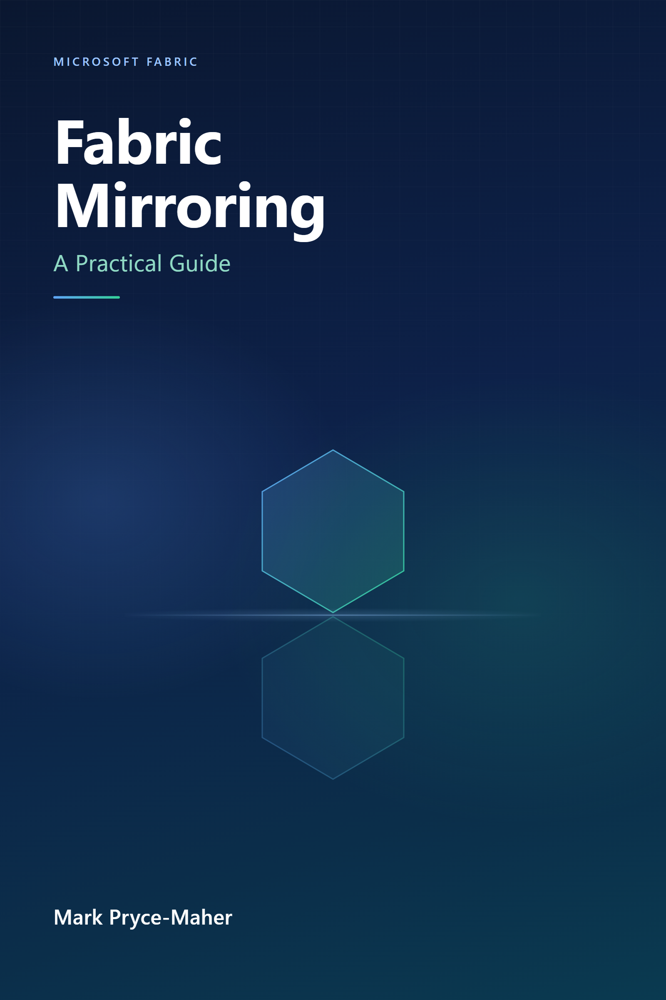

# Fabric Mirroring: A Practical Guide

> **Start with the source.** Almost every Fabric Mirroring question begins with the same reply: *What is the source?*

I was one of the Product Managers who helped bring Fabric Mirroring to customers. The idea sounds simple: keep an analytical copy of operational data in OneLake. The details are not. Each source has its own replication mechanism, permissions, network requirements, limitations, and failure modes.

This book explains those differences without making readers assemble the story from dozens of documentation pages.

It all started with a couple of sources and now it supports over 14 different sources.

The main reason for doing this book is that I get asked the same Mirroring questions over and over again. Some of that I put on my [blog](https://medium.com/@sqltidy), but some things just need a longer explanation. So the aim is this should actually save me time.

 

I am also publishing it in sections. As of today, 'Concepts and architecture' is fully published. Now just Source-specific guides and Open Mirroring to go...

 

**[Read the book](docs/index.md)**

## What You Will Find

| Part                          | Focus                                                                              | Best for                                           |
| ----------------------------- | ---------------------------------------------------------------------------------- | -------------------------------------------------- |
| **Concepts and architecture** | Mirroring types, replication methods, security, monitoring, APIs, CI/CD, and costs | Anyone designing or operating a mirrored database  |
| **Source-specific guides**    | Setup, limitations, and troubleshooting for each supported source                  | Engineers implementing a particular connector      |
| **Open Mirroring**            | Landing-zone formats, custom integrations, examples, and operational guidance      | Developers building their own replication solution |

The source chapters are intentionally separate. A correct answer for Snowflake may be wrong for Cosmos DB, SQL Server, PostgreSQL, or SAP. Use the [complete table of contents](docs/index.md) to go straight to the chapter that matches your source.

## Suggested Reading Paths

* **New to Mirroring:** Start with [Chapter 1](docs/Part%201%20-%20Concepts%20and%20Architecture/chapter-01.md), then read Chapters 2 through 5.
* **Planning an implementation:** Read the relevant source chapter, followed by monitoring, security, and troubleshooting.
* **Building a custom connector:** Begin with the Open Mirroring section and the current [Open Mirroring partner ecosystem](https://learn.microsoft.com/en-us/fabric/mirroring/open-mirroring-partners-ecosystem).
* **Checking a fast-changing detail:** Follow the Microsoft Learn references in each chapter. Preview status, limits, and supported features can change.

## Why the Book Lives Online

Fabric changes quickly. A printed edition can be out of date before it reaches a reader, while an online book can be corrected as the product and its documentation evolve.

Keeping the book on GitHub also makes errors visible and fixable. If you find something that no longer matches the public documentation, [open an issue](https://github.com/MarkPryceMaherMSFT/MirroringBook/issues).

**Public-information policy:** This book uses publicly available information. Unclear, conflicting, internal, or private-preview claims are tracked separately rather than presented as product facts.

The book update history records documentation reviews, product-status changes, and material corrections.

 

## AI and why you should not steal this book

Before you go too far, you might ask: did I use AI to help write this book? Yes, I did. I'm using AI to edit the book. The content and ideas are mine, because AI will make stuff up and it doesn't always like to be told it's wrong.

So while it's built from my experience of working on Fabric Mirroring and the years of helping customers - AI is too useful not to use. I tell it to check my edits, look for updates in the public docs (since putting this online, 2 more Mirroring sources appeared). So there are things in here, like Chapter 3, you will not find anywhere else.

And it's also why this book is online and free, I don't think I could sell a book if AI has helped work on it.

 

If there is an issue or you think I've got something wrong, then raise an issue. If you know a specific Mirroring source really well, then feel free to lean in and help out on a chapter.

So don't steal, join in!

## Copyright and Permissions

© 2026 Mark Pryce-Maher. All rights reserved.

No part of this publication may be reproduced, distributed, transmitted, displayed, published, or broadcast in any form or by any means, including photocopying, recording, or other electronic or mechanical methods, without the prior written permission of the author, except for brief quotations used in critical reviews and other noncommercial uses permitted by copyright law.

For permission requests, contact <markpm@hotmail.co.uk>.
