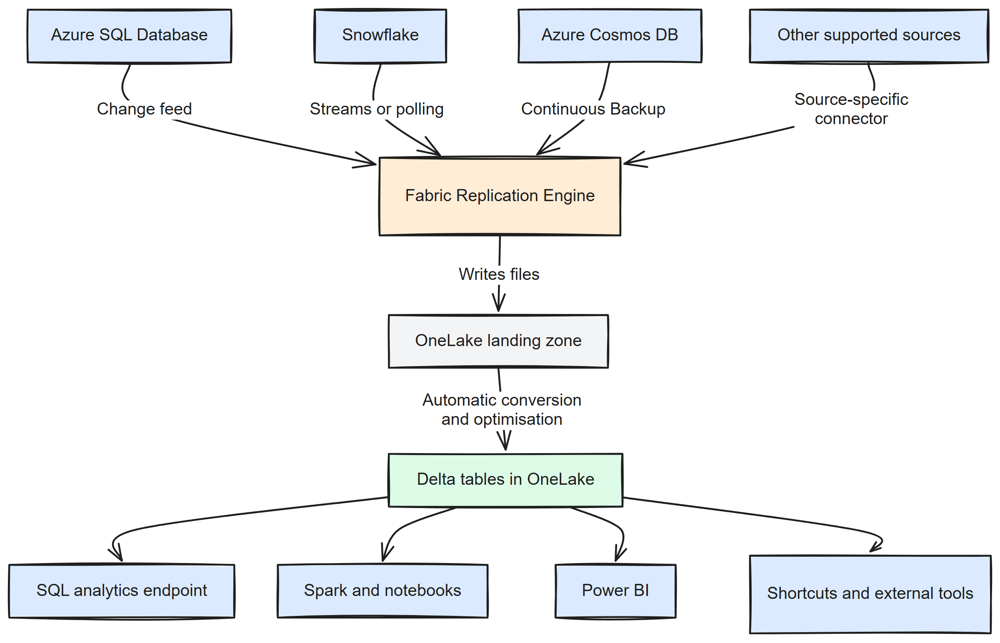

# Chapter 1: Introduction to Fabric Mirroring

> **Part 1: Concepts and Architecture**
>
> **Purpose:** This chapter explains what Fabric Mirroring is, the problem it solves, how it works, and how mirrored storage costs are calculated so you can decide whether it fits your workload.

***

Fabric Mirroring continuously replicates data from supported operational and analytical systems into Microsoft Fabric so that the data can be queried in OneLake as Delta tables. Instead of building and operating separate ingestion pipelines, you configure mirroring on a supported source and Fabric manages the replication process.

Mirrored data is stored in OneLake and can then be used from SQL, Spark, Power BI, and other Fabric workloads.

## 1.1 What Is Microsoft Fabric?

Microsoft Fabric is a Software as a Service analytics platform that combines data integration, engineering, warehousing, real-time analytics, data science, and business intelligence in one product.

Fabric is built around **OneLake**, the tenant-wide storage layer used by Fabric workloads. OneLake stores data in open formats and provides a common location for lakehouses, warehouses, shortcuts, and mirrored data.

Mirroring is one of the Fabric data ingestion options. Its specific role is to keep a replica of source data available in Fabric with minimal setup and low operational overhead.

## 1.2 Release History

The Book Update History records dated Fabric Mirroring milestones and documentation changes. Use the [appendix](../appendix.md) for the current source and availability matrix.

## 1.3 The Problem Mirroring Solves

Before mirroring, teams usually had to move operational data into an analytics platform by building ETL or ELT pipelines. Those pipelines often create a few recurring problems:

* Data arrives on a schedule rather than when changes happen.
* Source systems take extra read load from reporting and ad hoc analysis.
* Pipelines need ongoing maintenance for schema changes, failures, credentials, and retries.
* Different tools produce different storage layouts and metadata conventions.
* Analysts often need separate access paths for the same data.

Mirroring addresses these issues by keeping a managed replica in Fabric, storing it in Delta format in OneLake, and making it available to multiple Fabric workloads without separate custom ingestion code for each consumer.

## 1.4 Core Value Proposition

| Feature        | Fabric Mirroring                                                                                                                                                                                                     | Traditional ETL                                                     |
| -------------- | -------------------------------------------------------------------------------------------------------------------------------------------------------------------------------------------------------------------- | ------------------------------------------------------------------- |
| Setup time     | Usually minutes through a guided setup                                                                                                                                                                               | Days or weeks to design, build, test, and deploy                    |
| Data freshness | Near real-time, source dependent                                                                                                                                                                                     | Usually batch-based                                                 |
| Maintenance    | Managed by Fabric for supported sources                                                                                                                                                                              | Ongoing pipeline ownership required                                 |
| Storage format | Delta Lake in OneLake                                                                                                                                                                                                | Varies by tool and destination                                      |
| Consumption    | Native access from SQL, Spark, and Power BI                                                                                                                                                                          | Often needs extra modelling or connectors                           |
| Cost           | Replication compute is free. Mirrored storage is free up to 1 TB per purchased capacity unit (a F4 capacity includes 4 TB free mirrored storage). Querying via SQL, Spark, or Power BI is charged at standard rates. | Separate ingestion compute plus destination storage and query costs |

Mirrored storage allowance is calculated at the capacity level. The free allowance scales with purchased capacity units rather than with the number of mirrored databases.

## 1.5 Ideal Use Cases

Mirroring works best when you need current source data in Fabric without building a separate ingestion estate.

| Use case                       | Why mirroring fits                                                           |
| ------------------------------ | ---------------------------------------------------------------------------- |
| **Operational analytics**      | Report on current business data without querying the source directly.        |
| **Cross-system analysis**      | Combine data from multiple source systems in one Fabric workspace.           |
| **Reducing read load**         | Move reporting and analytical reads away from production databases.          |
| **Access control separation**  | Let analysts work in Fabric without direct source-system access.             |
| **Historical change analysis** | Retain replicated changes for downstream analysis in OneLake.                |
| **Compliance and audit**       | Keep an analytical copy available for review, validation, or reconciliation. |

## 1.6 High-Level Architecture and Workflow

At a high level, mirroring follows the same broad pattern across sources: Fabric connects to the source, reads an initial snapshot and later changes, writes files into a landing zone in OneLake, and makes the result available as Delta tables.

*Figure 1.1: End-to-end Fabric Mirroring architecture*

**Key components:**

* **Source system**: The database, platform, or application being mirrored.
* **Fabric Replication Engine**: The Fabric service that reads source changes and writes them into OneLake.
* **Landing zone**: The OneLake location where mirroring writes source files before they are materialised as tables.
* **Delta tables**: The queryable tables created from mirrored data in OneLake.
* **SQL analytics endpoint**: The auto-provisioned T-SQL endpoint over the mirrored tables.

Fabric manages the replication pipeline, including connection handling, schema tracking, and offset tracking. The exact change capture mechanism depends on the source.

Fabric supports three official mirroring types:

* **Database mirroring** copies source data into OneLake.
* **Metadata mirroring** syncs metadata and uses shortcuts to data that remains in the source.
* **Open mirroring** lets a custom or partner solution write data into the mirroring landing zone.

## What comes next

The next chapter separates the three mirroring types and shows which sources belong to each one. That distinction matters because setup, data movement, and operational responsibility differ by type.

**Contents:** [Table of Contents](../index.md) | **Next:** [Chapter 2: Types of Mirroring in Fabric](chapter-02.md)
