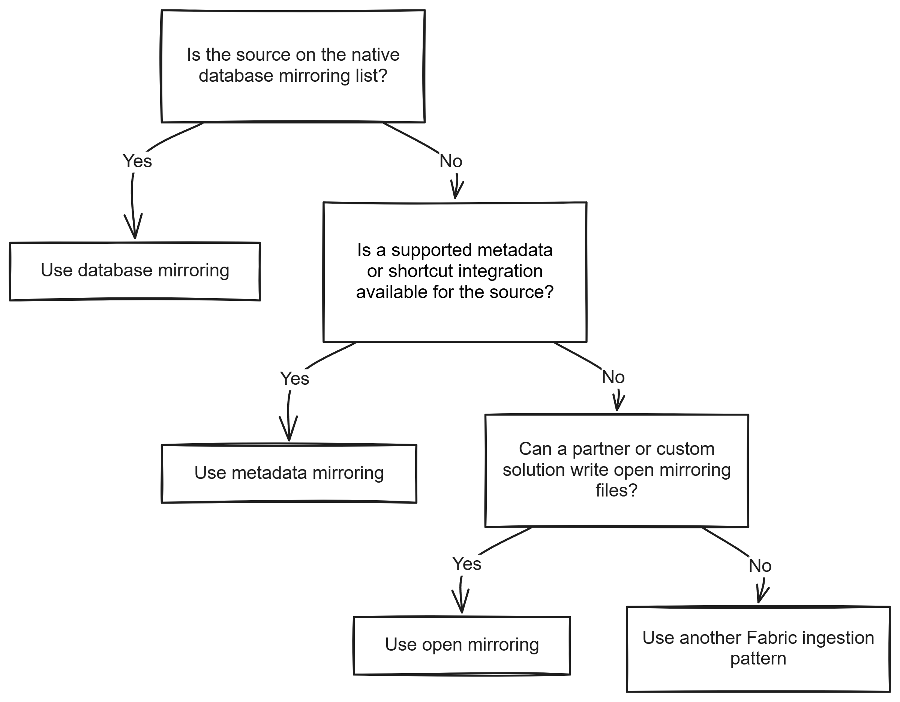

# Chapter 2: Types of Mirroring in Fabric

> **Part 1: Concepts and Architecture**
>
> **Purpose:** This chapter explains the three official mirroring types in Fabric and shows which sources belong to each one so you can choose the right pattern for your source.

**Part index:** [Chapters in Part 1](readme.md)

***

## Overview

Chapter 1 introduced mirroring as a way to make source data available in Fabric. Fabric implements that idea through three distinct **mirroring types**. The type determines what Fabric creates, whether data is physically copied into OneLake, and who is responsible for keeping it current.

This chapter walks through each type in turn: what is replicated, what Fabric creates, its key characteristics, and which sources use it today. Use it to decide which type applies to your source before you plan connectivity, security, or operations for a mirror. Chapter 3 then covers the transport methods (push, pull or polling, and shortcuts) that sit underneath these types.

Fabric groups mirroring into three types:

* **Database mirroring** replicates data into OneLake. (*Moves data*)
* **Metadata mirroring** syncs metadata and points Fabric to data that stays in the source. (*Does not move data*)
* **Open mirroring** lets users build their own mirroring solution. (*Moves data*)

These types are different from the transport methods covered in Chapter 3. The type tells you what Fabric creates and where the data lives. See the [Microsoft Learn mirroring overview](https://learn.microsoft.com/en-us/fabric/mirroring/overview#types-of-mirroring) for the official definitions.

## Database Mirroring

Database mirroring is the standard pattern for supported source databases and platforms. Fabric reads source data, writes it into OneLake, and materialises Delta tables that can be queried from Fabric workloads.

**What is replicated:**

* Supported table structures and schema information, not every source database object or security policy
* Source row data
* Ongoing inserts, updates, and deletes, subject to source support

**What is created in Fabric:**

* A **Mirrored Database** item
* A landing zone in OneLake
* Delta tables in OneLake
* An auto-provisioned **SQL analytics endpoint**

**Key characteristics:**

* Data is physically copied into OneLake.
* Fabric manages replication for supported sources.
* Schema changes are handled according to source-specific rules.
* Query performance and behaviour depend on the Fabric workload you use on top of the mirrored tables.
* Fabric manages the replicated tables' V-Ordered file layout and maintenance; do not apply lakehouse write or maintenance settings directly to mirrored tables. This does not mean Fabric maintains the external files behind metadata mirrors. See [Optimise mirrored data](https://learn.microsoft.com/en-us/fabric/fundamentals/table-maintenance-optimization#optimize-mirrored-data).

**Supported sources for database mirroring:**

* Azure SQL Database
* Azure SQL Managed Instance
* Azure Cosmos DB
* Azure Database for PostgreSQL
* Azure Database for MySQL *(Public Preview)*
* Google BigQuery
* Oracle
* SAP
* SharePoint List
* Snowflake
* SQL Server 2016–2022
* SQL Server 2025
* Fabric SQL Database *(auto-configured)*

SharePoint List combines database and metadata mirroring: Document Library content is surfaced through OneLake shortcuts, and list row data is replicated into Delta tables. [Chapter 21](../Part%202-%20Source-Specific%20Mirroring%20Guides/chapter-21.md) covers this in detail.

Snowflake also supports **view replication** as a separate paid extended capability. That capability is covered in Chapter 9.

> Database mirroring hands replication scheduling to Fabric. It is not a general-purpose transformation pipeline. If you need custom extraction or transformation logic, consider a pipeline, streaming solution, or open mirroring publisher.

## Metadata Mirroring

Metadata mirroring exposes source data through **OneLake shortcuts** rather than maintaining a replicated copy of the table data. Catalog integrations synchronise metadata; Azure Monitor uses a connection-based integration instead. The source remains responsible for storing the data.

Avoiding row replication does not guarantee instant query freshness. Catalog refresh, table-format metadata, optional shortcut caching, and SQL analytics endpoint metadata sync can each affect when a query sees a change. Review [OneLake shortcuts](https://learn.microsoft.com/en-us/fabric/onelake/onelake-shortcuts) and the source-specific guide rather than assuming zero lag.

**What is replicated:**

* Catalogues, schemas, and table metadata
* Storage references used to access the data in place

**What is created in Fabric:**

* For catalog connectors, a mirrored catalog item and its SQL analytics endpoint
* OneLake shortcuts that point to the source data
* Source-specific query surfaces; Azure Monitor also uses Eventhouse and lakehouse integration paths

**Key characteristics:**

* Data stays in the source platform.
* Catalog connectors keep metadata in sync rather than replicating rows.
* Query execution reads through the shortcut path to the source data location.
* This type is useful when the source already stores data in an open table format and Fabric only needs to surface it.

**Supported sources for metadata mirroring:**

* Azure Databricks (Unity Catalog) *(GA)*
* Azure Monitor *(Public Preview)*
* Dremio *(Public Preview)*
* AWS Glue *(Public Preview)*
* Google Lakehouse Runtime Catalog *(Public Preview)*
* Snowflake Iceberg tables through the supported shortcut path described in [Chapter 22](../Part%202-%20Source-Specific%20Mirroring%20Guides/chapter-22.md)
* SharePoint Document Library content through the hybrid integration in [Chapter 21](../Part%202-%20Source-Specific%20Mirroring%20Guides/chapter-21.md)

For Dremio and AWS Glue, Fabric connects to an Iceberg REST Catalog endpoint. Authentication and access to the underlying storage are separate requirements. [Chapter 26](../Part%202-%20Source-Specific%20Mirroring%20Guides/chapter-26.md) covers Dremio and [Chapter 27](../Part%202-%20Source-Specific%20Mirroring%20Guides/chapter-27.md) covers AWS Glue.

[Google Lakehouse Runtime Catalog mirroring](https://learn.microsoft.com/en-us/fabric/mirroring/catalog-mirroring/google-lakehouse-runtime) also uses an Iceberg REST catalog, with table data remaining in Google Cloud Storage. It authenticates Microsoft Entra identities through Google Cloud Workload Identity Federation rather than a stored service-account key. This is distinct from the BigQuery database replication connector in Chapter 16. Use the [Google catalog setup tutorial](https://learn.microsoft.com/en-us/fabric/mirroring/catalog-mirroring/google-lakehouse-runtime-tutorial) for configuration; this book does not yet have a dedicated source chapter for it.

The Google catalog preview supports up to 500 Iceberg V2 tables with Parquet data files. Both the catalog endpoint and storage must be reachable over the public internet; firewall-restricted catalog mirroring is not supported. Source row and column permissions do not carry over automatically. See its [limitations](https://learn.microsoft.com/en-us/fabric/mirroring/catalog-mirroring/google-lakehouse-runtime-limitations).

Azure Monitor follows a different mechanism within this same type: instead of an Iceberg catalog, it connects to a Log Analytics workspace and exposes the workspace's own Delta Parquet storage through OneLake shortcuts and a Fabric Eventhouse endpoint, with no separate catalog-sync step. Chapter 15 covers Azure Monitor mirroring in detail.

> [Link Dataverse to Microsoft Fabric](https://learn.microsoft.com/en-us/power-apps/maker/data-platform/azure-synapse-link-view-in-fabric) is a separate integration that also exposes data through shortcuts. Do not assume it has the same setup, storage behaviour, or limitations as a mirroring connector.

## Open Mirroring

Open mirroring is the extensibility model. A partner solution or custom application writes data and metadata files into the open mirroring landing zone, and Fabric processes them into Delta tables.

Open mirroring gives you control over extraction and the rows you publish. For example, a publisher can implement soft deletes, add audit columns, or extract a source view. That flexibility also makes you responsible for ordering, recovery, schema compatibility, and source load. The landing-zone protocol carries data, not source permissions; any permission mapping needs a separate supported implementation. The [Fabric Toolbox](https://github.com/microsoft/fabric-toolbox) contains examples.

If you do not want to build and operate a publisher, review the [open mirroring partner ecosystem](https://learn.microsoft.com/en-us/fabric/mirroring/open-mirroring-partners-ecosystem).

> I have built a Mirroring solution using Open Mirroring to mirror data from sources like [SQL Server 1.0](https://youtu.be/Q86zvv2cQ4M?si=PQ58nP8JqztDTnVr), [SQL Server 2008, Access,](https://github.com/microsoft/fabric-toolbox/tree/main/samples/open-mirroring/GenericMirroring) [Excel,](https://github.com/microsoft/fabric-toolbox/tree/main/samples/open-mirroring) [Snowflake Views and Dynamic tables, MySQL, SharePoint](https://github.com/microsoft/fabric-toolbox/tree/main/samples/open-mirroring).

**What is replicated:**

* Any data the connector or application chooses to publish in the required format

**What is created in Fabric:**

* An **Open Mirrored Database** item
* Delta tables built from the supplied files
* An auto-provisioned SQL analytics endpoint

**Key characteristics:**

* Open Mirroring is Generally Available.
* Fabric provides the target format and processing model.
* The connector or application is responsible for extraction logic, source-specific change tracking, and operational behaviour.
* Individual partner solutions vary in packaging, support model, and feature coverage.
* Custom behaviour must still follow the supported landing-zone file and schema contract.

> **Example sources:** Open mirroring suits sources without a native connector, such as unsupported on-premises databases, SaaS applications, or custom application event streams. Microsoft publishes sample connectors and partner examples at **aka.ms/FabricToolbox**.

## Comparison Matrix

| Attribute                           | Database mirroring                                     | Metadata mirroring              | Open mirroring                              |
| ----------------------------------- | ------------------------------------------------------ | ------------------------------- | ------------------------------------------- |
| **Data copied into OneLake**        | Yes                                                    | No                              | Yes                                         |
| **Fabric-managed source connector** | Yes                                                    | Yes                             | No                                          |
| **Primary output**                  | Delta tables in OneLake                                | Metadata plus OneLake shortcuts | Delta tables in OneLake                     |
| **SQL analytics endpoint**          | Yes                                                    | Catalog connectors; Azure Monitor depends on the integration path | Yes |
| **Spark access**                    | Yes                                                    | Through supported shortcuts and table formats | Yes |
| **Source coverage**                 | Fixed supported source list                            | Fixed supported source list     | Any source with a compatible implementation |
| **Operational responsibility**      | Mostly Fabric                                          | Shared with source platform     | Application owner                           |
| **Typical examples**                | Azure SQL Database, Snowflake, Oracle, SharePoint List | Azure Databricks, Azure Monitor, Dremio, AWS Glue | Custom applications, ISV connectors         |

## Selection Decision Framework

Use this decision path to choose the right type.

*Figure 2.1: Choosing a mirroring type*

**Additional considerations:**

* Choose **database mirroring** when you need the data physically present in OneLake.
* Choose **metadata mirroring** when the source already stores the data externally and you only need Fabric to surface it through synced metadata and shortcuts.
* Choose **open mirroring** when the source is not natively supported but you can use or build a connector that emits the required files.
* Check release status before committing to a source. Preview connectors can change more quickly than Generally Available ones.
* Separate the mirroring type decision from the transport method decision. Chapter 3 covers push, pull or polling, and shortcut-based access.

**Contents:** [Table of Contents](../index.md) | **Previous:** [Chapter 1: Introduction to Fabric Mirroring](chapter-01.md) | **Next:** [Chapter 3: Methods of Mirroring: Push, Pull or Polling, and Shortcuts](chapter-03.md)
