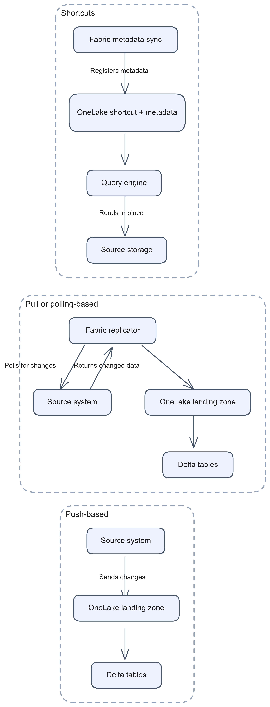
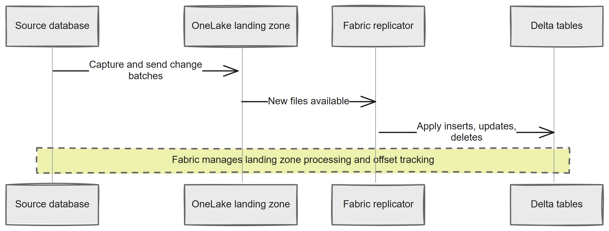
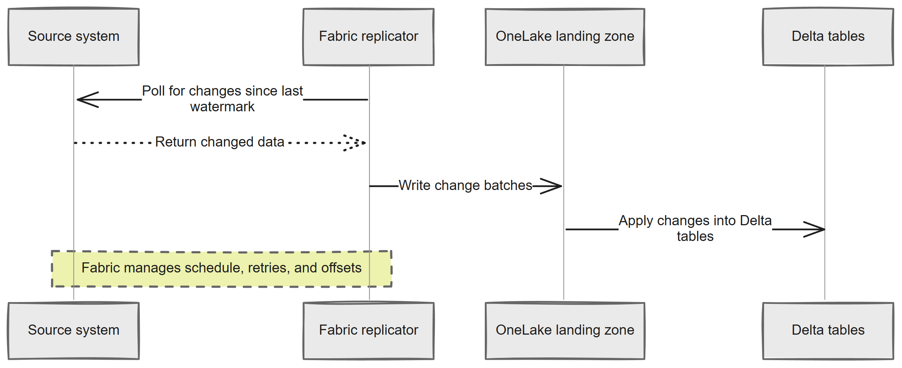
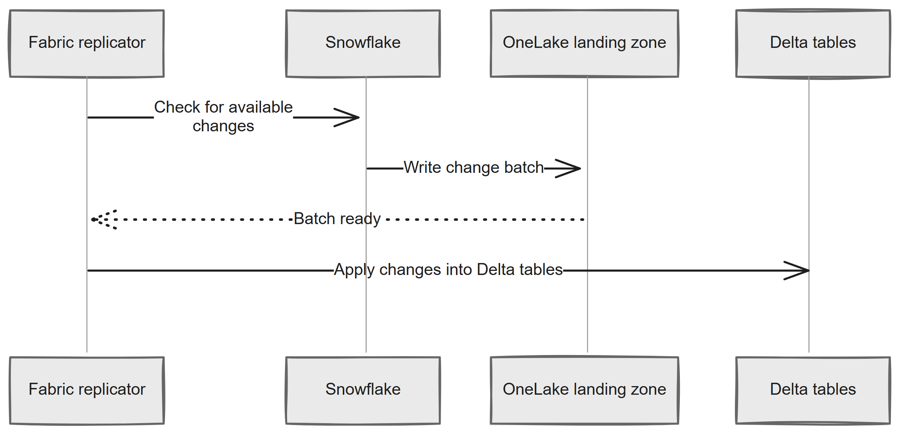
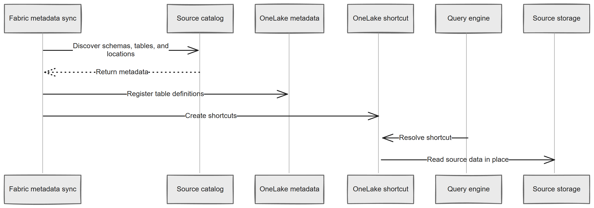
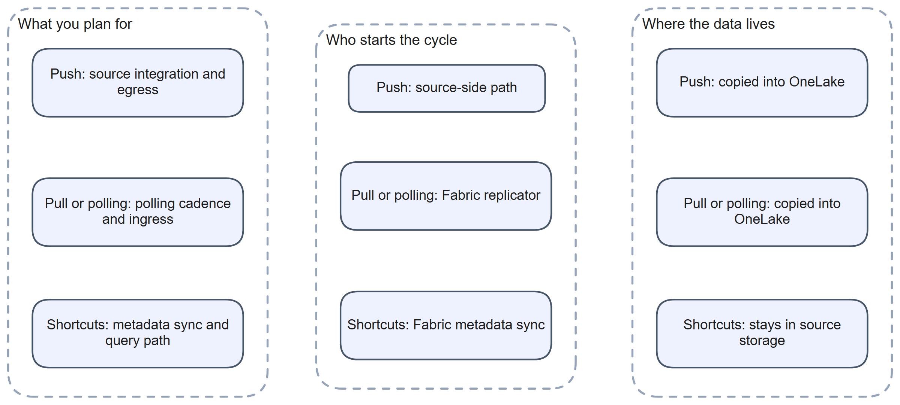
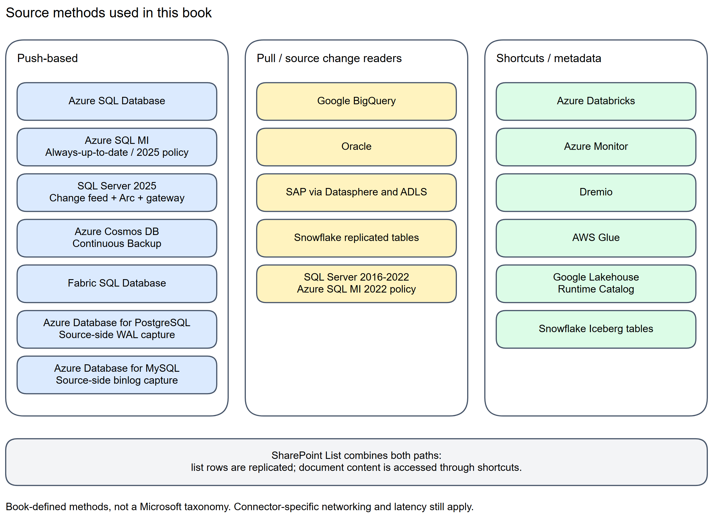

# Chapter 3: Methods of Mirroring: Push, Pull or Polling, and Shortcuts

> **Part 1: Concepts and Architecture**
>
> **Purpose:** This chapter helps you identify how each mirrored source moves or exposes data so you can plan connectivity, latency, storage, and operations before you configure a mirror.

**Part index:** [Chapters in Part 1](readme.md)

***

## Overview

In this chapter, **push**, **pull or polling**, and **shortcuts** are terms used to compare how Fabric mirroring behaves across sources. They are **not** an official Microsoft product taxonomy. The connector for each source determines the method. You do not choose it during setup.

> You don't *need* to read this chapter, but if you really want to understand Mirroring, the concept of how data is moved from the source system to the landing zone is really important.

These three methods answer practical questions:

* Who initiates the movement or exposure of data?
* Is data copied into OneLake, or read in place?
* What level of latency should you plan for?
* What connectivity and operational model does the source require?

| Method                    | What happens                                                | Data copied into OneLake? | Main replication concern                                |
| ------------------------- | ----------------------------------------------------------- | ------------------------: | ------------------------------------------------------- |
| **Push-based**            | The source-side mechanism sends changes towards Fabric.     |                       Yes | Source connectivity and source-side change capture      |
| **Pull or polling-based** | The connector reads source changes or staged files.         |                       Yes | Capture behaviour, connectivity, and replication lag    |
| **Shortcuts**             | Fabric exposes source data through OneLake shortcuts.       |                        No | Query path, source storage access, and metadata refresh |

> A connector can combine methods. For example, Snowflake mirroring polls for changes before exporting a batch to OneLake. A gateway requirement cannot be inferred from these labels alone.

*Figure 3.1: The three methods overview*

***

## Push-Based Mirroring

In the replication models used in this book, **push-based** mirroring means the source-side technology captures changes and sends them towards Fabric without Fabric repeatedly polling for each batch of changed rows.

This avoids repeated queries for changed rows, but it is not a guarantee of lower latency or lower source load. Log capture, source resource limits, network throughput, and target processing still matter.

Push-based mirroring does not mean gateway-free mirroring. SQL Server 2025 requires Azure Arc and a supported data gateway, while other integrations have different connection requirements. Read the source chapter's network section for both the connection path and the outbound path to OneLake.

For Fabric database mirroring, the underlying mechanism depends on the source:

* **Azure SQL Database** uses the **change feed**.
* **Azure SQL Managed Instance** on the **Always-up-to-date** or **SQL Server 2025** update policy uses the **change feed**.
* **SQL Server 2025** uses the **change feed** and requires **[Azure Arc](https://learn.microsoft.com/en-us/azure/azure-arc/overview)** plus a data gateway.
* **Azure Cosmos DB** uses **Continuous Backup**, which continuously captures inserts, updates, and deletes without Fabric needing to poll for changes.
* **Fabric SQL Database** uses the **change feed**, auto-configured inside Fabric.
* **Azure Database for PostgreSQL** uses logical replication to capture changes, then a source-side component publishes Parquet batches to OneLake. See the [PostgreSQL mirroring architecture](https://learn.microsoft.com/en-us/azure/postgresql/integration/concepts-fabric-mirroring#architecture).
* **Azure Database for MySQL** captures binlog changes and publishes them from the source to OneLake using its managed identity. See the [MySQL mirroring architecture](https://learn.microsoft.com/en-us/azure/mysql/integration/fabric-mirroring-mysql#architecture).

*Figure 3.2: Push-based sequence*

### How It Works

1. A source-side mechanism captures committed changes.
2. The source or its paired component sends those changes to the Fabric landing zone.
3. Fabric detects the new landing zone files.
4. Fabric applies the change batches into Delta tables in OneLake.
5. Fabric manages offset tracking so it knows the last processed change position.

### Characteristics

| Attribute                 | Detail                                                                                          |
| ------------------------- | ----------------------------------------------------------------------------------------------- |
| **Change initiator**      | Source-side mechanism                                                                           |
| **Latency**               | Source- and workload-dependent; not a guaranteed interval |
| **Agent required**        | Depends on source. Some paths are native to the platform; i.e. Azure Arc components             |
| **Outbound connectivity** | Usually required from the source-side path towards Fabric                                       |
| **Offset tracking**       | Managed by Fabric                                                                               |
| **Data movement**         | Full physical copy into OneLake                                                                 |

> SQL Server mirroring includes resource controls that reduce capture activity under pressure. These protect the source workload but can increase replication lag; they do not make capture cost-free. See [SQL Server mirroring performance](https://learn.microsoft.com/en-us/fabric/mirrroring/sql-server-performance#resource-governor-for-sql-server-mirroring).

### Push-Based Sources

| Source                                                                                         | Mechanism               | Chapter |
| ---------------------------------------------------------------------------------------------- | ----------------------- | ------: |
| **Azure SQL Database**                                                                         | Change feed             |      11 |
| **Azure SQL Managed Instance** with **Always-up-to-date** or **SQL Server 2025** update policy | Change feed             |      12 |
| **SQL Server 2025**                                                                            | Change feed + Azure Arc |      24 |
| Azure Cosmos DB                                                                                | Continuous Backup       |      13 |
| Fabric SQL Database                                                                            | Change feed             |      25 |
| Azure Database for PostgreSQL | Source-side logical replication capture and publishing | 18 |
| Azure Database for MySQL | Source-side binlog capture and publishing | 19 |

### When You See Push

You will usually see this pattern when the source platform has a dedicated mirroring integration or a source-side publishing component. In this book it includes Azure SQL Database, the newer Azure SQL Managed Instance policies, SQL Server 2025, PostgreSQL, and MySQL. SQL Server 2016-2022 uses a different, CDC-based path.

Source-driven capture can still batch changes, wait for resources, or retry after failures. Avoid treating "push" as a promise of immediate delivery or an absence of backoff.

***

## Pull or Polling-Based Mirroring

In the replication model used in this book, **pull or polling-based** mirroring groups connectors that read changes from a source API, change table, log stream, or staging store. A source's use of logs does not by itself make its connector pull-based: PostgreSQL and MySQL use source-side publishers and belong in the preceding group.

A publicly reachable source can use a supported cloud connection without a gateway. A private source may require an [on-premises or VNet data gateway](https://learn.microsoft.com/en-us/data-integration/gateway/), depending on the connector. Gateways add operational requirements and can become throughput bottlenecks, but they are not mandatory for every pull-based source and do not necessarily carry every part of the data path.

Repeated checks can add source load and, for services such as Snowflake, compute charges even when few rows change. Adaptive polling reduces unnecessary work.

### Backoff and Polling Cadence

Fabric documents backoff that reduces overhead when source activity is low. The exact algorithm and timing are source-specific; the following cycle is a conceptual explanation, not a published contract shared by all connectors. See [How database mirroring works](https://learn.microsoft.com/en-us/fabric/mirroring/overview#how-does-database-mirroring-work) and [BigQuery performance limitations](https://learn.microsoft.com/en-us/fabric/mirroring/google-bigquery-limitations#performance-limitations).

Backoff matters when investigating latency: a delayed batch does not by itself mean mirroring has failed. Check source activity, replication status, and the query layer before deciding where the delay occurs.

There is no common user-controlled polling interval across all connectors. Splitting tables across mirrored databases is not a documented way to double throughput or defeat backoff, and it can increase source load. Likewise, stopping and restarting replication can trigger a full reseed; it is not a routine refresh mechanism.

A conceptual cycle is:

1. Fabric polls the source for changes.
2. If changes are found, Fabric ingests them and continues with the normal cadence.
3. If no changes are found, Fabric can lengthen the polling interval.
4. If transient errors occur, Fabric backs off further before retrying.
5. When work resumes or the source becomes healthy again, Fabric returns to a shorter interval.

> Backoff is not a separate replication status. Use the available status, batch-latency, and source diagnostics rather than assuming a particular backoff state from an unchanged table.

*Figure 3.3: Pull-based sequence*

### How It Works

1. Fabric stores source connectivity details in a Fabric connection.
2. The replicator queries (pulls) the source for new changes since the last successful watermark, offset, or source-native checkpoint.
3. Fabric writes the returned changes to the landing zone in OneLake.
4. Fabric processes the landing zone files into Delta tables.
5. Fabric manages retries, backoff, and offset tracking.

### Characteristics

| Attribute            | Detail                                                                                          |
| -------------------- | ----------------------------------------------------------------------------------------------- |
| **Change initiator** | Fabric replicator                                                                               |
| **Latency**          | Depends on source protocol, polling cadence where applicable, workload, and load |
| **Agent required**   | Source-dependent; a gateway or source replication component may be required |
| **Connectivity**     | Fabric must be able to reach the source through the supported connection path                   |
| **Offset tracking**  | Managed by Fabric                                                                               |
| **Data movement**    | Full physical copy into OneLake                                                                 |
| **Backoff process**  | Differs by source                                                                               |

### Pull or Polling-Based Sources

| Source                                                                | Mechanism                                                                                    | Chapter |
| --------------------------------------------------------------------- | -------------------------------------------------------------------------------------------- | ------: |
| **Google BigQuery**                                                   | Google Cloud Storage initial export + BigQuery `CHANGES` TVF                                 |      16 |
| **Oracle**                                                            | Oracle log-based change capture path                                                         |      17 |
| **SAP**                                                               | SAP Datasphere replication flow to ADLS Gen2                                                 |      20 |
| **Snowflake**                                                         | Fabric polls and reads Snowflake stream changes                                              |      22 |
| **SQL Server 2016-2022**                                              | CDC                                                                                          |      23 |
| **Azure SQL Managed Instance** with **SQL Server 2022** update policy | CDC                                                                                          |      12 |

### Snowflake: Polling Snowflake Streams

Snowflake is an interesting mix of push and polling. The replicator polls the Snowflake warehouse for changes, and if there is a change, it is written (or pushed) directly to OneLake.

Snowflake uses a polling sequence:

* Fabric checks the Snowflake stream for available changes.
* The Fabric Replication Engine reads the change set.
* Fabric writes and processes those changes into Delta tables in OneLake.

*Figure 3.3a: Snowflake polling sequence*

Fabric controls the polling schedule, but Snowflake writes the change batch directly into the OneLake landing zone once a change is found.

> It's really interesting watching the Snowflake query history, as you can see all the queries that Mirroring executes against Snowflake.

### SAP: Two-Step Architecture

For SAP sources, the mirroring path is also important to understand. Fabric does not poll the operational SAP tables directly in the same way it polls a database transaction log. Instead, **SAP Datasphere replication flow** first moves the relevant data towards **ADLS Gen2**, and Fabric then mirrors through that supported path. This is why SAP is best planned as a two-step architecture.

Check SAP Datasphere licensing and replication-flow requirements as well as Fabric prerequisites. Do not assume that the Fabric storage allowance covers the SAP side.

### SharePoint List: A Hybrid Case

SharePoint List mirroring does not fit neatly into a single method. Fabric manages replication of list row data into Delta tables, but the public source guide does not specify a polling algorithm or refresh cadence. Document Library content is surfaced through **OneLake shortcuts** rather than copied. Plan for both behaviours: replicated list rows and document content read through shortcuts. [Chapter 21](../Part%202-%20Source-Specific%20Mirroring%20Guides/chapter-21.md) covers setup and the current documentation gaps.

***

## Shortcuts/Metadata Mirroring

In the replication model used in this book, **shortcuts** means Fabric synchronises metadata and creates OneLake shortcuts to data that stays in its original storage location.

This is different from both push and pull or polling methods because the main data files **are not copied** into the mirrored database's Delta storage layer.

There is no separate row-copy backlog, but query freshness still depends on source commits, catalog or table metadata refresh, shortcut caching where enabled, and SQL analytics endpoint metadata sync. "No copy" does not mean "no delay".

*Figure 3.4: Shortcuts sequence*

### How It Works

For catalog-based mirroring:

1. Fabric connects to the source catalog layer.
2. Fabric discovers table definitions, storage locations, and related metadata.
3. Fabric creates OneLake shortcuts that point to the source data.
4. Queries run through Fabric, but the underlying files remain in the source location.
5. Metadata refresh keeps the Fabric view aligned with the source catalog.

Azure Monitor is a connection-based exception: it exposes Log Analytics storage through supported Eventhouse and shortcut paths rather than an Iceberg catalog.

### Characteristics

| Attribute            | Detail                                                                                       |
| -------------------- | -------------------------------------------------------------------------------------------- |
| **Change initiator** | Fabric metadata sync                                                                         |
| **Latency**          | Metadata refresh timing depends on the connector; data freshness depends on the source files |
| **Agent required**   | No                                                                                           |
| **Connectivity**     | Fabric must be able to read the source storage and metadata endpoints                        |
| **Offset tracking**  | Not a change-feed pattern; Fabric tracks metadata refresh state instead                      |
| **Data movement**    | None for the data files                                                                      |

### Shortcut-Based Sources

| Source               | Mechanism                                                              | Chapter |
| -------------------- | ---------------------------------------------------------------------- | ------- |
| **Azure Databricks** | Unity Catalog metadata + OneLake shortcuts                             | 14      |
| **Azure Monitor**    | Log Analytics Delta Parquet storage + OneLake shortcuts and Eventhouse | 15      |
| **Dremio**           | Dremio metadata + OneLake shortcuts                                    | 26      |
| **AWS Glue**         | AWS Glue Iceberg catalog metadata + OneLake shortcuts                  | 27      |
| **Google Lakehouse Runtime Catalog** | Iceberg REST catalog + shortcuts to Google Cloud Storage | [Setup tutorial](https://learn.microsoft.com/en-us/fabric/mirroring/catalog-mirroring/google-lakehouse-runtime-tutorial) |
| **Snowflake Iceberg tables** | Supported shortcut access to Iceberg data | 22 |

Azure Monitor, Dremio, AWS Glue, and Google Lakehouse Runtime Catalog mirroring are in **Public Preview**. Snowflake's replicated tables and shortcut-backed Iceberg tables use different paths; check Chapter 22 before choosing one.

### Fabric SQL Database Note

**Fabric SQL Database** is a special case inside Fabric. Its analytical replica is configured automatically, but source rows are still copied into Delta tables in OneLake. It is database mirroring, not metadata-only access.

***

## How the Three Methods Compare

*Figure 3.5: Comparison*

| Attribute                          | Push-based                           | Pull or polling-based             | Shortcuts                                        |
| ---------------------------------- | ------------------------------------ | --------------------------------- | ------------------------------------------------ |
| **Initiator**                      | Source-side mechanism                | Fabric replicator                 | Fabric metadata sync                             |
| **Data copied into OneLake**       | Yes                                  | Yes                               | No                                               |
| **Operational rhythm**             | Change-driven                        | Polling-driven                    | Metadata refresh-driven                          |
| **Source dependency**              | Source-side integration required     | Source reachable to Fabric        | Source catalog and storage reachable to Fabric   |
| **Typical query path after setup** | Local Delta tables                   | Local Delta tables                | In-place reads through shortcut                  |
| **Primary replication concern**    | Connectivity and source capture path | Polling cadence, lag, and retries | Query path, storage access, and metadata refresh |

***

## Complete Source-to-Method Reference

The table below brings the source list together using the replication model in this chapter.

| Source                                                                                         | Method in this book                                  | Data moved to OneLake? | Main mechanism                                                           | Chapter |
| ---------------------------------------------------------------------------------------------- | ---------------------------------------------------- | ---------------------: | ------------------------------------------------------------------------ | ------- |
| **Azure SQL Database**                                                                         | Push-based                                           |                    Yes | Change feed                                                              | 11      |
| **Azure SQL Managed Instance** with **Always-up-to-date** or **SQL Server 2025** update policy | Push-based                                           |                    Yes | Change feed                                                              | 12      |
| **Azure SQL Managed Instance** with **SQL Server 2022** update policy                          | Pull or polling-based                                |                    Yes | SQL Server CDC via data gateway                                          | 12      |
| **Azure Cosmos DB**                                                                            | Push-based                                           |                    Yes | Continuous Backup                                                        | 13      |
| **Azure Databricks**                                                                           | Shortcuts                                            |                     No | Unity Catalog metadata + OneLake shortcuts                               | 14      |
| **Azure Monitor**                                                                              | Shortcuts                                            |                     No | Log Analytics Delta Parquet storage + OneLake shortcuts and Eventhouse   | 15      |
| **Google BigQuery**                                                                            | Pull or polling-based                                |                    Yes | Google Cloud Storage initial export + BigQuery `CHANGES` TVF             | 16      |
| **Oracle**                                                                                     | Pull or polling-based                                |                    Yes | Oracle log-based change capture path                                     | 17      |
| **PostgreSQL** | Push-based | Yes | Source-side logical replication capture and OneLake publishing | 18 |
| **MySQL** | Push-based | Yes | Source-side binlog capture and OneLake publishing | 19 |
| **SAP**                                                                                        | Pull or polling-based                                |                    Yes | SAP Datasphere replication flow to ADLS Gen2                             | 20      |
| **Snowflake**                                                                                  | Pull or polling-based                                |                    Yes | Fabric polls and creates Snowflake Streams                               | 22      |
| **SharePoint List** | Hybrid: replicated rows and document shortcuts | Partial | Managed list-row replication; OneLake shortcuts for Document Library content | 21 |
| **SQL Server 2016–2022**                                                                       | Pull or polling-based                                |                    Yes | SQL Server CDC via data gateway                                          | 23      |
| **SQL Server 2025**                                                                            | Push-based                                           |                    Yes | Change feed + Azure Arc + data gateway                                   | 24      |
| **Fabric SQL Database**                                                                        | Push-based                                           |         Yes, automatic | Auto-configured inside Fabric                                            | 25      |
| **Dremio**                                                                                     | Shortcuts                                            |                     No | Dremio metadata + OneLake shortcuts                                      | 26      |
| **AWS Glue**                                                                                   | Shortcuts                                            |                     No | AWS Glue Iceberg catalog metadata + OneLake shortcuts                    | 27      |
| **Google Lakehouse Runtime Catalog** | Shortcuts | No | Iceberg REST catalog + Google Cloud Storage shortcuts | [Microsoft Learn](https://learn.microsoft.com/en-us/fabric/mirroring/catalog-mirroring/google-lakehouse-runtime) |
| **Snowflake Iceberg tables** | Shortcuts | No | Shortcut access rather than Snowflake Streams replication | 22 |

*Figure 3.6: Source groupings*

***

## Choosing the Right Method

You do not choose the method directly, but you do need to plan around it.

* **Connectivity:** Push-based sources need a supported source-side path towards Fabric. Pull or polling-based sources need Fabric to reach the source. Shortcuts need Fabric to reach the source catalog and storage path at query time.
* **Latency expectations:** Measure the chosen connector and query path. Source-driven capture, polling, metadata propagation, and workload pressure each affect freshness; no method label guarantees a particular latency.
* **Storage impact:** Push-based and pull or polling-based methods create a physical copy in OneLake. Shortcuts do not.
* **Operations:** Push-based issues often centre on source integration and connectivity. Pull or polling-based issues often centre on polling, throttling, and retries. Shortcut issues often centre on metadata alignment and query access to source storage.

***

## Summary

This chapter uses a simple replication model with three methods: push-based, pull or polling-based, and shortcuts. These are book terms, not an official Microsoft taxonomy. The model helps you predict how each source behaves, what connectivity it needs, whether data is copied into OneLake, and what sort of lag you should expect. The detailed source chapters begin with Azure SQL Database in Chapter 11 and continue through AWS Glue Catalog Mirroring in Chapter 27.

**Contents:** [Table of Contents](../index.md) | **Previous:** [Chapter 2: Types of Mirroring in Fabric](chapter-02.md) | **Next:** [Chapter 4: The Anatomy of a Mirrored Database](chapter-04.md)
