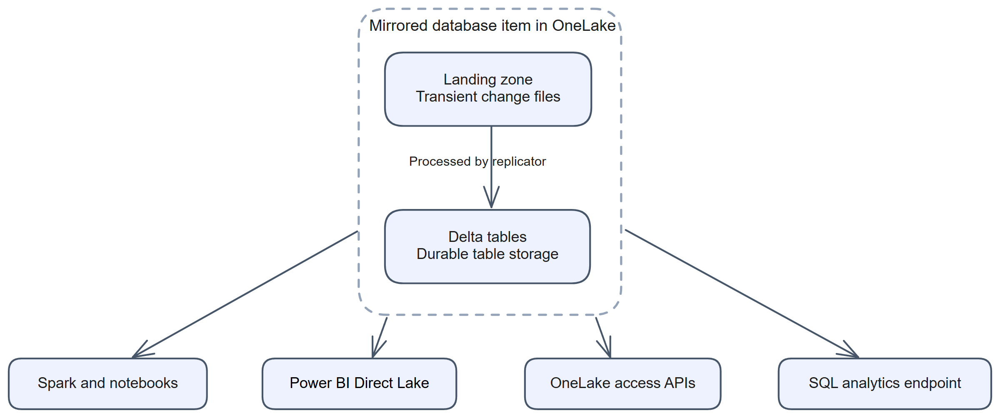
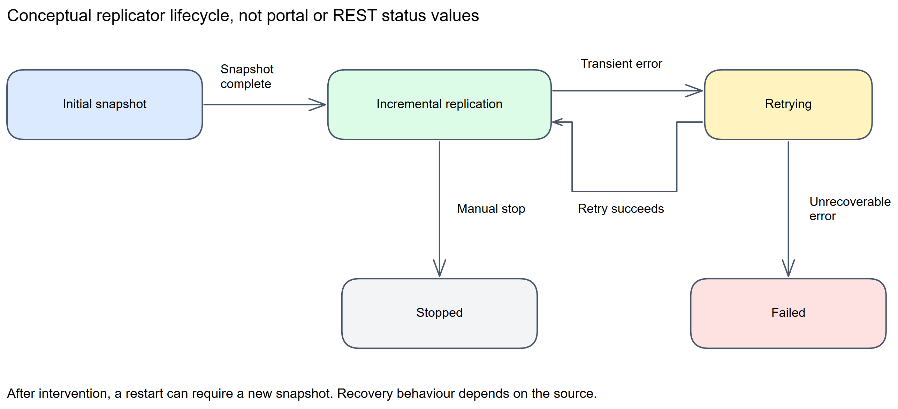
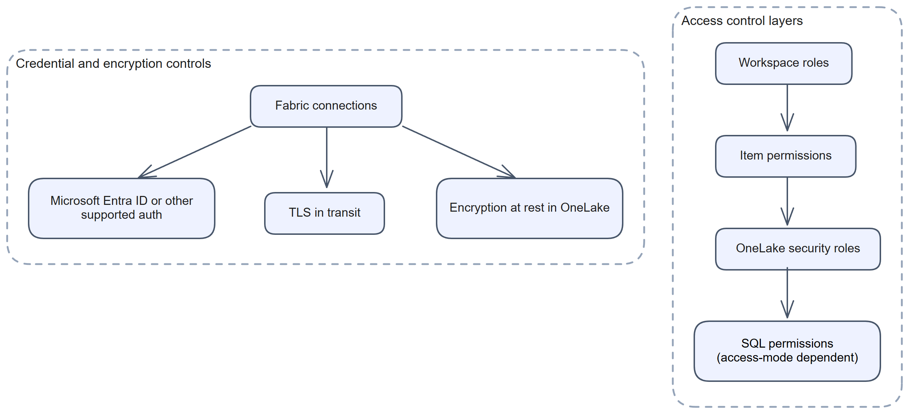

# Chapter 4: The Anatomy of a Mirrored Database

> **Part 1: Concepts and Architecture**
>
> **Purpose:** This chapter helps you understand what Fabric creates when you mirror a source, where the replicated data is stored, how the replicator behaves, and what operational details matter after setup.

**Part index:** [Chapters in Part 1](readme.md)

***

## Overview

A mirrored database in Fabric combines storage, replication state, and query surfaces inside OneLake. This chapter describes the replicated-data architecture used by database mirroring and open mirroring. Metadata mirroring uses source-specific catalog or connection items rather than this complete landing-zone pipeline.

When you create a mirrored database, Fabric creates **two** items:

1. The **mirrored database item** itself, which owns the landing zone, Delta tables, replicator engine, replication settings, and monitoring state.
2. The **SQL analytics endpoint**, which exposes the mirrored tables through a read-only SQL surface.

Conceptually, you can think of the mirrored database item as the ingestion and storage layer, which can be the source of a Fabric shortcut or queried using a Delta reader, and the SQL analytics endpoint as the query layer that sits over the resulting Delta tables.

***

## 4.1 Storage Architecture: Landing Zone and Delta Tables

*Figure 4.1: Storage architecture from landing zone to Delta tables*

### The Landing Zone

The **landing zone** is a transient staging area inside the mirrored database item. Change data arrives here before Fabric applies it to the final table layer.

**Key points:**

* The landing zone is Fabric-managed. Open mirroring exposes a supported landing-zone contract for external publishers; native connectors manage their staging internally.
* The file pattern depends on the source and mirroring method.
* Retention and cleanup behaviour depend on the mirroring type and source.

For open mirroring, the [landing-zone specification](https://learn.microsoft.com/en-us/fabric/mirroring/open-mirroring-landing-zone-format) describes moving processed files into internal cleanup folders and removing them after seven days, while retaining the latest sequential file as a publisher reference. This is **landing-file cleanup**, not Delta-table VACUUM or a durable publisher checkpoint. [Chapter 32](../Part%203%20-%20Open%20Mirroring/chapter-32.md#file-names-and-delivery) explains the publication and recovery implications.

### Delta Tables

After Fabric processes the landing zone files, the replicated data is written into **Delta tables** in OneLake.

**Key points:**

* The table layer is stored in **Delta** format.
* Delta transaction logs preserve table state and change application order.
* This is the main queryable data layer for SQL, Spark, and Direct Lake scenarios.
* A compatible Delta reader can query the data if it supports the table's Delta features and has the required access.
* Delta change data feed (CDF) is an optional paid capability for supported sources; see [Chapter 9](chapter-09.md).
* The mirrored database item owns these tables even though users often access them through the SQL analytics endpoint.
* Treat the output tables as read-only. Direct changes to the mirrored Delta files are unsupported; use the source or an open mirroring publisher to change the data. See [Explore mirrored data directly](https://learn.microsoft.com/en-us/fabric/mirroring/explore-data-directly).

### Delta Table Retention and VACUUM

Mirroring automatically runs Delta **VACUUM** on mirrored tables to remove obsolete files that are no longer needed within the configured retention window. The retention setting is an age threshold for eligible files, not a schedule promising that VACUUM runs at a particular time.

**Key points:**

* The retention period is configurable, from 1 to 30 days.
* Mirrored databases created through the Fabric portal after mid-June 2025 default to a **1-day** retention period. Older mirrored databases, and any mirror created through the REST API without an explicit value, default to **7 days**.
* A longer retention period keeps historical files available to compatible Delta time-travel readers, at the cost of extra mirrored storage. It does not enable Warehouse T-SQL time travel on the SQL analytics endpoint or create a permanent audit archive.
* Configure it in the Fabric portal from the mirrored database's **Settings** > **Delta table management** tab, or set `properties.target.typeProperties.retentionInDays` in the definition through the [mirrored database REST API](https://learn.microsoft.com/en-us/fabric/mirroring/mirrored-database-rest-api#configure-data-retention). Set it explicitly when consistent retention across deployments matters.

Fabric manages the replicated tables' **V-Ordered file layout and maintenance**. Do not schedule your own `OPTIMIZE` or `VACUUM` writes against these managed output tables. The documentation does not publish a fixed optimisation or VACUUM cadence. Metadata mirrors are different: Fabric does not maintain the source files behind their shortcuts. See [Optimise mirrored data](https://learn.microsoft.com/en-us/fabric/fundamentals/table-maintenance-optimization#optimize-mirrored-data). Maintenance of a separate lakehouse table that you own is also a different operation.

See [Retention for mirrored data](https://learn.microsoft.com/en-us/fabric/mirroring/overview#retention-for-mirrored-data) for the current official description.

***

## 4.2 The Replicator

The **replicator** is the managed processing that turns incoming changes into Delta tables. Native database connectors also coordinate source extraction and delivery. For open mirroring, those source-side responsibilities belong to the external publisher.

### Replicator Responsibilities

1. **Source connectivity:** Native connectors use a Fabric connection or supported source-side integration; open mirroring publishers manage their own source connections.
2. **Change extraction:** The connector or publisher reads data through the source's supported mechanism.
3. **Change position tracking:** Source offsets, such as LSNs, are connector-specific. Open mirroring publishers must retain their own extraction checkpoints.
4. **Landing zone writes:** The connector or publisher delivers captured changes into the landing zone.
5. **Delta application:** Applies inserts, updates, and deletes into the Delta table layer.
6. **Retry management:** Handles transient failures and backoff behaviour.

### Replicator Lifecycle

*Figure 4.2: Replicator state machine and lifecycle*

This is a conceptual model of what the replicator does internally. It does not map one-to-one to the replication status values returned by the Fabric portal or the REST API, covered in Chapter 5.

* **Initial snapshot:** Fabric performs a full load of the selected objects.
* **Incremental replication:** Fabric switches to change processing after the snapshot completes.
* **Retrying (backoff):** Fabric waits and retries after transient issues, without leaving incremental replication.
* **Stopped:** Replication has been halted by an operator.
* **Failed:** Replication cannot continue without intervention.

> **Note:** Stop/start behaviour is source-specific and can trigger a **full reseed**. Do not use it as a harmless refresh. It is also distinct from **Resume replication** after a capacity pause, which can continue from the paused position if the retained source changes are still available. See [Mirroring troubleshooting](https://learn.microsoft.com/en-us/fabric/mirroring/troubleshooting#changes-to-fabric-capacity).

***

## 4.3 Configuration Screens and Management

Mirrored databases are created and managed in the Fabric portal, REST API or via the deployment process.

### Create a Mirrored Database in the Portal

1. Open the target workspace.
2. Select **New item** and choose the relevant mirrored database source.
3. Select or create the required Fabric connection.
4. Choose the schemas or tables to mirror.
5. Start mirroring to begin the initial snapshot.

### Common Configuration Options

| Option               | Description                                              |
| -------------------- | -------------------------------------------------------- |
| **Connection**       | The Fabric connection that stores source access details. |
| **Tables to mirror** | The selected tables or schemas included in the mirror.   |
| **Start mirroring**  | Starts the initial snapshot or reseed process.           |
| **Stop mirroring**   | Stops active replication.                                |

### Management Notes

* You can monitor table status, lag, and errors from the mirrored database item.
* You can add or remove mirrored tables, subject to connector support.
* Before using **Stop mirroring** and **Start mirroring**, check the connector's reseed behaviour and the impact of a new snapshot.

***

## 4.4 SQL Analytics Endpoint

A database or open mirrored database also creates a **SQL analytics endpoint**. This is the read-only SQL surface over the mirrored Delta tables. Metadata connectors have their own item and query-surface arrangements, described in their source chapters.

**Key points:**

* The endpoint is created automatically with the mirrored database item.
* It exposes the mirrored tables through T-SQL.
* It is read-only for mirrored data.
* It can be used from SQL Server Management Studio, Visual Studio Code with the MSSQL extension, Power BI, and other supported SQL clients.
* The mirrored database item and the SQL analytics endpoint are separate Fabric items, even though users often move between them during normal work.

The SQL analytics endpoint metadata sync can lag behind the Delta tables. If tables or schema changes are missing, use **Refresh** in the endpoint's Explorer toolbar. The new metadata sync option is in Public Preview and applies only to endpoints created after it is enabled in the workspace. Existing endpoints keep the previous implementation, and the preview cannot currently be enabled with workspace private link. It aims to improve freshness, not guarantee zero latency. See [SQL analytics endpoint metadata sync](https://learn.microsoft.com/en-us/fabric/data-engineering/sql-analytics-endpoint-metadata-sync).

The SQL analytics endpoint uses the same compute engine as Fabric Data Warehouse, but its autogenerated mirrored tables remain read-only.

***

## 4.5 Security of a Mirrored Database

Fabric mirrored databases use Fabric permissions for access to replicated data. Do not assume that source security carries over merely because the rows are replicated.

*Figure 4.3: Security model for mirrored databases*

### Workspace and Item Access

* Workspace roles control who can create, manage, and view mirrored database items.
* Item permissions control who can access the mirrored database item and its SQL analytics endpoint.

### OneLake Security for Mirrored Databases

Workspace roles and item permissions control access to the item. **OneLake security** adds data-plane roles scoped to tables, folders, rows, and columns. Enforcement depends on the supported engine and the identity used to access the data; configuring a role does not automatically switch every SQL or Power BI query path to the end user's identity.

**What it adds for mirrored databases:**

* OneLake security supports **mirrored databases**, **mirrored catalogs**, and **Azure Databricks mirrored catalogs**. These items support **Read** roles; the lakehouse's **ReadWrite** role capability is not permission to edit mirrored output tables.
* A role defines its **permissions**, its **type** (Grant), the **data** it covers, and its **members**. Row and column restrictions can narrow that data access.
* You enable and manage these roles from the mirrored database item's own experience in the Fabric portal, the same pattern already used for lakehouses.
* Workspace **Admins** and **Members** can create and manage OneLake security roles.

**Who is affected:**

* OneLake security roles apply to users who have the **Viewer** workspace role, or **Read** item permission on the mirrored database. Those users only see the tables or folders their assigned role grants.
* Workspace **Admins**, **Members**, and **Contributors** bypass OneLake security roles entirely. They can read and write all data in the item regardless of role membership.
* A mirrored database's **DefaultReader** role grants access to users with **ReadAll**. Mirrored catalogs, including Azure Databricks catalogs, instead use **Read** for default membership. Review the role for the actual item type; it can be edited or removed.

**Shortcuts to mirrored data:**

* A passthrough OneLake shortcut evaluates access using the calling identity at the source and shortcut paths. A delegated shortcut or query engine can use a connection or owner identity instead. Check both the shortcut authentication mode and the consuming engine's identity before granting access.

> **Important:** SQL analytics endpoints start in **delegated identity mode**, where SQL permissions govern the user's access and the owner's identity reads OneLake. **User identity mode** instead applies the user's OneLake roles to table access. Switching modes affects existing permissions and can interrupt all SQL analytics endpoints in the workspace; read the mode-switching guidance before changing it.

See [OneLake security roles and supported items](https://learn.microsoft.com/en-us/fabric/onelake/security/data-access-control-model), [SQL analytics endpoint access modes](https://learn.microsoft.com/en-us/fabric/onelake/security/sql-analytics-endpoint-onelake-security), and [supported secured-data readers](https://learn.microsoft.com/en-us/fabric/onelake/security/read-secured-data).

### SQL-Layer Security

* In delegated identity mode, configure SQL object permissions, row-level security, and column-level security where supported.
* In user identity mode, OneLake roles govern tables; SQL permissions still apply to supported nondata objects such as views and stored procedures.

> **Important:** Replicating table data does not itself reproduce source row-level security, column-level security, or masking policies. Configure and review access in Fabric. Optional source-specific security mirroring has a separate scope and setup; see [Chapter 9](chapter-09.md) and the source guide rather than assuming full policy parity. For SQL controls, see [SQL granular permissions](https://learn.microsoft.com/en-us/fabric/data-warehouse/sql-granular-permissions).

### Credentials and Identity

* Source credentials are stored in **Fabric connections**.
* Authentication paths may use **Microsoft Entra ID**, service principals, or other connector-specific methods.
* End users of the mirrored database do not need direct access to the stored source credentials.

### Network Boundaries

Treat these as separate controls rather than using "private connectivity" as a single yes/no setting:

* **Source networking:** The source firewall, public or private endpoint, and any required data gateway determine how the connector reaches the source. Source-published changes can also need a separate outbound path to OneLake.
* **Fabric private link:** Tenant or workspace private link controls access to Fabric endpoints. A connector's support for a gateway does not automatically establish support for Fabric private link.
* **Workspace outbound access protection:** For supported mirrored-database connectors, configure **data connection rules** that permit the required connections. This is separate from granting source permissions or opening its firewall.

See [Outbound access protection for mirrored databases](https://learn.microsoft.com/en-us/fabric/security/workspace-outbound-access-protection-mirrored-databases) and the relevant source chapter. Metadata catalogs and their shortcuts have their own support boundaries; do not apply the database-connector matrix to them without explicit documentation.

### Encryption Notes

* Data in transit uses TLS.
* Data at rest in OneLake is encrypted by Fabric.
* **Azure Cosmos DB mirroring does not support customer-managed keys on OneLake.** Refer to the [Azure Cosmos DB mirroring limitations](https://learn.microsoft.com/en-us/fabric/mirroring/azure-cosmos-db-limitations) for current guidance.

***

## 4.6 Sharing and Managing Permissions

Sharing gives a person or group access to the mirrored item and its SQL analytics endpoint without making them a member of the whole workspace. The default **Read** grant lets them open the items; it is not a blanket data-read grant.

| Sharing option | Permission and effect |
|---|---|
| **Read all SQL analytics endpoint data** | **ReadData** on the endpoint. Grants broad SQL data access in delegated identity mode; user identity mode instead evaluates OneLake roles. |
| **Read all OneLake data** | **ReadAll** and **SubscribeOneLakeEvents**. Review the DefaultReader role and the included event-subscription access. |
| **Read and write** | **Write** on the mirrored database. Allows configuration changes and landing-zone access, not supported editing of the managed output Delta tables. |

Use **Share** or **Manage permissions** on the item to grant, inspect, and revoke access. The sharing guide requires a workspace Admin or Member to share; a holder of **Share** permission can also manage grants through **Manage permissions**.

For Azure SQL Database, Azure SQL Managed Instance, Azure Database for PostgreSQL, Azure Database for MySQL, and SQL Server 2025, the source's managed identity needs **Read and write** on the mirrored database. Portal creation grants it automatically. For API-created mirrors, grant it explicitly before starting replication.

See [Share your mirrored database and manage permissions](https://learn.microsoft.com/en-us/fabric/mirroring/share-and-manage-permissions). Grant only the access required by the recipient or publisher, and check the SQL access mode as well as the item permission.

***

## Summary

A mirrored database in Fabric consists of a mirrored database item, a SQL analytics endpoint, a landing zone, Delta Parquet tables, and the replicator state that keeps those layers moving. Understanding these parts makes it easier to plan retention, diagnose reseeds, manage endpoint visibility, and apply security correctly inside Fabric.

**Contents:** [Table of Contents](../index.md) | **Previous:** [Chapter 3: Methods of Mirroring: Push, Pull or Polling, and Shortcuts](chapter-03.md) | **Next:** [Chapter 5: Monitoring a Mirrored Database](chapter-05.md)
