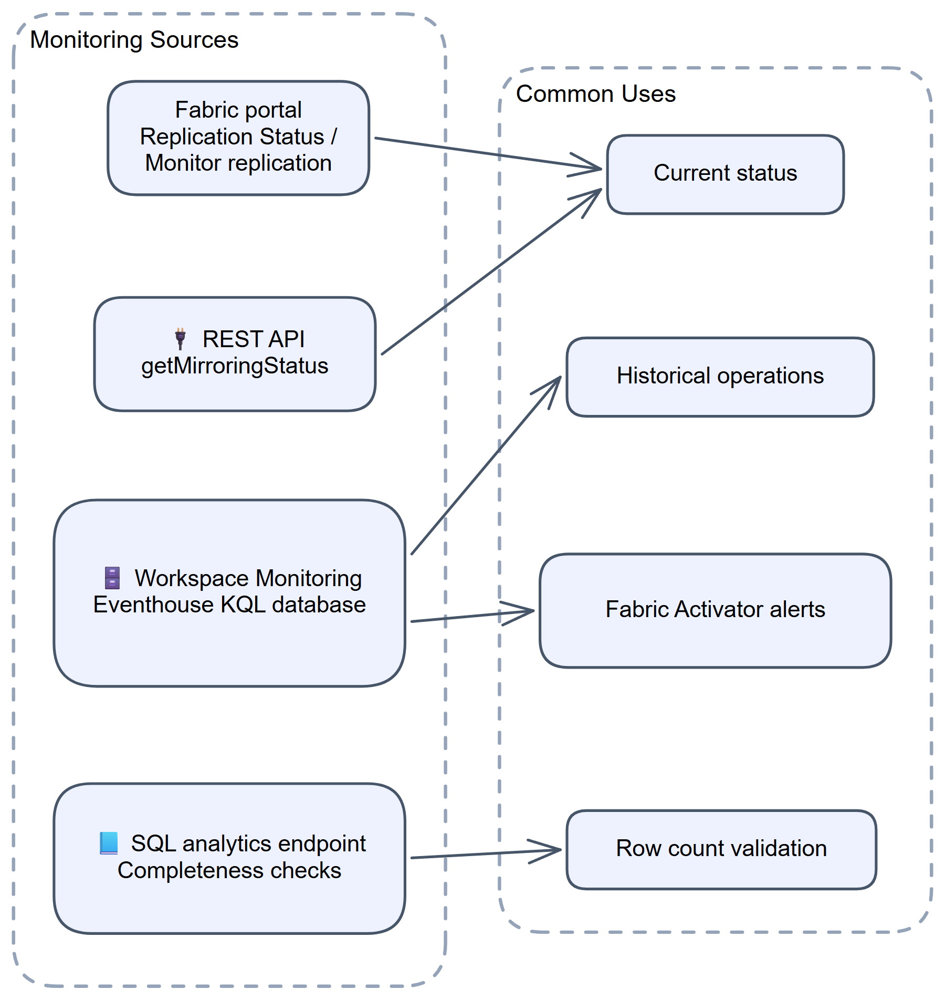
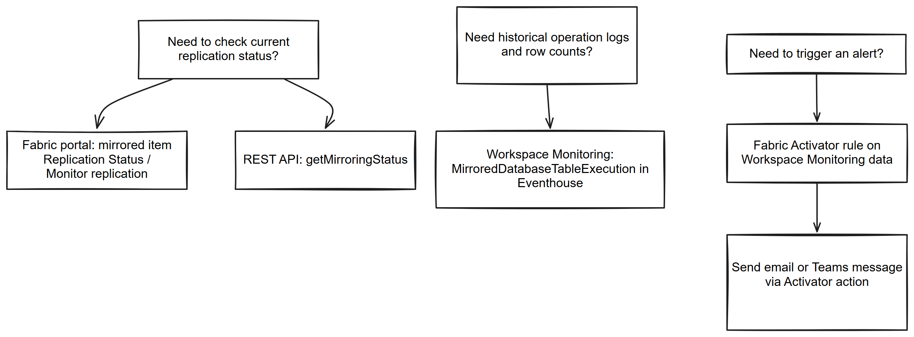
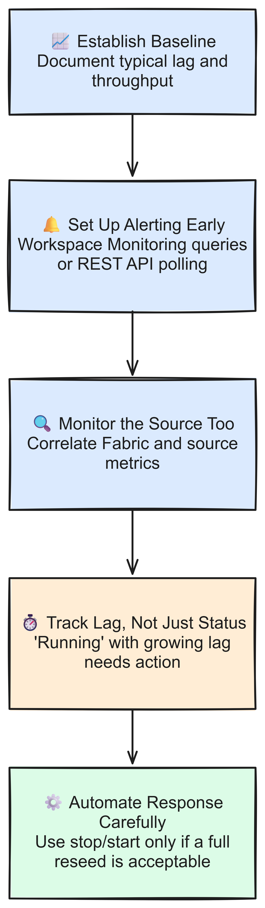

# Chapter 5: Monitoring a Mirrored Database

> **Part 1: Concepts and Architecture**
>
> **Purpose:** Use this chapter to choose the right monitoring path, detect replication problems, and gather evidence for troubleshooting.

**Part index:** [Chapters in Part 1](readme.md)

***

## Overview

There are several ways to check the status of Fabric Mirroring:

* The mirrored database's Replication Status tab or monitoring section
* Fabric Mirroring Item REST API
* Workspace Monitoring: `MirroredDatabaseTableExecution` table

<br />

[](../assets/diagrams/chapter-05/diagram-01.excalidraw.png)

*Figure 5.1: Monitoring options for a mirrored database*

***

## Fabric Portal Monitoring

The fastest way to check a mirrored database is its item-level replication status view in the Fabric portal.

> **Note:** This is not the same as the Fabric-wide **Monitor hub**, opened by selecting **Monitor** in the navigation pane. Its **Job runs** page tracks activity for items such as pipelines, notebooks, dataflows, and Spark job definitions. Mirrored databases are not in its [supported item list](https://learn.microsoft.com/en-us/fabric/admin/monitoring-hub-jobs#supported-item-types-in-the-job-runs-page). To check replication status, open the mirrored database item directly.

### Replication Status and Monitor Replication

Open the mirrored database item and use the **Replication Status** tab or monitoring section for that item experience. [Monitor mirrored database replication](https://learn.microsoft.com/en-us/fabric/mirroring/monitor) describes a **Monitor replication** section, illustrated on the item's Home page. That section heading does not establish a rename of the Replication Status tab. The item-level monitoring view shows:

* **Overall replication status**: **Running**, **Running with warning**, **Stopping/Stopped**, **Failed**, or **Paused**
* **Per-table replication status**: **Running**, **Running with warning**, **Stopping/Stopped**, or **Failed**
* **Rows replicated**: cumulative count of replicated rows, including inserts, updates, and deletes applied to the target table. This is not the number of rows currently in the table.
* **Last completed**: the last completed time for refreshing each mirrored table from the source

For replication latency, use the REST API metrics or Workspace Monitoring logs described below.

Status meanings:

* **Running**: replication is running and bringing snapshot or change data into OneLake
* **Running with warning**: replication is still active, but transient or nonfatal errors need attention
* **Stopping/Stopped**: replication is being stopped or has already stopped
* **Failed**: replication hit a fatal, unrecoverable failure and needs intervention
* **Paused**: replication is paused because the Fabric capacity was paused and then resumed (database-level status only)

**Backoff is not a separate status value.** It is polling behaviour, described in Chapter 3, that can occur while a mirror still shows **Running** or **Running with warning**.

### Table-Level Detail

Use the table rows in the item-level replication status view to identify affected tables. For snapshot or incremental state, processed rows and bytes, latency, and table-level errors, use `getTablesMirroringStatus`. For individual replication operations, use Workspace Monitoring.

Source-specific watermarks or LSN positions are not part of the documented common monitoring view or table-status API. Where supported, inspect them using the source's troubleshooting tools.

***

## Programmatic Monitoring

Use programmatic monitoring when you need scheduled checks, alerting, or integration with operational workflows.

### Fabric REST API

The Fabric REST API separates database-level and table-level status. See the [Fabric mirroring public REST API reference](https://learn.microsoft.com/en-us/fabric/mirroring/mirrored-database-rest-api) for the full set of operations, including create, update, start, and stop.

```http
POST https://api.fabric.microsoft.com/v1/workspaces/{workspaceId}/mirroredDatabases/{mirroredDatabaseId}/getMirroringStatus

POST https://api.fabric.microsoft.com/v1/workspaces/{workspaceId}/mirroredDatabases/{mirroredDatabaseId}/getTablesMirroringStatus
```

The database-level response is concise:

```json
{
  "status": "Running"
}
```

The paginated table-status response includes metrics:

```json
{
  "data": [
    {
      "sourceObjectType": "Table",
      "sourceSchemaName": "dbo",
      "sourceTableName": "Orders",
      "status": "Replicating",
      "metrics": {
        "processedBytes": 1247,
        "processedRows": 6,
        "lastSyncDateTime": "2024-10-08T05:07:11Z",
        "lastSyncLatencyInSeconds": 15
      }
    }
  ]
}
```

Use database status for lifecycle checks and table status for snapshot, replication, reseed, failure, row, byte, and latency details. Portal status labels and REST API status values differ; do not test API responses for portal labels such as `Running with warning`.

Follow `continuationUri`, or pass `continuationToken` in another `POST`, until there are no more pages. Otherwise, a monitor can miss failed tables beyond the first page. Inspect the optional `error` field on both database and table responses.

### TableMirroringMetrics

The [table-status API reference](https://learn.microsoft.com/en-us/rest/api/fabric/mirroreddatabase/mirroring/get-tables-mirroring-status#tablemirroringmetrics) defines these metrics:

| Name                     | Type               | Description                                                                                                                                                                       |
| ------------------------ | ------------------ | --------------------------------------------------------------------------------------------------------------------------------------------------------------------------------- |
| lastSyncDateTime         | string (date-time) | Last processed time of the table in UTC, using the YYYY-MM-DDTHH:mm:ssZ format.                                                                                                |
| lastSyncLatencyInSeconds | integer (int32)    | Latency in seconds between source commit time and target commit time of last processed change. For sources whose source commit time is not available, this value is not returned. |
| processedBytes           | integer (int64)    | Processed bytes for this table.                                                                                                                                                   |
| processedRows            | integer (int64)    | Processed row count for this table.                                                                                                                                               |

### SQL-Based Monitoring

If you need a simple completeness check, list the replicated tables and run an explicit count against the table you want to verify:

```sql
-- List replicated tables
SELECT
    TABLE_SCHEMA,
    TABLE_NAME
FROM
    INFORMATION_SCHEMA.TABLES
WHERE
    TABLE_TYPE = 'BASE TABLE';

-- Count one mirrored table
SELECT COUNT_BIG(*) AS row_count
FROM dbo.YourMirroredTable;
```

These queries do not expose replication lag or state, but they help confirm that the expected table and data are present.

***

## Workspace Monitoring

For historical operational monitoring across one or more mirrored databases, use **Workspace Monitoring**. This is the primary documented log-based monitoring path for Fabric Mirroring. See [Monitor mirrored database replication](https://learn.microsoft.com/en-us/fabric/mirroring/monitor#use-workspace-monitoring) for how to enable it.

Workspace Monitoring stores telemetry in an **Eventhouse KQL database**, which is part of **Fabric Real-Time Intelligence**. For mirrored database activity, the main table is:

```text
MirroredDatabaseTableExecution
```

The current [Workspace Monitoring experience](https://learn.microsoft.com/en-us/fabric/fundamentals/workspace-monitoring-overview) uses a **monitoring item**. Creating the item does not start collection: enable data collection separately. It does not backfill earlier activity. The default log retention is 30 days, and monitoring consumes Fabric capacity.

### MirroredDatabaseTableExecution schema

The table includes these columns, based on the [Mirrored database operation logs reference](https://learn.microsoft.com/en-us/fabric/mirroring/monitor-logs):

| Column                         | Type     | Description                                                                                                                                                                        |
| ------------------------------ | -------- | ---------------------------------------------------------------------------------------------------------------------------------------------------------------------------------- |
| `Timestamp`                    | datetime | UTC timestamp when the log entry was generated                                                                                                                                     |
| `OperationName`                | string   | Operation type: `AddTable`, `ReplicatingSchema`, `StartSnapshotting`, `Snapshotting`, `StartReplicating`, `Replicating`, `StartReseeding`, `FailTable`, `RemoveTable`, `StopTable` |
| `ItemId`                       | string   | Fabric mirrored database item identifier                                                                                                                                           |
| `ItemKind`                     | string   | Always `MirroredDatabase`                                                                                                                                                          |
| `ItemName`                     | string   | Name of the mirrored database item                                                                                                                                                 |
| `WorkspaceId`                  | string   | Workspace identifier                                                                                                                                                               |
| `WorkspaceName`                | string   | Workspace name                                                                                                                                                                     |
| `CapacityId`                   | string   | Fabric capacity identifier                                                                                                                                                         |
| `CorrelationId`                | string   | Not applicable for mirrored database logs                                                                                                                                          |
| `OperationId`                  | string   | Not applicable for mirrored database logs                                                                                                                                          |
| `Identity`                     | string   | Not applicable for mirrored database logs                                                                                                                                          |
| `CustomerTenantId`             | string   | Customer tenant ID where the operation was performed                                                                                                                               |
| `DurationMs`                   | long     | Not applicable for mirrored database logs                                                                                                                                          |
| `Status`                       | string   | Not applicable for mirrored database logs                                                                                                                                          |
| `Level`                        | string   | Not applicable for mirrored database logs                                                                                                                                          |
| `Region`                       | string   | Region where the mirrored database is located                                                                                                                                      |
| `WorkspaceMonitoringTableName` | string   | Always `MirroredDatabaseTableExecution`                                                                                                                                            |
| `OperationStartTime`           | datetime | UTC operation start time                                                                                                                                                           |
| `OperationEndTime`             | datetime | UTC operation end time                                                                                                                                                             |
| `MirroringSourceType`          | string   | Source type such as `AzureSqlDatabase`, `AzurePostgreSql`, or `Snowflake`                                                                                                          |
| `SourceTableName`              | string   | Source table name                                                                                                                                                                  |
| `SourceSchemaName`             | string   | Source schema name                                                                                                                                                                 |
| `ProcessedRows`                | long     | Number of rows processed by the operation                                                                                                                                          |
| `ProcessedBytes`               | long     | Bytes processed by the operation                                                                                                                                                  |
| `ReplicatorBatchLatency`       | long     | Latency in **seconds** for the batch replication                                                                                                                                   |
| `ErrorType`                    | string   | `UserError` or `SystemError`                                                                                                                                                       |
| `ErrorMessage`                 | string   | Error message details                                                                                                                                                              |

### Sample KQL query

Use KQL to inspect recent mirrored database activity:

```kql
MirroredDatabaseTableExecution
| where OperationStartTime > ago(1d)
| where ItemName == "MyMirroredDatabase"
| project OperationStartTime, OperationEndTime, OperationName, SourceSchemaName, SourceTableName, ProcessedRows, ProcessedBytes, ReplicatorBatchLatency, ErrorType, ErrorMessage
| order by OperationStartTime desc
```

This pattern is useful when you need to answer questions such as:

* Which tables are still snapshotting?
* How many rows were processed in recent batches?
* Which operations failed, and what error message was recorded?
* Is latency increasing over time for a specific table?

See the [sample Workspace Monitoring queries](https://github.com/microsoft/fabric-samples/tree/main/workspace-monitoring/Mirrored%20database%20operations).

See the [Workspace Monitoring log reference](https://learn.microsoft.com/en-us/fabric/mirroring/monitor-logs).

***

## Alerting with Fabric Activator

Workspace Monitoring gives you queryable replication history in Eventhouse, but someone still has to run a KQL query to notice a problem. **Fabric Activator** can run that query on a schedule and trigger an action, such as an email or a Microsoft Teams message, when a rule condition is met.

### How It Fits Together

1. Workspace Monitoring writes mirrored database replication events into `MirroredDatabaseTableExecution` in the Eventhouse KQL database, as covered above.
2. Build a **Real-Time Dashboard** with a supported visual, such as a stat tile showing the count of recent failures or a bar chart of latency by table. Table visuals do not support **Set alert**.
3. From that tile, select **Set alert** to create a Fabric Activator rule.
4. Set the query frequency and condition, for example a failure count above zero or latency above an agreed threshold. Dashboard alerts query every five minutes by default; they do not react instantly to each log entry.
5. Choose an action: **send an email**, or **send a Microsoft Teams message** to an individual, a group chat, or a channel, so the right person is notified to investigate.

### Example Alert Scenarios

* Alert on `OperationName == "FailTable"` to identify table failures. Use `ErrorType` and `ErrorMessage` to diagnose them; `SystemError` alone does not mean an error is fatal.
* Alert when `ReplicatorBatchLatency` on a specific table rises above an agreed threshold, to catch growing lag before users notice stale data.
* Alert on repeated `StartReseeding` operations, or derive an elapsed-time check that finds a reseed without later progress. `StartReseeding` is an event, not a continuously updated status.

> **Note:** Activator rules are built from a Real-Time Dashboard tile, an Eventstream, or certain other supported data sources, not by pointing Activator directly at a KQL table in the Fabric portal. Build a Real-Time Dashboard over the Workspace Monitoring KQL database first, then attach the alert to a tile in that dashboard.

Allow for throttling in the alert design. Activator alerts that use Workspace Monitoring still respect capacity throttling, even though monitoring Eventhouse queries can continue.

For the full walkthrough, see [Create Activator alerts from a Real-Time Dashboard](https://learn.microsoft.com/en-us/fabric/real-time-intelligence/data-activator/activator-get-data-real-time-dashboard) and [What is Fabric Activator?](https://learn.microsoft.com/en-us/fabric/real-time-intelligence/data-activator/activator-introduction).

***

## Choosing a Monitoring Path

[](../assets/diagrams/chapter-05/diagram-02.excalidraw.png)

*Figure 5.2: Monitoring decision flow*

*This diagram shows common patterns, not all supported approaches.*

***

## Key Metrics

Focus on these metrics in production:

| Metric                       | Description                                           | Healthy Range                                       | Action if Outside Range                                                        |
| ---------------------------- | ----------------------------------------------------- | --------------------------------------------------- | ------------------------------------------------------------------------------ |
| **Replication lag**          | Time between source change and availability in Fabric | Usually low and stable for the workload             | Investigate source load, connectivity, throttling, or downstream backlog       |
| **Table replication status** | State of each table                                   | Portal `Running`, or API `Replicating` after snapshot | If warning persists or lag grows, inspect workspace logs and source health     |
| **Rows replicated per hour** | Throughput of the replication pipeline                | Consistent with source change rate                  | Investigate if it drops unexpectedly                                           |
| **Snapshot completion time** | Time to complete the initial full table scan          | Depends on table size and source performance        | Long times may be normal for large tables, but track trend and blocking issues |
| **Error rate**               | Number of fatal or repeated errors                    | Zero                                                | Investigate schema changes, permissions, or source connectivity                |

***

## Monitoring Best Practices

[](../assets/diagrams/chapter-05/diagram-03.excalidraw.png)

*Figure 5.3: Monitoring best practices workflow*

1. **Establish a baseline**: document typical lag, throughput, and snapshot duration soon after go-live.
2. **Set up alerting early**: build a Fabric Activator rule on Workspace Monitoring data before moving a workload into production, rather than relying on someone to check the portal.
3. **Monitor the source too**: replication lag often starts with source-side CPU, I/O, locking, or network issues.
4. **Track lag, not just status**: `Running with warning` may still be acceptable short term, but persistent lag growth needs investigation.
5. **Automate response carefully**: a stop followed by start can cause a full reseed, as documented for Azure SQL Database and Snowflake. Do not use that pattern as routine recovery unless re-replication is acceptable.

***

## Summary

Use the portal for fast checks, the REST API for automation, Workspace Monitoring in Eventhouse for historical operations, row counts, latency, and failure analysis, and Fabric Activator to turn that Workspace Monitoring data into proactive email or Teams alerts. In practice, effective monitoring means watching lag trends and being notified automatically, not just checking whether replication still shows as running.

**Contents:** [Table of Contents](../index.md) | **Previous:** [Chapter 4: The Anatomy of a Mirrored Database](chapter-04.md) | **Next:** [Chapter 6: Using the Fabric REST API](chapter-06.md)
