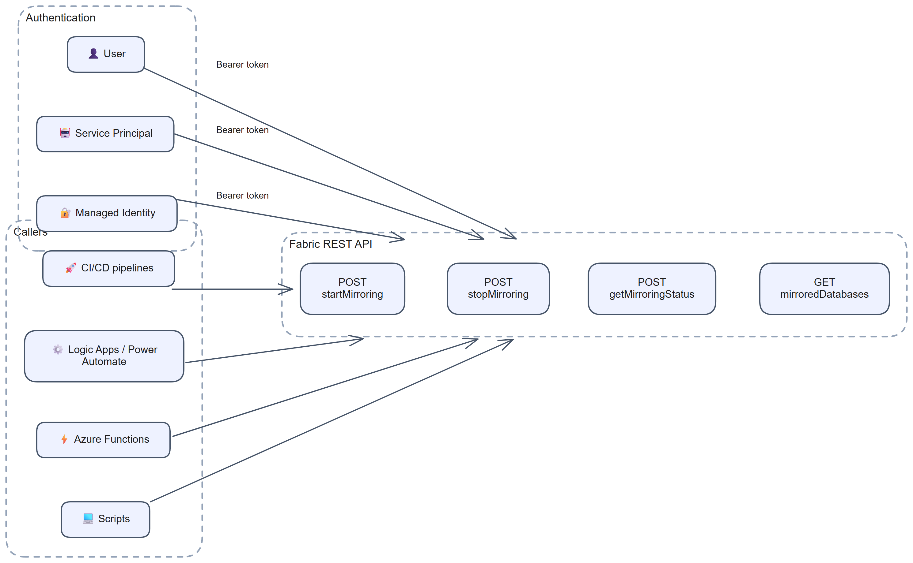
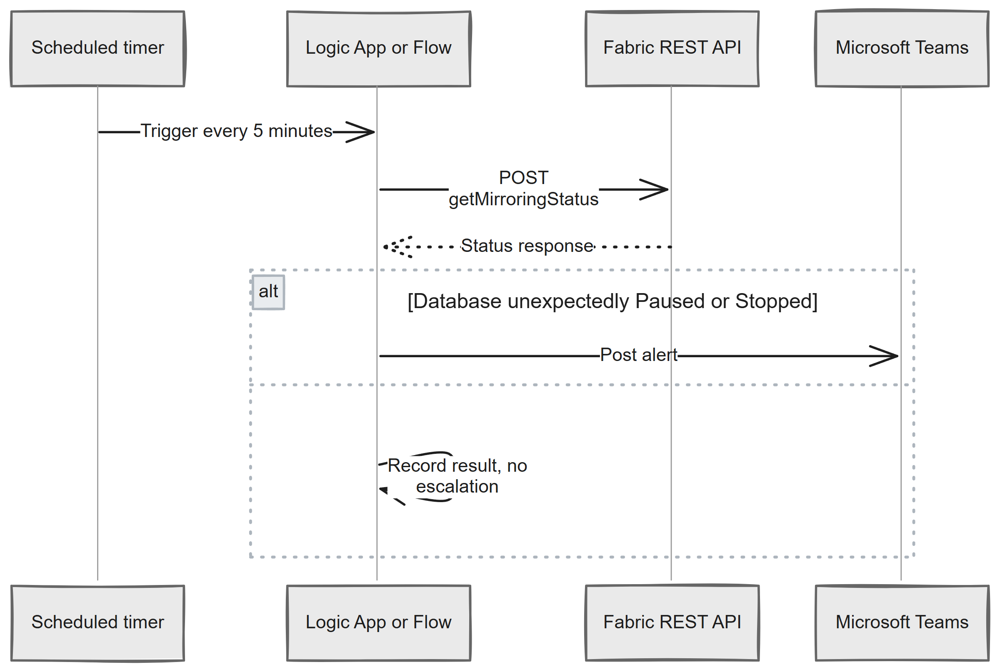

# Chapter 6: Using the Fabric REST API

> **Part 1: Concepts and Architecture**
>
> **Purpose:** Use this chapter to automate mirrored database operations, status checks, and operational workflows through the Fabric REST API.

---

## Overview

> **Note:** The Mirrored Database REST API operations covered in this chapter apply to **database mirroring** sources and **open mirroring** items. They do **not** apply to Azure Databricks mirrored catalogs (metadata mirroring). Databricks catalog mirroring is managed differently. See Chapter 14.

[](../assets/diagrams/chapter-06/diagram-01.excalidraw.png)

*Figure 6.1: Fabric REST API usage patterns*

---

## Prerequisites

Before using the Fabric REST API for mirroring operations, make sure the following are in place.

### 1. Authentication Setup

Fabric REST API calls require a valid **Microsoft Entra ID** bearer token. You can authenticate as:

- **A user** with delegated permissions, suitable for interactive scripts and development
- **A service principal** with application permissions, suitable for CI/CD, scheduled jobs, and other automation

**Obtaining a token (service principal example):**

```bash
# Using Azure CLI
az login --service-principal \
  --username <app-id> \
  --password <client-secret> \
  --tenant <tenant-id>

TOKEN=$(az account get-access-token \
  --resource https://api.fabric.microsoft.com \
  --query accessToken -o tsv)
```

### 2. Required Permissions

The calling identity must have at least:

| Operation | Required Role |
|---|---|
| Read mirroring status | Workspace Viewer or item Read permission |
| Start or stop mirroring | Workspace Contributor or item Write permission |
| Create mirrored database | Workspace Member or Admin |

**Managed identity nuance:** when you create a mirrored database in the Fabric portal and choose a managed identity such as a system-assigned or user-assigned managed identity, Fabric grants the managed identity the required Fabric item permissions automatically. If you create the item through the API or through automated deployment pipelines, you must grant that managed identity **Read** and **Write** permission on the mirrored database item yourself.

### 3. Fabric Workspace and Item IDs

All API calls require the **Workspace ID** and **Mirrored Database Item ID**. You can get these from the Fabric portal URL or by listing workspaces:

```http
GET https://api.fabric.microsoft.com/v1/workspaces
```

---

## Start Mirroring

To start replication on a mirrored database:

```http
POST https://api.fabric.microsoft.com/v1/workspaces/{workspaceId}/mirroredDatabases/{mirroredDatabaseId}/startMirroring
Authorization: Bearer {token}
Content-Type: application/json
```

**Request body:** empty

**Response:** `200 OK` on success

**Notes:**

- If mirroring has never been started, the API initiates the initial snapshot and then ongoing replication.
- Calling `startMirroring` on an already running item is generally safe.
- **Important:** For database mirroring sources, stopping mirroring and then restarting it triggers a **full reseed**. All previously replicated data is re-replicated from the initial snapshot. The stop/start pattern does not resume from a watermark. Use stop/start only when a full reseed is acceptable. This behaviour is documented in the [Azure SQL Database FAQ](https://learn.microsoft.com/en-us/fabric/mirroring/azure-sql-database-mirroring-faq) and [Snowflake FAQ](https://learn.microsoft.com/en-us/fabric/mirroring/snowflake-mirroring-faq). Individual source chapters provide source-specific detail.

---

## Stop Mirroring

To stop replication without deleting the mirrored database item:

```http
POST https://api.fabric.microsoft.com/v1/workspaces/{workspaceId}/mirroredDatabases/{mirroredDatabaseId}/stopMirroring
Authorization: Bearer {token}
Content-Type: application/json
```

**Response:** `200 OK` on success

**Notes:**

- Stopping mirroring does not delete the Delta tables in OneLake. Existing data remains queryable.
- For database mirroring sources, a later `startMirroring` call triggers a full reseed rather than a simple resume.
- Treat stop/start as an operational reset only when full re-replication is acceptable.

---

## Get Mirroring Status

To query the current replication status:

```http
POST https://api.fabric.microsoft.com/v1/workspaces/{workspaceId}/mirroredDatabases/{mirroredDatabaseId}/getMirroringStatus
Authorization: Bearer {token}
```

The database status can be **Initializing**, **Initialized**, **Starting**, **Running**, **Paused**, **Stopping**, or **Stopped**.

**Sample response:**

```json
{
  "status": "Running"
}
```

Call `getTablesMirroringStatus` with `POST` when you need per-table states and metrics. Table states include **Initialized**, **Snapshotting**, **Replicating**, **Reseeding**, **Stopped**, and **Failed**.

---

## List Mirrored Databases in a Workspace

To enumerate mirrored databases in a workspace:

```http
GET https://api.fabric.microsoft.com/v1/workspaces/{workspaceId}/mirroredDatabases
Authorization: Bearer {token}
```

**Sample response:**

```json
{
  "value": [
    {
      "id": "xxxxxxxx-xxxx-xxxx-xxxx-xxxxxxxxxxxx",
      "displayName": "Sales Database Mirror",
      "type": "MirroredDatabase"
    }
  ]
}
```

---

## Integration with Automation

### Logic Apps or Power Automate

Use an HTTP action to call Fabric REST API endpoints in scheduled or event-driven workflows.

[](../assets/diagrams/chapter-06/diagram-02.excalidraw.png)

*Figure 6.2: Automated status check pattern*

Common patterns:

- **Scheduled status checks**: call `getMirroringStatus` for lifecycle state and `getTablesMirroringStatus` for failed tables or latency thresholds.
- **Operational gating**: verify mirroring status before downstream data jobs run.
- **Controlled restart workflows**: use `stopMirroring` and `startMirroring` only when a full reseed is acceptable.

### Azure Functions

An Azure Function can poll the Fabric REST API and forward the result to a workflow, dashboard, or incident system.

```python
import requests

def get_mirroring_status(workspace_id: str, database_id: str, token: str) -> dict:
    url = (
        f"https://api.fabric.microsoft.com/v1/workspaces/{workspace_id}"
        f"/mirroredDatabases/{database_id}/getMirroringStatus"
    )
    headers = {"Authorization": f"Bearer {token}"}
    response = requests.post(url, headers=headers)
    response.raise_for_status()
    return response.json()
```

### CI/CD Pipelines

Pipelines can call the REST API after deployment to:

- start mirroring on a newly deployed item
- confirm that the item exists and is reachable
- check status before promoting downstream configuration

Be careful with automated stop/start steps for database mirroring sources, because restart triggers a full reseed.

---

## API Rate Limits and Best Practices

- **Rate limiting**: Fabric REST API calls are subject to throttling.
- **Polling frequency**: avoid polling `getMirroringStatus` more often than every 30 seconds per mirrored database to stay within published rate limits.
- **Error handling**: implement retry logic with exponential backoff for `429 Too Many Requests` and `503 Service Unavailable`.
- **Idempotent operations**: `startMirroring` and `stopMirroring` are designed to be safe to call repeatedly, but for database mirroring a stopped item that is started again triggers a full reseed rather than a simple resume.
- **Token expiry**: bearer tokens typically expire after about one hour, so long-running automation should refresh tokens.

---

## Summary

The Fabric REST API gives you practical control over mirrored database operations: start, stop, list, and check status. Use Microsoft Entra ID for authentication, grant permissions carefully for managed identities in automated deployments, and remember that for database mirroring a stop followed by start causes a full reseed.

**Contents:** [Table of Contents](../index.md) | **Previous:** [Chapter 5: Monitoring a Mirrored Database](chapter-05.md) | **Next:** [Chapter 7: Deploying a Mirrored Database Using CI/CD](chapter-07.md)
