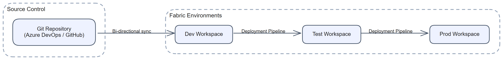
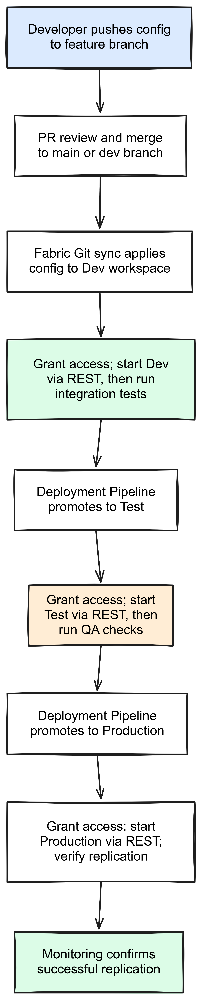

# Chapter 7: Deploying a Mirrored Database Using CI/CD

> **Part 1: Concepts and Architecture**
>
> **Purpose:** Use this chapter to choose and implement a repeatable deployment pattern for mirrored databases across environments.

**Part index:** [Chapters in Part 1](readme.md)

---

## Overview

Fabric supports Git integration, deployment pipelines, REST API scripting, and the Fabric Terraform provider for mirrored databases. These deploy configuration, not a copy of the mirrored data. See [CI/CD for mirrored databases](https://learn.microsoft.com/en-us/fabric/mirroring/mirrored-database-cicd).

This chapter's `MirroredDatabase` deployment contract does not create a [Dataverse Link to Fabric](../Part%202-%20Source-Specific%20Mirroring%20Guides/chapter-28.md) or establish [SAP BDC sharing](../Part%202-%20Source-Specific%20Mirroring%20Guides/chapter-29.md). Treat source-side link/product authorization as a separate deployment dependency; moving a consumer item definition is not proof that its source link, permissions, or synchronized data are ready.

[](../assets/diagrams/chapter-07/diagram-01.excalidraw.png)
*Figure 7.1 - CI/CD pipeline flow for mirrored databases*

---

## CI/CD Support

Fabric supports native source control and promotion workflows for mirrored databases.

### Fabric Git Integration

Fabric workspaces can be connected to a **Git repository** in Azure DevOps or GitHub through the Fabric portal. When configured:

- Workspace items, including mirrored databases, are serialised to Git-compatible JSON files.
- Changes made in the portal can be committed to the connected branch.
- Changes pushed to the branch can be synchronised back to the Fabric workspace.

**Mirrored database artefacts in Git** include:

- `<mirrored-database-name>.MirroredDatabase/` directory
- `.platform` for system-generated item metadata
- `mirroring.json` for the source connection reference, table selection, and mirroring configuration

Only the mirrored database item is tracked. Its SQL analytics endpoint, SQL views, and other child items are not tracked in this Git representation. Manage any SQL objects you create separately.

**Important:** Source credentials are **not** stored in Git. The connection reference, typically the Connection ID, is stored in the item definition, but the actual credentials remain in Fabric's connection store. When environments use different connections, substitute the correct connection IDs during promotion.

### Fabric Deployment Pipelines

Fabric **Deployment Pipelines** support promotion across environments, usually Development to Test to Production, with:

- Promotion of individual items or all items in a workspace
- Deployment rules for environment-specific values
- A controlled path for validation before production release

Deployment does **not** start mirroring. Start it explicitly after validating the target configuration and permissions. Child items such as SQL views are not deployed across stages with the mirror.

### September 2026 CI/CD Announcements

The [FabCon summary](https://community.fabric.microsoft.com/blog/fbc_fabricupdatesblogs/fabric-september-2026-feature-summary/5325825) adds the following workflows. Their platform-wide availability does not remove the mirrored-database restrictions above.

| Feature | Announced status | Apply it to a mirroring solution |
|---|---|---|
| Compare and commit changes | GA | Review supported item definitions and conflicts before updating. This does not bring SQL endpoint child objects into the mirror's Git representation. |
| File-level commit | Preview | **MirroredDatabase is not in the current supported-item list.** Do not prescribe partial commits of `mirroring.json` and `.platform` for mirrors. See [supported items](https://learn.microsoft.com/en-us/fabric/cicd/git-integration/granular-compare#items-that-support-file-level-commit). |
| Branch workspace and selective branching | GA | Create a smaller development workspace with selected items, but retain required dependencies. Switching branches can delete items absent from the selected branch. |
| Branch workspace admin profile | Preview | Administrators preconfigure the identity/settings used to create branch workspaces; developers can then branch without separate workspace-creation or capacity-assignment privileges. The workspace must already be Git-connected. See [branch workspaces](https://learn.microsoft.com/en-us/fabric/cicd/git-integration/branched-workspace). |
| Deployment Plan | Preview | Order deployment groups and pre/post actions when dependencies are not captured by lineage. Provision connections, gateway bindings, identities, and workspace settings separately; still start the mirror explicitly and wait for usable data. |
| Bulk export/import APIs | GA | Export/import multiple item definitions through `bulkExportDefinitions` and `bulkImportDefinitions`; this is configuration transport, not a data copy. Verify item/identity support and the 128 MB request limit. See [export](https://learn.microsoft.com/en-us/rest/api/fabric/core/items/bulk-export-item-definitions) and [import](https://learn.microsoft.com/en-us/rest/api/fabric/core/items/bulk-import-item-definitions). |

A [deployment plan](https://learn.microsoft.com/en-us/fabric/cicd/deployment-plan/deployment-plan-overview) stops later work after failure; it does **not** roll back completed work or automatically prove downstream queryability. Plan a readiness check between starting replication and deploying consumers. The current guide excludes deployment-plan support from `fabric-cicd`. Separately, the summary describes production-ready bulk deployment while the [library's optional-feature guidance](https://microsoft.github.io/fabric-cicd/latest/how_to/optional_feature/) still uses Experimental/beta wording. Pin the library and inspect its supported feature set rather than assuming parity with a GA REST endpoint.

---

## Infrastructure as Code

For teams that want scripted deployment, the two current programmatic paths are the **Fabric Terraform provider** and direct **REST API** calls. If you need infrastructure-as-code beyond Terraform, the REST API is the current recommended path for mirrored databases.

### Terraform (Fabric Provider)

```hcl
resource "fabric_mirrored_database" "sales_mirror" {
  workspace_id = var.workspace_id
  display_name = "Sales Database Mirror"
  format       = "Default"

  definition = {
    "mirroring.json" = {
      source = "${path.module}/mirroring.json.tmpl"
      tokens = {
        CONNECTION_ID = var.sql_connection_id
      }
    }
  }
}
```

The template must contain a valid [mirrored database definition](https://learn.microsoft.com/en-us/rest/api/fabric/articles/item-management/definitions/mirrored-database-definition), using `{{ .CONNECTION_ID }}` in `properties.source.typeProperties.connection`. Table selection belongs in the definition's `mountedTables` array, not in standalone Terraform attributes. Start from a definition exported from a working mirror and parameterise only the environment-specific values. Pin and check the [Fabric provider version and resource schema](https://registry.terraform.io/providers/microsoft/fabric/latest/docs/resources/mirrored_database) used by your release.

### REST API Deployment Script

For maximum control, you can create and configure a mirrored database through the Fabric REST API:

```bash
# Create a mirrored database
curl -X POST "https://api.fabric.microsoft.com/v1/workspaces/${WORKSPACE_ID}/mirroredDatabases" \
  -H "Authorization: Bearer ${TOKEN}" \
  -H "Content-Type: application/json" \
  -d '{
    "displayName": "Sales Database Mirror",
    "definition": {
      "parts": [
        {
          "path": "mirroring.json",
          "payload": "<base64-encoded-config>",
          "payloadType": "InlineBase64"
        }
      ]
    }
  }'
```

Replace the payload placeholder with the locally Base64-encoded `mirroring.json` definition. This approach is useful when you need custom environment substitution or release orchestration. For updates, retrieve the current definition before calling `updateDefinition`, and handle asynchronous responses as described in Chapter 6.

---

## Service Principal and Permissions

Automated deployments should use a **service principal** or supported **managed identity** rather than a personal user account. The following steps cover a service principal.

### 1. Create a Service Principal

In the Azure portal under **Microsoft Entra ID**:
1. Register a new application.
2. Create a client secret or upload a certificate.
3. Record the **Application (client) ID** and **Tenant ID**.

### 2. Grant Workspace Access

In the Fabric portal:
1. Open the target workspace settings.
2. Under **Access**, add the service principal as a **Contributor** for item creation and management. Use **Member** or **Admin** only if the release also needs permissions such as sharing or workspace administration.

### 3. Enable Service Principal Access in Fabric Admin Settings

In the Fabric Admin portal:
1. Go to **Tenant settings** and then **Developer settings**.
2. Enable **Service principals can use Fabric APIs**.
3. Optionally restrict access to a specific security group.

### 4. Connection Permissions

The service principal must also have access to the **Fabric Connection** used by the mirrored database:
- Add the service principal as an owner or user of the connection in **Manage connections and gateways**.

For sources that publish using a source managed identity, also grant that identity **Read and Write** on the newly deployed mirrored database before starting it. This is separate from the deployment service principal's access. Chapter 6 lists the applicable sources and permission steps.

---

## Promotion Between Environments

Promoting a mirrored database between environments mainly involves substituting environment-specific values, especially connection references and source database names.

### Parameterisation Strategy

Use deployment parameters to supply environment-specific values during promotion:

| Parameter | Dev Value | Test Value | Prod Value |
|---|---|---|---|
| `source_connection_id` | `conn-dev-sql-01` | `conn-test-sql-01` | `conn-prod-sql-01` |
| `source_database_name` | `SalesDB_Dev` | `SalesDB_Test` | `SalesDB` |
| `workspace_id` | `ws-dev-xxxxx` | `ws-test-xxxxx` | `ws-prod-xxxxx` |

In deployment pipelines, configure the **connection ID** and, where applicable to the source type, **database name** through **Data source rules** on the target stage. The target workspace is assigned to the pipeline stage, not set by a data source rule. Rules take effect on the next deployment.

The names in the table are release-parameter examples, not literal fields in `mirroring.json`. In scripted releases, map them to the source-specific definition properties using environment variables, parameter files, or your CI/CD platform's secret and variable store. Change the source connection ID, database name, or default schema only while the target mirror is `Initialized` or `Stopped`.

### Promotion Workflow

A typical workflow looks like this:

[](../assets/diagrams/chapter-07/diagram-02.excalidraw.png)
*Figure 7.2 - End-to-end CI/CD promotion workflow*

### Post-Deployment Verification

After promotion to a new environment:

1. Verify that the connection resolves to the correct server, database, and stored credentials.
2. Confirm that required source managed identity permissions are granted. For a new mirror, wait for `Initialized`; for a previously stopped mirror, verify `Stopped`. Then explicitly start mirroring.
3. Confirm that the initial snapshot completes and table replication is healthy. Do not assume a newly deployed mirror resumes a source-stage replication watermark.
4. Compare row counts or sample records against the source.
5. Enable or confirm monitoring and alerting. See Chapter 5 for monitoring guidance.

---

## Summary

For mirrored databases, the currently verified deployment patterns are Git integration, Deployment Pipelines, REST API scripting, and the Fabric Terraform provider. The main operational task is parameterising environment-specific values, especially connection IDs, because credentials stay in Fabric rather than in source control.

**Contents:** [Table of Contents](../index.md) | **Previous:** [Chapter 6: Using the Fabric REST API](chapter-06.md) | **Next:** [Chapter 8: Using a Mirrored Database](chapter-08.md)
