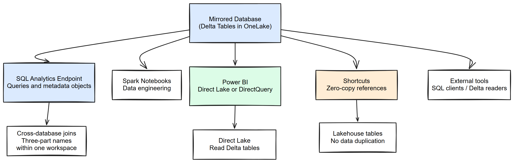
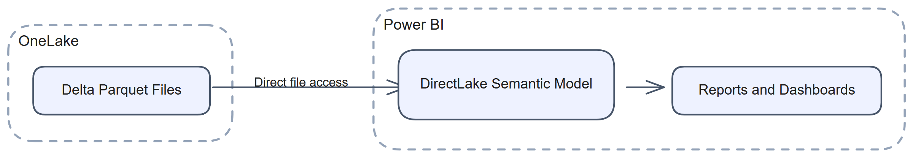

# Chapter 8: Using a Mirrored Database

> **Part 1: Concepts and Architecture**
>
> **Purpose:** Use this chapter to query, secure, and combine mirrored data after replication is running.

**Part index:** [Chapters in Part 1](readme.md)

***

## Overview

Mirrored data is a read-only analytical asset that you can query, join to other Fabric data, and expose to reporting tools.

[](../assets/diagrams/chapter-08/diagram-01.excalidraw.png)
*Figure 8.1 - Analytics capabilities powered by a mirrored database*

> **Important:** Replicating rows does not automatically reproduce source row-level security, column-level security, or data masking in Fabric. Configure and validate equivalent controls separately. The announced Snowflake security-role replication Preview has a narrower, optional scope; it is not a promise of complete policy parity. See [Chapter 9](chapter-09.md#95-snowflake-security-roles-replication-preview) for the announcement boundary and the [Snowflake security-role discussion](../Part%202-%20Source-Specific%20Mirroring%20Guides/chapter-22.md#snowflake-security-roles-replication-preview). For SQL controls, see [Row-level security](https://learn.microsoft.com/en-us/fabric/data-warehouse/row-level-security), [Column-level security](https://learn.microsoft.com/en-us/fabric/data-warehouse/column-level-security), and [Dynamic data masking](https://learn.microsoft.com/en-us/fabric/data-warehouse/dynamic-data-masking).

SQL endpoint security protects queries through that endpoint, not direct access through Spark or OneLake. Review both SQL and OneLake access before sharing. Item **Read** alone does not grant access to all table data; **ReadData** grants SQL data access and **ReadAll** grants OneLake data access. See [Share and manage permissions](https://learn.microsoft.com/en-us/fabric/mirroring/share-and-manage-permissions) and [SQL analytics endpoint security](https://learn.microsoft.com/en-us/fabric/data-engineering/lakehouse-sql-analytics-endpoint#security).

***

## SQL Analytics Endpoint

Every mirrored database exposes a **SQL analytics endpoint** for querying mirrored tables with T-SQL.

### Key Behaviours

* Mirrored tables are **read-only** through the SQL analytics endpoint.
* `INSERT`, `UPDATE`, and `DELETE` statements against mirrored tables are not supported.
* You **can** create SQL views and stored procedures on the SQL analytics endpoint. These are metadata-only objects and do not write to the mirrored tables.
* Metadata synchronisation can lag behind the underlying Delta tables. If a newly mirrored table does not appear, use **Refresh** in the SQL analytics endpoint editor's **Explorer** toolbar.

> **Note:** Query freshness through the SQL analytics endpoint depends on **metadata sync**, not only on mirroring replication speed. This separate process detects tables, schema changes, and row-level data changes in Delta. A change can therefore be visible in OneLake before it appears through SQL. Query the Delta table through Spark to distinguish replication delay from SQL sync delay. Direct Lake on SQL also depends on the endpoint for discovery and framing, so it is not a general bypass for metadata sync.

The [new metadata sync option](https://learn.microsoft.com/en-us/fabric/data-engineering/sql-analytics-endpoint-metadata-sync) is in preview. Enable it under **Workspace settings > Warehouse settings** before creating an endpoint; existing endpoints remain on legacy sync. The T-SQL refresh procedure `sys.sp_dw_refresh_ext_table` is available only on endpoints created with the new sync. Portal refresh and the metadata-refresh REST API provide other manual refresh paths.

### String Column Size Boundary

The mirrored SQL analytics endpoint supports `varchar(max)` up to **16 MB**, but source-specific limits can be lower: **1 MB** for mirrored SQL Server, Azure SQL Database, and Azure SQL Managed Instance, and **2 MB** for mirrored Azure Cosmos DB. Older tables can still map strings to `varchar(8000)` and may need to be recreated. Check the actual column metadata and the [Fabric Mirroring troubleshooting guidance](https://learn.microsoft.com/en-us/fabric/mirroring/troubleshooting#some-of-the-data-in-my-column-appears-to-be-truncated).

A Lakehouse shortcut does not carry the mirrored endpoint's larger string limit into the Lakehouse SQL endpoint. The [Lakehouse SQL endpoint limitations](https://learn.microsoft.com/en-us/fabric/data-engineering/lakehouse-sql-analytics-endpoint#limitations) still document 8 KB truncation there, including shortcuts to mirrored items.

### September 2026 Query-Language Previews

The [FabCon feature summary](https://community.fabric.microsoft.com/blog/fbc_fabricupdatesblogs/fabric-september-2026-feature-summary/5325825) announces analytical SQL enhancements relevant to endpoint consumers: `MEDIAN`, `QUANTILE`, their approximate variants, and aggregate forms of the percentile functions; `GROUP BY ALL`, `ORDER BY ALL`, `QUALIFY`, and `FROM ... SELECT`; and additional scalar-UDF inlining scenarios. These are **Preview query capabilities**, not changes to source capture or permission to modify mirrored base tables.

Use the [aggregate-function reference](https://learn.microsoft.com/en-us/sql/t-sql/functions/aggregate-functions-transact-sql?view=fabric), [QUALIFY](https://learn.microsoft.com/en-us/sql/t-sql/queries/select-qualify-clause-transact-sql?view=fabric), [GROUP BY](https://learn.microsoft.com/en-us/sql/t-sql/queries/select-group-by-transact-sql?view=fabric), [ORDER BY](https://learn.microsoft.com/en-us/sql/t-sql/queries/select-order-by-clause-transact-sql?view=fabric), and [FROM-first syntax](https://learn.microsoft.com/en-us/sql/t-sql/queries/from-select-transact-sql?view=fabric) for supported forms. Expanded [scalar-UDF inlining](https://learn.microsoft.com/en-us/fabric/data-warehouse/how-to-inline-udf) does not mean every data-access UDF or query shape is supported.

***

## Openness of the Delta Format

Mirrored data is stored as **Delta** tables in OneLake.

**What this means in practice:**

* Use a Delta-aware reader that supports the table's Delta features. Reading individual Parquet files without the Delta transaction log can return obsolete rows or miss changes.
* OneLake exposes [ADLS Gen2-compatible APIs](https://learn.microsoft.com/en-us/fabric/onelake/onelake-access-api), so compatible tools such as Azure Databricks and Apache Spark can read it with Microsoft Entra authentication and appropriate permissions.
* You do not need to export mirrored data into another format before analysing it.
* The format remains open even though the mirrored tables themselves stay read-only.

### OneLake Table Read API (Preview)

The [September Table Read API announcement](https://community.fabric.microsoft.com/blog/fbc_fabricupdatesblogs/fabric-september-2026-feature-summary/5325825#community-5325825-mcetoc_1k3kj91s5_18) offers another application read path: Delta or Iceberg table data returned as **Apache Arrow**, with OneLake security including row/column restrictions. Follow the [API prerequisites and authentication](https://learn.microsoft.com/en-us/fabric/onelake/table-apis/table-apis-overview); the token audience is **Azure Storage**, not the Fabric management API audience used in Chapter 6.

The [read protocol](https://learn.microsoft.com/en-us/fabric/onelake/table-apis/read-table-data-rest-api) starts a snapshot read with `POST .../tables/{table}/read`, then returns streams downloaded through `GET .../readStream/{id}`. Read **every** returned stream before the 60-minute expiry. Streams belong to the same snapshot and can be downloaded in parallel, but row order is not guaranteed and cross-region shortcuts are unsupported. This is parallel **consumption**, not a new mirroring replication-throughput feature.

### Find Tables Before Choosing a Read Path

September's OneLake Catalog object browsing and enhanced Global Search make supported schemas/tables discoverable without opening every parent item. The **Catalog Search API enhancements are Preview** and explicitly include mirrored-database tables. Table discoverability depends on Read access to the parent item, not OneLake data-plane roles; discovering metadata does not establish permission to query the data. See [OneLake Catalog](https://learn.microsoft.com/en-us/fabric/governance/onelake-catalog-overview) and [Chapter 6's discovery interfaces](chapter-06.md#september-2026-discovery-and-automation-interfaces).

***

## Cross-Database Queries

The SQL analytics endpoint supports **cross-database queries** within the same workspace, so you can join mirrored data with warehouses and Lakehouse SQL endpoints using three-part names. For data in another workspace, use OneLake shortcuts where supported rather than assuming the same naming convention crosses workspace boundaries. See [Write a cross-database query](https://learn.microsoft.com/en-us/fabric/data-warehouse/query-warehouse#write-a-cross-database-query).

### Joining Mirrored and Warehouse Data

```sql
SELECT
    m.OrderID,
    m.OrderDate,
    m.TotalAmount,
    w.CustomerSegment
FROM
    [SalesMirror].[dbo].[Orders] AS m
INNER JOIN
    [SalesWarehouse].[dbo].[CustomerSegments] AS w
    ON m.CustomerID = w.CustomerID
WHERE
    m.OrderDate >= '2024-01-01';
```

### Three-Part Naming Convention

Cross-database queries use the form `[database].[schema].[table]`. The database name is the Fabric item name, whether that item is a mirrored database, warehouse, or lakehouse SQL endpoint.

***

## Shortcuts to Mirrored Data

Fabric **Shortcuts** let you reference mirrored tables from a Lakehouse without copying the data.

### Creating a Shortcut to Mirrored Data

1. Open a Fabric Lakehouse.
2. In **Tables**, select **+ New shortcut**.
3. Choose **Microsoft OneLake** as the source.
4. Browse to the mirrored database path and select the required table.

The shortcut then appears as a Lakehouse table that Spark and the Lakehouse SQL endpoint can query.

### Use Cases for Shortcuts

* Reading mirrored data in Spark notebooks
* Combining mirrored tables with Lakehouse-managed tables
* Preparing downstream transformations without duplicating storage

***

## Tool Ecosystem

Mirrored databases can be consumed through the SQL analytics endpoint and through OneLake. Mirrored tables remain read-only to consumers. Direct edits to their Delta files are unsupported; update the source instead, or publish changes through the landing zone for open mirroring.

### SQL-Based Tools

| Tool                                    | Connection Method           | Notes                                    |
| --------------------------------------- | --------------------------- | ---------------------------------------- |
| **SQL Server Management Studio (SSMS)** | TDS / SQL Server connection | Read-only access to mirrored tables      |
| **Visual Studio Code with MSSQL**       | TDS / SQL Server connection | SQL querying and development              |
| **DBeaver**                             | JDBC / SQL Server driver    | Community tool with broad compatibility  |
| **Power BI Desktop**                    | DirectQuery or Import       | Uses Fabric and SQL connectivity options |
| **Excel**                               | Get Data -> SQL Server      | Can read mirrored tables directly        |
| **Tableau**                             | SQL Server connector        | Read-only analytics on mirrored data     |

Azure Data Studio is retired and no longer receives security fixes. Use [Visual Studio Code with the MSSQL extension](https://learn.microsoft.com/en-us/sql/tools/whats-happening-azure-data-studio?view=sql-server-ver17) or SSMS for supported Microsoft desktop tooling.

### Spark / Notebook Tools

| Tool                 | Connection Method      | Notes                           |
| -------------------- | ---------------------- | ------------------------------- |
| **Fabric Notebooks** | Native OneLake / Spark | Read Delta data directly        |
| **Azure Databricks** | OneLake ABFS connector | Reads Delta tables from OneLake |
| **Apache Spark**     | ADLS Gen2 API          | Direct Delta table access       |

***

## Power BI Integration

Power BI is a common way to consume mirrored data in Fabric.

### Direct Lake Mode

Power BI **Direct Lake** loads data from Delta tables in OneLake into the semantic model's engine without a full Import-mode copy. There are two paths:

* **Direct Lake on OneLake** accesses Delta tables without SQL endpoint discovery or DirectQuery fallback.
* **Direct Lake on SQL** uses the SQL analytics endpoint for discovery and permission checks. It can fall back to DirectQuery, for example for SQL views or SQL row-level security.

[](../assets/diagrams/chapter-08/diagram-02.excalidraw.png)
*Figure 8.2 - Direct Lake data-reading path, excluding SQL-based discovery and any DirectQuery fallback*

Direct Lake still needs a metadata refresh, called **framing**, to reference updated table files. Automatic updates can keep the model current without a scheduled full import, but mirroring a change does not guarantee that every report immediately sees it. See the [Direct Lake overview](https://learn.microsoft.com/en-us/fabric/fundamentals/direct-lake-overview).

### Creating a Power BI Semantic Model from a Mirrored Database

1. Open the mirrored database item in Fabric.
2. Select **Create semantic model**.
3. Choose the tables to include.
4. Let Fabric create the semantic model in the same workspace.
5. Build reports on top of that model.

### DirectQuery Mode

If Direct Lake is unsuitable for a particular model, Power BI can use **DirectQuery** through the SQL analytics endpoint. In that case, queries are executed by the SQL engine rather than directly against OneLake files.

### Refreshing Imported Models

If you choose **Import** mode, schedule refreshes as needed. Mirroring does not need to stop for an import refresh to succeed.

***

## Summary

A mirrored database in Fabric is primarily a read-only analytical asset. You can query it through the SQL analytics endpoint, reference it through shortcuts, join it across databases, and use it in Power BI, while keeping source security and Fabric-side security responsibilities clearly separated.

**Contents:** [Table of Contents](../index.md) | **Previous:** [Chapter 7: Deploying a Mirrored Database Using CI/CD](chapter-07.md) | **Next:** [Chapter 9: Extended Capabilities](chapter-09.md)
