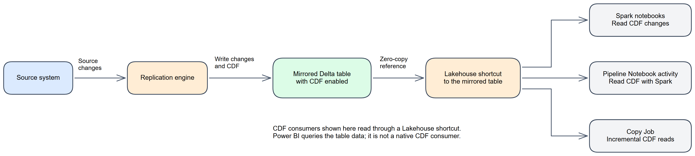
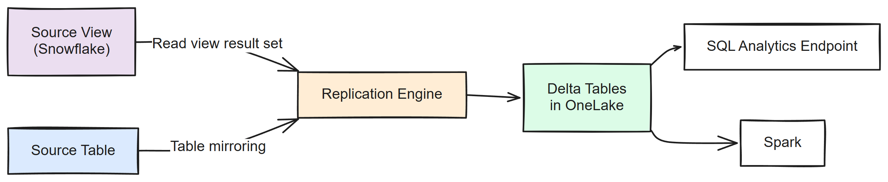
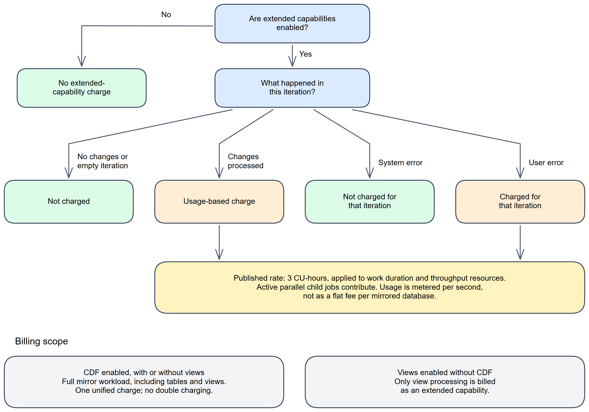

# Chapter 9: Extended Capabilities

> **Part 1: Concepts and Architecture**
>
> **Purpose:** Use this chapter to assess Delta change data feed and Mirroring Views, including their limitations and billing, before enabling them.

**Part index:** [Chapters in Part 1](readme.md)

---

## Overview

The extended capabilities are:

- **Delta change data feed** for row-level inserts, updates, and deletes
- **Mirroring Views** for replicating selected source views

Core mirroring copies tables into OneLake. Extended capabilities add optional paid features that consume extra compute and follow different operational rules.

Microsoft's [Fabric release announcements](https://learn.microsoft.com/en-us/fabric/fundamentals/whats-new) list extended mirroring capabilities, including change feeds and source-view mirroring, as generally available. The [extended-capabilities overview](https://learn.microsoft.com/en-us/fabric/mirroring/extended-capabilities) and dedicated Views guide still carry preview labels. The documentation is not yet consistent on status.

**Snowflake security-role mirroring** is separately announced as a preview that brings role definitions into Fabric. Do not read that as automatic replication of all source security policies: the [Snowflake security guide](https://learn.microsoft.com/en-us/fabric/mirroring/snowflake-how-to-data-security) still instructs users to reconfigure granular security in Fabric and does not describe the preview's policy coverage.

## 9.1 Core Mirroring vs. Extended Capabilities

Before you enable anything, separate the default mirroring behaviour from the optional paid features.

| Core Mirroring (Included by Default) | Extended Capabilities (Optional, Paid) |
|---|---|
| Continuous replication of source tables into OneLake with standard mirrored database behaviour. | Optional paid features such as Delta change data feed and Mirroring Views. |

Core mirroring compute remains free. Extended capabilities are billed only for the extra work they perform.

---

## 9.2 Delta Change Data Feed

Delta change data feed, usually shortened to CDF, records inserts, updates, and deletes at row level in the mirrored Delta tables. It is available across mirroring sources, including open mirroring partners. This is a feed of changes to the replicated Delta tables, not a replacement for source-side change capture. See [Delta change data feed in mirroring](https://learn.microsoft.com/en-us/fabric/mirroring/extended-capabilities-delta-change-data-feed).

### What It Does

- Records incremental row-level changes
- Supports downstream processing that reads only changed rows
- Works across all mirroring sources, including open mirroring sources

### How It Works

When CDF is enabled on a mirrored database, Fabric writes Delta change metadata alongside the mirrored table data in OneLake. Downstream Spark workloads can then read just the changed rows for a chosen version range.

[](../assets/diagrams/chapter-09/diagram-01.excalidraw.png)
*Figure 9.1 - Delta change data feed flow*

### When to Use It

| Scenario | Description |
|---|---|
| **Incremental ETL** | Downstream jobs process only new or changed rows instead of re-reading full tables. |
| **Audit and compliance** | A downstream process persists row-level changes into a separately retained audit store. |
| **Event-driven processing** | Downstream logic reacts to specific data changes. |
| **Slowly changing dimensions** | Downstream models need change-aware history handling. |

### Enabling Delta Change Data Feed

CDF is enabled **per mirrored database**, not per table.

**Via the Fabric portal:**

1. Open the mirrored database.
2. Select the **gear** icon to open the configuration dashboard.
3. Under **Delta table management**, enable **Delta change data feed**.

**Via REST API:**

Use the mirrored database REST API. See the [API documentation](https://learn.microsoft.com/en-us/fabric/mirroring/mirrored-database-rest-api#enable-delta-change-data-feed-for-a-mirrored-database) for the request format.

Retrieve the current definition, add `enableDeltaChangeDataFeed: true` under `properties.target.typeProperties`, and update the full definition without losing existing settings. This API path also supports enabling CDF on existing mirrored tables.

### Reading the Change Data Feed

To query CDF, first create a **Lakehouse shortcut** to the mirrored table and then read the shortcut from Spark. Direct CDF queries on the mirrored database item itself are not currently supported. The following example uses a schema-enabled Lakehouse attached to the notebook:

```python
# First create a Lakehouse shortcut to the mirrored table,
# then read the change data feed from the shortcut in Spark.
df = spark.read.format("delta") \
    .option("readChangeFeed", "true") \
    .option("startingVersion", 5) \
    .table("<lakehouse>.<schema>.<shortcut_name>")

# The result includes _change_type, _commit_version, _commit_timestamp columns
df.show()
```

Replace version `5` with a retained version at or after CDF was enabled. CDF does not backfill earlier history, and its files are subject to VACUUM. It is not a permanent audit log. Persist required history downstream and keep consumers within the retention window. See [Delta CDF behaviour](https://learn.microsoft.com/en-us/fabric/data-engineering/delta-lake-change-data-feed) and [Delta table retention and VACUUM](chapter-04.md#delta-table-retention-and-vacuum).

The change data feed output includes three important metadata columns:

| Column | Description |
|---|---|
| `_change_type` | Type of change: `insert`, `update_preimage`, `update_postimage`, or `delete` |
| `_commit_version` | Delta table version that contains the change |
| `_commit_timestamp` | Timestamp of the Delta commit, not the original source transaction |

### Consuming CDF in Fabric Workloads

**Eventstreams connector:** The [Mirrored Database Change Feed connector](https://learn.microsoft.com/en-us/fabric/real-time-intelligence/event-streams/add-source-mirrored-database-change-feed) reads CDF-enabled mirrors directly. Its guide still labels it preview and documents **All tables** selection rather than individual tables, with no DeltaFlow transformation support. The Fabric release announcements also list it among generally available Eventstream connectors while retaining it in the preview list. Confirm the connector's available options in your workspace rather than assuming those documented restrictions have been removed.

**Copy Job:** Copy Job can read CDF incrementally through a **Lakehouse shortcut** to the mirrored table. Direct mirrored-database support remains in development; the shortcut path is available now.

**Data Pipelines:** Use a Fabric Notebook activity within a Data Pipeline to run Spark code that reads from the CDF Lakehouse shortcut. A native Data Pipeline source connector for mirroring CDF is not currently available.

---

## 9.3 Mirroring Views

Mirroring Views replicates selected source views into OneLake as materialised Delta data.

### What It Does

- Replicates selected source views
- Stores the resulting data physically in OneLake
- Makes the view output available to downstream Fabric workloads

> **Note:** Mirroring Views supports **Snowflake only**. Its guide retains a preview label despite the general-availability release announcement described above.

> **Note:** Mirroring Views is a **paid extended capability** and follows the billing rules in Section 9.4.

### How It Works

Fabric reads the result set of each selected source view and writes it into OneLake as a materialised Delta table. This is different from normal mirrored table replication: view data is physically copied and refreshed on an approximately **12-hour** cycle rather than near real time.

These are source view results, not SQL view definitions deployed to the mirrored SQL endpoint. Complex views with nested subqueries or unsupported functions might not replicate successfully. See [Mirroring views](https://learn.microsoft.com/en-us/fabric/mirroring/extended-capabilities-views).

[](../assets/diagrams/chapter-09/diagram-02.excalidraw.png)
*Figure 9.2 - Views and tables mirrored into OneLake*

### When to Use It

| Scenario | Description |
|---|---|
| **Pre-aggregated reporting** | The source view already contains the required joins, filters, or aggregations. |
| **Source-defined shaping** | You want to preserve source-side logic without rebuilding it in Fabric immediately. |
| **Cross-table simplification** | A source view combines several tables into one analytical object. |

### Enabling Views

You can enable views in two places:

1. During creation of a new mirrored database
2. For an existing mirrored database through the configuration dashboard

When you enable views, Fabric asks you to acknowledge that extended capability billing applies.

---

## 9.4 Billing for Extended Capabilities

### Pricing Model

| Aspect | Delta Change Data Feed | Mirroring Views |
|---|---|---|
| **CU consumption rate** | 3 CU-hours | 3 CU-hours |
| **Meter** | `DataMovementIncrementalCopy` | `DataMovementIncrementalCopy` |
| **Operation name in billing** | Mirror Replication Premium | Mirror Replication Premium |
| **Billing scope** | Full mirror workload, including tables and any views | View processing when CDF is not enabled |

The published **3 CU-hours** rate is a usage rate, not a flat charge per database or refresh. Billing depends on actual work duration and throughput resources, with per-second granularity. Each active child job contributes when work runs in parallel. See [Billing for extended capabilities](https://learn.microsoft.com/en-us/fabric/mirroring/extended-capabilities-billing).

### What Is Charged

- Incremental replication work when changes occur
- Iterations that fail due to **user errors**
- Compute used to process inserts, updates, and deletes

### What Is Not Charged

- Core mirroring compute
- A separate extended-capability storage meter; the normal mirroring storage allowance and overage rules still apply
- Idle time with no changes
- Empty iterations with no data
- Iterations that fail due to **system errors**

### Unified Charging Rule

When Delta CDF and Mirroring Views are both enabled on the same mirrored database, Fabric applies a **single unified charge**. You are not billed twice.

This does not make the full mirror workload a fixed-price operation: CDF applies at mirror level, so its billing scope includes all replicated tables and any views. Additional CDF files increase storage consumption. Chapter 10 explains the capacity-based storage allowance and paused-capacity charges.

[](../assets/diagrams/chapter-09/diagram-03.excalidraw.png)
*Figure 9.3 - When extended capability billing applies*

### Capacity Requirement

A Fabric capacity is still required for setup and execution. Extended capability usage is charged through the **Mirror Replication Premium** operation on the `DataMovementIncrementalCopy` meter.

---

## Summary

Extended capabilities add optional paid features on top of core mirroring. Delta CDF supports change-aware downstream processing, while Mirroring Views brings selected Snowflake views into OneLake on an approximately 12-hour refresh cycle. Check source and consumer limitations, and budget for the additional compute.

**Contents:** [Table of Contents](../index.md) | **Previous:** [Chapter 8: Using a Mirrored Database](chapter-08.md) | **Next:** [Chapter 10: Billing and Capacity Management](chapter-10.md)
