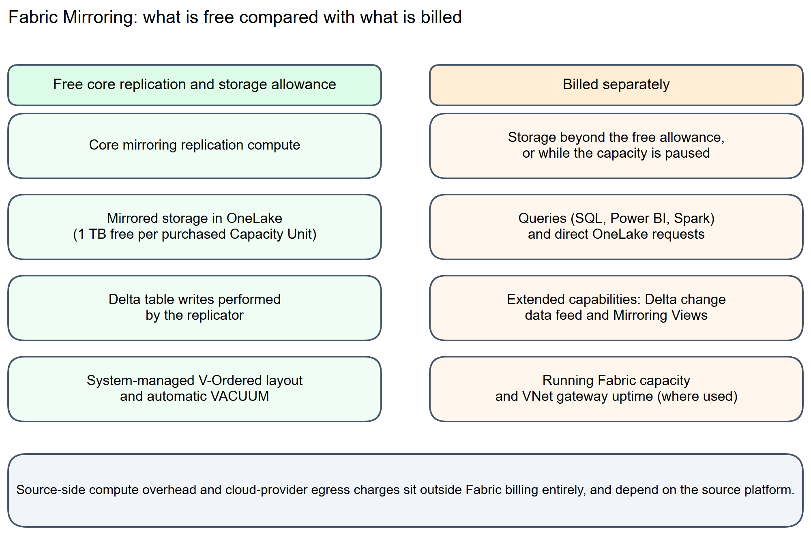

# Chapter 10: Billing and Capacity Management

> **Part 1: Concepts and Architecture**
>
> **Purpose:** This chapter explains what Fabric charges for when you use mirroring, what stays free, and how to plan capacity so mirroring costs stay predictable.

**Part index:** [Chapters in Part 1](readme.md)

***

## Overview

Chapter 9 covered the optional, paid extended capabilities layered on top of mirroring. This chapter steps back and covers the full cost picture: what a Fabric capacity is, what mirroring includes for free, what triggers a charge, and where to look when you need to plan or explain a bill.

Core mirroring's background replication compute is free, but the capacity itself is not. A purchased capacity also provides a mirrored-storage allowance. Additional usage includes storage beyond that allowance, queries, extended capabilities, and storage retained while the capacity is paused.

*Figure 10.1: What mirroring includes for free compared with what is billed separately*

***

## 10.1 Fabric Capacity and Capacity Units

Mirroring requires a workspace backed by a **Fabric capacity**. Capacity provides a pool of compute measured in **Capacity Units (CUs)**. F SKUs are the recommended purchase option; eligible existing Power BI Premium P capacities also support Fabric, and a Fabric trial can be used for evaluation. Power BI Pro or Premium Per User alone does not provide the capacity needed to run mirroring.

The following table shows F2 through F2048:

| SKU   | Capacity Units (CUs) |
| ----- | -------------------: |
| F2    |                    2 |
| F4    |                    4 |
| F8    |                    8 |
| F16   |                   16 |
| F32   |                   32 |
| F64   |                   64 |
| F128  |                  128 |
| F256  |                  256 |
| F512  |                  512 |
| F1024 |                 1024 |
| F2048 |                 2048 |

> A **running** Fabric capacity is required to set up and operate mirroring, and the capacity must not be throttled when you configure a new mirror. If a capacity is paused or deleted, mirroring stops replicating data, even though the background replication compute itself does not consume capacity units while it runs. See [Understand Microsoft Fabric licenses](https://learn.microsoft.com/en-us/fabric/enterprise/licenses) for the full SKU and licensing reference.

***

## 10.2 What Mirroring Includes for Free

For database mirroring and open mirroring, core replication compute is free and mirrored OneLake storage has a capacity-based free allowance:

* **Mirrored storage**: Fabric gives you **1 TB of free mirrored storage for every Capacity Unit you purchase**. An F64 capacity includes 64 TB of free mirrored storage, exclusive to mirroring. This allowance is calculated at the capacity level, not per mirrored database, so it is shared across every mirror on that capacity. The [Microsoft Fabric pricing page](https://azure.microsoft.com/en-us/pricing/details/microsoft-fabric/) explicitly limits this allowance to purchased capacities; it does not come with the Fabric free trial.
* **Background replication compute**: The Fabric compute that reads source changes and writes them into OneLake does not consume capacity units. This is the core replication engine covered throughout this book.
* **Delta table writes and housekeeping**: Fabric manages the replicated Delta table writes, layout optimisation, and automatic VACUUM as part of mirroring, rather than requiring a separate user-run maintenance job. This system-managed work belongs to the free core replication path; it does not make downstream Spark jobs or direct OneLake requests free. See [Mirrored table maintenance](https://learn.microsoft.com/en-us/fabric/fundamentals/table-maintenance-optimization#optimize-mirrored-data) and [Delta table retention and VACUUM](chapter-04.md#delta-table-retention-and-vacuum) for the maintenance model and retention settings.

See [Cost of mirroring](https://learn.microsoft.com/en-us/fabric/mirroring/overview#cost-of-mirroring) for the current official description of what is included.

**Do not transfer this allowance to every linked source.** [Dataverse Link to Fabric](../Part%202-%20Source-Specific%20Mirroring%20Guides/chapter-28.md) consumes additional Dataverse database storage for its optimized replica and Fabric resources for consumers. [SAP BDC Connect](../Part%202-%20Source-Specific%20Mirroring%20Guides/chapter-29.md) has separate SAP/Fabric sharing and commercial requirements. Zero-copy consumption is not a promise of free source storage, data-product preparation, network traffic, or analytical compute.

***

## 10.3 What Is Billed Separately

Several things fall outside the free allowance:

* **Storage beyond the free limit**: If your mirrored data exceeds the free terabyte-per-CU allowance, the excess is billed as standard OneLake storage, at a pay-as-you-go rate per GB. Storage is also billed while a capacity is **paused**, since the mirrored data still sits in OneLake even though replication is not running. See [Changes to Fabric capacity](https://learn.microsoft.com/en-us/fabric/mirroring/troubleshooting#changes-to-fabric-capacity) for how a pause and resume affects a mirror.
* **Querying mirrored data**: Reading mirrored tables through the SQL analytics endpoint, Power BI, or Spark consumes capacity like any other Fabric query. Only the replication process itself is free. Requests made directly against OneLake for mirrored data are billed as normal OneLake transactions. See [OneLake consumption](https://learn.microsoft.com/en-us/fabric/onelake/onelake-consumption) for the transaction-level rates.
* **Capacity provision**: The F capacity is billed while running even if replication itself consumes no CUs. A running capacity is also required for setup; do not confuse that requirement with a separate published mirroring-setup meter.
* **Extended capabilities**: Delta change data feed and Mirroring Views are optional, paid features billed through `DataMovementIncrementalCopy`. The published 3 CU-hours rate is applied to actual work duration and throughput resources, with per-second billing; it is not a flat per-mirror fee. Chapter 9, Section 9.4 covers the scope, parallel-work accounting, and unified-charge rule. See [Billing for extended capabilities in Mirroring](https://learn.microsoft.com/en-us/fabric/mirroring/extended-capabilities-billing).
* **VNet data gateway**: Where the source supports this gateway, its uptime consumes the capacity linked to the gateway at **4 CUs per gateway member**. It is not free mirroring compute or an external hosting charge. See [VNet data gateway capacity consumption](https://learn.microsoft.com/en-us/data-integration/vnet/data-gateway-business-model).
* **Monitoring and downstream processing**: Workspace Monitoring, alerts, and downstream Copy Jobs or notebooks have their own workload consumption. Free replication does not make the monitoring or transformation workload free.

***

## 10.4 Source-Side and Network Costs

Source-platform and self-hosted infrastructure costs sit outside the free Fabric replication compute. Plan for:

* **Source system load**: The mechanism a source uses to capture changes, such as CDC, logical replication, or a change feed, runs on the source platform and can add CPU, I/O, or storage overhead there. The scale of that overhead depends on the number of tables mirrored and the volume of changes, and varies by source. See the relevant source chapter in Part 2 for source-specific considerations.
* **Egress charges**: Moving data out of a source cloud provider's region or data centre can incur that provider's own egress or data-transfer charges. These are billed by the source platform, not by Fabric.
* **On-premises data gateway costs**: If the source uses a self-hosted on-premises data gateway, budget for its machines and maintenance separately. Do not apply this model to the managed VNet data gateway, which consumes Fabric or Power BI Premium capacity as described above.

***

## 10.5 Planning Capacity for Mirroring

* **Estimate mirrored data volume** for each source you plan to mirror, and compare the total against the free-storage allowance of your target capacity SKU before committing to a size.
* **Track storage growth over time**, since ongoing inserts, updates, and retained change history can grow mirrored storage well beyond the initial snapshot size.
* **Monitor consumption** using the Fabric Capacity Metrics app, which reports storage and CU usage at the capacity level across every workload sharing that capacity, not mirroring alone.
* **Separate heavy query workloads where practical**. A consumer workspace on another capacity can access mirrored data through shortcuts. OneLake shortcut transactions are charged to the consumer capacity, while storage remains attributed to the capacity hosting the data. Check the workload's billing placement rather than assuming every read is charged to the mirror's capacity.
* **Revisit extended capabilities deliberately**. Because Delta change data feed and Mirroring Views bill separately, enable them only where the downstream use case needs them, rather than by default on every mirror.

***

## 10.6 September 2026 Query-Capacity Announcements

The [FabCon feature summary](https://community.fabric.microsoft.com/blog/fbc_fabricupdatesblogs/fabric-september-2026-feature-summary/5325825#community-5325825-mcetoc_1k3kj91s5_38) announces **custom SQL pools as GA** and explicitly includes **SQL analytics endpoints**. Use them to isolate and allocate query resources within a workspace; they are not a way to reserve extra mirroring replication capacity or change the free core-replication model.

The next announcement makes the **Statement Type classifier GA**, with configurable SELECT/NONSELECT allocation. The [current custom-pool guide](https://learn.microsoft.com/en-us/fabric/data-warehouse/custom-sql-pools) still says Preview, documents a maximum of eight pools, and describes statement-type classification as autonomous-only. Treat that as an announcement/implementation-documentation conflict: confirm the available classifier in your environment before proposing a custom allocation. Workspace administrators manage these settings.

**On-demand billing for Fabric Data Warehouse**, including SQL analytics endpoints, appears in the summary's **Coming Soon** section, not its available-feature list. Do not budget as if that billing model were already enabled, or infer a new price for mirroring replication. Continue using the published capacity and mirroring billing rules until a supported launch and pricing specification applies.

## Summary

Core mirroring compute is free, and mirrored storage is free up to one terabyte per purchased Capacity Unit. Budget for the capacity itself, storage overages or paused-capacity storage, queries, extended capabilities, monitoring, and any gateway usage. Source-side compute, network transfer, and self-hosted gateway costs are additional considerations. Estimate total mirrored volume against the capacity allowance and monitor growth over time.

**Contents:** [Table of Contents](../index.md) | **Previous:** [Chapter 9: Extended Capabilities](chapter-09.md) | **Next:** [Chapter 11: Azure SQL Database](../Part%202-%20Source-Specific%20Mirroring%20Guides/chapter-11.md)
