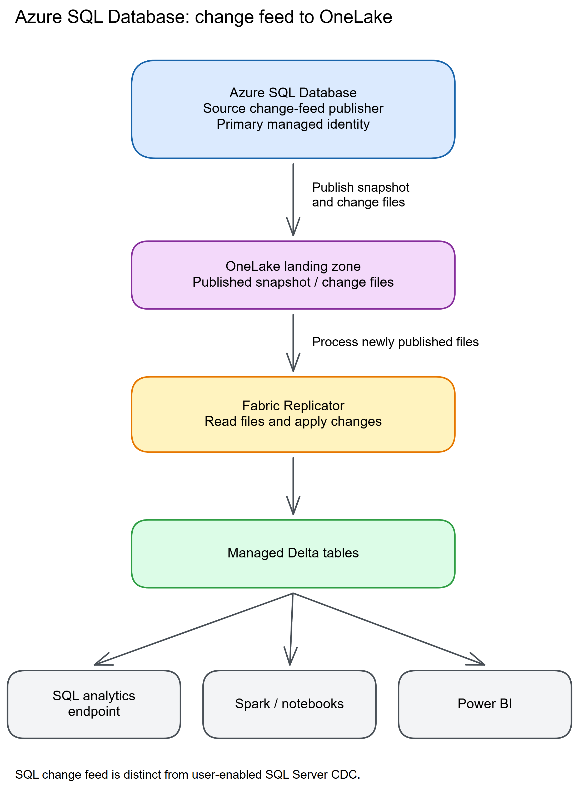
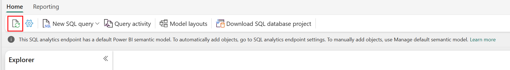

# Chapter 11: Azure SQL Database

> **Part 2: Source-Specific Mirroring Guides**
>
> **Purpose:** Use this chapter to configure Azure SQL Database mirroring and plan managed identity, permissions, network access, and connector limits.

**Part index:** [Chapters in Part 2](readme.md)

---

## Overview of the Source System

**Azure SQL Database** is Microsoft's fully managed relational database service built on the SQL Server engine. Its generally available Fabric Mirroring connector uses the database engine's external mirroring capability to replicate changes into OneLake.

---

## Mirroring Type and Architecture

- **Mirroring type**: Database mirroring
- **Method**: Source-managed change feed
- **Change mechanism**: Built-in external mirroring

The source publishes row changes through the change feed. This path does not use user-enabled SQL Server CDC. A database with CDC or Azure Synapse Link for SQL already enabled cannot be mirrored. The engine tracks change feed configuration internally; you can inspect the current state with the [`sys.sp_help_change_feed`](https://learn.microsoft.com/en-us/sql/relational-databases/system-stored-procedures/sp-help-change-feed?view=azuresqldb-current) system stored procedure.

**Architecture flow:**

See the [Microsoft Learn architecture description](https://learn.microsoft.com/en-us/fabric/mirroring/azure-sql-database).

[](../assets/diagrams/chapter-11/diagram-01.excalidraw.png)
*Figure 11.1: Azure SQL Database mirroring data flow*

---

## Network and Connectivity

| Question | Answer |
|---|---|
| **Data gateway required?** | No, if the logical server is publicly accessible or [allows Azure services](https://learn.microsoft.com/en-us/azure/azure-sql/database/network-access-controls-overview#allow-azure-services) to connect. Otherwise, yes: a VNet data gateway or an on-premises data gateway. |
| **Private endpoint support?** | Yes. When the server is not publicly accessible, a data gateway connects to it through a private endpoint or a trusted private network. |
| **Source firewall restrictions?** | A gateway needs a permitted route to the source; it does not remove gateway outbound-connectivity requirements or configure Fabric workspace network controls. |
| **Restricted OneLake inbound access?** | Add the Azure SQL logical server's Azure resource ID to the workspace's Resource Instance Rules so it can publish mirrored data. |
| **Fabric workspace outbound protection?** | Supported separately through [data connection rules](https://learn.microsoft.com/en-us/fabric/security/workspace-outbound-access-protection-mirrored-databases). Explicitly allow the source connection; a gateway does not bypass this policy. |

See [Mirroring Azure SQL Database behind firewall](https://learn.microsoft.com/en-us/fabric/mirroring/azure-sql-database#mirroring-azure-sql-database-behind-firewall) for the current setup steps.

---

## Setup Walkthrough

### 1. Agree the source, owners, and decision gates

Follow the [Azure SQL Database tutorial](https://learn.microsoft.com/en-us/fabric/mirroring/azure-sql-database-tutorial) with a recoverable non-production database first. These instructions configure one existing database, not every database on a logical server.

| Owner | Complete before opening the wizard |
|---|---|
| Source DBA | Identify the writable primary, service tier, supported tables, snapshot window, and log-space baseline. Approve the disposable verification table below. |
| Azure resource/identity administrator | Enable the logical server's publishing identity and confirm the source and Fabric workspace use the same Entra tenant. |
| Network/gateway administrator | Approve either public source access or a gateway route; check private DNS, SQL connectivity, and gateway service connectivity separately. |
| Database release owner | Identify source schema deployments, including `.dacpac` publishing. Review their mirroring implications before enabling the database, not during the next production deployment. |
| Fabric tenant administrator | Enable **Service principals can call Fabric public APIs** and **Users can access data stored in OneLake with apps external to Fabric**, including any scoped group restrictions. |
| Workspace Admin or Member | Use an active Fabric capacity, create the mirror, and allow the publishing identity to receive item permissions. Contributor alone cannot perform the required Reshare operation. |
| Data/security owner | Approve which data will leave the transactional security boundary and prepare equivalent analytical access controls before sharing. |

All vCore service tiers and elastic pools are supported; DTU Free, Basic, and Standard below 100 DTUs are not. Review the [tier requirements](https://learn.microsoft.com/en-us/fabric/mirroring/azure-sql-database#tier-and-purchasing-model-support), current supported regions, and the limitations below. Do not confuse the vCore free offer with the unsupported DTU Free tier.

As the DBA, connect **directly to the intended source user database** in SSMS or the MSSQL extension for VS Code and inspect:

```sql
SELECT name, is_read_only, is_cdc_enabled,
       delayed_durability_desc, log_reuse_wait_desc
FROM sys.databases
WHERE database_id = DB_ID();

SELECT s.name AS schema_name, t.name AS table_name
FROM sys.tables AS t
JOIN sys.schemas AS s ON s.schema_id = t.schema_id
WHERE t.is_ms_shipped = 0
ORDER BY s.name, t.name;
```

Stop the setup if this is a read-only replica, CDC or Azure Synapse Link is enabled, delayed durability is enabled, or the database already mirrors to a different workspace. The query is an inventory aid, not a complete eligibility test: review keys, column types, existing replication configuration, and the wizard's table warnings. Do not disable an existing integration simply to make the wizard pass.

If source releases use **SqlPackage/.dacpac**, the [documented database limitations](https://learn.microsoft.com/en-us/fabric/mirroring/azure-sql-database-limitations#database-level-limitations) require `/p:DoNotAlterReplicatedObjects=False` to modify mirrored tables. Have the release owner assess this publish property and review the generated deployment script in the pilot environment. It is not a command to run against the database or a recommendation to allow unreviewed destructive changes. Supported DDL can reseed the affected table; partition switching and primary-key changes remain restricted.

### 2. Configure the publishing identity

The **publishing identity** belongs to the Azure SQL logical server; the **connection principal** in the next step is the account Fabric uses to connect to SQL. They are different responsibilities, even when the connection uses a Fabric workspace identity.

1. In the Azure portal, open the **logical SQL server**, not just its database.
2. Select **Security → Identity** and turn **System assigned managed identity → Status** **On**. Save.
3. Confirm this is the primary identity. As an administrator connected to the server's `master` database, run:

```sql
SELECT *
FROM sys.dm_server_managed_identities;
```

Record the primary identity's `client_id` and `tenant_id` in the restricted operational record; match them to the Azure resource. Do not repeatedly toggle the identity off and on to troubleshoot.

**Alternative, preview:** A user-assigned managed identity can be added and made primary under the same Identity page. Validate with `WHERE is_primary = 1` on the DMV and an `identity_type` of `User-assigned`. For an existing SAMI-backed mirror, follow the tutorial's migration order: grant the new UAMI Read and Write on the mirrored item, make it primary, and retain the previous identity's permissions for at least 15 minutes. This is not permission to remove identities used by other services.

### 3. Create the connection principal in the correct databases

Choose one authentication path. The following SQL-authentication example is useful for a controlled lab. A SQL administrator creates the login in a query connection to **`master`**:

```sql
CREATE LOGIN [fabric_login]
WITH PASSWORD = '<REPLACE_WITH_A_UNIQUE_SECRET>';
```

Open a **new connection to the source user database**; Azure SQL Database does not support switching to another database with `USE`. Create the mapping and the exact grants listed in the tutorial:

```sql
CREATE USER [fabric_user] FOR LOGIN [fabric_login];
GRANT SELECT,
      ALTER ANY EXTERNAL MIRROR,
      VIEW DATABASE PERFORMANCE STATE,
      VIEW DATABASE SECURITY STATE
TO [fabric_user];
```

These are database-level grants, not server `CONTROL` or permanent `db_owner`. Adapt the names consistently and do not execute `CREATE` again if the principals already exist: inspect the existing mapping first.

For **Organizational account**, **Service principal**, or **Workspace identity**, have the Microsoft Entra administrator provision the chosen existing identity instead. Create its login in `master`, then reconnect to the user database:

```sql
-- master connection, as the Microsoft Entra administrator:
CREATE LOGIN [<EXISTING_ENTRA_PRINCIPAL_NAME>] FROM EXTERNAL PROVIDER;
```

```sql
-- Separate connection to the source user database:
CREATE USER [<EXISTING_ENTRA_PRINCIPAL_NAME>]
FOR LOGIN [<EXISTING_ENTRA_PRINCIPAL_NAME>];
GRANT SELECT, ALTER ANY EXTERNAL MIRROR,
      VIEW DATABASE PERFORMANCE STATE, VIEW DATABASE SECURITY STATE
TO [<EXISTING_ENTRA_PRINCIPAL_NAME>];
```

For Workspace identity, first have a workspace administrator [create that identity](https://learn.microsoft.com/en-us/fabric/security/workspace-identity) and use its actual name and application identity, not a human owner's name. Entra server logins for Azure SQL Database remain preview; review [Entra login prerequisites and limitations](https://learn.microsoft.com/en-us/azure/azure-sql/database/authentication-azure-ad-logins). SQL-side directory lookup permissions and propagation can be relevant; a Fabric workspace role alone does not create a SQL login.

Reconnect with the intended connection account, select the source database explicitly, and check its effective permissions:

```sql
SELECT DB_NAME() AS database_name, USER_NAME() AS database_user;
SELECT permission_name
FROM sys.fn_my_permissions(NULL, 'DATABASE')
WHERE permission_name IN
      ('SELECT', 'ALTER ANY EXTERNAL MIRROR',
       'VIEW DATABASE PERFORMANCE STATE', 'VIEW DATABASE SECURITY STATE');
```

Keep passwords and client secrets in the approved secret store and Fabric connection credential fields. Never paste a real secret into this book, a shared query, source control, screenshots, or incident messages. Assign a credential-rotation owner.

### 4. Prove the network path

1. Copy the actual logical-server FQDN from Azure, for example `example.database.windows.net`; do not use a guessed IP address.
2. For approved public access, configure the server firewall so Fabric can reach SQL. The **Allow Azure services and resources to access this server** setting is a broad Azure-origin allowance, not a rule restricted to your tenant; obtain security approval rather than enabling it reflexively.
3. For private-only access, create/select an on-premises data gateway or VNet data gateway with a route to the database private endpoint. Verify private DNS resolves the normal server FQDN correctly from that network, then test an encrypted SQL login to the specific database from that path.
4. The gateway administrator must also permit the gateway's [outbound service endpoints](https://learn.microsoft.com/en-us/data-integration/gateway/service-gateway-communication). A successful laptop connection outside the gateway network is not this test.
5. If OneLake inbound access is restricted, a workspace administrator adds the **logical server Azure resource ID** to [Resource Instance Rules](https://learn.microsoft.com/en-us/fabric/onelake/onelake-manage-inbound-access-trusted-resources). This permits source publishing; it does not replace source-side firewall rules.
6. If workspace outbound access protection is enabled, separately allow the source using the documented data connection rule. Test the complete path before the snapshot window.

### 5. Prepare a safe verification table

With DBA approval, run this **once on the disposable source database**, using an account allowed to create tables and write data. The replication account does not need DML rights for this test. If the name already exists, stop and choose a new approved name rather than deleting it.

```sql
IF OBJECT_ID(N'dbo.MirrorSetupProbe11', N'U') IS NOT NULL
    THROW 50000, 'Probe table already exists; choose a new approved name.', 1;

CREATE TABLE dbo.MirrorSetupProbe11
(
    ProbeId int NOT NULL PRIMARY KEY,
    Note varchar(40) NOT NULL,
    ChangedAt datetime2(6) NOT NULL
);
INSERT dbo.MirrorSetupProbe11 (ProbeId, Note, ChangedAt)
VALUES (1, 'snapshot', SYSUTCDATETIME()),
       (2, 'before-update', SYSUTCDATETIME());
```

### 6. Connect, select, and start in Fabric

1. Open the approved workspace. Use **Create** or **+ New item** and select **Mirrored Azure SQL Database**; name the destination item and select **Create** when prompted.
2. Under **New sources**, select **Azure SQL Database**, or reuse a connection whose source, gateway, and credential you have verified.
3. For a new connection, enter the **Server** FQDN, the actual **Database** name, and a meaningful **Connection name**. Select **None** only for the approved gatewayless path; otherwise select the prepared gateway.
4. Choose the authentication kind corresponding to the principal prepared above. Basic uses the **login** name (`fabric_login`), not the mapped user name (`fabric_user`). Service principal uses the correct tenant ID, client ID, and secret; Workspace identity uses the configured workspace identity.
5. Select **Connect**. Diagnose validation failures before proceeding; do not compensate for a network or identity problem by granting administrator access.
6. On **Configure mirroring**, for a lab turn off **Mirror all data** and select `dbo.MirrorSetupProbe11` plus the approved test tables. Expand warnings and document skipped columns or unsupported tables. Alternatively, **Mirror all data** includes future eligible tables and is subject to the first-1,000 rule; this also needs data-owner approval.
7. Select **Mirror database**. Open **Monitor replication** and refresh the panel. The tutorial's 2–5 minutes is a starting observation interval, not a snapshot SLA.


*Figure 11.2: Microsoft Learn's shared monitoring example shows an Azure SQL Database source. The current [setup tutorial](https://learn.microsoft.com/en-us/fabric/mirroring/azure-sql-database-tutorial) has no embedded screenshots and links to this [monitoring guide](https://learn.microsoft.com/en-us/fabric/mirroring/monitor). Image: Microsoft, [original](https://raw.githubusercontent.com/MicrosoftDocs/fabric-docs/main/docs/mirroring/media/monitor/monitor-mirrored-database.png), [CC BY 4.0](https://creativecommons.org/licenses/by/4.0/), unchanged. Older UI banners in the image are illustrative, not additional provisioning promises.*

### 7. Verify the snapshot and each kind of change

Wait for the probe table's initial copy to complete and its **Last completed/Last refresh** value to populate. **Running** alone can include snapshot activity. **Rows replicated** counts change operations, not the current row count.

On the source and then the mirror's **SQL analytics endpoint**, run:

```sql
SELECT ProbeId, Note, ChangedAt
FROM dbo.MirrorSetupProbe11
ORDER BY ProbeId;
```

Expect rows 1 and 2. Next execute each following statement **separately on the source**, in autocommit mode. After each statement, rerun the SELECT on both sides and wait for that state to appear before making the next change:

```sql
INSERT dbo.MirrorSetupProbe11 (ProbeId, Note, ChangedAt)
VALUES (3, 'insert-check', SYSUTCDATETIME());
```

```sql
UPDATE dbo.MirrorSetupProbe11
SET Note = 'update-check', ChangedAt = SYSUTCDATETIME()
WHERE ProbeId = 2;
```

```sql
DELETE FROM dbo.MirrorSetupProbe11 WHERE ProbeId = 1;
```

The final state is exactly keys 2 and 3, with row 2 showing `update-check`. Save timestamps and non-sensitive results; a rolled-back transaction is not a replication test.

If monitoring advances but the SQL result is stale, distinguish **source → OneLake replication** from **OneLake → SQL analytics endpoint metadata sync**. Following the [documented diagnostic sequence](https://learn.microsoft.com/en-us/fabric/mirroring/troubleshooting#data-doesnt-appear-to-be-replicating), inspect the table through a Lakehouse shortcut/Spark if necessary, then refresh the SQL endpoint's metadata and query again. Refreshing a browser or report alone does not prove the mirror has caught up.


*Figure 11.3: Metadata refresh, not a source replication reset. Companion to the [Azure SQL Database tutorial](https://learn.microsoft.com/en-us/fabric/mirroring/azure-sql-database-tutorial); reproduced from [Microsoft Learn troubleshooting](https://learn.microsoft.com/en-us/fabric/mirroring/troubleshooting#data-doesnt-appear-to-be-replicating). Image: Microsoft, [original](https://raw.githubusercontent.com/MicrosoftDocs/fabric-docs/main/docs/mirroring/media/troubleshoot/sql-endpoint-refresh-button.png), [CC BY 4.0](https://creativecommons.org/licenses/by/4.0/), unchanged.*

### 8. Hand over without resetting the mirror

Record the source/database, selected tables and exclusions, connection owner, gateway owner if used, publishing identity, Fabric item, capacity, baseline lag, and escalation contact. Check the identity's **Read and Write** under item **Manage permissions**. Reapply RLS, masking, and endpoint permissions, and assess direct OneLake access separately before consumer sign-off.

Monitor log usage, source CPU/I/O, table warnings, and elapsed freshness—not only item status. Read the troubleshooting DMVs below before considering a restart. A deliberate Stop/Start reseeds every table; capacity **Resume replication** is a different operation. Retain the disposable probe for approved periodic checks or retire only that table after sign-off; with selective mirroring, remove it from the selection as part of retirement. Never drop the database or disable its change feed as routine cleanup.

---

## Nuances and Limitations

| Topic | Detail |
|---|---|
| **Table limit** | Up to 1,000 tables. With **Mirror all data**, Microsoft documents selecting the first 1,000 by schema and table name order; review the selected set. |
| **Primary keys** | Tables without primary keys are supported. Unsupported types in a primary key, or a clustered index when no primary key exists, can make the whole table ineligible. |
| **Unsupported columns and tables** | Unsupported columns include `image`, `text`, `ntext`, `xml`, `rowversion`/`timestamp`, `sql_variant`, user-defined types, `geometry`, and `geography`. A table containing native `json` or `vector` cannot be mirrored. Views, external tables, in-memory tables, graph tables, clustered columnstore indexes, and temporal or ledger history tables are not supported. |
| **Schema changes (DDL)** | DDL changes trigger a fresh snapshot of the affected table. Partition switching and primary-key changes are not allowed while mirrored. |
| **Computed columns** | Computed columns are not mirrored, including persisted computed columns. |
| **Encrypted columns** | Tables using Always Encrypted cannot be mirrored. |
| **Precision and large values** | Delta supports six fractional-second digits; `datetimeoffset` loses time-zone information. LOB values larger than 1 MB are truncated to 1 MB. |
| **CDC compatibility** | User-enabled CDC and Azure Synapse Link for SQL block mirroring on the source database. |
| **Elastic Pools** | Supported. |
| **Read replicas** | Mirroring connects to the primary replica, not a read replica. |
| **Stop and restart** | Stopping disables mirroring; starting again reseeds all tables rather than resuming from the previous position. |

---

## Source System Impact

Fabric manages the change feed, so there are no user-managed CDC tables or CDC cleanup jobs for this connector. The initial snapshot consumes source CPU and I/O, while updates and deletes can increase log generation. Long transactions and replication lag can delay log truncation. Monitor log usage as well as source workload and connectivity; protective automatic reseeding can occur under log pressure.

**Recommendation**: Test mirroring in a non-production environment and measure the impact before enabling in production.

---

## Troubleshooting

| Symptom | Likely Cause | Resolution |
|---|---|---|
| Mirroring fails to start | CDC or Azure Synapse Link is already enabled | Review dependent integrations with their owners; use another supported source or plan an approved migration before disabling anything |
| Permission error | Connection principal lacks external mirroring permissions | Grant `ALTER ANY EXTERNAL MIRROR` and the documented view permissions |
| Managed identity error | Logical server identity is missing or not primary | Enable and verify the server managed identity |
| Firewall error | Source route or OneLake inbound access is blocked | Verify the connection's firewall or gateway path and, for restricted OneLake access, the server's Resource Instance Rule |
| Table not appearing in Fabric | Table or data type is unsupported | Review table-selection and data-type limitations |
| Replication lag increasing | Source pressure or network instability | Review source health, gateway status, and Fabric monitoring logs |
| Schema change delays replication | The changed table is being reseeded, or a DDL operation is unsupported | Inspect **Monitor replication** and the source errors before restarting; restarting reseeds every table |
| Data type error | Unsupported source column, key, or table feature | Review the limitations; use a supported physical source table if conversion is needed, not a source view |

For source-side diagnosis, have the DBA run these read-only checks in the **source user database**, not in the Fabric SQL analytics endpoint:

```sql
SELECT * FROM sys.dm_change_feed_log_scan_sessions;
SELECT * FROM sys.dm_change_feed_errors;
EXEC sys.sp_help_change_feed;
```

Record whether log-scan progress advances, the error and its time, and the affected table's configuration/state. The [Azure SQL Database troubleshooting guide](https://learn.microsoft.com/en-us/fabric/mirroring/azure-sql-database-troubleshoot#t-sql-queries-for-troubleshooting) identifies state `4` as the expected configured-table state for this check. Interpret initialization states alongside the snapshot monitor; a single early observation is not a reason to disable and recreate replication. Before raising an incident, compare the actual publishing identity's AppId with its **Read and Write** item grant and sanitize diagnostic output.

---

## Public issues and common pitfalls

**Evidence review: 8 October 2026.** Searches started with Reddit, including `site:reddit.com/r/MicrosoftFabric "Azure SQL" mirroring`, then checked Microsoft Learn. Reddit blocked direct thread access during this refresh. A search-index lead is identified separately below; its replies and claimed resolution were not verified. The other rows describe documented behaviors, not newly discovered bugs.

| Evidence and source date | Practical implication |
|---|---|
| **Documented:** [Tutorial](https://learn.microsoft.com/en-us/fabric/mirroring/azure-sql-database-tutorial), 22 September 2026; [troubleshooting](https://learn.microsoft.com/en-us/fabric/mirroring/azure-sql-database-troubleshoot), 25 November 2025 | UAMI is preview. A successful SQL login does not prove the source's primary publishing identity can write the mirrored item. Inspect the actual IDs and item grants before changing credentials. |
| **Documented:** [Entra stale-permission error](https://learn.microsoft.com/en-us/fabric/mirroring/azure-sql-database-troubleshoot#errors-from-stale-permissions-with-microsoft-entra-logins) | The reported `VIEW SERVER SECURITY STATE` error can involve preview Entra login permission propagation. Do not automatically grant broad server rights. The documented cache/user recreation sequence is an administrator-led, impact-assessed repair—not an initial setup step. |
| **Reddit search-index lead, indexed date 18 April 2025:** [Azure SQL Mirroring with Service Principal](https://www.reddit.com/r/MicrosoftFabric/comments/1k2d4cs/azure_sql_mirroring_with_service_principal_view/) | Indexed text describes a permission failure immediately after authentication. The full thread and any fix were inaccessible in this review. Use the documented Entra permission-propagation diagnosis above; do not copy an unverified cache reset or privilege escalation from a search snippet. |
| **Documented:** [Cross-tenant restriction](https://learn.microsoft.com/en-us/fabric/mirroring/azure-sql-database-limitations#network-and-connectivity-security) | The source Azure SQL Database and Fabric workspace must be in the same Entra tenant. A guest user, successful interactive login, or extra workspace role does not make a cross-tenant mirror supported. Confirm tenant IDs in preflight rather than debugging this as a missing SQL grant. |
| **Documented:** [Limitations](https://learn.microsoft.com/en-us/fabric/mirroring/azure-sql-database-limitations), 26 February 2026 | Old preview advice that every table needs a primary key is obsolete for this connector; support changed in April 2025. Existing older items may need an eligibility refresh. Check selected tables before scheduling a full reseed. |
| **Documented:** [General troubleshooting](https://learn.microsoft.com/en-us/fabric/mirroring/troubleshooting), 18 March 2026 | An up-to-date OneLake table can coexist with a stale SQL endpoint. Use separate checks; deleting the mirror is not a metadata-refresh operation. |
| **Documented:** [Log usage and automatic reseeding](https://learn.microsoft.com/en-us/fabric/mirroring/azure-sql-database-troubleshoot#transaction-log-usage) | Log pressure can trigger protective reseeding. Investigate long transactions and publishing failures; do not infer that a fresh snapshot means the original snapshot never completed. |

### Public references reviewed

Source setup, tier, limitation, and troubleshooting pages rechecked **8 October 2026**: [setup tutorial](https://learn.microsoft.com/en-us/fabric/mirroring/azure-sql-database-tutorial), [source overview and tiers](https://learn.microsoft.com/en-us/fabric/mirroring/azure-sql-database), [limitations](https://learn.microsoft.com/en-us/fabric/mirroring/azure-sql-database-limitations), and [source troubleshooting](https://learn.microsoft.com/en-us/fabric/mirroring/azure-sql-database-troubleshoot). The existing screenshot companions are [monitoring](https://learn.microsoft.com/en-us/fabric/mirroring/monitor) and [shared troubleshooting](https://learn.microsoft.com/en-us/fabric/mirroring/troubleshooting). The screenshot files come from the public MicrosoftDocs/fabric-docs repository under its [CC BY 4.0 license](https://github.com/MicrosoftDocs/fabric-docs/blob/main/LICENSE); no license is inferred for unrelated websites.

---

## Summary

Azure SQL Database uses its built-in external mirroring capability, not user-enabled CDC. Plan managed identity, permissions, network access, and supported schema before setup. See the current [Azure SQL Database mirroring overview](https://learn.microsoft.com/en-us/fabric/mirroring/azure-sql-database), [tutorial](https://learn.microsoft.com/en-us/fabric/mirroring/azure-sql-database-tutorial), and [limitations](https://learn.microsoft.com/en-us/fabric/mirroring/azure-sql-database-limitations).

**Contents:** [Table of Contents](../index.md) | **Previous:** [Chapter 10: Billing and Capacity Management](../Part%201%20-%20Concepts%20and%20Architecture/chapter-10.md) | **Next:** [Chapter 12: Azure SQL Managed Instance](chapter-12.md)
