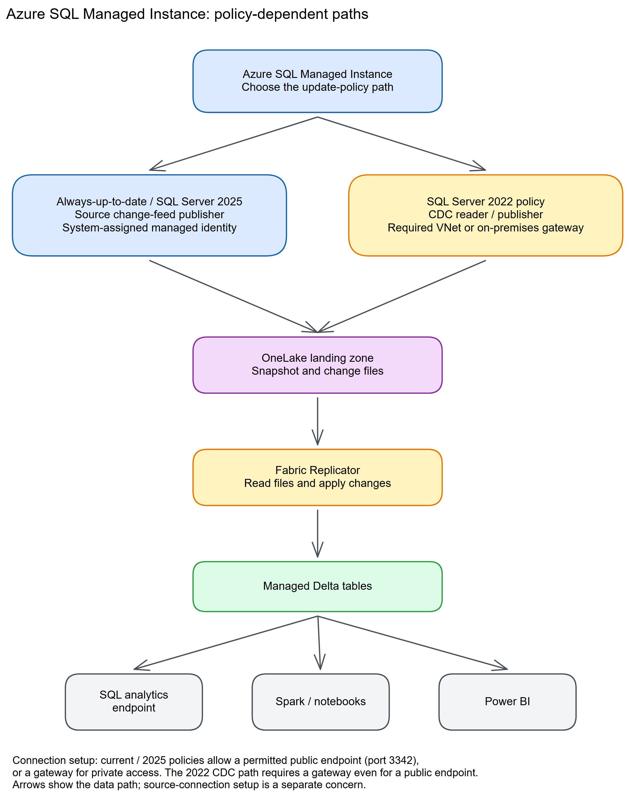

# Chapter 12: Azure SQL Managed Instance

> **Part 2: Source-Specific Mirroring Guides**
>
> **Purpose:** Use this chapter to configure Azure SQL Managed Instance mirroring and resolve its additional VNet and connectivity requirements.

**Part index:** [Chapters in Part 2](readme.md)

---

## Overview of the Source System

**Azure SQL Managed Instance (SQL MI)** is a fully managed SQL Server instance in the cloud with near-complete compatibility with on-premises SQL Server. Unlike Azure SQL Database, SQL MI provides a full instance experience that includes SQL Server Agent, cross-database queries, CLR, Service Broker, and other instance-level features.

SQL MI is commonly used as a migration target for on-premises SQL Server workloads that require features not available in Azure SQL Database. Fabric Mirroring for SQL MI is generally available, with different setup paths for different update policies.

---

## Mirroring Type and Architecture

- **Mirroring type**: Database mirroring
- **Method**: Source-managed push (Always-up-to-date or SQL Server 2025 update policy) or gateway-mediated pull via CDC (SQL Server 2022 update policy)
- **Always-up-to-date or SQL Server 2025 update policy**: Change feed
- **SQL Server 2022 update policy**: SQL Server CDC through a data gateway

The replication path depends on the managed instance update policy. The dedicated **Mirrored Azure SQL Managed Instance** connector uses the change feed. Instances on the SQL Server 2022 update policy instead follow the [SQL Server 2016-2022 mirroring tutorial](https://learn.microsoft.com/en-us/fabric/mirroring/sql-server-tutorial?tabs=sql201622), using CDC and a gateway even when a public endpoint exists.

[](../assets/diagrams/chapter-12/diagram-01.excalidraw.png)
*Figure 12.1: SQL Managed Instance mirroring with VNet connectivity options*

---

## Network and Connectivity

| Question | Answer |
|---|---|
| **Data gateway required?** | Always for the SQL Server 2022 update-policy path. For change-feed policies, required when the instance is not publicly accessible; otherwise the public endpoint uses port 3342. |
| **Private endpoint support?** | Yes. Use an on-premises data gateway or VNet data gateway with a route to the SQL MI private endpoint. |
| **Source firewall restrictions?** | For gatewayless public access, allow inbound traffic using the Power BI and Data Factory service tags, or the AzureCloud service tag, in the NSG. A gateway still requires its own permitted outbound connectivity. |
| **Fabric workspace outbound protection?** | Supported through [data connection rules](https://learn.microsoft.com/en-us/fabric/security/workspace-outbound-access-protection-mirrored-databases). Allow the source connection separately from its network route. |

Unlike Azure SQL Database, SQL MI has no simple "Allow Azure services" toggle, so one of these two paths (public endpoint or gateway-mediated VNet access) is always required.

---

## Setup Walkthrough

### 1. Choose the update-policy branch before granting permissions

Start with the [SQL MI tutorial](https://learn.microsoft.com/en-us/fabric/mirroring/azure-sql-managed-instance-tutorial), one recoverable test database, and an agreed snapshot window. This is a per-database connection, not an instance-wide replication switch.

Have the Azure SQL administrator inspect the instance's **Update policy** in Azure and record it using the [update-policy guidance](https://learn.microsoft.com/en-us/azure/azure-sql/managed-instance/update-policy). Do not infer the policy from a database compatibility level, and do not change the instance's policy just to pass a mirroring prerequisite.

| Recorded policy | Fabric source/item and change mechanism | Follow |
|---|---|---|
| Always-up-to-date or SQL Server 2025 | **Mirrored Azure SQL Managed Instance**, change feed | Steps 2–8 below |
| SQL Server 2022 | **Mirrored SQL Server database**, CDC, mandatory data gateway | The explicit CDC branch below and [Chapter 23](chapter-23.md#setup-walkthrough) |

All vCore service tiers, including instance pools, are supported. The source DBA must confirm a writable primary and check the policy-specific limitations; a readable Managed Instance Link replica and the documented geo-disaster-recovery configurations are not supported change-feed sources.

Agree the owners up front:

- **SQL MI DBA:** database eligibility, login/user creation, table selection, log monitoring, LOB settings, and safe test writes.
- **Azure identity/network administrator:** primary SAMI for change feed, endpoint, NSG, DNS, and private routing.
- **Gateway administrator:** gateway creation, connection access, outbound connectivity, and availability when applicable.
- **Fabric administrator:** active capacity, same Entra tenant, and the tenant settings **Service principals can use Fabric APIs** and **Users can access data stored in OneLake with apps external to Fabric**.
- **Workspace Admin or Member:** item creation and identity permission assignment; Contributor lacks the required Reshare permission.
- **Security/data owner:** approval of mirrored data and separate SQL endpoint/OneLake access controls.

### 2. Check the source database and primary SAMI

For the **change-feed branch**, as an administrator in SSMS or the MSSQL extension for VS Code, connect to the instance and select the intended database:

```sql
USE [<SOURCE_DATABASE>];
SELECT name, is_read_only, is_cdc_enabled, is_published,
       delayed_durability_desc, log_reuse_wait_desc
FROM sys.databases
WHERE database_id = DB_ID();

SELECT s.name AS schema_name, t.name AS table_name
FROM sys.tables AS t
JOIN sys.schemas AS s ON s.schema_id = t.schema_id
WHERE t.is_ms_shipped = 0
ORDER BY s.name, t.name;
```

Replace `<SOURCE_DATABASE>` with the actual database throughout this walkthrough. CDC, transactional replication, delayed durability, or an existing mirror in another workspace are blockers for this branch. Inventory existing integrations with their owners; do not disable CDC used by another workload as an exploratory fix.

In Azure, open the **SQL Managed Instance → Security → Identity** page. Enable **System assigned managed identity**, save, and make sure it is the primary identity. Verify as an instance administrator:

```sql
USE [master];
SELECT * FROM sys.dm_server_managed_identities;
```

Match the primary identity's client and tenant IDs with Azure. SQL MI change-feed mirroring supports **SAMI only**, unlike Azure SQL Database's preview UAMI support. If an existing UAMI is primary, arrange an approved identity change with its other workload owners. Do not blindly remove it or toggle SAMI; recreating SAMI changes its identity and can break grants.

Check the instance-wide LOB setting if selected data contains large values:

```sql
SELECT name, value_in_use
FROM sys.configurations
WHERE name = N'max text repl size (B)';
```

The [MI limitations](https://learn.microsoft.com/en-us/fabric/mirroring/azure-sql-managed-instance-limitations#table-level) require an appropriate **max text repl size** above 65,536 bytes for larger inserts. The DBA should choose and apply a workload-appropriate value using the linked [configuration procedure](https://learn.microsoft.com/en-us/sql/database-engine/configure-windows/configure-the-max-text-repl-size-server-configuration-option), assessing all affected replication workloads. This does **not** increase Fabric's separate 1 MB mirrored-value limit; do not use an unlimited server setting to imply end-to-end lossless large-value support.

### 3. Provision the change-feed connection principal

Use one dedicated connection principal. The SQL administrator creates a SQL-authenticated login in `master`:

```sql
USE [master];
CREATE LOGIN [fabric_login]
WITH PASSWORD = '<REPLACE_WITH_A_UNIQUE_SECRET>';
```

Then create the mapping **only in the source database** and use the tutorial's grants:

```sql
USE [<SOURCE_DATABASE>];
CREATE USER [fabric_user] FOR LOGIN [fabric_login];
GRANT SELECT, ALTER ANY EXTERNAL MIRROR,
      VIEW DATABASE PERFORMANCE STATE, VIEW DATABASE SECURITY STATE
TO [fabric_user];
```

For **Organizational account** or **Service principal**, have the Entra administrator configure the existing identity and create its login instead:

```sql
USE [master];
CREATE LOGIN [<EXISTING_ENTRA_PRINCIPAL_NAME>] FROM EXTERNAL PROVIDER;
GO
USE [<SOURCE_DATABASE>];
CREATE USER [<EXISTING_ENTRA_PRINCIPAL_NAME>]
FOR LOGIN [<EXISTING_ENTRA_PRINCIPAL_NAME>];
GRANT SELECT, ALTER ANY EXTERNAL MIRROR,
      VIEW DATABASE PERFORMANCE STATE, VIEW DATABASE SECURITY STATE
TO [<EXISTING_ENTRA_PRINCIPAL_NAME>];
```

Use a tool that understands `GO`, or execute its batches separately. Choose one path, not both. Inspect any existing principals rather than rerunning `CREATE`. Complete the [SQL MI Entra prerequisites](https://learn.microsoft.com/en-us/azure/azure-sql/database/authentication-aad-configure) if choosing Entra authentication; a Fabric role does not confer SQL access.

> **Unresolved documentation discrepancy, rechecked 8 October 2026:** The tutorial's SQL lists the four narrower grants above, but its introductory prose mentions `CONTROL DATABASE`, and the [limitations page](https://learn.microsoft.com/en-us/fabric/mirroring/azure-sql-managed-instance-limitations#permissions-in-the-source-database) requires database `CONTROL` or `db_owner`. Test the tutorial grants in the non-production target and obtain Microsoft clarification if validation fails. If a supported deployment needs escalation, have the DBA authorize it on **this database only**; do not silently grant server-wide administration.

Reconnect as the planned connection account and check the database context and effective grants:

```sql
SELECT DB_NAME() AS database_name, USER_NAME() AS database_user;
SELECT permission_name FROM sys.fn_my_permissions(NULL, 'DATABASE');
```

Keep real passwords/client secrets in the approved secret store and Fabric connection fields, never shared scripts, screenshots, notebooks, or this repository. Document expiry and rotation ownership.

### 4. Establish the appropriate network route

**Change feed with an approved public endpoint:**

1. In **SQL Managed Instance → Security → Networking**, enable **Public endpoint**.
2. Review the instance's minimum TLS policy and client compatibility; use encrypted SQL connections.
3. Configure the subnet NSG for TCP **3342**, using the documented **Power BI and Data Factory** service tags or the broader **AzureCloud** alternative. Obtain approval for the actual scope; do not create an unrestricted Internet allowance.
4. Copy the public FQDN from Azure: `<instance>.public.<dns-zone>.database.windows.net,3342`. The `.public.` hostname and comma-port suffix both matter.
5. Follow [public endpoint configuration](https://learn.microsoft.com/en-us/azure/azure-sql/managed-instance/public-endpoint-configure), then test from the intended access path.

**Private-only access, or any SQL Server 2022 update-policy deployment:**

1. Have the gateway administrator install/register an on-premises data gateway or provision a VNet data gateway with access to the MI private endpoint/network.
2. For an MI **Private Link endpoint**, create/select the endpoint targeting `Microsoft.Sql/managedInstances` / `managedInstance`, and have the MI owner approve any pending connection under **Security → Private endpoint connections**. It uses TCP **1433** and the proxy connection type, not public port 3342. This is distinct from the instance's default VNet-local endpoint.
3. Configure and test [MI-specific private endpoint DNS](https://learn.microsoft.com/en-us/azure/azure-sql/managed-instance/private-endpoint-overview?view=azuresql-mi#set-up-domain-name-resolution-for-private-endpoint) from the gateway network: DNS registration is not automatic, and connecting by private IP instead of the instance hostname fails. Follow the **same-VNet** or **different-VNet** procedure as applicable; do not overwrite the instance's own VNet-local DNS resolution. The same-VNet procedure also needs certificate-hostname handling—verify that the chosen connector supports the required settings rather than disabling TLS validation.
4. Test an encrypted SQL connection to the target database through that route and check the gateway's [outbound service connectivity](https://learn.microsoft.com/en-us/data-integration/gateway/service-gateway-communication).
5. Give the creator permission to use the gateway and connection. A gateway invisible in the picker can be an access or region issue, not a SQL password failure.

**If creating a VNet gateway:** follow the [gateway creation prerequisites](https://learn.microsoft.com/en-us/data-integration/vnet/create-data-gateways). Check supported region, tenant, and eligible capacity; have the subscription owner register `Microsoft.PowerPlatform`. A network administrator with subnet `join/action` permission creates a **dedicated gateway subnet**, delegates it to `Microsoft.PowerPlatform/vnetaccesslinks`, and provides routing/DNS to MI. Do not reuse or redelegate the MI subnet. In Fabric/Power BI **Settings → Manage connections and gateways → Virtual network (VNet) data gateway → New**, select the capacity, subscription, resource group, VNet, and delegated subnet, then save. This managed gateway is not created merely by creating the MI private endpoint.

For workspace-level Private Link, the MI tutorial has additional instructions to create the private link service and private endpoint from the MI VNet/subnet. Apply those where relevant; a source private endpoint alone does not establish the source-to-OneLake publishing path. Workspace outbound access protection also needs its own connection rule.

### SQL Server 2022 update-policy branch: prepare CDC, not external mirroring

Do **not** run the change-feed grant block above on this branch or configure Azure Arc for MI. Follow the [SQL Server tutorial's 2016–2022 tab](https://learn.microsoft.com/en-us/fabric/mirroring/sql-server-tutorial?tabs=sql201622):

1. The DBA inventories database/table CDC, existing capture consumers, primary keys, capture/cleanup jobs, and retention. SQL Server Agent jobs must operate correctly; MI is managed, so do not try to install a Windows service on its host.
2. If CDC already covers all selected tables, reuse it. Otherwise the DBA configures it, or explicitly authorizes temporary `sysadmin` membership for the Fabric setup login. Future CDC maintenance still requires an administrator.
3. The ongoing connection needs the following, using the login/user created for this branch:

```sql
USE [master];
CREATE LOGIN [fabric_login]
WITH PASSWORD = '<REPLACE_WITH_A_UNIQUE_SECRET>';
GRANT CONNECT SQL TO [fabric_login];
GO
USE [<SOURCE_DATABASE>];
CREATE USER [fabric_user] FOR LOGIN [fabric_login];
GRANT CONNECT, SELECT TO [fabric_user];
```

4. Use **Mirrored SQL Server database → SQL Server database**, select the mandatory gateway, and supply the MI hostname, correct endpoint port, and **database name**. Do not select the dedicated change-feed MI connector.
5. Follow Chapter 23's CDC setup, verification, and temporary-privilege removal steps, including gating-role access if existing CDC restricts readers. Select the disposable table below for validation. The snapshot/change tests and security handoff below apply to either branch, but CDC diagnostics—not change-feed DMVs—apply to this branch.

### 5. Create the disposable verification table

Before table selection, the DBA or an approved test writer runs this once in the **source database**:

```sql
USE [<SOURCE_DATABASE>];
IF OBJECT_ID(N'dbo.MirrorSetupProbe12', N'U') IS NOT NULL
    THROW 50000, 'Probe already exists; use a new approved name.', 1;
CREATE TABLE dbo.MirrorSetupProbe12
(
    ProbeId int NOT NULL PRIMARY KEY,
    Note varchar(40) NOT NULL,
    ChangedAt datetime2(6) NOT NULL
);
INSERT dbo.MirrorSetupProbe12 (ProbeId, Note, ChangedAt)
VALUES (1, 'snapshot', SYSUTCDATETIME()),
       (2, 'before-update', SYSUTCDATETIME());
```

The name collision check protects existing data. Use no production identifiers or personal data. For the CDC branch, ensure this new table receives CDC before using a non-administrative connection.

### 6. Create the change-feed mirror in Fabric

1. In the approved workspace, select **Create** or **+ New item → Mirrored Azure SQL Managed Instance**.
2. Under **New sources**, choose **Azure SQL Managed Instance**. An existing connection of generic type **SQL Server** is not supported for this change-feed connector.
3. Enter the exact **Server**, **Database**, and a meaningful **Connection name**. Select **None** only for the approved public path, or the prepared gateway for private connectivity.
4. Choose **Basic**, **Organizational account**, or **Service principal**. Basic uses the server login name, not its differently named mapped database user. Supply credentials securely and select **Connect**.
5. In **Configure mirroring**, turn off **Mirror all data** for a narrowly scoped trial and select `dbo.MirrorSetupProbe12` and any other approved tables. Inspect every error/warning icon. Alternatively, approve **Mirror all data**, which includes future eligible tables, subject to the 1,000-table cap.
6. Give the destination item a name and select **Create mirrored database**.
7. Open **Monitor replication**. The tutorial suggests checking after 2–5 minutes; actual initial-copy duration depends on the data and workload.


*Figure 12.2: Shared monitoring controls used after MI setup; the example image itself shows Azure SQL Database, not the MI connection wizard. The current [MI tutorial](https://learn.microsoft.com/en-us/fabric/mirroring/azure-sql-managed-instance-tutorial) contains no embedded screenshots and links to this [monitoring guide](https://learn.microsoft.com/en-us/fabric/mirroring/monitor). Image: Microsoft, [original](https://raw.githubusercontent.com/MicrosoftDocs/fabric-docs/main/docs/mirroring/media/monitor/monitor-mirrored-database.png), [CC BY 4.0](https://creativecommons.org/licenses/by/4.0/), unchanged. Historical UI banners are illustrative.*

### 7. Validate initial copy, inserts, updates, and deletes

Wait for the table's initial-copy timestamp, not just the overall **Running** label. Run this on the source and on the mirror's **SQL analytics endpoint**; initially expect keys 1 and 2:

```sql
SELECT ProbeId, Note, ChangedAt
FROM dbo.MirrorSetupProbe12
ORDER BY ProbeId;
```

Run each following statement separately on the **source**, with no uncommitted outer transaction. After each operation, repeat the SELECT on both sides and wait to observe the matching state:

```sql
INSERT dbo.MirrorSetupProbe12 (ProbeId, Note, ChangedAt)
VALUES (3, 'insert-check', SYSUTCDATETIME());
```

```sql
UPDATE dbo.MirrorSetupProbe12
SET Note = 'update-check', ChangedAt = SYSUTCDATETIME()
WHERE ProbeId = 2;
```

```sql
DELETE FROM dbo.MirrorSetupProbe12 WHERE ProbeId = 1;
```

The final keys must be 2 and 3, with the changed value on row 2. **Rows replicated** includes repeated operations on the same row and cannot substitute for this comparison.

Record source commit time, monitor freshness, and endpoint visibility separately. If OneLake is current but the SQL analytics endpoint is stale, follow the [OneLake and metadata-sync checks](https://learn.microsoft.com/en-us/fabric/mirroring/troubleshooting#data-doesnt-appear-to-be-replicating), including a shortcut/Spark check and SQL endpoint metadata refresh. Do not restart CDC or change feed for an endpoint-only delay.

### 8. Operational acceptance and handoff

For change feed, verify the SAMI's **Read and Write** permissions in the mirrored item's **Manage permissions**, matching the actual identity ID. For CDC, verify the intended low-privilege login can still replicate after setup elevation is removed. Record the update policy explicitly so the next operator chooses the correct diagnostics.

Hand over the selected-table list, connection/gateway ownership, credential rotation, capacity, log/CDC-retention thresholds, refresh baseline, and incident contact. Reapply analytical security before sharing; MI logins, jobs, masking, RLS, and labels are not transported into equivalent Fabric policies.

Plan MI database renames, copy/move operations, and capacity maintenance with the documented limitations in mind. Do not use Stop/Start as a harmless pause: it reseeds all tables. Retain the probe for agreed checks or retire only that approved table and its selective-mirror entry after acceptance; preserve business CDC consumers and never use database deletion as cleanup.

---

## Nuances and Limitations

| Topic | Detail |
|---|---|
| **VNet connectivity** | Unlike Azure SQL Database, SQL MI has no simple "Allow Azure services" toggle. VNet configuration is required. |
| **Public endpoint port** | The public endpoint for SQL MI uses port **3342**, not the standard 1433. |
| **Update policy** | The update policy determines whether the source uses the change feed or SQL Server CDC. |
| **Change-feed table limit and keys** | Up to 1,000 tables. Tables without primary keys are supported, but unsupported key or clustered-index types can block a table. |
| **Change-feed types and features** | Computed columns are excluded, including persisted ones. Tables with native `json`, Always Encrypted, in-memory or graph features, external tables, history tables, and clustered columnstore indexes are unsupported. Review the MI-specific list rather than assuming complete parity with Azure SQL Database. |
| **Large values and precision** | LOB values above 1 MB are truncated. Values above 65,536 bytes also require an appropriate `max text repl size` setting. Delta supports six fractional-second digits; time-zone information is lost from `datetimeoffset`. |
| **DDL** | Supported DDL reseeds the affected table. Partition switching, primary-key changes, column alteration, and column renaming are not supported while mirrored. Views and materialized views cannot be mirrored. |
| **CDC scope** | On a SQL Server 2022 update policy, CDC is configured per database and selected table. |
| **SQL MI link** | SQL MI supports a native "Managed Instance Link" for disaster recovery to SQL Server. This is separate from Fabric Mirroring. |
| **Instance-level features** | Instance-level objects (logins, SQL Agent jobs, linked servers) are not replicated. Only database-level table data is mirrored. |
| **Recovery and restart** | Geo-disaster-recovery configurations and readable MI Link replicas are not supported. Stopping and starting mirroring reseeds all tables; after a capacity pause, the MI limitations page requires a manual restart. |

---

## Source System Impact

- **Change-feed path**: Fabric manages the external mirroring change feed. User CDC objects are not part of this path.
- **CDC path**: SQL Server CDC creates capture and cleanup activity on the instance.
- **Network**: Both paths depend on stable connectivity between Fabric and the managed instance.
- **Primary replica**: Mirroring connects to the primary for supported configurations.
- **Log pressure**: Initial snapshots consume CPU and I/O. Long transactions and delayed change-feed processing can hold log truncation; monitor log usage and automatic reseeds.

---

## Troubleshooting

| Symptom | Likely Cause | Resolution |
|---|---|---|
| Public connection timeout | Endpoint not enabled, or wrong hostname/port | Verify the `.public.` hostname, port 3342, and NSG rule; for private-only deployments, use the gateway route instead |
| Firewall error | SQL MI NSG blocks the selected route | Verify the public endpoint's service-tag rule or the gateway's private route |
| Change mechanism error | Setup does not match the instance update policy | Confirm the update policy and use the corresponding mirroring path |
| CDC error on SQL Server 2022 policy | CDC setup or permissions failed | Review Fabric-managed CDC setup and source permissions |
| Data gateway errors | Gateway cannot reach SQL MI endpoint | Verify gateway VNet routing and NSG rules |
| Change feed stalls | Publishing identity or source error | Check the primary system-assigned identity's item permissions and `sys.dm_change_feed_errors` |

For the change-feed path, the [SQL MI troubleshooting guide](https://learn.microsoft.com/en-us/fabric/mirroring/azure-sql-managed-instance-troubleshoot) uses `sys.dm_change_feed_log_scan_sessions`, `sys.dm_change_feed_errors`, and `sys.sp_help_change_feed`. Do not use CDC diagnostics as a substitute for these checks.

---

## Public issues and common pitfalls

**Evidence review: 8 October 2026.** Research started with Reddit searches for SQL MI mirroring. Relevant search results existed, but Reddit blocked access to thread bodies, so no useful Reddit report was independently verified. The directly read Fabric Community report below is **anecdotal**; the other entries are **Microsoft-documented**. Forum post dates were checked against public post metadata.

| Evidence and source date | Practical implication |
|---|---|
| **Community report, 15 June 2026:** [SQLMI CDC mode: some tables without PKs](https://community.fabric.microsoft.com/discussions/ac_generaldiscussion/fabric-mirroring-in-cdc-mode-for-sqlmi---some-tables-without-pks/5199804) | The author explicitly uses the **2022 update policy** and reports tables without primary keys cannot mirror. This matches the CDC connector's documented key requirement; do not generalize replies about row identity to the change-feed branch, whose current MI limitations explicitly support tables without primary keys. A copy-based alternative is a separate ingestion design, not a fix to this connector. |
| **Documented:** [Tutorial](https://learn.microsoft.com/en-us/fabric/mirroring/azure-sql-managed-instance-tutorial) and [limitations](https://learn.microsoft.com/en-us/fabric/mirroring/azure-sql-managed-instance-limitations), both 3 April 2026 | SQL Server 2022 update policy uses CDC and a gateway, even with a public endpoint. Advice for the dedicated MI change-feed connector is not interchangeable. |
| **Documentation discrepancy:** The same tutorial and limitations | The minimum-permission text conflicts. Preserve least privilege, test the four tutorial grants, and obtain clarification; do not hide the inconsistency behind blanket `sysadmin`. |
| **Documented:** [Managed-identity troubleshooting](https://learn.microsoft.com/en-us/fabric/mirroring/azure-sql-managed-instance-troubleshoot#managed-identity), 14 March 2025 | Turning SAMI off/on produces a different identity. A UAMI becoming primary can also break publishing. Check identity and item grants before rebuilding the mirror. |
| **Documented:** [Database limitations](https://learn.microsoft.com/en-us/fabric/mirroring/azure-sql-managed-instance-limitations#database-level-limitations) | Renaming a mirrored database breaks monitoring; copy/move and geo-DR have restrictions. Avoid treating lifecycle operations as transparent replication events. |
| **Documented, differing wording:** [MI mirrored-item limitations](https://learn.microsoft.com/en-us/fabric/mirroring/azure-sql-managed-instance-limitations#mirrored-item-limitations) versus [shared capacity troubleshooting](https://learn.microsoft.com/en-us/fabric/mirroring/troubleshooting#changes-to-fabric-capacity), 18 March 2026 | MI says a capacity restart needs manual mirroring restart; the shared guide describes **Paused → Resume replication**. Check actual state and freshness, use Resume when offered, and clarify behavior before a deliberate reseeding Stop/Start. |
| **Documented:** [LOB restrictions](https://learn.microsoft.com/en-us/fabric/mirroring/azure-sql-managed-instance-limitations#table-level) | Source `max text repl size` and destination 1 MB truncation are different limits. Test representative values instead of judging fidelity from a successful connection. |

### Public references reviewed

Reviewed **7 October 2026**: [MI tutorial](https://learn.microsoft.com/en-us/fabric/mirroring/azure-sql-managed-instance-tutorial), [MI limitations](https://learn.microsoft.com/en-us/fabric/mirroring/azure-sql-managed-instance-limitations), [MI troubleshooting](https://learn.microsoft.com/en-us/fabric/mirroring/azure-sql-managed-instance-troubleshoot), [SQL Server CDC tutorial](https://learn.microsoft.com/en-us/fabric/mirroring/sql-server-tutorial?tabs=sql201622), [monitoring](https://learn.microsoft.com/en-us/fabric/mirroring/monitor), and [shared troubleshooting](https://learn.microsoft.com/en-us/fabric/mirroring/troubleshooting). Screenshot licensing is the public MicrosoftDocs/fabric-docs [CC BY 4.0 license](https://github.com/MicrosoftDocs/fabric-docs/blob/main/LICENSE), not a license assumption about other sites.

Rechecked **8 October 2026**: the MI tutorial, limitations, troubleshooting, SQL Server version branches, and shared troubleshooting; additionally, [MI private endpoints and DNS](https://learn.microsoft.com/en-us/azure/azure-sql/managed-instance/private-endpoint-overview?view=azuresql-mi), [VNet gateway creation](https://learn.microsoft.com/en-us/data-integration/vnet/create-data-gateways), and the dated forum report above.

---

## Summary

Azure SQL Managed Instance uses either the change feed or SQL Server CDC, depending on its update policy. Confirm that policy, source permissions, and VNet connectivity before setup. See the current [Azure SQL Managed Instance mirroring overview](https://learn.microsoft.com/en-us/fabric/mirroring/azure-sql-managed-instance), [tutorial](https://learn.microsoft.com/en-us/fabric/mirroring/azure-sql-managed-instance-tutorial), and [limitations](https://learn.microsoft.com/en-us/fabric/mirroring/azure-sql-managed-instance-limitations) for the matching path.

**Contents:** [Table of Contents](../index.md) | **Previous:** [Chapter 11: Azure SQL Database](chapter-11.md) | **Next:** [Chapter 13: Azure Cosmos DB](chapter-13.md)
