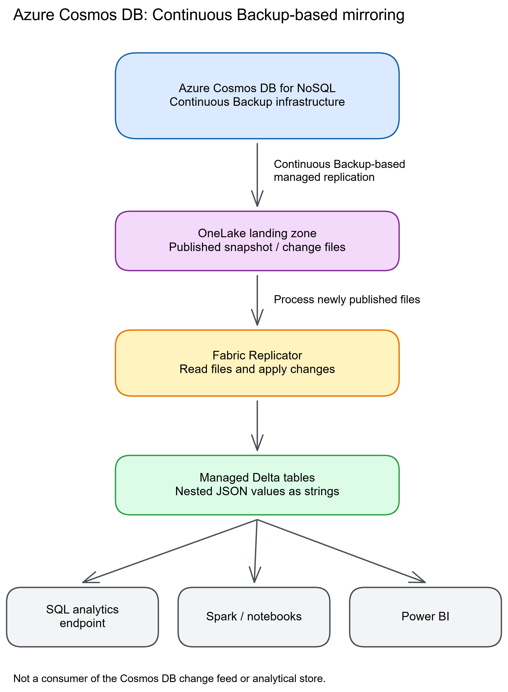
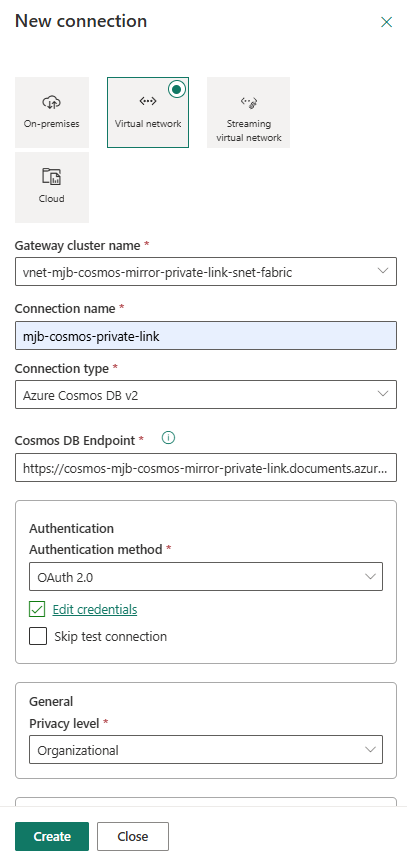
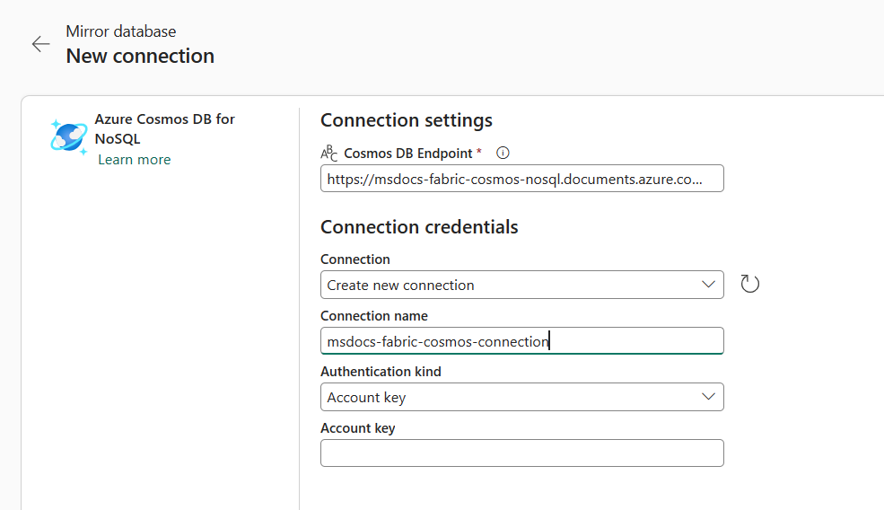

# Chapter 13: Azure Cosmos DB

> **Part 2: Source-Specific Mirroring Guides**
>
> **Purpose:** Use this chapter to configure Azure Cosmos DB mirroring and plan for schema inference, deletes, backup retention, authentication, and source cost.

**Part index:** [Chapters in Part 2](readme.md)

---

## Overview of the Source System

**Azure Cosmos DB** is Microsoft's fully managed, globally distributed NoSQL database service. Its generally available Fabric Mirroring connector supports accounts for NoSQL, not the other Cosmos DB APIs.

Cosmos DB mirroring is independent of **Azure Synapse Link for Cosmos DB**, its analytical store, and the Cosmos DB change feed. See [Migrate from Azure Synapse Link to Cosmos DB mirroring](https://learn.microsoft.com/en-us/fabric/mirroring/azure-cosmos-db-migrate-synapse-link) if you are moving from that integration.

---

## Mirroring Type and Architecture

- **Mirroring type**: Database mirroring
- **Method**: Managed continuous replication using Continuous Backup infrastructure
- **Change mechanism**: Azure Cosmos DB Continuous Backup

Azure Cosmos DB mirroring uses Continuous Backup infrastructure to replicate inserts, updates, and explicit deletes into Delta tables in OneLake without consuming provisioned Request Units. Mirroring does not use the Azure Cosmos DB change feed or analytical store, and it has no built-in inactivity backoff.

**Architecture flow:**

See the [Microsoft Learn architecture description](https://learn.microsoft.com/en-us/fabric/mirroring/azure-cosmos-db).

[](../assets/diagrams/chapter-13/diagram-01.excalidraw.png)
*Figure 13.1: Cosmos DB mirroring data flow*

> **Deletion stop gate:** Direct item deletes are replicated. Microsoft's [limitations page](https://learn.microsoft.com/en-us/fabric/mirroring/azure-cosmos-db-limitations#replication-limitations) says TTL expiration is unsupported, but its [FAQ](https://learn.microsoft.com/en-us/fabric/mirroring/azure-cosmos-db-faq#analytical-time-to-live-ttl-or-soft-deletes) says TTL deletions **are** mirrored. This disagreement remained on **8 October 2026**. Do not promise either automatic expiry or historical retention in OneLake from TTL alone; validate separately and obtain Microsoft confirmation for a retention-dependent workload.

---

## Network and Connectivity

**FabCon announcement:** the [September 2026 summary announces VNet data gateway support for Cosmos DB mirroring](https://community.fabric.microsoft.com/blog/fbc_fabricupdatesblogs/fabric-september-2026-feature-summary/5325825#community-5325825-mcetoc_1k3kj91s5_117). It does not attach a separate GA/Preview label to this networking announcement. The source account can retain private-endpoint protection and disabled public access, but the gateway establishes/tests the connection rather than carrying the replication stream. Follow the detailed restricted-network setup below, including OAuth, trusted-workspace ACL bypass, and REST creation.

| Question | Answer |
|---|---|
| **Data gateway required?** | Not for the public cloud-connection walkthrough. For a restricted account, a VNet data gateway tests and creates the connection; trusted-workspace Network ACL Bypass authorizes Fabric. Ongoing replication does not traverse the gateway. |
| **Private endpoint support?** | The private-network guide documents public access disabled, private DNS, a same-region Fabric workspace, OAuth, and creation through the Fabric REST API. Ongoing replication uses an internal Microsoft network, not the private endpoint. |
| **Source firewall restrictions?** | The documented private-endpoint path does not require Fabric service-tag IP allow lists. The gateway subnet still needs outbound access to Microsoft Entra ID. |
| **Fabric workspace outbound protection?** | Cosmos DB is listed as supported through [data connection rules](https://learn.microsoft.com/en-us/fabric/security/workspace-outbound-access-protection-mirrored-databases). This is separate from the account's Network ACL Bypass. |

> **Network boundary:** The [overview](https://learn.microsoft.com/en-us/fabric/mirroring/azure-cosmos-db#network-security), [limitations](https://learn.microsoft.com/en-us/fabric/mirroring/azure-cosmos-db-limitations#security-limitations), and [private-network guide](https://learn.microsoft.com/en-us/fabric/mirroring/azure-cosmos-db-private-network), updated 6 October 2026, now agree on this distinction. Support for a private source account is not a promise that replication flows through your private endpoint.

The [FAQ's security answers](https://learn.microsoft.com/en-us/fabric/mirroring/azure-cosmos-db-faq#security) still say private endpoints are unsupported. That conflicts with the explicit restricted-account procedure above; it is not a reason to open a private source publicly. Also check the gateway's own [capacity, region, same-tenant, and subnet-permission requirements](https://learn.microsoft.com/en-us/data-integration/vnet/create-data-gateways); connector region availability alone does not establish gateway eligibility.

---

## Setup Walkthrough

This runbook follows the [Microsoft setup tutorial](https://learn.microsoft.com/en-us/fabric/mirroring/azure-cosmos-db-tutorial) and the separate [restricted-network procedure](https://learn.microsoft.com/en-us/fabric/mirroring/azure-cosmos-db-private-network). Official source references were rechecked **8 October 2026**. Begin with a recoverable development account; the account changes below are not merely Fabric settings.

### 1. Agree the source scope and change window

1. In **Azure portal → Azure Cosmos DB → Overview**, record the account resource ID, tenant, subscription, API, endpoint, region configuration, and intended database and containers.
2. Confirm **API for NoSQL**, a single write region, and a supported Fabric region. Multiple read regions are supported; multi-region writes, MongoDB, Gremlin, Table, and Cassandra accounts are not native sources for this connector. Azure Government and Azure China are excluded. General continuous-backup support for multi-write accounts does not expand the mirroring connector's eligibility.
3. Record the current backup mode, analytical-store history, local-authentication setting, firewall/private endpoints, and any customer-managed encryption-key dependency.
4. Obtain source-owner approval for enabling continuous backup and, if choosing the restricted-network path, for disabling local authentication. The latter can break applications still using account keys.
5. Reserve time for backup-policy migration to complete. This procedure does not request a database-engine restart, but migration is asynchronous and irreversible. Do not start Fabric configuration while the account still reports migration in progress.
6. Agree an initial-load window, data-owner approval for copying the selected containers, and a disposable-item test. Do not use a production customer's document as a canary.

**Keep the three identities separate:**

| Responsibility | Required access / decision |
|---|---|
| Azure account administrator | Account configuration rights, including `Microsoft.DocumentDB/databaseAccounts/write` for backup migration; rights to create Cosmos DB SQL data-plane role definitions and assignments when using Entra authentication. Azure resource Reader alone is insufficient. |
| Fabric connection principal | Either a supported read-write account key or an Entra principal granted `readMetadata` and `readAnalytics` on the source account. Azure management-plane Contributor is not a substitute for these data-plane actions. |
| Fabric creator / network administrator | Active capacity and workspace Admin or Member for the public walkthrough. The restricted-network guide explicitly requires a subscription Owner and target workspace Admin, plus permission to configure the gateway network. |

Managed identity is **not** a supported Cosmos DB mirroring connection authentication method. An identity used by Cosmos DB to access a customer-managed key is a different dependency, not a replacement for the connection principal.

### 2. Enable and verify continuous backup on the source account

1. In the Azure account, open **Backup & Restore → Backup Policies → Change**.
2. Select **Continuous (7 days)** or **Continuous (30 days)** and save. If backup exists only for mirroring, the overview recommends the free 7-day tier; retain a longer tier when required by the recovery policy.
3. Wait for the account's backup policy to show **Continuous**, not **Periodic / Migrating**. **Point in Time Restore** should become available.
4. Before changing an existing analytical-store deployment, check the [migration restrictions](https://learn.microsoft.com/en-us/azure/cosmos-db/migrate-continuous-backup) and [mirroring limitations](https://learn.microsoft.com/en-us/fabric/mirroring/azure-cosmos-db-limitations#account-and-database-limitations).
   - Analytical store and continuous backup may coexist.
   - You cannot disable analytical store on an account with continuous backup enabled.
   - A history of disabling analytical store on a container can prevent continuous-backup migration. Turning analytical store on again is not a documented repair.
   - Do not delete a container or disable Synapse Link to “prepare” the source.
5. If the **source account uses customer-managed keys**, follow the backup-migration guide's additional prerequisite: authorize a managed identity in the Key Vault access policy and set it as the account's default identity. Have the key owner verify access before migration. This source encryption dependency is separate from connection authentication; it does not provide customer-managed encryption keys for the OneLake replica, which the mirroring limitations exclude.

**Synapse Link migration caution:** the linked [migration guide](https://learn.microsoft.com/en-us/fabric/mirroring/azure-cosmos-db-migrate-synapse-link) recommends disabling Synapse Link after cutover and refers to mirroring starting from the change feed. Those statements conflict with the current mirroring limitations on disabling analytical store with continuous backup and the overview's explicit statement that mirroring does **not** use the change feed. Confirm a supported cleanup sequence with Microsoft rather than running that cleanup blindly. Historical items already expired from the transactional store are not part of a new source snapshot; inventory any analytical-store-only history before cutover.

For a CLI-driven change, these are the documented migration commands with explicit placeholders, formatted for **PowerShell with Azure CLI**, run by the Azure account administrator:

```powershell
az login
az account set --subscription "<subscription-id>"
az cosmosdb update --resource-group "<resource-group-name>" --name "<account-name>" --backup-policy-type "Continuous" --continuous-tier "Continuous7Days"
az cosmosdb show --resource-group "<resource-group-name>" --name "<account-name>" --query backupPolicy
```

Inspect `type`, `continuousModeProperties.tier`, and `migrationState`; proceed only after completion. Omitting the tier defaults to 30 days in the migration guide. Although the general backup guide also lists a 35-day tier, the **Fabric mirroring prerequisites explicitly list only 7 and 30 days**; do not infer connector support from the broader backup feature.

### 3. Prepare the connection credential

**Entra / Organizational account — preferred where the deployment permits it**

1. Identify the exact user that will sign into the Fabric connection and its tenant/object ID.
2. Have an authorized Cosmos DB administrator create or reuse a SQL data-plane custom role containing:
   - `Microsoft.DocumentDB/databaseAccounts/readMetadata`
   - `Microsoft.DocumentDB/databaseAccounts/readAnalytics`
3. Assign that role to the connection principal at the appropriate account scope. Use the [Microsoft-published role-assignment sample](https://github.com/Azure-Samples/azure-cli-samples/blob/master/cosmosdb/common/rbac-cosmos-mirror.sh), which prompts for subscription, resource group, and account and applies the role to the signed-in user. Review its target principal before running it in **Bash**, not PowerShell.
4. Verify the resulting definition and assignment using the [Cosmos DB data-plane RBAC guide](https://learn.microsoft.com/en-us/azure/cosmos-db/how-to-connect-role-based-access-control). Match the role definition's actual data actions, assignment scope, and principal ID to the user signing into Fabric. The sample reuses an existing role by name without repairing its definition, so a successful script run alone does not prove effective permissions. Do not assume the Azure portal IAM role list represents Cosmos DB SQL data-plane assignments.
5. The restricted-network guide additionally assigns **Cosmos DB Built-in Data Contributor** to this principal for its validated workflow. That is broader than the two read actions; obtain security approval and do not silently add it to every public-network deployment.

**Account key — supported for the public connection**

1. Retrieve a **read-write** key through an approved secret-handling process. A read-only key is not supported even though the mirror is read-only.
2. Enter the key only in the Fabric credential field. Never put it in this runbook, a notebook, a screenshot, or a shared command history.
3. Record who owns rotation and the Fabric connection that must be updated. Plan a controlled reseed if following the documented stop/update/start recovery procedure after an invalid key.

### 4. Establish the network path before creating the mirror

For a permitted **public cloud connection**, verify the intended Cosmos DB endpoint and the account's approved public-network policy. The tutorial's uncomplicated path assumes public access for all networks. Do not broaden a restricted production firewall just to imitate that example.

For a **private endpoint with public network access disabled**, complete this separate sequence with the Azure and Fabric administrators:

1. Keep the approved private endpoint and private DNS zone `privatelink.documents.azure.com`; ensure the gateway network resolves the account to that endpoint.
2. Use a shared Fabric workspace on an active capacity in the **same region** as the account. Record the workspace GUID from the `/groups/{workspace-id}/` URL segment.
3. Register `Microsoft.PowerPlatform` in the subscription if necessary.
4. Create a **dedicated `/27` or larger subnet**, delegated to `Microsoft.PowerPlatform/vnetaccesslinks`, with routes to the private endpoint. It must not contain unrelated resources.
5. Provide explicit outbound access to `login.microsoftonline.com` for OAuth. The current private-network guide specifies a NAT gateway; do not rely on a “default outbound access” checkbox as a complete egress design.
6. Complete the guide's data-plane RBAC assignments, including its additional Data Contributor role, and migrate key-using applications before disabling local authentication as required by this path.
7. Enable the account capability `EnableFabricNetworkAclBypass`. Use the guide's **preserve-existing-capabilities** command; the Azure CLI `--capabilities` option replaces the entire capability list.
8. Authorize the exact tenant/workspace trusted resource ID under Network ACL Bypass. Inventory existing authorized workspace IDs first and preserve them when changing the list; don't overwrite unrelated access.
9. In **Fabric → Settings → Manage connections and gateways → Virtual network data gateways → New**, select the capacity, subscription, resource group, VNet, and delegated subnet. Save and wait for provisioning.
10. Under **Connections → New**, choose **Virtual network**, the new gateway, **Azure Cosmos DB v2**, the account endpoint, **OAuth 2.0**, and **Organizational** privacy level. Sign in as the authorized principal, keep **Skip test connection** cleared, and create the connection.

For an existing **VNet service-endpoint** design instead of a private endpoint, the same guide documents a different gateway route: public network access stays **Selected networks**, enable the `Microsoft.AzureCosmosDB` service endpoint on the delegated gateway subnet, and add that subnet to the account's virtual-network rules. Keep the OAuth/RBAC and trusted-workspace bypass steps. Do not mix this with the private-endpoint instruction to disable public access.


*Figure 13.2 — Microsoft documentation screenshot, unchanged. Source: [restricted-network setup guide, step 7](https://learn.microsoft.com/en-us/fabric/mirroring/azure-cosmos-db-private-network#step-7-create-the-azure-cosmos-db-v2-connection). [Original image](https://raw.githubusercontent.com/MicrosoftDocs/fabric-docs/main/docs/mirroring/media/azure-cosmos-db-private-network/fabric-new-connection-cosmos-db.png). Credit: Microsoft; [CC BY 4.0](https://creativecommons.org/licenses/by/4.0/).*

**Private-source stop gate:** the mirrored-database creation portal cannot select that gateway connection. Follow [step 8's REST creation procedure](https://learn.microsoft.com/en-us/fabric/mirroring/azure-cosmos-db-private-network#step-8-create-the-mirrored-database-with-the-fabric-rest-api), rather than falling back to a cloud connection:

- Resolve and verify the **connection GUID**, not its display name; check the gateway and endpoint when more than one connection matches.
- Use the private guide's definition containing Base64-encoded **`mirroring.json` and `.platform`** parts, not top-level source properties. The guide describes an empty-shell failure; the [current create API reference](https://learn.microsoft.com/en-us/rest/api/fabric/mirroreddatabase/items/create-mirrored-database) requires a definition and its generic example includes only `mirroring.json`. Do not turn the private guide's two-part sample into a universal API requirement.
- Use an access token for `https://api.fabric.microsoft.com` without logging it, in the `Authorization: Bearer <access-token>` header. The guide's literal `******` is redacted text, not a working header. The create API requires the delegated scope `MirroredDatabase.ReadWrite.All` or `Item.ReadWrite.All`; API support for service principals/managed identities does not make them supported Cosmos DB connection credentials.
- Capture the actual item ID from a successful create response before calling **`startMirroring`**. If an operation returns `202 Accepted`, follow Fabric's [long-running-operation procedure](https://learn.microsoft.com/en-us/rest/api/fabric/articles/long-running-operation), including `Location` and `Retry-After`, and obtain the result after success. Do not assume a five-second wait or the first item with a matching display name identifies the newly created mirror.
- Confirm the item Details card contains the intended source database and connection GUID.

The guide's basic REST definition targets the database; inspect its resulting container scope before approving sensitive-data replication. Do not invent an unverified table-filter payload. Ongoing replication travels over Microsoft's internal network, **not** through the gateway or private endpoint used for the connection test.

### 5. Create and configure the public-path Fabric item

Skip this public-path creation sequence if you used the private-source REST procedure above.

1. Open the approved workspace in Fabric and select **Create / New item → Mirrored Azure Cosmos DB**.
2. Enter a meaningful mirror name and select **Create**.
3. Under **New connection**, select **Azure Cosmos DB for NoSQL**.
4. Enter `https://<account-name>.documents.azure.com:443/`, a unique connection name, and **Account key** or **Organizational account**.
5. Provide the credential from step 3 and select **Connect**. Reuse a connection only after checking its endpoint, authentication principal, and ownership.


*Figure 13.3 — Microsoft tutorial screenshot, unchanged; account names are Microsoft's examples. Source: [Cosmos DB tutorial](https://learn.microsoft.com/en-us/fabric/mirroring/azure-cosmos-db-tutorial#connect-to-the-source-database). [Original image](https://raw.githubusercontent.com/MicrosoftDocs/fabric-docs/main/docs/mirroring/media/azure-cosmos-db-tutorial/connection-configuration.png). Credit: Microsoft; [CC BY 4.0](https://creativecommons.org/licenses/by/4.0/).*

6. Select the **database**, then deliberately select the required containers or approve the all-container scope. Record the selection and the handling of newly created containers.
7. Select **Mirror database**. After two to five minutes, open **Monitor replication** and refresh the pane. This tutorial timing is not an initial-load SLA for large containers.
8. Wait for each selected container to show replication progress and completion of its initial copy. A database-level **Running** status is not sufficient to certify every container.

### 6. Prove snapshot and insert/update/delete behavior

1. Record an initial source count and a small set of known document IDs **with partition-key values**, then compare the corresponding target rows after the initial snapshot. Use a quiet interval or a bounded test set; comparing two live counts at different times does not prove loss.
2. In the **Azure portal's Cosmos DB Data Explorer** or an approved source application, insert one authorized disposable document in a selected test container. Include a unique `id`, the container's real partition-key property, and a simple marker such as `validation_stage: "inserted"`.
3. Query the **Fabric SQL analytics endpoint**, not Fabric's source Data Explorer, for that ID and partition key. Record the time the row and marker become visible.
4. In the source, update only that disposable item's marker to `"updated"`; save and verify the changed value in the replica before proceeding.
5. Explicitly delete that **same item and partition key** from the source. Verify its target row disappears. Never delete a container, issue broad cleanup, or wait for TTL as this test.
6. Use a separate approved sample to verify nested JSON, nulls, numeric values, and differently cased properties. Confirm inferred target columns rather than assuming every document has identical fields.
7. If rows are visible in a Lakehouse shortcut/Spark query but not the SQL endpoint, investigate SQL endpoint synchronization rather than resetting source backup or recreating containers.

If TTL is business-critical, run a **separate** approved expiry test without changing a production container's TTL policy. Record the disposable item's partition key, source expiry and target observation times, and the deployed configuration. Neither a successful explicit-delete canary nor one expiry observation resolves the documentation conflict or establishes a retention guarantee.

Fabric's Cosmos DB Data Explorer reads the **source** and consumes RUs; it cannot insert, edit, or delete items. Its immediacy is not evidence that OneLake has caught up. The SQL analytics endpoint is a separate, read-only analytical copy.

### 7. Hand over operations and security

- Record the source account/database/container selection, Fabric item and connection IDs, connection owner, backup tier, target region, and initial/canary timings.
- Assign owners for replication alerts, failed-container diagnosis, credential expiry/rotation, and private-network/OAuth changes.
- Recreate the required analytical access controls in Fabric. Share only the SQL endpoint when users should not also access the Cosmos DB source explorer.
- Monitor source recovery settings and costs separately from Fabric query capacity. Free replication RUs do not make source validation queries or all Fabric workloads free.
- Keep an approved recovery plan: stopping and starting mirroring reseeds the target. Preserve evidence and estimate initial-load time before using that operation.
- Assign a data-retention owner to resolve the TTL documentation conflict and approve the downstream retention design. Do not silently replace an application's TTL policy with explicit deletes or assume TTL preserves an analytical archive.
- For a restore into a new source account, recheck endpoint, backup tier, network rules/private endpoints, and data-plane RBAC before recreating the connection/mirror. The [continuous-backup guide](https://learn.microsoft.com/en-us/azure/cosmos-db/continuous-backup-restore-introduction#what-isnt-restored) says network and RBAC settings are not restored; backup recovery alone is not mirroring recovery.

---

## Nuances and Limitations

| Topic | Detail |
|---|---|
| **Schema inference** | Fabric continuously infers properties and compatible data types. Incompatible type changes can produce null values rather than preserving every original type. |
| **Schema evolution** | New properties added to documents are detected over time. Removed properties are not reflected as column drops. |
| **Nested JSON** | Nested data is represented as JSON strings in the SQL analytics endpoint, not automatically flattened. Use `OPENJSON` with `CROSS APPLY` or `OUTER APPLY` to expand it. |
| **Deletes** | Explicit deletes are replicated. The limitations page says TTL expiry is unsupported, while the FAQ says it is replicated; resolve this conflict before relying on expiry or retention. |
| **Partition key** | The container partition key is replicated as a column. |
| **Large documents** | SQL endpoint tables created after 18 November 2025 support `varchar(max)` up to the 2 MB document limit. Older tables use `varchar(8000)` and must be recreated to gain this support. |
| **Backup configuration** | Enable 7-day or 30-day Continuous Backup. It cannot be disabled afterwards; review analytical-store migration restrictions before changing an existing account. |
| **Throughput impact** | Mirroring from Continuous Backup does not consume provisioned RU/s. |
| **Global distribution** | Fabric reads from the closest regional endpoint by default. |
| **Restart behaviour** | Stopping and starting replication reseeds all target tables from the current source, rather than resuming incremental replication. |

---

## Source System Impact

- **RU/s consumption**: Mirroring does not consume provisioned Request Units.
- **Continuous Backup**: Standard Continuous Backup charges and limitations still apply. The 7-day tier is available without an additional backup charge.
- **Fabric queries**: Queries from SQL, Spark, or Power BI consume Fabric capacity rather than Cosmos DB RU/s.
- **Data Explorer**: Queries run against the source through Data Explorer consume Cosmos DB RU/s.

**Recommendation**: Choose the backup-retention tier for your source recovery requirements. Do not treat that retention period as a documented Fabric pause-and-resume guarantee.

---

## Troubleshooting

| Symptom | Likely Cause | Resolution |
|---|---|---|
| Schema appears incomplete | New properties have not propagated, or types are incompatible | Inspect source documents and allow schema evolution; check for null-producing type changes before considering a full reseed |
| TTL-expired items remain | TTL support is contradicted by the limitations page and FAQ | Verify source expiry and target behavior; obtain support confirmation and an approved retention design rather than changing application deletion semantics |
| Mirror cannot be created | Continuous Backup is not enabled or the account uses multi-region writes | Enable a supported backup tier or use a supported account topology |
| Data type mismatch | Inconsistent JSON property types across documents | Normalise source document schema or handle at the transformation layer |
| Authentication failure | Unsupported credential or insufficient Microsoft Entra permissions | Use a read-write key or grant `readMetadata` and `readAnalytics` |
| Private connection fails | Gateway DNS, outbound OAuth access, or trusted-workspace configuration is incomplete | Follow the private-network guide's validation steps; its portal gateway-selection limitation requires REST API creation |

See the [Cosmos DB troubleshooting guide](https://learn.microsoft.com/en-us/fabric/mirroring/azure-cosmos-db-troubleshooting) for credential rotation, stalled containers, and SQL endpoint visibility checks. An unchanged **Last refresh** value alone does not indicate failure when the source has no new changes.

---

## Public issues and common pitfalls

**Evidence checked 8 October 2026.** Research began with Reddit-targeted search, but direct Reddit pages returned a network-security/login block. The existing chapter's Reddit links are retained below as **unverified leads**: their bodies, exact publication dates, and claimed fixes could not be independently confirmed in this review. A previous review label is not independent verification. The Fabric Community report and its dated accepted answer were directly read and verified on 8 October. None of these sources measures current failure frequency.

| Public report or research lead | Evidence available in this review | Appropriate use today |
|---|---|---|
| [Big issues with mirroring of CosmosDB data to Fabric — Reddit lead](https://www.reddit.com/r/MicrosoftFabric/comments/1ip63d4/big_issues_with_mirroring_of_cosmosdb_data_to/) | Search located the thread title; the existing chapter described duplicate/missing data and reinitialization experiments, but the body and replies could not be reread. | **Unverified inherited anecdote**, not evidence of a current GA defect or a confirmed fix rollout. Keep key-level reconciliation and INSERT/UPDATE/DELETE acceptance tests; don't adopt repeated reinitialization as normal operation. |
| [Cosmos DB mirroring stuck on 0 rows replicated — Reddit lead](https://www.reddit.com/r/MicrosoftFabric/comments/1jx0036/cosmos_db_mirroring_stuck_on_0_rows_replicated/) | Search located the thread title; the existing chapter described one larger container remaining in snapshotting, but the detailed account and any resolution could not be confirmed. | **Unverified inherited anecdote**. Independently, Microsoft's tutorial/FAQ support checking each container and distinguishing initial snapshot from incremental replication. A Running banner is not completeness evidence; the few-minute estimate is not an SLA. |
| [Running with warnings — Fabric Community, 19 October 2024](https://community.fabric.microsoft.com/discussions/ac_datawarehouse/cosmos-db-mirroring-status-issue---running-with-warnings/4249323); [accepted reply, 22 October 2024](https://community.fabric.microsoft.com/discussions/ac_datawarehouse/cosmos-db-mirroring-status-issue---running-with-warnings/4249323/replies/4252892) | The opening post reports an internal-system warning and empty SQL tables despite a working connection. The accepted reply describes an edge-case fix rollout, with West Europe delayed at that time. | **Historical preview-era incident**, not a current regional exclusion. Compare source/OneLake/SQL visibility and collect error details; do not assume all warnings share that old cause or that increasing capacity fixes them. |

The [current troubleshooting guide](https://learn.microsoft.com/en-us/fabric/mirroring/azure-cosmos-db-troubleshooting) remains the operating reference. Community-reported stop/recreate experiments are not adopted here as first-line repairs because they can trigger reseeding.

The following are **documented pitfalls**, not a claim about community incident prevalence:

| Pitfall | First safe check | Evidence |
|---|---|---|
| “No continuous backup” even after requesting migration | Wait for backup policy migration to complete; check analytical-store history rather than toggling features repeatedly. | [Backup migration](https://learn.microsoft.com/en-us/azure/cosmos-db/migrate-continuous-backup); [Cosmos troubleshooting](https://learn.microsoft.com/en-us/fabric/mirroring/azure-cosmos-db-troubleshooting). |
| `SQLAPIendpoint` or authentication error | Validate the selected connection's key or the actual Entra principal's data-plane grants. A management-plane role or a read-only key is insufficient. | [Troubleshooting](https://learn.microsoft.com/en-us/fabric/mirroring/azure-cosmos-db-troubleshooting). |
| Gateway OAuth returns “invalid token” | Check outbound Entra connectivity/NAT and DNS before rotating credentials. | [Private-network troubleshooting](https://learn.microsoft.com/en-us/fabric/mirroring/azure-cosmos-db-private-network#gateway-oauth-invalid-token-error), updated 6 October 2026. |
| Private gateway connection cannot be selected, or an empty mirror never starts | Use the documented REST definition and verify its GUIDs; this portal gap is not a reason to expose the source publicly. | [Private-network REST creation](https://learn.microsoft.com/en-us/fabric/mirroring/azure-cosmos-db-private-network#step-8-create-the-mirrored-database-with-the-fabric-rest-api). |
| Only `_rid`, missing SQL columns, or malformed nested JSON | Refresh SQL schemas; compare Spark and SQL visibility; check the pre-18-November-2025 `varchar(8000)` limitation before planning a recreation. | [Troubleshooting](https://learn.microsoft.com/en-us/fabric/mirroring/azure-cosmos-db-troubleshooting). |
| An unchanged refresh time or TTL-expired source item looks like failed CDC | Generate the approved explicit-change test; no source changes means no new refresh time. Investigate TTL separately because the official pages disagree. | [Troubleshooting](https://learn.microsoft.com/en-us/fabric/mirroring/azure-cosmos-db-troubleshooting); [limitations](https://learn.microsoft.com/en-us/fabric/mirroring/azure-cosmos-db-limitations); [TTL FAQ](https://learn.microsoft.com/en-us/fabric/mirroring/azure-cosmos-db-faq#analytical-time-to-live-ttl-or-soft-deletes). |

Check third-party advice against the current [overview](https://learn.microsoft.com/en-us/fabric/mirroring/azure-cosmos-db) and private-network guide: mirroring does not require analytical store, does not use the change feed, and supports the documented restricted-account workflow. For an unresolved failure, retain timestamps, item/connection IDs, container status, and sanitized errors for Microsoft support; do not post keys or customer documents publicly.

---

## Summary

Azure Cosmos DB mirroring reads changes from Continuous Backup without consuming provisioned RU/s. Plan for NoSQL API support, backup retention, schema inference, explicit-delete validation, and unresolved TTL guidance. See the current [Cosmos DB mirroring overview](https://learn.microsoft.com/en-us/fabric/mirroring/azure-cosmos-db), [limitations](https://learn.microsoft.com/en-us/fabric/mirroring/azure-cosmos-db-limitations), and [FAQ](https://learn.microsoft.com/en-us/fabric/mirroring/azure-cosmos-db-faq).

**Contents:** [Table of Contents](../index.md) | **Previous:** [Chapter 12: Azure SQL Managed Instance](chapter-12.md) | **Next:** [Chapter 14: Azure Databricks (Unity Catalog)](chapter-14.md)
