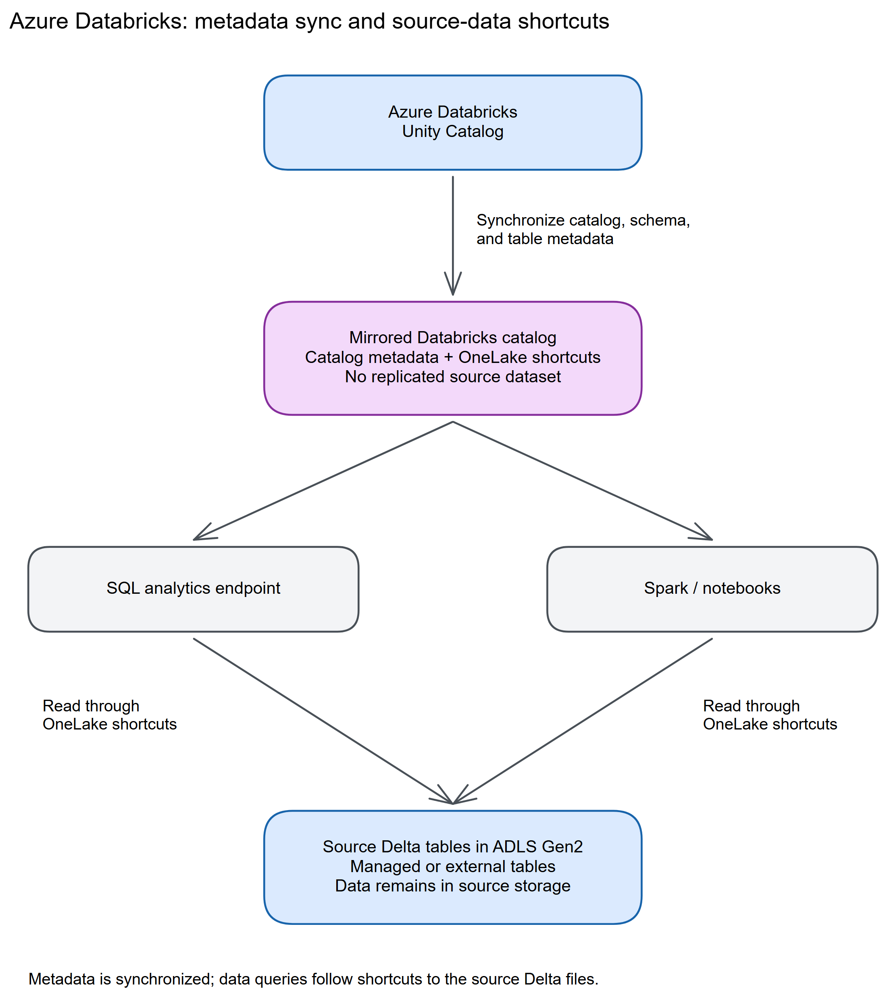
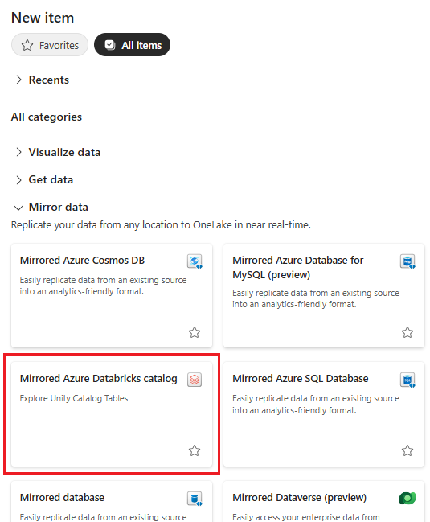
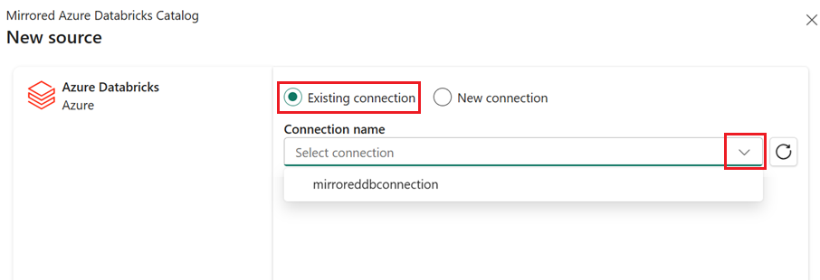
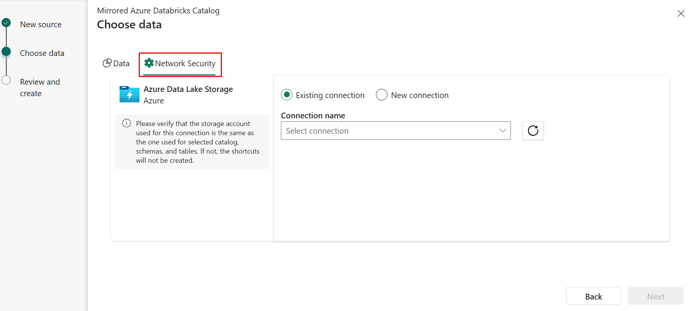

# Chapter 14: Azure Databricks (Unity Catalog)

> **Part 2: Source-Specific Mirroring Guides**
>
> **Purpose:** Use this chapter to connect Azure Databricks Unity Catalog to Fabric and understand metadata-only access, shortcuts, permissions, and query behaviour.

**Part index:** [Chapters in Part 2](readme.md)

---

## Overview of the Source System

**Azure Databricks** is an analytics platform built on Apache Spark. **Unity Catalog** provides centralised metadata management, access control, and data lineage across Databricks workspaces.

Fabric's generally available Azure Databricks integration uses **metadata mirroring**. It synchronises catalog metadata and uses OneLake shortcuts to access source data without copying that data into OneLake.

---

## Mirroring Type and Architecture

- **Mirroring type**: Metadata mirroring
- **Method**: Pull-based (metadata sync from Unity Catalog)
- **Metadata mechanism**: Unity Catalog metadata access and OneLake shortcuts; no row-level CDC pipeline

Unlike database mirroring, Fabric Mirroring for Azure Databricks does **not** copy data into OneLake. Instead, it mirrors the selected Unity Catalog structure, with **shortcuts** pointing to the underlying managed or external Delta tables in ADLS Gen2.

**Architecture flow:**

[](../assets/diagrams/chapter-14/diagram-01.excalidraw.png)
*Figure 14.1: Metadata mirroring keeps data in Databricks and synchronises metadata*

> **Key difference:** Unlike database mirroring, no data is physically moved to OneLake. Queries traverse shortcuts back to the original Databricks storage.

Changes in the underlying data are not necessarily visible immediately through the SQL analytics endpoint. The [overview](https://learn.microsoft.com/en-us/fabric/mirroring/azure-databricks) describes propagation ranging from seconds to several minutes.

---

## Network and Connectivity

| Question | Answer |
|---|---|
| **Data gateway required?** | A private Databricks workspace requires a VNet data gateway in the same region as that workspace. An on-premises data gateway is not supported. |
| **Private endpoint support?** | Supported for the Databricks workspace and ADLS storage. Precreate the workspace gateway connection in **Manage connections and gateways**; the mirror creation flow cannot create it. Configure storage access separately. |
| **Storage firewall restrictions?** | Firewall-protected ADLS Gen2 requires trusted workspace access and a Fabric workspace identity, regardless of the Databricks authentication method. The tutorial excludes Databricks workspace storage behind an Azure Storage firewall. |
| **Fabric workspace outbound protection?** | The mirrored-database support list does not explicitly enumerate this catalog item. [OneLake shortcut outbound controls](https://learn.microsoft.com/en-us/fabric/security/workspace-outbound-access-protection-onelake) also apply to data access; validate the complete catalog and storage path rather than inferring support from VNet gateway availability. |

See [Mirrored Azure Databricks behind a private endpoint](https://learn.microsoft.com/en-us/fabric/mirroring/azure-databricks-private-endpoint) for the current configuration steps.

---

## Setup Walkthrough

### 1. Administrator-owned preflight

Use the [Microsoft tutorial](https://learn.microsoft.com/en-us/fabric/mirroring/azure-databricks-tutorial) alongside this runbook. Record the Azure Databricks workspace URL, its attached Unity Catalog metastore, the **one catalog** to expose, selected schemas/tables, each table's ADLS location, and the Fabric workspace/capacity/region. A metastore can serve multiple workspaces; entering a workspace URL is not selecting every catalog in the metastore.

1. **Databricks workspace administrator:** provision or identify a Unity Catalog-enabled workspace and add the intended connection user or service principal to it. Use a small, existing managed or external **Delta** table for the pilot; do not start with views, streaming tables, Delta Sharing, federation, or tables protected with row filters/column masks.
2. **Metastore administrator:** in a workspace attached to that metastore, open **Catalog** → the gear icon → **Metastore** → **Details**, and enable **External data access**. It is disabled by default. If the control is absent, have the metastore administrator perform this step, rather than granting broader Fabric roles.
3. **Catalog owner and data owner:** explicitly authorize the connection principal. [Databricks external-access administration](https://learn.microsoft.com/en-us/azure/databricks/external-access/admin) requires `USE CATALOG`, `USE SCHEMA`, table `SELECT`, and `EXTERNAL USE SCHEMA`. Only the parent catalog owner can grant the last privilege; neither schema ownership nor `ALL PRIVILEGES` implicitly supplies it. For example, substitute real identifiers and the Databricks principal:

   ```sql
   GRANT USE CATALOG ON CATALOG pilot_catalog TO `fabric-reader@example.com`;
   GRANT USE SCHEMA ON SCHEMA pilot_catalog.reporting TO `fabric-reader@example.com`;
   GRANT SELECT ON TABLE pilot_catalog.reporting.orders TO `fabric-reader@example.com`;
   GRANT EXTERNAL USE SCHEMA ON SCHEMA pilot_catalog.reporting TO `fabric-reader@example.com`;
   ```

   These are read-path grants, not permission to create external tables. Do not add `CREATE TABLE`, `CREATE EXTERNAL TABLE`, or `EXTERNAL USE LOCATION` merely to mirror existing tables. Catalog enumeration alone does not establish permission to read the underlying files.
4. **Fabric administrator:** provide a workspace with an active capacity and item-creation permission, check the [supported regions](https://learn.microsoft.com/en-us/fabric/mirroring/azure-databricks-limitations#supported-regions), and, for Spark consumers, verify at least Spark 3.4/Delta 2.4 in workspace environment settings. Agree the Fabric/OneLake access model before importing a catalog structure.

### 2. Establish catalog credentials and the separate storage path

1. Choose **Organizational account** for an interactive pilot or a managed, rotated **Service principal** credential for a durable connection. Use the actual workspace URL, not a SQL warehouse HTTP path. The Fabric connector supports these two authentication choices; Databricks' general support for PATs does not establish PAT support for this Fabric connector.
2. For a private workspace, have the network owner configure workspace private connectivity and a **VNet data gateway in the Databricks workspace's region**, with DNS/routing to its private endpoint. In Fabric **Settings** → **Manage connections and gateways** → **New** → **Virtual network**, choose that gateway, **Azure Databricks workspace**, the workspace URL, and Organizational account or Service principal credentials. Create this connection **before** opening the mirror wizard. The [private-endpoint guide](https://learn.microsoft.com/en-us/fabric/mirroring/azure-databricks-private-endpoint) excludes the on-premises gateway.
3. Inventory the ADLS accounts separately. For firewall-protected supported ADLS storage, create the Fabric **workspace identity**, associate the workspace with F capacity for workspace-identity authentication, and have the storage administrator configure a **resource instance rule for that Fabric workspace** using [trusted workspace access](https://learn.microsoft.com/en-us/fabric/security/security-trusted-workspace-access). This rule is required even if a service principal authenticates the Databricks connection.
4. Prepare an ADLS connection to the actual container/folder, for example `https://<account>.dfs.core.windows.net/<container>/<folder>`, not just the account root. The tutorial lists Organizational account, Service principal, and Workspace identity for this storage connection. At account/container scope, grant its chosen identity **Storage Blob Data Reader**. For the recommended folder scope, grant **Read and Execute** ACLs and, for service-principal/workspace-identity access, **Execute** on the container root and every ancestor folder. Catalog grants are not substitutes for these storage permissions.
5. Keep the firewall rule and data-plane grant distinct: opening the network path does not authorize a read. The tutorial's network-security association covers **one storage account per catalog**; it creates no shortcuts for selected tables in other accounts. It also excludes **Databricks workspace storage behind an Azure Storage firewall**. Resolve these cases before creation; do not disable production firewalls as a test.

The tutorial additionally requires **Storage Blob Delegator** if that ADLS connection will be used **outside** the mirrored Databricks catalog scenario. Do not add this role to every mirroring identity by default; have the storage owner approve the separate use and its scope.

### 3. Create and scope the Fabric item

1. Open the intended Fabric workspace → **New item** → **Mirrored Azure Databricks catalog**.

   
   *Figure 14.2 — Microsoft tutorial screenshot, unchanged; the menu's generic replication text does not describe this metadata-only connector. Source: [Microsoft Learn tutorial](https://learn.microsoft.com/en-us/fabric/mirroring/azure-databricks-tutorial); [original image](https://raw.githubusercontent.com/MicrosoftDocs/fabric-docs/main/docs/mirroring/media/azure-databricks-tutorial/mirrored-item.png). © Microsoft, [CC BY 4.0](https://creativecommons.org/licenses/by/4.0/).*

2. Select the prepared connection, or create the public-workspace connection using the credentials above. On **Choose tables from a Databricks catalog**, choose the intended catalog and explicitly include the pilot schema/table.

   
   *Figure 14.3: For a private workspace, select the VNet gateway connection created earlier; do not attempt to create it in this wizard. Microsoft screenshot, unchanged. Source: [Microsoft Learn private-endpoint guide](https://learn.microsoft.com/en-us/fabric/mirroring/azure-databricks-private-endpoint#create-a-mirrored-azure-databricks-catalog-item); [original image](https://raw.githubusercontent.com/MicrosoftDocs/fabric-docs/main/docs/mirroring/media/azure-databricks-private-endpoint/existing-connection.png). Microsoft, [CC BY 4.0](https://creativecommons.org/licenses/by/4.0/).*

3. Review **Automatically sync future catalog changes for the selected schema**: it is enabled by default. Leave it enabled only when future tables in that scope have been approved for exposure; otherwise use a deliberate inclusion list. This controls metadata discovery, not a data ingestion schedule.
4. If the ADLS firewall path applies, open **Network Security** and select the prepared ADLS connection. Match its storage account to the pilot table's location.

   
   *Figure 14.4 — Separate ADLS connection in the catalog wizard. Microsoft screenshot, unchanged. Source: [Microsoft Learn tutorial](https://learn.microsoft.com/en-us/fabric/mirroring/azure-databricks-tutorial#enable-network-security-access-for-your-azure-data-lake-storage-gen2-account); [original image](https://raw.githubusercontent.com/MicrosoftDocs/fabric-docs/main/docs/mirroring/media/azure-databricks-tutorial/network-security.png). © Microsoft, [CC BY 4.0](https://creativecommons.org/licenses/by/4.0/).*

5. Select **Next**, review scope and a unique item name, then **Create**. Expect catalog metadata and a shortcut per eligible table, not a snapshot of Delta files. Empty schemas are not displayed.

### 4. Validate both discovery and a real read

1. **Catalog test:** compare the selected catalog/schema/table names with Unity Catalog. Check that deliberately excluded objects are absent. A visible table is only a successful metadata test.
2. **Storage/query test:** open the item's **SQL analytics endpoint** and query known rows, for example `SELECT TOP (10) * FROM [reporting].[orders];` after checking the actual generated schema/table names. Compare a stable key and value with the source. A `403` here can be storage authorization/firewall failure even when catalog discovery succeeded.
3. **Change test:** have the source owner append a recognizable non-sensitive test row to the pilot Delta table through the normal source write process. Requery after propagation and record the observed delay. If testing auto-discovery, create a separate approved table in the included schema and verify its shortcut appears. Data visibility and new-table discovery are different checks; neither proves replicated CDC or an ingest snapshot.
4. **Consumer test:** grant the intended Entra group appropriate Fabric/OneLake read access, then repeat the query as a non-admin consumer. Unity Catalog grants and policies are **not copied** to Fabric, and consumers use the connection's source credential rather than passing their own Unity Catalog identity through.
5. For Spark, create a Lakehouse **Tables** shortcut → **Microsoft OneLake** → this mirrored catalog → selected tables. This is a second shortcut hop, not a second data copy. Validate that consumer separately.

For the [tutorial's explicit OneLake security mapping](https://learn.microsoft.com/en-us/fabric/mirroring/azure-databricks-tutorial#enable-onelake-security-on-the-mirrored-databricks-item), have the Databricks administrator synchronize the intended Entra group through Automatic Identity Management and grant its approved Unity Catalog permissions. In Fabric, open the mirrored item, select **Manage OneLake security**, create a data access role for the approved shortcuts, and add that same group with read access. This is an administrator-maintained mapping, not automatic policy replication. Keep it synchronized when tables or memberships change and test the actual consumer query path as described above.

### 5. Operations handoff

Record connection owner, principal IDs (not secrets), catalog scope, automatic-sync decision, storage ACL/RBAC scope, firewall rule, gateway/region where applicable, credential expiry, and test results. Rotate credentials through the connection owner and recheck **both** enumeration and data reads. Have source owners approve table renames, permission changes, and new auto-included schemas before rollout. Remove pilot rows through Databricks, not Fabric; removing a Fabric item/shortcut is not a source-data purge. Keep direct ADLS connections narrowly scoped because they bypass Unity Catalog policy enforcement.

---

## Nuances and Limitations

| Topic | Detail |
|---|---|
| **No data movement** | Data stays in Databricks storage. Queries read from source storage, so cross-region query latency may apply. |
| **Delta format required** | Only Unity Catalog tables stored in Delta format are supported. Parquet-only or CSV external tables are not supported. |
| **Managed vs. external tables** | Both managed and external Unity Catalog tables are supported, provided Fabric can access the storage location. |
| **Unsupported table types** | Tables with row-level security or column masking policies, lakehouse-federated tables, Delta Sharing tables, streaming tables, views, and materialized views are not supported. |
| **Write-back not supported** | The Fabric SQL analytics endpoint is read-only for metadata-mirrored tables. |
| **Metadata changes** | Automatic sync discovers schema and table additions and deletions. Renaming schemas or tables used in inclusion or exclusion lists is not supported. |
| **Table permissions** | Unity Catalog permissions are not copied into Fabric. Configure Fabric or OneLake security separately; direct storage connections do not enforce Unity Catalog policies. |
| **Catalog scope** | One item selects a catalog, including multiple schemas and tables. The entire catalog is selected by default, not just one schema or the entire metastore. |

---

## Source System Impact

- **Metadata synchronisation**: Catalog synchronisation calls Unity Catalog metadata APIs without copying source table data.
- **Query-time reads**: Fabric queries read the underlying Databricks storage. Scan, compute, and cross-region egress costs can apply.

---

## Troubleshooting

| Symptom | Likely Cause | Resolution |
|---|---|---|
| Storage access denied | Missing storage permission or workspace-identity firewall rule | Verify scoped data access and trusted workspace access, even when using a service principal |
| Metadata not syncing | Connection authentication expired or Unity Catalog privileges are missing | Refresh the connection and verify external data access, `EXTERNAL USE SCHEMA`, and catalog/schema/table privileges |
| Query returns no data | Storage path in Unity Catalog is incorrect or inaccessible | Verify external location paths in Unity Catalog |
| Schema not visible | Schema not selected during mirroring setup | Edit the mirrored database to add the missing schema |
| Private gateway cannot be selected | Connection is being created inside the mirror wizard | Create the VNet connection in **Manage connections and gateways**, then select it |

---

## Public issues and common pitfalls

**Setup documentation and Fabric Community report rechecked 8 October 2026.** Research started with `site:reddit.com Fabric Databricks mirroring`. Direct Reddit access was blocked; the inherited Reddit reference below is an unverified lead, not evidence that its body, dates, replies, or resolution were confirmed. Current setup requirements come from the linked Microsoft tutorial, security, external-access administration, and private-endpoint documentation.

| Evidence | What to do with it |
|---|---|
| **Documented:** `EXTERNAL USE SCHEMA` must be explicitly granted; metadata visibility and storage reads are distinct. | Check the connection principal's workspace membership, metastore switch, catalog/schema/table grants, and the ADLS path independently. Do not treat `ALL PRIVILEGES` or a successful Databricks SQL query as the whole external-read test. |
| **Unverified Reddit lead:** [Mirror Databricks UC behind a private endpoint](https://www.reddit.com/r/MicrosoftFabric/comments/1oo69op/mirror_databricks_uc_behind_a_private_endpoint/). The thread was inaccessible during this review. | Do not infer current private-workspace support from an unreadable historical thread. The independently checked [current VNet gateway procedure](https://learn.microsoft.com/en-us/fabric/mirroring/azure-databricks-private-endpoint) documents this path, including precreation of the connection. It still does not remove separate storage-access requirements. |
| **Fabric Community anecdote, opened 7 July 2026:** [Table Access Forbidden despite Unity Catalog access](https://community.fabric.microsoft.com/discussions/power-bi-web-app/power-bi--mirrored-databricks-catalog-%e2%80%94-table-access-forbidden-errors-despite-un/5275827) reports discoverable metadata but failed reads; follow-up describes `403` and object-resolution errors. | The public discussion does not establish one universal root cause or confirmed fix. Compare a failing table with a working one, check format and ADLS location, and capture sanitized error/activity IDs. Do not assume every `403` is a missing UC grant. |
| **Documented:** the tutorial limits a network-security connection to one storage account and requires the workspace-identity firewall rule even with service-principal authentication. | Check the actual storage account of each missing shortcut and both the data grant and resource instance rule before recreating the item. |

**Documentation caution:** the tutorial introduction still describes a “continuously replicated copy,” while the [overview](https://learn.microsoft.com/en-us/fabric/mirroring/azure-databricks) explicitly says no data movement/replication. This chapter follows the detailed metadata-and-shortcut architecture. A metadata refresh is not a Delta-file ingestion snapshot.

---

## Summary

Azure Databricks mirroring makes Unity Catalog tables accessible through Fabric without moving the source data into OneLake. Use it when Fabric consumers need governed access to existing Databricks data without duplication. See the current [Azure Databricks mirroring overview](https://learn.microsoft.com/en-us/fabric/mirroring/azure-databricks), [tutorial](https://learn.microsoft.com/en-us/fabric/mirroring/azure-databricks-tutorial), [security guidance](https://learn.microsoft.com/en-us/fabric/mirroring/azure-databricks-security), and [limitations](https://learn.microsoft.com/en-us/fabric/mirroring/azure-databricks-limitations).

**Contents:** [Table of Contents](../index.md) | **Previous:** [Chapter 13: Azure Cosmos DB](chapter-13.md) | **Next:** [Chapter 15: Azure Monitor](chapter-15.md)
