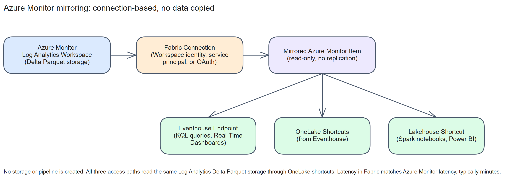
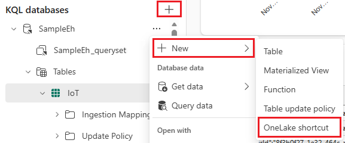

# Chapter 15: Azure Monitor

> **Part 2: Source-Specific Mirroring Guides**
>
> **Purpose:** Use this chapter to configure Azure Monitor mirroring and understand its connection-based, no-replication architecture.

**Part index:** [Chapters in Part 2](readme.md)

---

## Overview of the Source System

**Azure Monitor** collects operational telemetry from Azure resources and applications. Its logs are stored in **Log Analytics workspaces**. The **Mirror Azure Monitor** feature, currently in **Public Preview**, makes selected Log Analytics tables available to Fabric workloads without copying or replicating the data.

Unlike database mirroring, mirroring Azure Monitor is based on a connection rather than a replication pipeline. The data stays in Log Analytics storage, and the mirrored item exposes the same Delta Parquet storage that Azure Monitor already uses internally. This lets you combine operational telemetry with business data for cross-domain analytics, real-time dashboards, and Power BI reporting, without an export job or a second replicated dataset.

---

## Mirroring Type and Architecture

- **Mirroring type**: Metadata mirroring
- **Method**: Shortcuts. Fabric creates OneLake shortcuts to the Log Analytics workspace's own Delta Parquet storage
- **Change mechanism**: None. There is no replication or ingestion pipeline; reads pass through to Azure Monitor storage

All tables in the Log Analytics workspace are already written internally as Delta Parquet files. Fabric exposes the selected tables through OneLake shortcuts that point at that storage, and also creates a **Fabric Eventhouse endpoint** over the same tables for KQL-based real-time analytics. The mirrored item carries only shortcut metadata; the underlying storage stays with Azure Monitor.

**Architecture flow:**

[](../assets/diagrams/chapter-15/diagram-01.excalidraw.png)
*Figure 15.1: Azure Monitor mirroring connects to Log Analytics storage without copying data*

Reads in Fabric are **read-only**. New data continues to arrive in Log Analytics through normal Azure Monitor ingestion, and Fabric reads reflect it through the shortcut path. Allow minutes for visibility; the troubleshooting guide describes approximately 15 minutes without a formal latency SLA.

You get three access paths over the same mirrored data:

* **Database shortcuts** from Eventhouse, the primary access path for Real-Time Dashboards, anomaly detection, and KQL queries.
* **Eventhouse endpoint**, a KQL database experience created automatically with the mirrored item.
* **OneLake shortcut into a Lakehouse**, for Spark notebooks, Power BI semantic models, and batch analytics.

Microsoft documents automatic creation of an **Eventhouse endpoint**, not a SQL analytics endpoint, for this item. Metadata-mirroring query surfaces are connector-specific. Eventhouse query acceleration can cache shortcut data for faster queries; this cache is distinct from the source-replication pipeline that Azure Monitor mirroring avoids.

See [Mirror Azure Monitor data in Microsoft Fabric](https://learn.microsoft.com/en-us/fabric/mirroring/catalog-mirroring/azure-monitor) for the full architecture description.

---

## Network and Connectivity

| Question | Answer |
|---|---|
| **Data gateway required?** | The documented setup uses a Fabric Azure Monitor connection without a data gateway. |
| **Private endpoint support?** | The connector documentation does not specify an Azure Monitor Private Link deployment procedure. Do not infer support from the authentication options. |
| **Fabric workspace outbound protection?** | The [mirrored-database support list](https://learn.microsoft.com/en-us/fabric/security/workspace-outbound-access-protection-mirrored-databases) does not explicitly enumerate Azure Monitor. Source authentication does not establish support; validate the catalog item and its shortcut access paths before deployment. |

---

## Setup Walkthrough

### 1. Source administrator and security preflight

Follow the [Microsoft setup tutorial](https://learn.microsoft.com/en-us/fabric/mirroring/catalog-mirroring/azure-monitor-tutorial) and [source permission requirements](https://learn.microsoft.com/en-us/fabric/mirroring/catalog-mirroring/azure-monitor#security-and-permissions), checked **8 October 2026**. This is an exposure of Azure Monitor's existing storage, not a log-export or CDC setup.

1. **Log Analytics administrator:** identify the source workspace and copy **Workspace ID** from its Azure portal **Overview** page. Use this GUID, not the workspace name, subscription ID, or Azure resource ID. Record the Log Analytics tenant and compare it with the Fabric tenant.
2. Pick a non-sensitive, actively ingesting table such as `Heartbeat` or `AppRequests`. Query it in Log Analytics and record the latest `TimeGenerated` plus an identifiable recent record. Merely creating a custom table is insufficient: it must receive streaming records to appear in the preview picker. No export rule, new destination storage account, or source CDC configuration is required.
3. **Azure access administrator:** assign the connection identity the required permissions at the **source Log Analytics workspace**, not at an unrelated subscription or Fabric workspace. Microsoft's custom-role recipe lists all three as **Actions**:

   ```text
   Microsoft.Authorization/roleAssignments/write
   Microsoft.OperationalInsights/workspaces/query/read
   Microsoft.OperationalInsights/workspaces/read
   ```

   Have the IAM owner follow [Create a custom role in the Azure portal](https://learn.microsoft.com/en-us/azure/role-based-access-control/custom-roles-portal): open the containing subscription/resource group's **Access control (IAM)** → **Add custom role**, name the role, add these three **Actions**, review **Assignable scopes**, and create it. Then open the **Log Analytics workspace's** IAM → **Add role assignment**, choose that role and the intended connection identity, and **Review + assign**. Defining where a role is assignable is not assigning it: keep the actual assignment at the source workspace.

   Verify effective access before connecting. The tutorial also lists Owner, User Access Administrator, and Role Based Access Control Administrator as privileged-role alternatives. The custom role is narrower, but `roleAssignments/write` still permits access administration: obtain security approval rather than describing it as an ordinary read-only role. A Fabric Admin/Contributor role alone is not enough. Do not remove source permissions after onboarding: the stored identity is used for ongoing token refresh and table-list operations.
4. **Fabric administrator:** provide capacity (or an active trial) and a workspace other than **My workspace**, with permission to create the item. If its card is missing, enable **OneLake catalog** → **Govern** → **Configurations** → **Tenant settings** → **Mirrored catalog item** for the intended users.
5. **Data owner:** approve the connected workspace as a new access boundary. Source table-level protection and source row/column controls do not carry into Fabric. Restrict reuse of the connection as well as access to the item: another authorized Fabric user can reuse the connection and select a different table subset without their own Azure source role. Table selection is not a substitute for security review.

### 2. Prepare the correct source identity

| Scenario | Prepare before connecting | Fabric authentication |
|---|---|---|
| Same-tenant pilot | Account with the source connection-creation permissions above | **OAuth 2.0 / Organizational account**; complete **Sign in** against the Log Analytics tenant |
| Same-tenant production | A workspace admin opens **Workspace settings** → **Workspace identity** → **+ Workspace identity**; record the created identity's ID and grant that service principal the source connection-creation role | **Workspace identity** |
| Cross-tenant | Register/provision the service principal in the **Log Analytics tenant**, grant connection-creation/read permissions there, and securely obtain tenant ID, application/client ID, and client-secret **value** | **Service principal**; enter the source tenant, not the Fabric tenant |

The cross-tenant prerequisites mention read access, but the tutorial's connection-creation steps additionally require connection-creation access: read-only access is not a complete bootstrap recipe. Protect and rotate the service-principal secret, preferably with the organization's Key Vault process. The tutorial describes an underlying SAS-based connection; do not publish or manually share that token. After creation, the authentication mode cannot be changed in place: use a replacement connection when changing identity type.

For workspace identity, follow the [identity administration guidance](https://learn.microsoft.com/en-us/fabric/security/workspace-identity). Creating the identity does not itself assign Azure source permissions; match its ID, not just its display name, when making the IAM assignment. Azure Monitor's native connection manages the underlying storage path: there is no documented customer storage-account key, separate ADLS shortcut connection, or Blob Data Reader grant to configure here.

The connector pages provide no complete Azure Monitor Private Link/gateway setup procedure. Where networking is restricted, verify support with the service team before onboarding; do not substitute Databricks' VNet instructions or make a workspace public to force a test through.

### 3. Create the item and select actively ingesting tables

1. In the target Fabric workspace, select **+ New item** → **Mirrored Azure Monitor**.
2. Under **New connection**, select **Azure Monitor**, enter the source **Log Analytics workspace ID**, and name the connection. Select the authentication mode above, supply its details, and **Connect**. Alternatively select an authorized existing connection, after confirming its source workspace and owner.
3. Browse/search the table list and select the approved pilot tables. During preview only tables with recent streaming ingestion appear. For a missing table, verify source ingestion before retrying; add it later through **Edit data selection**. Keep each item's scope within approximately 500 tables.
4. Review the connection, table list, and item name; select **Create**. The item can appear in under a minute while table access is still becoming available. Allow approximately **15 minutes**, without treating this as an SLA.
5. Record the onboarding time. Only new data is exposed during preview: a successful create does not trigger historical backfill, and **Edit data selection** is metadata reconfiguration, not an ingestion snapshot.

### 4. Validate the source, the Eventhouse endpoint, and consumer access

1. Confirm the selected table names appear in the mirrored item. Then open **Analyze data with** → **Eventhouse endpoint**. This automatically created query surface is **not** an automatically created SQL analytics endpoint.
2. After new records arrive through the normal Azure Monitor ingestion path, query a table available in the endpoint, for example:

   ```kusto
   AppRequests
   | where TimeGenerated > ago(1h)
   | summarize Records=count(), LatestRecord=max(TimeGenerated)
   ```

   Substitute a table selected during setup. Compare the latest timestamp and a known post-onboarding record with Log Analytics, not its all-history count. Check metadata visibility and successful data access independently. Seeing a table name does not prove that the connection can read its backing storage.
3. To combine telemetry with an **existing** Eventhouse, expand its KQL database → **+ New** → **OneLake shortcut**, select the mirrored Azure Monitor item and required table, and create the shortcut. Review acceleration/cache settings and capacity usage.

   
   *Figure 15.2 — Downstream Eventhouse shortcut setup, not the Azure Monitor connection wizard. Microsoft tutorial screenshot, unchanged. Source: [Create OneLake shortcuts in a KQL database](https://learn.microsoft.com/en-us/fabric/real-time-intelligence/onelake-shortcuts); [original image](https://raw.githubusercontent.com/MicrosoftDocs/fabric-docs/main/docs/real-time-intelligence/media/onelake-shortcuts/new-shortcut.png). © Microsoft, [CC BY 4.0](https://creativecommons.org/licenses/by/4.0/). The Azure Monitor tutorial itself supplies no setup screenshots.*

4. For a manually created KQL shortcut, the generic shortcut guide uses `external_table('<shortcut-name>')`; do not assume it has the same table-reference syntax as the automatically created endpoint. Query the actual shortcut, for example `external_table('AppRequests') | take 10`.
5. For Spark/Power BI, open a Lakehouse → **Tables** → **New shortcut** → **Microsoft OneLake**, choose the mirrored item and tables, and confirm. Validate this path separately from the Eventhouse endpoint. Acceleration caches and any deliberately materialized downstream transformations are separate from the no-replication source connection.
6. Configure **OneLake security** and test as an intended non-admin consumer. During preview, Microsoft's tutorial recommends this rather than the item's **Share** action. Do not grant Contributor solely to work around sharing unless the data owner accepts its broader write powers.

### 5. Hand over operations safely

Record source/Fabric workspace IDs, tenant pairing, identity owner and expiry, custom-role assignment, chosen tables, onboarding timestamp, normal ingestion cadence, and the validation queries. Monitor ingestion and Fabric freshness separately. An OAuth owner's departure or access removal can break the connection. Test credential replacements before retiring the original.

Keep source retention and the documented **two-step purge** process in the operational runbook. Deleting a mirrored item is not deleting Azure Monitor logs. Remove dependent consumers and check connection reuse before deleting a shared connection; source data, retention, and Azure billing continue independently.

---

## Nuances and Limitations

| Topic | Detail |
|---|---|
| **Table count** | A mirrored item supports approximately 500 tables. This limit is soft during Public Preview and might change. Create multiple mirrored items, each scoped to a subset of tables, for larger workspaces. |
| **No historical backfill** | Mirrored items show new data only. Data that arrived before the table was mirrored is not backfilled into Fabric. |
| **Read-only** | Mirrored items are read-only. Writing back to Azure Monitor through the mirrored item is not supported. |
| **Regional availability** | Available in all supported Microsoft Fabric regions, which are a subset of Azure regions. |
| **Initial setup latency** | Tables typically take about 15 minutes to appear in OneLake and Eventhouse after item creation. |
| **Cross-region reads** | Reads work across regions, but network egress charges might apply. |
| **Auth lifecycle** | Items created with organizational-account (OAuth) authentication stop working if the creating user leaves the tenant or loses workspace access. Prefer workspace identity or a service principal for production. |
| **Two-step data purge** | Microsoft documents both the Log Analytics data purge API and the Lake Data Purge API after onboarding. If the latter is unavailable during preview, contact support; do not assume a source purge is sufficient. |
| **Some columns unavailable** | Mirrored tables do not include the `_ResourceId`, `_SubscriptionId`, and `Type` system columns. |
| **Table-level protection not enforced** | During Public Preview, Azure Monitor table-level protection settings are not enforced on the mirrored item; all tables in the connected workspace are available through it, regardless of source-side protection. |
| **Sharing** | The tutorial recommends OneLake security instead of the item's **Share** action during preview. Troubleshooting documents a Contributor-role requirement and missing share-notification emails. |
| **Authentication changes** | A connection's authentication mode cannot be changed after creation. Create a replacement connection when changing modes. |

See the current [Mirror Azure Monitor overview](https://learn.microsoft.com/en-us/fabric/mirroring/catalog-mirroring/azure-monitor#considerations) for the full, up-to-date list of Public Preview constraints.

> **Documentation discrepancy:** The overview explicitly describes no duplicate storage, but its purge section refers to a "copy in OneLake storage." Retain the documented two-step purge requirement without treating that wording as evidence of database replication.

---

## Source System Impact

- **No replication load**: Because mirroring is connection-based, there is no extraction job, export pipeline, or additional ingestion load on Azure Monitor.
- **Independent permission models**: Azure RBAC on the Log Analytics workspace and Fabric workspace permissions on the mirrored item are separate systems with no identity correlation. A user denied access to a table in Azure can still read it through the mirrored item if Fabric workspace permissions allow it, and source-side row-level or column-level security does not carry through. Review the mirrored item as its own access surface.
- **Cost**: Azure Monitor continues to charge for log ingestion, retention, and queries run inside Azure Monitor. Queries through the Eventhouse endpoint or shortcuts consume Fabric capacity instead. Core mirroring does not create a second replicated dataset; account separately for the Fabric resources used by query acceleration, Spark, Power BI, and other downstream workloads.

---

## Troubleshooting

See the current [troubleshooting guide for Mirror Azure Monitor](https://learn.microsoft.com/en-us/fabric/mirroring/catalog-mirroring/azure-monitor-troubleshoot) for the full diagnostic flow, covering item creation, table discovery, item health, data availability, and Lakehouse shortcut issues.

| Symptom | Likely Cause | Resolution |
|---|---|---|
| Cannot create the mirrored item | Tenant setting not enabled, or connection creation role missing | Ask a tenant admin to enable **Mirrored catalog item**; confirm you hold the required custom role or a built-in Owner/User Access Administrator/RBAC Administrator role |
| Table not visible after creation | No recent ingestion, discovery delay, or insufficient connection access | Confirm active ingestion and source read access, allow discovery time, then use **Edit data selection** |
| Item or table shows an error | Source ingestion issue, or a problem affecting one or multiple tables | Verify source ingestion is healthy; compare the affected table against healthy tables in the same item |
| Data not visible in Fabric | Propagation is in progress, or only historical data exists | Compare timestamps and allow approximately 15 minutes; data from before onboarding is not backfilled |
| Lakehouse shortcut fails | Shortcut-specific issue, separate from mirrored item health | Confirm the mirrored item itself is healthy first, then troubleshoot the shortcut independently |
| Mirrored item stops working | Organizational-account connection's creating user left the tenant or lost access | Recreate the connection using workspace identity or a service principal for production use |
| Workspace identity fails validation | Known early-preview issue still affects the deployment | The troubleshooting guide recommends Organizational account for same-tenant access until fixed; create a new Workspace identity connection afterwards |

---

## Public issues and common pitfalls

**Reviewed 8 October 2026.** Research began with [`site:reddit.com "Azure Monitor" "mirroring"`](https://www.google.com/search?q=site%3Areddit.com+%22Azure+Monitor%22+%22mirroring%22). Search results included a source-specific performance discussion, but Reddit returned HTTP 403 when the thread was opened. Its full report and date could not be independently verified in this review, so the checks below rely on readable Microsoft guidance rather than presenting the search snippet as incident evidence.

| Evidence | Practical response |
|---|---|
| **Documented:** the [troubleshooting guide](https://learn.microsoft.com/en-us/fabric/mirroring/catalog-mirroring/azure-monitor-troubleshoot) distinguishes malformed workspace ID (`400`), wrong/expired identity (`401`), permissions (`403`), missing workspace (`404`), throttling (`429`), and service failures (`5xx`). | Read the detailed error before changing configuration. Check the GUID and tenant first; check source IAM for `403`, and back off rather than repeatedly recreating connections for `429`. |
| **Documented:** only recently ingesting tables are discoverable and only post-onboarding data is exposed during preview. | Confirm new source ingestion, note onboarding time, and compare recent record timestamps. An empty table is not proof of a stalled replication pipeline—there is no such pipeline here. |
| **Documented consumer constraints:** [Direct Lake capacity guardrails](https://learn.microsoft.com/en-us/fabric/fundamentals/direct-lake-overview#fabric-capacity-requirements) include Parquet-file and row-group counts, not just table size; [Eventhouse acceleration](https://learn.microsoft.com/en-us/fabric/real-time-intelligence/query-acceleration-overview#billing) adds Premium cache charges and indexing compute. | Test the actual semantic-model mode, file counts, and capacity usage with representative ingestion. A successful KQL read does not prove Direct Lake suitability. The source tables are read-only: do not compact the Azure Monitor shortcut. Deliberate downstream materialization changes the no-copy design and adds compute/storage. |
| **Dated Microsoft preview guidance:** the troubleshooting article still describes a workspace-identity validation issue and sharing fixes “rolling out.” | Do not assume an early-preview bug persists everywhere. Test the deployed experience first; if affected, use its same-tenant OAuth/cross-tenant service-principal workaround and later create a new workspace-identity connection. Prefer OneLake security to broad Contributor access. |

The [Microsoft announcement on Fabric Community](https://community.fabric.microsoft.com/blog/fbc_fabricupdatesblogs/bring-your-azure-monitor-and-aws-glue-data-to-onelake-preview/5326474), also reviewed on 8 October 2026, corroborates no-copy access; it is not a support incident or proof of a performance fix. For a healthy mirrored item with a failing Lakehouse consumer, investigate the downstream shortcut separately. Record UTC times, source/Fabric latest timestamps, affected tables, and sanitized activity IDs for support.

---

## Summary

Azure Monitor mirroring is a Public Preview, connection-based feature: Fabric reads the same Delta Parquet storage that Azure Monitor already uses, through OneLake shortcuts and a Fabric Eventhouse endpoint, without copying or replicating data. Plan for the approximately 500-table limit, new-data-only visibility, read-only access, and the two-step data purge process before relying on it for production analytics. See the current [Mirror Azure Monitor overview](https://learn.microsoft.com/en-us/fabric/mirroring/catalog-mirroring/azure-monitor), [tutorial](https://learn.microsoft.com/en-us/fabric/mirroring/catalog-mirroring/azure-monitor-tutorial), and [troubleshooting guide](https://learn.microsoft.com/en-us/fabric/mirroring/catalog-mirroring/azure-monitor-troubleshoot).

**Contents:** [Table of Contents](../index.md) | **Previous:** [Chapter 14: Azure Databricks (Unity Catalog)](chapter-14.md) | **Next:** [Chapter 16: Google BigQuery](chapter-16.md)
