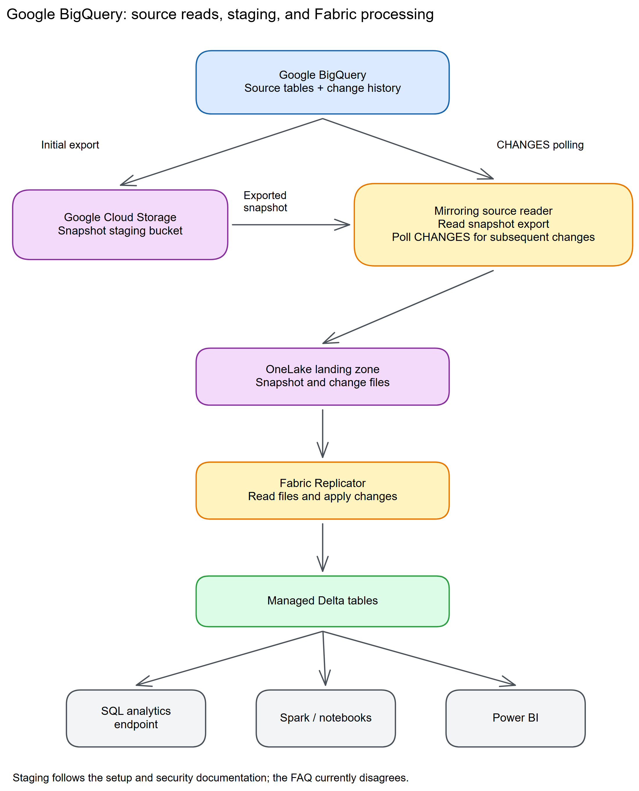

# Chapter 16: Google BigQuery

> **Part 2: Source-Specific Mirroring Guides**
>
> **Purpose:** Use this chapter to configure Google BigQuery mirroring and plan change history, primary keys, staging storage, Google Cloud cost, and complex data types.

**Part index:** [Chapters in Part 2](readme.md)

---

## Overview of the Source System

**Google BigQuery** is Google Cloud's fully managed, serverless data warehouse. Its Fabric Mirroring connector is generally available and replicates selected BigQuery tables into OneLake so they can be analysed with other Fabric data.

---

## Mirroring Type and Architecture

- **Mirroring type**: Database mirroring
- **Method**: Pull or polling-based
- **Change mechanism**: BigQuery change history through the `CHANGES` table-valued function

The setup documentation requires a Google Cloud Storage staging bucket for table exports to OneLake. Incremental replication polls BigQuery's `CHANGES` table-valued function for inserts, updates, and deletes recorded in change history.

> **Staging documentation discrepancy:** The [tutorial](https://learn.microsoft.com/en-us/fabric/mirroring/google-bigquery-tutorial) and [security guide](https://learn.microsoft.com/en-us/fabric/mirroring/google-bigquery-security) require a staging bucket, while the [FAQ](https://learn.microsoft.com/en-us/fabric/mirroring/google-bigquery-faq) says direct reads need no staging or landing zone. Provision the documented setup prerequisites and confirm the applicable execution path with Microsoft before making a no-staging architecture commitment.

**Architecture flow:**

[](../assets/diagrams/chapter-16/diagram-01.excalidraw.png)
*Figure 16.1: BigQuery initial export and change-history polling*

> **Cost awareness:** Initial exports, `CHANGES` queries, staging storage, API operations, and Google Cloud egress can incur Google Cloud charges.

---

## Network and Connectivity

| Question | Answer |
|---|---|
| **Data gateway required?** | No, for a directly reachable BigQuery project. Optional otherwise: an on-premises data gateway (version 3000.286.6 or later) or a VNet data gateway can route the connection. |
| **Private endpoint support?** | Not applicable in the Azure sense, since BigQuery runs on Google Cloud. A gateway routes outbound connectivity from a controlled network instead. |
| **Source network restrictions?** | Gateway support does not itself establish support for every Google Cloud perimeter or Fabric workspace outbound policy. Verify that the selected connection can reach the required BigQuery and Cloud Storage endpoints. |
| **Fabric workspace outbound protection?** | BigQuery is supported through [data connection rules](https://learn.microsoft.com/en-us/fabric/security/workspace-outbound-access-protection-mirrored-databases). Allow the source connection in addition to configuring its network path. |

See the current [BigQuery limitations](https://learn.microsoft.com/en-us/fabric/mirroring/google-bigquery-limitations) for gateway version requirements.

---

## Setup Walkthrough

**Documentation reviewed: 8 October 2026.** Follow the [Microsoft Learn tutorial](https://learn.microsoft.com/en-us/fabric/mirroring/google-bigquery-tutorial), with its [permission requirements](https://learn.microsoft.com/en-us/fabric/mirroring/google-bigquery-security), rather than a generic BigQuery copy-connector recipe. Run the source commands below only in your approved Google Cloud project; they are examples, not commands to execute against production unchanged.

### 1. Assign owners and complete preflight

| Owner | Must complete before connection creation |
|---|---|
| Fabric administrator | Provide an active Fabric/Premium/trial capacity, a supported workspace other than **My workspace**, and permission for the operator to create items; check tenant mirroring settings if the card is unavailable. |
| Google Cloud project/IAM administrator | Confirm billing, APIs, a dedicated service account, approved key creation, IAM bindings, and staging-bucket ownership. |
| BigQuery data owner | Approve the tables, validate keys and data types, enable change history, and document time-travel retention and application write patterns. |
| Network/security owner | Approve the direct connection or gateway path and the source-data export; define equivalent access controls in Fabric. |
| Operations/FinOps owner | Agree latency targets, an outage budget shorter than retained history, source-cost alerts, and key rotation ownership. |

1. Record `<PROJECT_ID>`, `<DATASET_ID>`, the dataset **location**, intended table names, and the service-account email. Use the project ID, not its display name or project number.
2. Begin with one small regular table. Views, materialized views, external tables, and wildcard tables are not substitutes for regular source tables.
3. Check application writes. BigQuery `CHANGES` cannot read a window containing committed multi-statement transactions, and cannot be used on a table with Google's separate **BigQuery CDC** feature enabled. Do not configure Storage Write API CDC as though it were this connector's change-history prerequisite.
4. Record the actual time-travel window, not just the usual seven-day default. Account for snapshot duration, planned outages, detection time, and catch-up time.
5. Approve source charges before running tests. Enabling change history stores additional metadata; reading it, exports, Cloud Storage objects/API requests, and egress can cost money even though core Fabric replication compute is free.

### 2. Prepare the project, APIs, and service account

1. In Google Cloud Console, select the approved project and confirm its billing account is active. In **APIs & Services**, review **BigQuery API**, **BigQuery Storage API**, and **Cloud Storage API** for the data path; **IAM API**, **IAM Service Account Credentials API**, and **Cloud Resource Manager API** cover identity/signing/project-management operations. This is an administrative checklist, **not a Microsoft-published mandatory API allowlist**.
2. The API administrator can inspect enabled services first with `gcloud services list --enabled --project=<PROJECT_ID>`. The following enablement example is for an approved setup using all six services; otherwise enable only the missing services required by the agreed path. Enabling APIs requires `serviceusage.services.enable`; that administrative privilege is not a runtime permission to add to Fabric's service account.

```text
gcloud services enable bigquery.googleapis.com bigquerystorage.googleapis.com storage.googleapis.com iam.googleapis.com iamcredentials.googleapis.com cloudresourcemanager.googleapis.com --project=<PROJECT_ID>
```

3. This API checklist follows the services associated with the documented operations, not a claim that every named API is called in every deployment. Google's [IAM setup guidance](https://docs.cloud.google.com/iam/docs/create-short-lived-credentials-direct#before-you-begin) covers IAM/Credentials API enablement, not Fabric's complete execution path. Microsoft's FAQ additionally mentions **BigQuery Connection API** when managing Google-side connection details; that is not a reason to invent a BigQuery connection resource or Data Transfer Service for ordinary mirroring.
4. Open **IAM & Admin → Service Accounts → Create service account**. Create a dedicated account such as `fabric-mirror`; do not give it project Owner merely to make the wizard succeed.
5. Apply the permissions in the next section before testing discovery. Separate projects for data, jobs, or identity require the corresponding grants in each project; first prove the simpler single-project path.
6. Under the service account, select **Keys → Add key → Create new key → JSON**. Secure the downloaded private key immediately. Existing private key material cannot be downloaded again from Google; retrieve your protected original or create a replacement through your approved rotation process.
7. If organization policy prohibits service-account keys, stop and resolve the supported authentication design with the administrators. The current mirroring connector supports service keys, not SSO or a documented keyless replacement.
8. Store the key only in approved secret storage and the Fabric connection credential field. Do not put it in this repository, SQL, screenshots, or support tickets.

### 3. Grant the complete documented runtime permission set

The following is the **union of the current Microsoft permission include**, not just its shorter introductory list. In **IAM & Admin → Roles**, the IAM administrator can create approved custom roles; bind them to the service account on the relevant project, dataset, bucket, or service-account resource. Some permissions, such as dataset/job creation and project discovery, require project-level scope.

| Purpose | Permissions from Microsoft's setup requirements |
|---|---|
| Project and dataset discovery/temporary datasets | `resourcemanager.projects.get`, `bigquery.datasets.get`, `bigquery.datasets.create` |
| Table metadata and working tables | `bigquery.tables.list`, `bigquery.tables.get`, `bigquery.tables.create`, `bigquery.tables.updateData` |
| Routine discovery | `bigquery.routines.get`, `bigquery.routines.list` |
| Read data/change history | `bigquery.tables.getData` |
| Jobs | `bigquery.jobs.create`, `bigquery.jobs.get`, `bigquery.jobs.list` |
| Read sessions | `bigquery.readsessions.create`, `bigquery.readsessions.getData` |
| Exports | `bigquery.tables.export` |
| Bucket discovery | `storage.buckets.list`, `storage.buckets.get` |
| Staging objects | `storage.objects.create`, `storage.objects.list`, `storage.objects.delete` |
| Signed export access | `iam.serviceAccounts.signBlob` |
| Fabric enables change history, if chosen | `bigquery.tables.update` |
| Fabric creates the bucket, if chosen | `storage.buckets.create` |

1. Scope data access to the approved datasets/tables where Google IAM permits it; scope object permissions to the dedicated staging bucket. Project-level create/list permissions are still necessary where the service creates temporary resources.
2. Grant `iam.serviceAccounts.signBlob` on the service account being used to sign, not indiscriminately across unrelated identities. A custom signing role avoids treating token impersonation over every service account as a prerequisite.
3. Choose **either** owner-enabled change history **or** `bigquery.tables.update` for Fabric to enable it. Choose **either** an administrator-created bucket **or** `storage.buckets.create`. Omitting these two permissions is justified only by completing the respective manual prerequisite.
4. Microsoft mentions BigQuery Admin and Storage Admin as convenient broad roles. They are not a complete least-privilege design and do not remove the separate signing requirement. Do not assume two role names guarantee every permission in the table.
5. For tables that have or previously had row-access policies, Google requires additional historical-data authority, including `bigquery.rowAccessPolicies.overrideTimeTravelRestrictions`. Have the security owner review this exception; ordinary data-viewer access can be insufficient. Column policies also affect accessible history.
6. Save the resulting role definitions and bindings in your organization's change record. A successful sign-in alone does not prove discovery, export, read-session, or change-history permission.

### 4. Create and protect the staging bucket

1. Prefer an administrator-created bucket when avoiding runtime bucket creation. In **Cloud Storage → Buckets → Create**, enter exactly `<project_id_in_lowercase>_fabric_staging_bucket`.
2. Select the **same location as the BigQuery dataset**, including regional versus multi-regional placement. A project does not have one universal data region; the permission include's dataset-location requirement is the relevant one.
3. Keep the bucket nonpublic and grant only the documented staging permissions to the replication identity. Treat staged objects as copies of source data, with the same confidentiality classification.
4. If the required globally unique name is unavailable, or datasets in one project require different locations, obtain a supported design from Microsoft before proceeding. The tutorial does not document an arbitrary bucket-name override or a multiple-region naming scheme.
5. Review retention locks and lifecycle rules with the storage owner. Do not automatically delete files that a running export might still need, and do not assume a retention lock is compatible with the required object-delete permission.
6. Alternatively, grant `storage.buckets.create` and let Fabric provision its bucket. Verify the resulting name, location, permissions, and charges before adding larger tables.

### 5. Prepare and verify source tables

Have the table owner run GoogleSQL in the selected project's BigQuery query editor, using the owner's approved table-update authority rather than adding it to the runtime identity when owner-side preparation was chosen. Replace the placeholders inside backticks and select the dataset's processing location.

```sql
ALTER TABLE `<PROJECT_ID>.<DATASET_ID>.<TABLE_NAME>`
SET OPTIONS (enable_change_history = TRUE);
```

For a mutable table without a declared key, first test the proposed key; this scan has a source cost:

```sql
SELECT <KEY_COLUMN>, COUNT(*) AS row_count
FROM `<PROJECT_ID>.<DATASET_ID>.<TABLE_NAME>`
GROUP BY <KEY_COLUMN>
HAVING <KEY_COLUMN> IS NULL OR COUNT(*) > 1;
```

Only after the result is empty and the application owner guarantees future uniqueness:

```sql
ALTER TABLE `<PROJECT_ID>.<DATASET_ID>.<TABLE_NAME>`
ADD PRIMARY KEY (<KEY_COLUMN>) NOT ENFORCED;
```

For a composite key, validate uniqueness of the entire tuple and non-nullness of **every** component, then list all key columns in the declaration. BigQuery does not enforce this constraint: declaring an invalid key can produce incorrect query results and replication behavior. Do not add a second key to an already-keyed table.

```sql
SELECT table_name, option_name, option_value
FROM `<PROJECT_ID>.<DATASET_ID>.INFORMATION_SCHEMA.TABLE_OPTIONS`
WHERE option_name = 'enable_change_history';

SELECT table_name, constraint_type
FROM `<PROJECT_ID>.<DATASET_ID>.INFORMATION_SCHEMA.TABLE_CONSTRAINTS`
WHERE constraint_type = 'PRIMARY KEY';
```

Check each selected table, not merely that these queries return at least one row. A table without a key is an **insert-only** onboarding choice; updates/deletes are not a normal incremental workload for it.

**Prove change-history reads, not only the table option.** On a small approved pilot with a known committed change, test the following through the same service-account identity and project/location that Fabric will use. This is a billable source query, not a Fabric configuration command:

```sql
SELECT _CHANGE_TYPE, _CHANGE_TIMESTAMP
FROM CHANGES(
  TABLE `<PROJECT_ID>.<DATASET_ID>.<TABLE_NAME>`,
  TIMESTAMP '<START_UTC>',
  TIMESTAMP '<END_UTC>'
)
ORDER BY _CHANGE_TIMESTAMP;
```

Replace both timestamps with UTC values: start after change history was enabled, include the known change, and keep the interval within retained history and no longer than one day. The end is exclusive. For a conservative connector diagnostic, choose an end at least 15 minutes in the past; this avoids conflating Microsoft's documented wait with a failed source read. An empty window without a known change is not proof of failure. Google's [current `CHANGES` reference](https://docs.cloud.google.com/bigquery/docs/reference/standard-sql/time-series-functions#changes) warns that pre-enablement history can be incomplete; enabling history now does not repair an earlier gap.

### 6. Establish connectivity and create the mirror

1. For direct access, have the network owner permit the Google API/authentication/storage endpoints used by the connection. Validate DNS, HTTPS, proxy rules, organization policies, and any Google service perimeter. Public service endpoints do not mean anonymous access.
2. If using a gateway, configure its network route first. On-premises data gateway must be **3000.286.6 or later**; VNet data gateway is also supported. A gateway is optional, not universally required for BigQuery.
3. In an outbound-protected Fabric workspace, allow the BigQuery connection through the documented data connection rules. Do not assume a gateway automatically bypasses workspace or Google-side restrictions.
4. In the capacity-backed workspace, open **Create → Mirrored Google BigQuery**, name the item, and select **Create**.
5. Select **BigQuery** under **New connection**, or an existing authorized connection. Enter the exact **Service Account Email** and the complete **Service Account JSON key file contents**. Select the approved gateway, if applicable, and give the connection a recognizable name.
6. Use the database dropdown to locate the authorized project/dataset hierarchy. Confirm the intended project and dataset from the discovered objects rather than selecting a similarly named dataset.
7. On **Configure mirroring**, turn off **Mirror all data** for the pilot and select the prepared table. The default all-data setting also enrolls newly created tables; do not enable it without a future-table permission, key, and cost policy.
8. Select **Mirror database**. Open **Monitor replication** after a few minutes; initial duration depends on table size, source throughput, and the export path. A two-to-five-minute tutorial check is not a completion guarantee.


*Figure 16.2: The BigQuery tutorial links to this shared monitoring walkthrough; the pictured sample source is Azure SQL Database, not a BigQuery connection wizard. The current BigQuery tutorial contains no source-specific setup screenshot. Source: Microsoft Learn, [Monitor Fabric mirrored database replication](https://learn.microsoft.com/en-us/fabric/mirroring/monitor), linked from the [BigQuery tutorial](https://learn.microsoft.com/en-us/fabric/mirroring/google-bigquery-tutorial); [direct image](https://raw.githubusercontent.com/MicrosoftDocs/fabric-docs/main/docs/mirroring/media/monitor/monitor-mirrored-database.png). Credit: Microsoft; [CC BY 4.0](https://creativecommons.org/licenses/by/4.0/); reproduced unchanged.*

### 7. Validate the snapshot and disposable test changes

1. Compare source and target table names, columns, key values, and representative data. For a small quiescent pilot, compare `COUNT(*)`; for live production data, use a stable key range or an agreed cutoff instead of expecting simultaneous counts.
2. The monitor's **Rows replicated** is a cumulative operation count, including updates/deletes, **not** the current target row count. Query the SQL analytics endpoint separately.
3. For an isolated test, have the source owner create the following **new** table in an approved test dataset, then include it in the mirror. Use a different name if it already exists; do not use `CREATE OR REPLACE`.

```sql
CREATE TABLE `<PROJECT_ID>.<TEST_DATASET>.fabric_mirror_probe` (
  probe_id INT64 NOT NULL,
  marker STRING,
  PRIMARY KEY (probe_id) NOT ENFORCED
)
OPTIONS (enable_change_history = TRUE);

INSERT INTO `<PROJECT_ID>.<TEST_DATASET>.fabric_mirror_probe`
VALUES (1, 'snapshot');
```

4. Wait until the snapshot row is visible in Fabric. Then execute each of the following **separately**, checking the target between operations. Do not wrap them in a multi-statement transaction.

```sql
INSERT INTO `<PROJECT_ID>.<TEST_DATASET>.fabric_mirror_probe`
VALUES (2, 'insert');
```

```sql
UPDATE `<PROJECT_ID>.<TEST_DATASET>.fabric_mirror_probe`
SET marker = 'updated' WHERE probe_id = 2;
```

```sql
DELETE FROM `<PROJECT_ID>.<TEST_DATASET>.fabric_mirror_probe`
WHERE probe_id = 2;
```

5. In Fabric, select the discovered schema/table from the SQL endpoint explorer and query `probe_id, marker`. Expect row 2 to appear, change to `updated`, then disappear, while row 1 remains. Use source GoogleSQL and target T-SQL in their respective editors.
6. The Microsoft tutorial advises an approximately **15-minute initial wait after snapshot** and up to **one-hour quiet-table backoff**. Use those documented expectations when timing a low-traffic pilot; do not repeatedly restart merely because a test change is not immediate. **Source-documentation discrepancy:** Microsoft attributes the initial wait to a Google ten-minute restriction, but the Google `CHANGES` reference retrieved on 8 October no longer lists that restriction and permits a `NULL` end timestamp. Do not promise lower Fabric latency from that source-only change; the connector tutorial still documents its wait.
7. Test supported representative complex/high-precision values and source security policies separately. The simple probe proves basic DML, not full type fidelity or all application write modes.
8. After approval, deselect only the disposable probe and arrange source cleanup. Deselecting deletes that table's OneLake replica, so keep it out of shared reports.

### 8. Hand over operation

- Record the mirror/connection IDs, project, dataset, bucket, selected tables, IAM bindings, gateway version, and key expiry/rotation owner without recording the private key.
- Establish alerts for failed/warning states, elapsed time since expected changes, source job errors, bucket growth, and Google Cloud billing. BigQuery is serverless: there is no Snowflake-style warehouse size to reduce.
- Baseline BigQuery job history and billing under the dedicated identity. The FAQ does not promise a built-in query-to-mirror mapping; avoid claiming every job with that identity belongs to one particular mirrored table.
- Keep the maximum outage plus catch-up shorter than source history. After a longer gap, budget and approve a reseed rather than pretending missing changes can be recovered indefinitely.
- Recreate source row/column security and test consumers in Fabric before sharing. A successful replication identity is not a consumer authorization model.
- Rotate keys by updating the connection and verifying replication before retiring the old key. Schedule stop/start carefully: it reinitializes tables and can incur another full export.

---

## Nuances and Limitations

| Topic | Detail |
|---|---|
| **Primary keys** | Tables with primary or composite keys support inserts, updates, and deletes. Tables without keys operate in insert-only mode; non-insert changes trigger a reseed. |
| **Change-history window** | `CHANGES` can only return data within the table's time-travel window, typically seven days. A longer interruption can require a full reseed. |
| **Query window** | A single `CHANGES` query cannot cover more than one day. Fabric manages the polling windows. |
| **Transactions** | Multi-statement transactions can prevent incremental reads for the affected time window. |
| **BigQuery costs** | Change-history queries are billed by bytes scanned. Initial export, staging storage, APIs, and egress can also incur charges. |
| **Table types** | Only regular tables are supported. Views, materialized views, external tables, and wildcard tables do not provide a supported `CHANGES` source. |
| **Data type validation** | The cited connector guides do not publish a complete type-mapping matrix. Test representative complex and high-precision values rather than assuming a particular `ARRAY`, `STRUCT`, or numeric mapping. |
| **Egress** | Google Cloud transfer charges depend on locations and the billing agreement. Do not assume a Fabric region and a Google Cloud region are interchangeable. |
| **Restart and removal** | Stop/start reloads source tables. Deselecting a table stops its mirroring and deletes its replica from OneLake. |

---

## Source System Impact

- **Initial export**: The first load exports source data through the staging bucket.
- **Incremental queries**: `CHANGES` queries consume BigQuery compute based on bytes scanned.
- **Staging and egress**: Google Cloud Storage and network egress charges can apply.
- **Backoff**: Fabric reduces polling frequency, up to one hour, when it detects no changes.

**Recommendation**: Enable change history before mirroring, define keys for mutable tables, and monitor BigQuery query, storage, and egress charges.

---

## Troubleshooting

| Symptom | Likely Cause | Resolution |
|---|---|---|
| Authentication failure | Invalid, revoked, or expired service account key | Rotate the key and update the connection's JSON key contents |
| Permission denied | Service account lacks one or more required Google Cloud permissions | Grant the permissions listed in the current Fabric security guide |
| Initial load fails | Staging bucket is missing, misnamed, or in another region | Create the required bucket in the dataset region and grant object permissions |
| Repeated table reseeds | Mutable table has no primary key | Validate uniqueness and non-null key values with the data owner before declaring the unenforced primary or composite key |
| Incremental replication fails | Change history is disabled or the requested period is outside the time-travel window | Enable change history or allow Fabric to perform a full reseed |
| High BigQuery costs | Large change-history scans, staging use, or egress | Review source changes, scan volume, staging lifecycle, and regional placement |
| Data type error | A source value cannot be mapped as expected | Capture the exact type and error, validate supported handling with Microsoft, and materialize a compatible physical source table if needed; views are not supported |

---

## Public Issues and Common Pitfalls

**Evidence rechecked 8 October 2026.** Searches started with [Reddit via Bing](https://www.bing.com/search?q=site%3Areddit.com+%22BigQuery%22+%22mirroring%22+%22Fabric%22), then [Google](https://www.google.com/search?q=site%3Areddit.com%2Fr%2FMicrosoftFabric+%22BigQuery%22+%22mirroring%22). A source-specific Reddit incident could not be verified from this research. This is an evidence limitation, **not a claim that no reports or issues exist**; unrelated search results and blocked pages do not establish reliability. The actual Fabric Community thread below was re-read, including its embedded original-post/accepted-answer dates.

- **Unhelpful internal warnings (historical anecdote):** A [Fabric Community BigQuery thread](https://community.fabric.microsoft.com/discussions/df_mirroring/error-in-mirrored-google-big-query/4832312), posted **22 September 2025** and verified **8 October 2026**, reports an unclear setup error and asks about the cost of mirroring 15 large tables. This is not a diagnosed universal defect. Its accepted reply's preview wording and suggestion that every connection needs a gateway are superseded by current GA/gateway documentation.
- **Avoid the thread's reset-first advice:** Capture the table error, ArtifactId, UTC timestamp, gateway version/path, and Google job error before changing configuration. Check the full permission union, bucket location, and history first. Deselect/reselect deletes the replica and stop/start reloads it; neither is a harmless refresh button.
- **A small-table success can hide missing privileges:** The published permission set explicitly covers larger-than-10-GB tables too. Do not remove export, read-session, signing, or staging permissions simply because a tiny proof of concept worked.
- **Source history is not limitless:** Multi-statement transactions, history expiry, source CDC, recently streamed-row DML restrictions, and partition expiration require application-level review. Google's current `CHANGES` reference is authoritative for those source behaviors.
- **“Free mirroring” is not free Google Cloud:** The tutorial's staging requirement and the FAQ's no-staging statement conflict. Follow the setup prerequisites and validate actual jobs/objects and costs; do not build a no-egress or no-storage budget from the FAQ alone.

### References and Image Provenance

Reviewed **8 October 2026**:

- Microsoft Learn: [tutorial](https://learn.microsoft.com/en-us/fabric/mirroring/google-bigquery-tutorial), [security](https://learn.microsoft.com/en-us/fabric/mirroring/google-bigquery-security), [limitations](https://learn.microsoft.com/en-us/fabric/mirroring/google-bigquery-limitations), [cost](https://learn.microsoft.com/en-us/fabric/mirroring/google-bigquery-cost), and [FAQ](https://learn.microsoft.com/en-us/fabric/mirroring/google-bigquery-faq).
- Exact permission source: [MicrosoftDocs permission include](https://raw.githubusercontent.com/MicrosoftDocs/fabric-docs/main/docs/mirroring/includes/google-bigquery-permissions.md).
- Google: [change history permissions/costs](https://docs.cloud.google.com/bigquery/docs/change-history), [`CHANGES` syntax and restrictions](https://docs.cloud.google.com/bigquery/docs/reference/standard-sql/time-series-functions#changes), [unenforced keys](https://docs.cloud.google.com/bigquery/docs/primary-foreign-keys), and [IAM API enablement](https://docs.cloud.google.com/iam/docs/create-short-lived-credentials-direct#before-you-begin).
- Figure 16.2 is a Microsoft documentation asset in `MicrosoftDocs/fabric-docs`. Its [LICENSE](https://raw.githubusercontent.com/MicrosoftDocs/fabric-docs/main/LICENSE) and [ThirdPartyNotices](https://raw.githubusercontent.com/MicrosoftDocs/fabric-docs/main/ThirdPartyNotices.md) license documentation and other content under CC BY 4.0; no separate media-license exception was found for this asset. Trademark rights are not granted. The authored architecture figure above has separate provenance.

---

## Summary

Google BigQuery mirroring uses a staged initial export followed by `CHANGES` polling. Plan change history, keys, the time-travel window, service-account permissions, staging storage, and Google Cloud charges. See the current [BigQuery mirroring overview](https://learn.microsoft.com/en-us/fabric/mirroring/google-bigquery), [tutorial](https://learn.microsoft.com/en-us/fabric/mirroring/google-bigquery-tutorial), [security guidance](https://learn.microsoft.com/en-us/fabric/mirroring/google-bigquery-security), [limitations](https://learn.microsoft.com/en-us/fabric/mirroring/google-bigquery-limitations), [cost guidance](https://learn.microsoft.com/en-us/fabric/mirroring/google-bigquery-cost), and [FAQ](https://learn.microsoft.com/en-us/fabric/mirroring/google-bigquery-faq).

**Contents:** [Table of Contents](../index.md) | **Previous:** [Chapter 15: Azure Monitor](chapter-15.md) | **Next:** [Chapter 17: Oracle](chapter-17.md)
