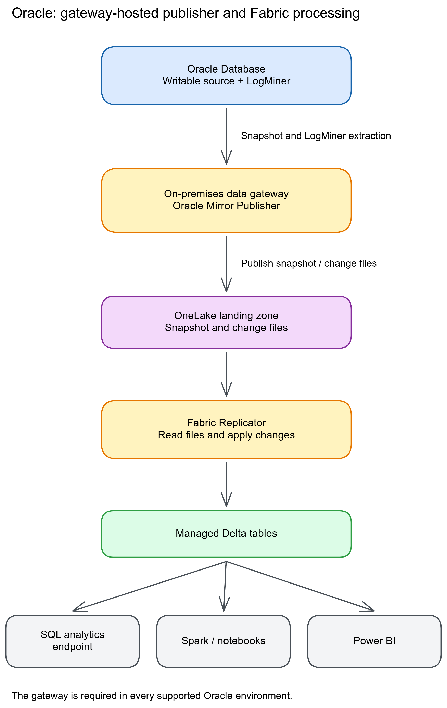
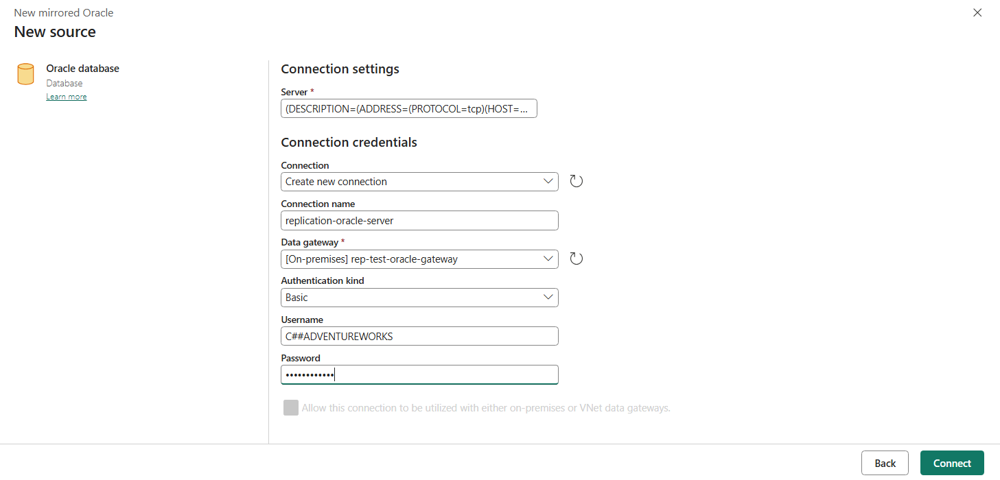
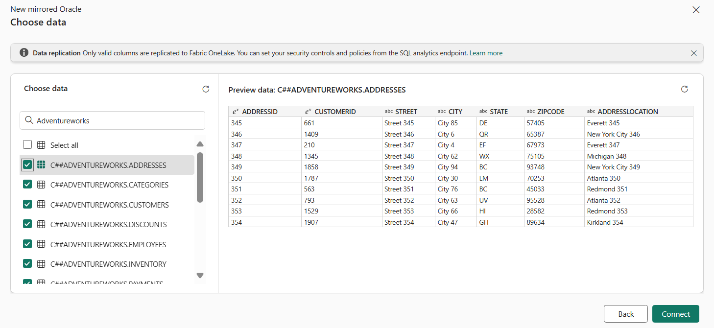

# Chapter 17: Oracle

> **Part 2: Source-Specific Mirroring Guides**
>
> **Purpose:** Use this chapter to configure Oracle mirroring and plan supplemental logging, LogMiner access, archive-log retention, privileges, and gateway connectivity.

**Part index:** [Chapters in Part 2](readme.md)

---

## Overview of the Source System

**Oracle Database** is an enterprise relational database available on-premises and in Oracle Cloud Infrastructure (OCI). Its generally available Fabric Mirroring connector replicates Oracle data into Fabric without replacing the source system.

---

## Mirroring Type and Architecture

- **Mirroring type**: Database mirroring
- **Method**: Gateway-mediated extraction using Oracle LogMiner
- **CDC mechanism**: Oracle redo log (LogMiner-based)

The Oracle Mirror Publisher runs on the on-premises data gateway and uses LogMiner to extract redo-log changes. Fabric applies the captured INSERT, UPDATE, and DELETE operations to the replica.

**Architecture flow:**

[](../assets/diagrams/chapter-17/diagram-01.excalidraw.png)
*Figure 17.1: Oracle mirroring architecture with on-premises data gateway*

---

## Network and Connectivity

| Question | Answer |
|---|---|
| **Data gateway required?** | Yes, always. An on-premises data gateway is a required prerequisite for every supported Oracle environment, including on-premises servers, Oracle Cloud Infrastructure (OCI), Oracle Database@Azure, and Oracle Exadata. |
| **Private endpoint support?** | The gateway must reach the Oracle listener through a private route or a permitted firewall rule. Installing a gateway alone does not create that route. |
| **Source firewall restrictions?** | Allow the gateway-to-Oracle listener connection and the gateway's documented outbound service endpoints. No inbound connection from Fabric to the gateway is required, but source-side listener firewall rules can still be necessary. |
| **Fabric workspace outbound protection?** | Supported through [data connection rules](https://learn.microsoft.com/en-us/fabric/security/workspace-outbound-access-protection-mirrored-databases). Allow the Oracle gateway connection explicitly. |

Unlike Azure SQL Database or PostgreSQL, Oracle has no gatewayless mirroring path, even when the Oracle listener is publicly reachable. See the current [Oracle mirroring overview](https://learn.microsoft.com/en-us/fabric/mirroring/oracle) for the full prerequisite list.

---

## Setup Walkthrough

**Documentation reviewed: 8 October 2026.** This runbook follows the [Microsoft Learn Oracle tutorial](https://learn.microsoft.com/en-us/fabric/mirroring/oracle-tutorial) and its [current limitations](https://learn.microsoft.com/en-us/fabric/mirroring/oracle-limitations). Source SQL is Oracle SQL, not T-SQL; run administrative commands through the DBA's approved Oracle tooling.

### 1. Establish ownership, version, and database scope

| Owner | Responsibility |
|---|---|
| Oracle DBA | Confirm version/patch level, writable source, CDB/PDB topology, service name, LogMiner readiness, backup/restart plan, logging, sync-user grants, and archive retention. |
| Schema/application owner | Approve tables and source workload changes; validate keys/types, add table logging, and perform disposable test writes. |
| Gateway/network administrator | Supply and register a standard on-premises data gateway, supported Oracle connectivity, listener access, and outbound Fabric connectivity. |
| Fabric operator/security owner | Supply a capacity-backed workspace and item-creation permission; configure the connection and mirror, monitor it, and rebuild target access controls. |

1. Microsoft's supported baseline is **Oracle 10 and later with LogMiner**, including on-premises/VM, OCI, Oracle Database@Azure, and Exadata. This is not a promise that every version, patch, multitenant topology, or Oracle-native data type has identical behavior.
2. Use the **writable** database. A read-only standby is not a supported workaround for reducing source impact.
3. Ask the DBA to record database and service identity before issuing any change:

```sql
SELECT BANNER FROM V$VERSION WHERE BANNER LIKE 'Oracle%';
SELECT NAME, OPEN_MODE, LOG_MODE FROM V$DATABASE;
```

4. On **12c and later only**, inspect the container context:

```sql
SELECT CDB FROM V$DATABASE;
SELECT SYS_CONTEXT('USERENV', 'CON_NAME') AS CONTAINER_NAME FROM DUAL;
```

5. For a non-CDB, database logging and user grants apply to that database. For a CDB, archiving and instance shutdown/mount/open operations belong to the **CDB/root administration scope**, not an application PDB. Table DDL belongs to the container owning those tables.
6. Have the DBA validate the mining context, common/local user, grants, and service endpoint for the actual Oracle release. The Fabric tutorial does **not** publish a universal PDB connection/common-user/`CONTAINER=ALL` recipe. Do not infer one from its example username or blindly run every command inside a PDB.
7. If that multitenant setup cannot be established from your version-specific Oracle guidance, resolve it with Microsoft/Oracle support before onboarding production. The [Oracle 19c LogMiner guide](https://docs.oracle.com/en/database/oracle/oracle-database/19/sutil/oracle-logminer-utility.html) describes traditional root mining and per-PDB mining starting with **19c RU10**; that native capability is not a complete Fabric connection/grant recipe or a promise for earlier releases. The current Fabric limitations specifically route `ORA-65040` and certain duplicate-log errors to Oracle support for patch guidance.
8. Inventory the selected tables: each needs a **primary key or unique index**, a name shorter than 30 characters, and supported types. Exclude unsupported objects/columns deliberately; do not assume large objects or spatial types will be converted automatically. Keep the pilot below the 1,000-table mirror limit.

### 2. Plan and enable ARCHIVELOG safely

**Skip the conversion if `LOG_MODE` already reports `ARCHIVELOG`.** Do not restart a healthy production database simply to follow a tutorial. If conversion is needed, the DBA must approve an outage, verified backups, archive destinations with sufficient space, and an application reconnection plan. A CDB restart affects its PDB workloads too.

The Microsoft tutorial prescribes a backup before conversion and another after the control-file change. Use the site's RMAN procedure; the SQL below is not a backup plan or an unattended script.

1. Connect using the DBA's administrative session to the correct database/root, stop applications as agreed, and shut down cleanly:

```sql
SHUTDOWN IMMEDIATE;
```

2. Complete and verify the tutorial's pre-change whole-database backup through RMAN.
3. Mount, but do not open, the database:

```sql
STARTUP MOUNT;
```

4. If a new archive destination is necessary, the DBA creates it on the **Oracle host** with appropriate permissions and storage capacity, then configures it. `<ARCHIVE_DESTINATION>` is an approved Oracle filesystem/ASM destination, not a directory on the gateway.

```sql
ALTER SYSTEM SET LOG_ARCHIVE_DEST_1 = 'LOCATION=<ARCHIVE_DESTINATION>';
```

Do not overwrite an existing Data Guard, recovery-area, or archive destination without reviewing its dependencies. A second destination is optional in the tutorial, not a blanket mirroring requirement.

5. Enable archive mode and open:

```sql
ALTER DATABASE ARCHIVELOG;
ALTER DATABASE OPEN;
```

6. Follow the tutorial's post-change shutdown and backup sequence, then start normally:

```sql
SHUTDOWN IMMEDIATE;
```

Complete and verify the post-change whole-database backup before:

```sql
STARTUP;
SELECT LOG_MODE, OPEN_MODE FROM V$DATABASE;
```

7. Confirm the database is writable, expected PDBs/services are open, applications reconnect, and new archive logs are produced at the intended destination.
8. Keep ARCHIVELOG enabled throughout mirroring. Agree retention that covers **initial load + outage/detection + catch-up**, not just scheduled downtime. Microsoft recommends at least approximately **24 hours** when downtime windows are unclear; this is a floor for planning, not a guaranteed recovery window.
9. Size and monitor archive/FRA storage. Retention must coordinate RMAN, backup jobs, and any external purge process. Avoid aggressive purging during initial loads or heavy CDC; do not solve missing logs by disabling cleanup forever and filling the source disk.

**DBA verification gate:** Inspect archive destination status/errors and verify the required files actually exist, are readable by Oracle, and provide continuous log coverage for the required SCN/time window. A row in `V$ARCHIVED_LOG` or a recent backup timestamp alone does not prove this. For RAC, the [Oracle LogMiner guide](https://docs.oracle.com/en/database/oracle/oracle-database/19/sutil/oracle-logminer-utility.html) requires logs from **all redo threads active in that window**, not just one instance. Do not manually add/remove logs in Fabric's mining session.

### 3. Enable database and per-table supplemental logging

The DBA applies the following at the appropriate database scope, then verifies the settings for the selected source/container:

```sql
ALTER DATABASE ADD SUPPLEMENTAL LOG DATA;
ALTER DATABASE ADD SUPPLEMENTAL LOG DATA (PRIMARY KEY, UNIQUE) COLUMNS;

SELECT SUPPLEMENTAL_LOG_DATA_MIN,
       SUPPLEMENTAL_LOG_DATA_PK,
       SUPPLEMENTAL_LOG_DATA_UI
FROM V$DATABASE;
```

The schema owner or DBA must also configure **every selected table**, including tables added later:

```sql
ALTER TABLE <SOURCE_SCHEMA>.<SOURCE_TABLE>
ADD SUPPLEMENTAL LOG DATA (ALL) COLUMNS;
```

Validate the table-level log group in the table's owning container:

```sql
SELECT OWNER, TABLE_NAME, LOG_GROUP_TYPE, ALWAYS
FROM DBA_LOG_GROUPS
WHERE OWNER = '<SOURCE_SCHEMA>' AND TABLE_NAME = '<SOURCE_TABLE>';
```

Use actual dictionary casing, normally uppercase for unquoted identifiers. Confirm the all-column logging group, rather than merely finding any log group. Enabling logging does not reconstruct previously purged or insufficiently logged redo; do it **before** snapshot/change capture starts. Measure additional redo volume and source CPU/I/O.

### 4. Provision the dedicated sync identity

1. Have the DBA provision a dedicated login using the site's password, account-expiry, and auditing policy. The example name `FABRIC_REPL` is a placeholder, not a mandate to create a local user in the CDB root.
2. The following is the exact grant set published by Microsoft, with only the recipient changed. It is a grant template for DBA review against the actual Oracle version and container; it is **not** a cross-version common-user creation script.

```sql
GRANT CREATE SESSION TO FABRIC_REPL;
GRANT SELECT_CATALOG_ROLE TO FABRIC_REPL;
GRANT CONNECT, RESOURCE TO FABRIC_REPL;
GRANT EXECUTE_CATALOG_ROLE TO FABRIC_REPL;
GRANT FLASHBACK ANY TABLE TO FABRIC_REPL;
GRANT SELECT ANY DICTIONARY TO FABRIC_REPL;
GRANT SELECT ANY TABLE TO FABRIC_REPL;
GRANT LOGMINING TO FABRIC_REPL;
```

3. These are substantial source-wide privileges, including `ANY` privileges and catalog roles. Microsoft currently documents them as requirements; obtain explicit security approval. Do **not** add `DBA`, `SYSDBA`, or administrative credentials to the Fabric connection as a shortcut.
4. `LOGMINING` and container behavior are release-dependent. If an older supported release rejects a published grant, do not ignore the error and claim setup succeeded; obtain a version-specific supported grant plan.
5. Keep `ALTER DATABASE`/table preparation under the DBA or schema owner instead of granting them to the runtime identity unnecessarily. Do not replace the published grant set with a generic Power BI Oracle connector's read-only grants.
6. Validate login and source-table reads using the **same service and identity** that Fabric will use. Check account status, password expiry, effective roles, and required permissions; a successful DBA query is not a sync-user test.

### 5. Install the gateway and prove the network path

1. Install/register the latest supported **standard** on-premises data gateway on a supported Windows host with dedicated resources and recovery-key ownership. Personal mode is not the mirroring deployment.
2. Use **3000.282.5 or later**, and keep monthly updates current. This requirement also applies to OCI, Exadata, and Oracle Database@Azure; VNet data gateway is not a substitute for this Oracle connector.
3. Establish DNS and TCP access from that host to the actual Oracle listener/service. Port 1521 is common, not compulsory. For example, from gateway-host PowerShell:

```powershell
Test-NetConnection -ComputerName '<ORACLE_HOST>' -Port <LISTENER_PORT>
```

4. A TCP success is only a network check. Test Oracle authentication and a simple table query through the same naming method and supported Oracle client/provider available to the gateway. A TNS alias must resolve on the gateway host, not only on an administrator's laptop.
5. Prepare **64-bit Oracle Client for Microsoft Tools (OCMT)** on the gateway host using Microsoft's [client-installation procedure](https://learn.microsoft.com/en-us/fabric/data-factory/connector-oracle-database#prerequisites): choose **Default**, set the installation folder, and record the **Oracle Configuration File Directory**. For a TNS alias, place/configure `tnsnames.ora` there and ensure the gateway service can read the required client configuration. Easy Connect/full descriptors do not require a TNS alias file. For the documented unconstrained-`NUMBER` precision error, the mirroring limitations specifically prescribe updating OCMT, then a controlled gateway/mirror restart; do not alter production numeric columns first.
6. Allow the gateway's [documented outbound service endpoints](https://learn.microsoft.com/en-us/data-integration/gateway/service-gateway-communication), proxy/TLS path, and authentication endpoints. In the gateway app, run **Diagnostics → Network ports test → Start new test** and retain its result; this tests the relay route, not Oracle authentication or every workload endpoint. No inbound internet connection to the gateway is required.
7. Give the Fabric operator access to the registered gateway/connection. For outbound-protected workspaces, add the Oracle connection rule as well as the network path.

**Do not mix connector contracts:** The [Power Query Oracle guide](https://learn.microsoft.com/en-us/power-query/connectors/oracle-database) now describes a bundled driver and some gatewayless cloud connections, but its product/Import/DirectQuery instructions are not an Oracle Mirror Publisher deployment guide. Microsoft's mirroring pages still require OPDG and prescribe OCMT for the precision issue. Confirm any proposed bundled-driver substitution with Microsoft rather than removing OCMT or changing gateway configuration switches based on a different workload's instructions.

### 6. Create the connection, select tables, and start

1. In the capacity-backed workspace, select **New/Create → Mirrored Oracle**, then **Oracle Database**.
2. For **Server**, use the DBA-validated TNS alias, full connect descriptor, or Easy Connect service address, for example `<ORACLE_HOST>:<LISTENER_PORT>/<SERVICE_NAME>`. A SID and a service name are not interchangeable.
3. Select **Create new connection**, provide a connection name, and choose the registered **on-premises data gateway**.
4. Select **Basic** authentication and enter the dedicated sync user's credentials. Select **Connect** to test this identity and gateway path.


*Figure 17.2: Oracle connection fields; the tutorial's sample `C##` identity is illustrative, not a complete multitenant grant recipe. Source: Microsoft Learn, [Oracle mirroring tutorial](https://learn.microsoft.com/en-us/fabric/mirroring/oracle-tutorial); [direct image](https://raw.githubusercontent.com/MicrosoftDocs/fabric-docs/main/docs/mirroring/media/oracle/specify-oracle-server-details.png). Credit: Microsoft; [CC BY 4.0](https://creativecommons.org/licenses/by/4.0/); reproduced unchanged.*

5. Choose **Manual** for the first deployment and select only the prepared pilot table(s). **Auto** enrolls all eligible tables; it does not enable the source logging/keys you forgot.
6. Check the schema and preview, not only the display name. Verify expected columns are eligible. Onboard large tables in batches rather than requesting many initial copies simultaneously.


*Figure 17.3: Confirm the selected source objects before starting. Source: Microsoft Learn, [Oracle mirroring tutorial](https://learn.microsoft.com/en-us/fabric/mirroring/oracle-tutorial); [direct image](https://raw.githubusercontent.com/MicrosoftDocs/fabric-docs/main/docs/mirroring/media/oracle/choose-data.png). Credit: Microsoft; [CC BY 4.0](https://creativecommons.org/licenses/by/4.0/); reproduced unchanged.*

7. Select **Connect**, enter the mirror name, and select **Create mirrored database**. Open **Monitor replication** and inspect each table, including warning/error details.
8. Wait for initial copying to finish. **Running** indicates replication activity, not that all data has already arrived; large-table duration depends on source throughput, gateway resources, and retained redo.

### 7. Validate snapshot and committed DML

Use a **new disposable table** in a DBA-approved test schema/container; replace `MIRROR_TEST` below. Do not perform these writes in an application table or as the runtime sync user. The schema owner needs normal create-table/quota rights for this test.

```sql
CREATE TABLE MIRROR_TEST.FABRIC_MIRROR_PROBE (
  PROBE_ID NUMBER(10,0) PRIMARY KEY,
  MARKER VARCHAR2(30)
);
ALTER TABLE MIRROR_TEST.FABRIC_MIRROR_PROBE
ADD SUPPLEMENTAL LOG DATA (ALL) COLUMNS;
INSERT INTO MIRROR_TEST.FABRIC_MIRROR_PROBE VALUES (1, 'snapshot');
COMMIT;
```

1. Select this table in the mirror. Verify row 1, column types, and the actual source/target count after snapshot. Run source checks in Oracle and target checks through the Fabric SQL analytics endpoint.
2. Execute each test below separately, and wait for its expected target result **before** moving to the next. Oracle DML must be committed; uncommitted application work is not a failed replication test.

```sql
INSERT INTO MIRROR_TEST.FABRIC_MIRROR_PROBE VALUES (2, 'insert');
COMMIT;
```

```sql
UPDATE MIRROR_TEST.FABRIC_MIRROR_PROBE
SET MARKER = 'updated' WHERE PROBE_ID = 2;
COMMIT;
```

```sql
DELETE FROM MIRROR_TEST.FABRIC_MIRROR_PROBE WHERE PROBE_ID = 2;
COMMIT;
```

3. Confirm row 2 appears, changes to `updated`, and disappears while row 1 remains. Record commit and observation timestamps. Mirroring is asynchronous; there is no universal zero-latency promise.
4. The monitor's **Rows replicated** counts cumulative operations, not live rows. For production comparisons, use stable keys/cutoffs; source and target queries are not a distributed consistent snapshot.
5. Validate representative `NUMBER`, dates, intervals, and other used supported types, plus an approved supported schema change in a separate test. Do not use a column-type change as a supported DDL test.
6. After sign-off, remove only the disposable table from mirroring and arrange source cleanup with its owner. Keep production selections and service-managed replication state untouched.

### 8. Operational handoff and restart planning

- Record the Oracle release/patch, service/container design, source schemas/tables, logging verification, grant approval, gateway version/host, mirror ID, and password-rotation owner.
- Alert on gateway availability/memory, source CPU/I/O, redo generation, archive destination space, oldest retained required logs, replication errors, and lag relative to expected source commits.
- Coordinate Oracle patching, gateway monthly maintenance, password changes, and capacity pauses. Keep required logs throughout the outage and catch-up period.
- Before any restart/reseed, preserve error details and verify source logging, log coverage, and available gateway memory. Stagger large-table recoveries; avoid bulk restarts that cause concurrent reloads.
- If logs are already missing, increasing future retention does not recover them. Agree a supported recovery/reseed plan and downstream reconciliation with the DBA and Microsoft.
- Reapply Fabric access controls before sharing; test consumer identities separately from the privileged source connection. Keep credentials and row data out of troubleshooting tickets.

---

## Nuances and Limitations

| Topic | Detail |
|---|---|
| **Keys** | A primary key or unique index is required. Tables with neither cannot be mirrored. |
| **Supplemental logging** | Must be enabled before mirroring starts. Redo log records without supplemental logging lack before/after column values needed for UPDATE replication. |
| **Type support** | The published list includes character and numeric types, `DATE`, `RAW`, `ROWID`, `TIMESTAMP WITH LOCAL TIME ZONE`, and both interval types. It does not list BLOB, CLOB, NCLOB, XMLTYPE, or spatial types; do not assume these values are silently truncated or supported. |
| **DDL** | Adding, deleting, and renaming columns have partial support. Changing a column's data type is not supported. |
| **Scale and names** | Up to 1,000 tables. Table names must be shorter than 30 characters. |
| **Redo log retention** | Avoid aggressive archive-log purging during initial loads and heavy CDC. Microsoft recommends retaining at least approximately 24 hours when downtime windows are unclear; size retention for your actual recovery needs. |
| **On-premises Oracle** | Requires an on-premises data gateway installed on a machine with network access to the Oracle instance. |
| **Oracle Cloud (OCI)** | Also requires an on-premises data gateway. Deploy the gateway on a VM with network access to the OCI-hosted instance; there is no gatewayless direct-connectivity path. |
| **Partitioned tables** | Supported; partitions are replicated as part of the base table. |

---

## Source System Impact

- **LogMiner overhead**: LogMiner and supplemental logging add CPU, I/O, and redo volume. Measure the effect on the source workload.
- **Redo log reads**: Reading archived logs can create I/O pressure on the archive log storage.
- **Gateway memory**: Concurrent initial loads and reseeds of large tables can produce sharp memory spikes. Stagger large-table onboarding and size dedicated gateway VMs with headroom.

---

## Troubleshooting

| Symptom | Likely Cause | Resolution |
|---|---|---|
| LogMiner errors | Insufficient privileges or supplemental logging not enabled | Grant required privileges; enable supplemental logging |
| Archive log not found | Archived redo logs purged before the Replicator could read them | Have the DBA assess recoverable log coverage or a supported reseed; increase future retention, but do not expect it to restore already missing logs |
| Data gateway errors | Gateway cannot reach Oracle listener | Verify firewall rules; test TNS connectivity from gateway machine |
| Schema mismatch | Unsupported type change or incomplete supplemental logging | Verify supported DDL and database plus table logging settings |
| Performance degradation | Source logging load or concurrent large-table reseeds | Measure source and gateway load and stagger large-table onboarding; do not switch to a read-only replica |
| Invalid decimal precision or scale | Outdated Oracle client on the gateway mishandles unconstrained `NUMBER` | Follow the limitations guide to update Oracle Client for Microsoft Tools and restart the gateway and mirroring |

---

## Public Issues and Common Pitfalls

**Evidence review: 8 October 2026.** Research started with [Reddit via Bing](https://www.bing.com/search?q=site%3Areddit.com+%22Oracle%22+%22mirroring%22+%22Fabric%22), then [Google](https://www.google.com/search?q=site%3Areddit.com%2Fr%2FMicrosoftFabric+%22Oracle%22+%22mirroring%22). The existing chapter supplied the two Reddit links below with a **7 October** review label, but that label alone does not independently verify their contents or publication dates. Both direct URLs returned **HTTP 403** on 8 October; they are retained only as unverified research leads. The Fabric Community report was re-read on 8 October. Current Microsoft requirements and version-specific Oracle documentation take precedence over community advice.

- **Discovery can fail before replication (historical anecdote):** [Mirrored Oracle Error](https://community.fabric.microsoft.com/discussions/ac_dataengineering/mirrored-oracle-error/4843392) was posted **6 October 2025**; in the accepted reply dated **15 October 2025**, the author reported that approximately 10,000 source tables overwhelmed the object-selection UI and that support suggested REST-based creation. Original post and accepted reply verified **8 October 2026**. This is not permission to exceed the current **1,000 mirrored tables** limit. Capture discovery errors and consult support before changing source grants or recreating a mirror.
- **`ORA-01291` / incomplete LogMiner dictionary:** Current Microsoft documentation directly associates this class of failure with missing archived logs and aggressive purging. Inspect required log coverage and purge jobs first; restarting repeatedly can add load without restoring the missing history.
- **`ORA-65040` or duplicate-log errors:** The current limitations guide routes these to Oracle support for patch review. Do not move the connection blindly between PDB and root, delete archive files, or grant `SYSDBA` to make the error disappear.
- **Gateway memory pressure:** Simultaneous large initial copies/reseeds are a documented source of memory spikes. Reduce onboarding concurrency and size/dedicate gateway hosts; a public Oracle endpoint does not eliminate the required publisher/gateway.
- **Precision 38 / scale 127 (documented issue; unverified Reddit lead):** The inherited [Fabric Mirroring – NUMBER data type – Oracle](https://www.reddit.com/r/MicrosoftFabric/comments/1t820a9/fabric_mirroring_number_data_type_oracle/) link could not be read on 8 October, so its age and reported workaround are not asserted here. Independently, Microsoft's [current limitations](https://learn.microsoft.com/en-us/fabric/mirroring/oracle-limitations#invalid-decimal-precision-or-scale-for-oracle-number-columns) document this error for unconstrained `NUMBER` and prescribe an Oracle client update. Plan its interruption, retain logs, and verify data after recovery. Do not assume mirroring accepts a custom extraction query or rewrite production numeric columns first.
- **LogMiner deprecation confusion (documented distinction; unverified Reddit lead):** The inherited [Mirroring Oracle Databases: LogMiner Deprecation](https://www.reddit.com/r/MicrosoftFabric/comments/1q7gxnk/mirroring_oracle_databases_logminer_deprecation/) link is not independently verified. The [Oracle 19c LogMiner guide](https://docs.oracle.com/en/database/oracle/oracle-database/19/sutil/oracle-logminer-utility.html), checked **8 October 2026**, states that the **`CONTINUOUS_MINE` option** is desupported from 19c—not that LogMiner itself is removed. Microsoft's connector still specifies LogMiner; the inaccessible forum is not evidence of Fabric's internal mining options.

### References and Image Provenance

Reviewed **8 October 2026** (Reddit recheck limitations noted above):

- Microsoft Learn: [tutorial](https://learn.microsoft.com/en-us/fabric/mirroring/oracle-tutorial), [limitations and exact grants](https://learn.microsoft.com/en-us/fabric/mirroring/oracle-limitations), [monitoring](https://learn.microsoft.com/en-us/fabric/mirroring/monitor), and [gateway communication](https://learn.microsoft.com/en-us/data-integration/gateway/service-gateway-communication).
- Command provenance: [public tutorial source](https://raw.githubusercontent.com/MicrosoftDocs/fabric-docs/main/docs/mirroring/oracle-tutorial.md); the archiving sequence and supplemental-logging/grant statements were checked against it. Adapt the linked Oracle/RMAN procedures to your supported release.
- Additional prerequisite checks: [Microsoft OCMT installation](https://learn.microsoft.com/en-us/fabric/data-factory/connector-oracle-database#prerequisites), [Power Query driver scope](https://learn.microsoft.com/en-us/power-query/connectors/oracle-database), and [Oracle 19c LogMiner/RAC/multitenant guidance](https://docs.oracle.com/en/database/oracle/oracle-database/19/sutil/oracle-logminer-utility.html). Native Oracle and Power Query capabilities do not expand the Fabric mirroring support contract.
- Figures 17.2–17.3 are tutorial assets from `MicrosoftDocs/fabric-docs`. Its [LICENSE](https://raw.githubusercontent.com/MicrosoftDocs/fabric-docs/main/LICENSE) and [ThirdPartyNotices](https://raw.githubusercontent.com/MicrosoftDocs/fabric-docs/main/ThirdPartyNotices.md) cover documentation and other content under CC BY 4.0; no separate media-license exception was found for these assets. Trademark rights are not granted. The authored architecture figure has separate provenance.

---

## Summary

Oracle mirroring provides near-real-time row-level replication into OneLake. Its setup requires particular attention to supplemental logging, redo-log retention, privilege grants, and gateway connectivity. See the current [Oracle mirroring overview](https://learn.microsoft.com/en-us/fabric/mirroring/oracle), [tutorial](https://learn.microsoft.com/en-us/fabric/mirroring/oracle-tutorial), and [limitations](https://learn.microsoft.com/en-us/fabric/mirroring/oracle-limitations).

**Contents:** [Table of Contents](../index.md) | **Previous:** [Chapter 16: Google BigQuery](chapter-16.md) | **Next:** [Chapter 18: PostgreSQL](chapter-18.md)
