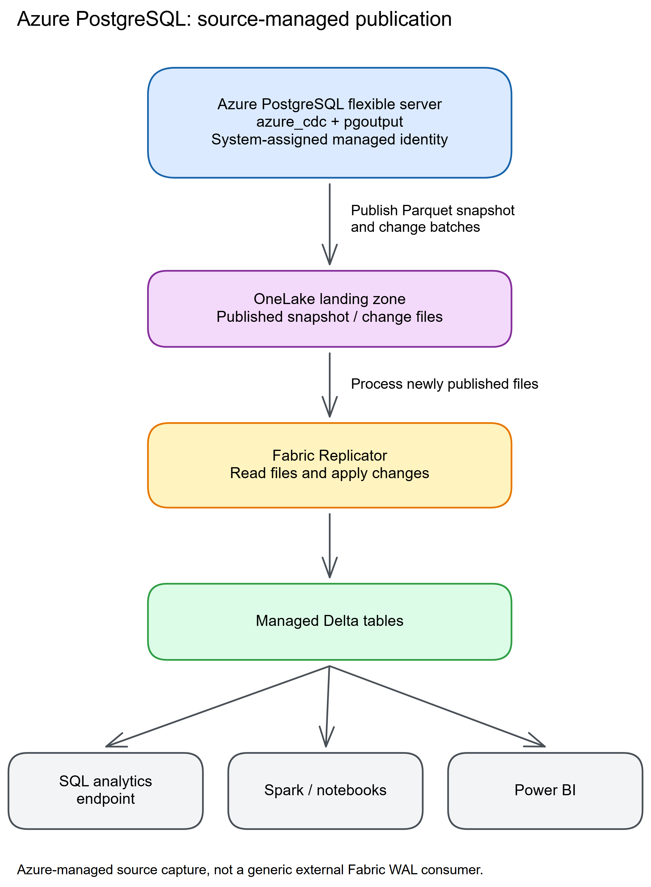
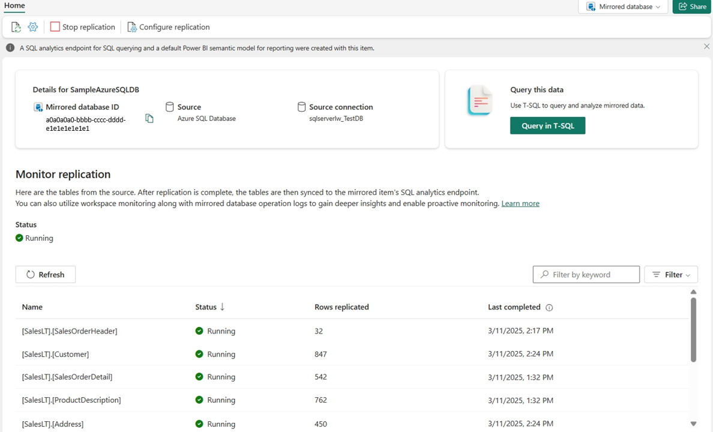

# Chapter 18: PostgreSQL

> **Part 2: Source-Specific Mirroring Guides**
>
> **Purpose:** Use this chapter to configure PostgreSQL logical replication and manage replication slots, WAL retention, connectivity, and data-type compatibility.

**Part index:** [Chapters in Part 2](readme.md)

---

## Overview of the Source System

**PostgreSQL** is an open-source relational database used for web applications, SaaS platforms, and data engineering. This generally available connector supports **Azure Database for PostgreSQL flexible server**, not arbitrary on-premises or self-managed PostgreSQL installations.

---

## Mirroring Type and Architecture

- **Mirroring type**: Database mirroring
- **Method**: Source-managed snapshot and change-batch publication to OneLake
- **CDC mechanism**: The `azure_cdc` extension over PostgreSQL logical decoding (`pgoutput`) and WAL

PostgreSQL natively supports **logical replication** through its Write-Ahead Log (WAL). The Azure-managed `azure_cdc` extension creates an initial snapshot, decodes subsequent changes, and exports Parquet batches to a OneLake landing zone using the server's managed identity. Fabric's Replicator applies those files to Delta tables. This is not a generic external Fabric client directly polling PostgreSQL's WAL. See the [Azure PostgreSQL architecture guide](https://learn.microsoft.com/en-us/azure/postgresql/integration/concepts-fabric-mirroring#architecture).

**Architecture flow:**

[](../assets/diagrams/chapter-18/diagram-01.excalidraw.png)
*Figure 18.1: PostgreSQL mirroring via WAL logical replication*

> **Critical operational risk:** Delayed logical decoding, long-running transactions, or stalled publication can retain WAL and consume source storage. Monitor replication slots and the `azure_cdc` publication, not just Fabric's table status.

---

## Network and Connectivity

| Question | Answer |
|---|---|
| **Data gateway required?** | Not for a permitted public connection. Use a VNet data gateway for private connectivity. The connector documentation does not offer an on-premises data gateway path. |
| **Private endpoint support?** | Yes. A VNet data gateway connects to a server reachable through a private endpoint or hosted inside a virtual network. |
| **Source firewall restrictions?** | Permit the VNet gateway's route to the server. Also preserve the source publishing identity's access to OneLake; a gateway alone does not configure that outbound path. |
| **Fabric workspace outbound protection?** | Supported through [data connection rules](https://learn.microsoft.com/en-us/fabric/security/workspace-outbound-access-protection-mirrored-databases). Explicitly allow the source connection. |

See [Network requirements for PostgreSQL mirroring](https://learn.microsoft.com/en-us/fabric/mirroring/azure-database-postgresql#network-requirements) for the current setup guidance.

---

## Setup Walkthrough

This runbook follows the [Fabric tutorial](https://learn.microsoft.com/en-us/fabric/mirroring/azure-database-postgresql-tutorial), [Azure source-preparation guide](https://learn.microsoft.com/en-us/azure/postgresql/integration/concepts-fabric-mirroring), and [source troubleshooting queries](https://learn.microsoft.com/en-us/fabric/mirroring/azure-database-postgresql-troubleshoot). Official source references were rechecked **8 October 2026**. Perform source SQL in pgAdmin, psql, or the PostgreSQL extension for Visual Studio Code, connected to the **source database**, not the Fabric SQL endpoint.

### 1. Complete the DBA and Fabric preflight

1. Record the Azure resource ID, PostgreSQL version, compute tier, database name, writable-primary hostname, HA/read-replica configuration, region, and network mode.
2. Confirm **Azure Database for PostgreSQL flexible server**, PostgreSQL **14–18**, and a supported non-Burstable tier. On-premises PostgreSQL, a VM, another cloud provider's PostgreSQL, and a read replica do not become native sources by enabling logical replication.
3. Inventory selected regular permanent tables, owners, keys, column types, partitioning, sizes, and write rates. Exclude unsupported views, materialized views, foreign/partitioned tables, and TimescaleDB hypertables.
4. Inventory existing logical-replication slots, WAL senders, extensions, and worker usage. Mirroring adds source workers and consumes **one slot and one WAL sender per mirrored database**, not per table.
5. Obtain a maintenance window for source-server restart, schema/ownership changes, and initial snapshot load. Agree the available source-storage headroom and escalation threshold before enabling a WAL-retaining consumer.
6. Have the Fabric administrator confirm an active capacity and the tenant settings **Service principals can use Fabric APIs** and **Users can access data stored in OneLake with apps external to Fabric**. Check the applicable tenant-setting security-group scope, not only whether a toggle is enabled.
7. Use a workspace **Admin or Member** to create the item. Contributor alone lacks the Reshare permission needed to grant the server identity access during creation.

| Operator / identity | What it must be able to do |
|---|---|
| Azure server administrator | Update the server's managed identity and parameters, prepare selected databases, and restart the server in the approved window. Database login privileges alone do not authorize Azure resource changes. |
| PostgreSQL setup administrator | Connect as a principal in `azure_pg_admin`; create/grant the documented connection role and arrange ownership of the selected tables. |
| Fabric connection role | Authenticate with a PostgreSQL login or mapped Entra role; hold the documented CDC/database permissions **and own the selected tables**. |
| Server system-assigned managed identity (SAMI) | Publish snapshots and batches to OneLake, with Read and Write on the mirrored item. This is separate from the source database login. |

> **Unresolved eligibility difference:** The [limitations page](https://learn.microsoft.com/en-us/fabric/mirroring/azure-database-postgresql-limitations#server-level-limitations), dated 27 February 2026, permits a primary that has read replicas. The [tutorial](https://learn.microsoft.com/en-us/fabric/mirroring/azure-database-postgresql-tutorial#prerequisites), dated 17 November 2025, excludes it. Both require replication from the writable primary. Confirm your primary-with-replicas configuration with Microsoft before deployment; don't delete replicas to make a tutorial checklist pass.

### 2. Prepare the server in Azure and perform the planned restart

1. Open **Azure portal → PostgreSQL flexible server → Fabric Mirroring → Get Started**.
2. If the page reports missing system-assigned identity, follow its link to **Security → Identity**, set **System assigned managed identity: On**, and save. Ensure SAMI is the **primary identity**, as required by the limitations/troubleshooting pages.
3. Return to Fabric Mirroring, select the source database, and select **Prepare**.
4. Review the pending changes: `wal_level = logical`, allowlisting and preloading `azure_cdc`, registration in the selected database, and increased worker resources.
5. Select **Restart** only in the approved maintenance window. Allow the workflow to finish and wait for the page to report that the server is ready.
6. Reconnect after the restart; validate application health as well as database availability.

The [Azure preparation walkthrough](https://learn.microsoft.com/en-us/azure/postgresql/integration/concepts-fabric-mirroring#prerequisites) includes screenshots of **Get Started**, database selection, and the ready state. Use that source-specific UI guide alongside these instructions. Do not manually set the internal mirroring-enabled flag or create your own publication/slot to imitate Azure's preparation workflow.

Run these read-only checks on the source after preparation:

```sql
SHOW wal_level;
SHOW shared_preload_libraries;
SHOW max_worker_processes;
SHOW max_replication_slots;
SHOW max_wal_senders;
SHOW azure.service_principal_id;
SHOW azure.service_principal_tenant_id;
SELECT current_database(), extname, extversion
FROM pg_extension
WHERE extname = 'azure_cdc';

SELECT name, setting, pending_restart
FROM pg_settings
WHERE name IN ('wal_level', 'shared_preload_libraries',
               'max_worker_processes', 'max_replication_slots', 'max_wal_senders')
ORDER BY name;
```

Expect logical WAL, preloaded `azure_cdc`, sufficient workers/slots/senders, the configured SAMI principal/tenant, and an extension row in **each selected database**. Resolve any `pending_restart = true` in the approved window. Preloading an extension at server startup is not the same as registering it in the database. If the extension row is absent or later checks report `schema "azure_cdc" does not exist`, first confirm the database name and completed Azure **Prepare** workflow; do not create a same-named schema or install an unrelated CDC extension.

The Fabric tutorial budgets **three additional `max_worker_processes` per mirrored database**. The Azure guide also describes snapshot workers and per-mirror processing, while the prerequisite checker can report its own required threshold. Plan against **all** existing workload workers and the actual checker output, not a hard-coded total copied from an example.

The Azure guide describes three mirrored databases by default, expandable to six, but uses inconsistent parameter naming in its narrative and parameter list (`max_mirrored_databases` versus `azure_cdc.max_fabric_mirrors`). Verify the actual exposed server parameter and current entitlement before increasing the limit. Never guess an internal parameter name.

**Budget the snapshot as well as steady-state workers.** The [Azure parameter list](https://learn.microsoft.com/en-us/azure/postgresql/integration/concepts-fabric-mirroring#parameters) documents `azure_cdc.max_snapshot_workers` (default 3), `azure_cdc.snapshot_buffer_size` (default 1,000 MB per worker), and `azure_cdc.snapshot_export_timeout` (default 180 minutes, after which snapshot export restarts). Record the actual values and `max_parallel_workers`; the documented buffer calculation is `snapshot_buffer_size × max_snapshot_workers`. Increasing parallelism can increase memory pressure. Size the source and snapshot window first rather than assuming that repeated snapshot restarts mean bad credentials or increasing worker counts indiscriminately.

### 3. Create the Fabric connection role and arrange ownership

For a **local PostgreSQL login**, connect to the intended source database as an `azure_pg_admin` member and adapt the documented tutorial script:

```sql
CREATE ROLE fabric_repl CREATEDB CREATEROLE LOGIN REPLICATION PASSWORD '<unique-secret-from-approved-vault>';
GRANT azure_cdc_admin TO fabric_repl;
GRANT CREATE ON DATABASE <database_to_mirror> TO fabric_repl;
```

Replace the database placeholder with its correctly quoted identifier before execution. Supply a unique password through approved tooling; do not save a real password in a shared script, shell history, or this book. If the role already exists, inspect and reconcile it rather than rerunning `CREATE ROLE`.

For **Organizational account authentication**:

1. Configure the server's Entra authentication and have its Entra administrator map the intended Entra user/group to a PostgreSQL role using the linked [Entra role-management procedure](https://learn.microsoft.com/en-us/azure/postgresql/security/security-manage-entra-users#manage-microsoft-entra-roles-using-sql). Verify the mapped object ID and tenant with `pg_catalog.pgaadauth_list_principals(false)`; a similarly named Entra object is not interchangeable.
2. Grant that mapped role `azure_cdc_admin` and `CREATE` on the selected database, as shown in the Fabric tutorial's Entra branch.
3. Sign into Fabric with the mapped identity; merely adding an Azure IAM assignment does not create a database role.

The [limitations page's generic permission list](https://learn.microsoft.com/en-us/fabric/mirroring/azure-database-postgresql-limitations#permissions-in-the-source-database) also lists `CREATEDB`, `CREATEROLE`, `LOGIN`, and `REPLICATION`, whereas the tutorial's Entra branch explicitly grants only `azure_cdc_admin` and database `CREATE` after mapping. Preserve this distinction: validate the mapped role with the readiness checks and resolve any missing privilege with the DBA/Microsoft rather than automatically promoting every Entra user to an administrator.

For **either authentication branch**, the connection role must own every selected table. Have the DBA approve the ownership change and check application/migration jobs that rely on the old owner. The documented ownership pattern is:

```sql
ALTER TABLE <schema_name>.<table_name> OWNER TO fabric_repl;
```

Apply it only to the approved table inventory. The tutorial notes that the new owner may first require all privileges on the `public` schema; where that applies, the DBA can use:

```sql
GRANT ALL PRIVILEGES ON SCHEMA public TO fabric_repl;
```

This is a schema-wide privilege change, not a harmless connectivity fix. For other schemas, assess their permissions explicitly. A blanket `SELECT`, `REPLICATION` alone, or a server-level Azure role cannot replace table ownership.

Before creating the Fabric connection, open a **fresh session as its exact database role**, without an administrator's `SET ROLE` workaround, and check effective access:

```sql
SELECT current_database(), session_user, current_user,
       pg_has_role(current_user, 'azure_cdc_admin', 'USAGE') AS cdc_admin_effective,
       has_database_privilege(current_user, current_database(), 'CONNECT') AS can_connect,
       has_database_privilege(current_user, current_database(), 'CREATE') AS can_create;

SELECT has_schema_privilege(current_user, '<schema_name>', 'USAGE') AS can_use_schema,
       has_table_privilege(current_user, '<schema_name>.<table_name>', 'SELECT') AS can_read_table;
```

Replace the schema/table strings with each approved object's correctly quoted name. In a hardened database, default `PUBLIC` privileges may have been revoked: have the DBA grant missing database `CONNECT`, schema `USAGE`, or table `SELECT` specifically where needed. The ownership-transfer operator must be authorized to alter the table and able to `SET ROLE` to the new owner; the new owner also needs `CREATE` on the containing schema. See [PostgreSQL `ALTER TABLE` permissions](https://www.postgresql.org/docs/18/sql-altertable.html). These checks complement, rather than replace, the connector's ownership/eligibility checks below.

### 4. Validate replica identity and table eligibility

1. Prefer a primary key. Otherwise use a supported **non-nullable, nonpartial unique index**; a nullable unique index can pass superficial checks but fail during replication.
2. Where no suitable key/index exists, obtain approval for full replica identity. The source-side statement, with your actual schema and table, is:

```sql
ALTER TABLE <schema_name>.<table_name> REPLICA IDENTITY FULL;
```

3. Schedule this table change appropriately and measure WAL growth and UPDATE/DELETE overhead. Full identity is not a free substitute for a key on a high-write, wide table.
4. Reconnect **as the intended Fabric connection role**, in the prepared database, and run the documented readiness/eligibility checks:

```sql
SELECT * FROM azure_cdc.check_prerequisites();
SELECT * FROM azure_cdc.get_all_tables_mirror_status();
```

5. Resolve `USER_NOT_CDC_ADMIN`, `NO_CREATE_PRIVILEGE_ON_DATABASE`, `NOT_TABLE_OWNER`, `SERVER_IN_RECOVERY`, worker shortages, and table errors before entering Fabric. Record accepted warnings with the data owner.
6. Because the published type lists disagree, test the actual source component's eligibility and representative values. In particular, explicitly verify decimal precision/scale, fractional unconstrained `numeric`, timezone values, JSON/XML, and any key columns with unusual types.

The general-availability component rollout is maintained by Azure. The tutorial says existing servers receive component updates through maintenance; disabling and re-enabling mirroring is **not** required merely to receive an update.

### 5. Verify connectivity without weakening the source boundary

1. For a permitted public path, confirm server DNS, PostgreSQL TLS connectivity, and the Azure firewall policy used by Fabric. The tutorial refers to allowing Azure services; that is a broad trust choice and needs the network owner's approval.
2. If public access is disabled or not permitted, provision a **VNet data gateway** with routing and DNS to the server's private endpoint or VNet-integrated address. Use the [gateway creation prerequisites](https://learn.microsoft.com/en-us/data-integration/vnet/create-data-gateways), including subscription/provider, delegated-subnet, capacity, and gateway-administration requirements.
   - Check the gateway's supported VNet region and capacity separately from PostgreSQL mirroring availability; cross-tenant gateway creation is unsupported.
   - Have the subscription administrator register `Microsoft.PowerPlatform`. Give the gateway creator the documented `Microsoft.Network/virtualNetworks/subnets/join/action` permission.
   - Use a dedicated IPv4 subnet delegated to `Microsoft.PowerPlatform/vnetaccesslinks`, with enough addresses for the gateway members and their reserved addresses. Do not put the gateway in the private-endpoint subnet or block communication between its members.
   - In **Settings → Manage connections and gateways → Virtual network data gateways → New**, select the capacity, subscription, resource group, VNet, and delegated subnet, then save. Arrange gateway access for the Fabric connection creator; creating a workspace item does not by itself grant gateway administration.
3. Check DNS and TCP **5432** from the gateway's network, not only from the DBA laptop. A private endpoint without the associated private DNS/routing is insufficient.
4. Keep **Use encrypted connection** enabled. Do not solve a certificate/authentication problem by disabling encryption.
5. Separately preserve the server SAMI's ability to publish to OneLake. A working gateway connection does not prove the publishing identity has target permissions.
6. If workspace outbound protection is enabled, have the Fabric administrator create the required data connection rule.

### 6. Create the Fabric connection and select tables

1. In the approved workspace, choose **New item → Mirrored Azure Database for PostgreSQL**.
2. Choose **Azure Database for PostgreSQL** under new sources, or inspect an existing connection before reusing it.
3. Enter **Server** as `<server-name>.postgres.database.azure.com` and **Database** as the actual PostgreSQL **database name**, not the server's resource name.
4. Set the connection name, choose the VNet gateway for the private path, and select **Basic** or **Organizational account** using the role prepared above.
5. Keep encryption selected. The tutorial says to leave the separate **This connection can be used with on-premises data gateway and VNET data gateway** reuse checkbox unselected; it is not the gateway selector.
6. Select **Connect**, then inspect the table list and any warnings.
7. For a controlled first deployment, disable **Mirror all data** and select the approved schemas/tables explicitly.
8. If choosing **Mirror all data**, approve automatic onboarding of new eligible tables and the 1,000-table limit. Above that limit, the limitations page says only the first 1,000 in schema/table alphabetical order are mirrored.
9. Select **Mirror database** and open **Monitor replication**. Wait for initial-copy completion for every selected table; the tutorial's two-to-five-minute first check is not a snapshot-duration guarantee.


*Figure 18.2 — Microsoft documentation screenshot, unchanged. This shared monitoring example shows an Azure SQL source, not PostgreSQL setup fields; the PostgreSQL tutorial links to this monitoring procedure. Source: [PostgreSQL tutorial](https://learn.microsoft.com/en-us/fabric/mirroring/azure-database-postgresql-tutorial#monitor-fabric-mirroring) and [monitoring guide](https://learn.microsoft.com/en-us/fabric/mirroring/monitor). [Original image](https://raw.githubusercontent.com/MicrosoftDocs/fabric-docs/main/docs/mirroring/media/monitor/monitor-mirrored-database.png). Credit: Microsoft; [CC BY 4.0](https://creativecommons.org/licenses/by/4.0/).*

The current Fabric PostgreSQL tutorial contains no source-specific setup screenshot. The illustration above is deliberately labeled as shared UI, rather than presenting another connector's connection dialog as PostgreSQL.

### 7. Validate the snapshot and a disposable row

1. Before table selection, arrange an approved permanent test table owned by the connection role, with a primary key and supported scalar columns. Alternatively, use a designated disposable-row range in an existing selected test table.
2. Record a baseline row before starting the mirror and confirm it appears after the initial snapshot. Compare bounded key ranges or stable counts in a quiet interval rather than two moving production totals.
3. Using an authorized **source application/SQL connection**, insert one uniquely identified disposable row and commit it. Note its ID and commit time.
4. Query that ID in the **Fabric SQL analytics endpoint**. Wait for the inserted values to appear and record the observation time.
5. Update only that test row's marker column on the source and commit. Wait until the new value appears in Fabric before doing the next step.
6. Delete only that same test row by its primary key on the source and commit. Confirm its absence in Fabric. Do not use `TRUNCATE`, table deletion, or rolled-back transactions as a delete test.
7. Check decimal fractions, timestamps, nulls, and all business-required columns separately. “Rows replicated” is cumulative change activity, including updates/deletes, not the current source row count.

A successful insert alone does not validate UPDATE/DELETE identity. The SQL endpoint is read-only; all test mutations must occur on the source with explicit approval.

### 8. Establish monitoring and handoff before production

Record server/database/item/connection IDs, selected tables, role ownership changes, identity object ID, worker/slot budgets, baseline storage, and the canary results.

Assign a source DBA for worker/WAL/storage alerts and ownership-sensitive application migrations, a connection owner for password or Entra-credential renewal, and a Fabric operator for capacity, gateway/connection access, and replication alerts. Keep these separate from the SAMI lifecycle owner; rotating the database credential does not require replacing the server identity.

Run the following **documented read-only diagnostics on the source** with the appropriate monitoring permissions:

```sql
SELECT * FROM azure_cdc.get_health_status('', '');
SELECT * FROM azure_cdc.tracked_publications;
SELECT * FROM azure_cdc.tracked_batches;
SELECT * FROM pg_stat_activity WHERE state = 'idle in transaction';
SELECT * FROM pg_replication_slots;
```

The empty-argument health call returns system-wide errors only. For publication/table errors, obtain the actual publication name from the views and use:

```sql
SELECT * FROM azure_cdc.get_health_status('<source_database>', '<publication_name>');
```

- Alert on persistent table failures, stale changes despite confirmed source writes, source storage growth, long transactions, and stalled slot/publication progress.
- Keep the server SAMI's **Read and Write** permissions on the mirrored item. Do not toggle SAMI off/on; that changes the identity and can break publication.
- Recreate source access controls in Fabric; source table ownership/security is not replicated as analytical authorization.
- Document the capacity-pause procedure, reseed budget, HA/version behavior, PITR reconfiguration, and major-version-upgrade plan.
- Never drop a managed slot or delete CDC metadata as a casual storage fix. Resolve long transactions/resource or permission errors with the DBA; plan a controlled reseed only when the diagnosis and recovery procedure require it.

**Retention is not a configurable number of Fabric outage days.** Inspect `SHOW max_slot_wal_keep_size;` and the [Azure parameter reference for the deployed PostgreSQL version](https://learn.microsoft.com/en-us/azure/postgresql/parameters/parameters-replication-sending-servers). It documents `-1` as read-only, not a tunable Fabric retention duration. Unbounded slot retention is still bounded by available disk. The [Azure logical-replication operating guidance](https://learn.microsoft.com/en-us/azure/postgresql/configure-maintain/concepts-logical#monitor) also warns about transaction-ID wraparound and service removal of unused slots under storage pressure. Alert on **Storage Used** and **Maximum Used Transaction IDs**, budget peak WAL generation across the expected outage, and treat a lost required slot as a recovery/reseed incident—not a guarantee of incremental catch-up. Do not run that general guide's sample `pg_drop_replication_slot` against a Fabric-managed slot.

---

## Nuances and Limitations

| Topic | Detail |
|---|---|
| **Primary key or row identity** | A primary key or non-nullable, nonpartial unique index is preferred. Tables with neither require `REPLICA IDENTITY FULL`; nullable or partial unique indexes are not suitable row identities. |
| **Logical replication slots** | One slot is consumed per mirrored database, not per connection credential. Monitor slot lag and retained WAL. |
| **Scale** | Up to 1,000 tables per mirrored database and one mirrored item per source database. The Azure architecture guide describes three mirrored databases per server by default, expandable to six with appropriate resource settings; the FAQ still says one mirror per server. Confirm eligibility for multiple databases. |
| **Data types** | The limitations and troubleshooting pages disagree on several types, including JSON, XML, network, range, interval, and geometric types. Run the eligibility checks below and validate actual values before relying on them. |
| **Numeric precision** | Values exceeding decimal precision 38 can become `NULL`. Troubleshooting also documents unconstrained numeric values mapping to `Decimal128(38,0)`, which requires particular care for fractional values. |
| **Table types** | Views, materialized views, foreign tables, partitioned tables, and TimescaleDB hypertables are not supported. General PostgreSQL logical-replication capabilities do not override these connector limits. |
| **Sequences** | Sequences (auto-increment values) are replicated as column values; sequence state itself is not replicated. |
| **DDL changes** | The limitations page requires stop/start for table changes, while troubleshooting describes partial add, remove, and rename support plus primary-key changes. Treat schema changes as a planned, validated operation rather than promising transparent propagation. `TRUNCATE` is unsupported. |
| **Column names** | The limitations page permits special characters, while troubleshooting lists them as unsupported. Validate affected tables before onboarding. |
| **HA and recovery** | Transparent HA failover requires PostgreSQL 17 or later; earlier versions require mirroring to be re-established. PITR requires configuration on the restored server. Disable mirroring before a major-version upgrade and re-enable afterwards. |
| **Restart** | Stop/start reseeds all tables. After a capacity pause, follow the documented manual restart procedure rather than assuming automatic catch-up. |

The type and DDL discrepancies above remain unresolved between the [limitations](https://learn.microsoft.com/en-us/fabric/mirroring/azure-database-postgresql-limitations) and [troubleshooting](https://learn.microsoft.com/en-us/fabric/mirroring/azure-database-postgresql-troubleshoot) pages. The Azure architecture guide also lists the broader type support. Confirm source component behaviour with Microsoft support when a workload depends on these differences.

---

## Source System Impact

- **WAL slot**: Each active replication slot holds back WAL cleanup. On high-write databases, a lagging replication slot can cause significant disk consumption.
- **Processes**: Each mirror uses a WAL sender and Azure CDC workers; initial snapshots need additional CPU, memory, and I/O.
- **CPU/I/O**: Measure initial-load and steady-state overhead. Full row identity and high update/delete rates can substantially increase work and log volume.

**Important**: Do not drop a managed replication slot as a routine fix. Diagnose publication health, transactions, permissions, and storage pressure first. Follow the [PostgreSQL troubleshooting guide](https://learn.microsoft.com/en-us/fabric/mirroring/azure-database-postgresql-troubleshoot) for controlled stop/restart or orphaned-publication cleanup, accounting for the resulting reseed.

---

## Troubleshooting

| Symptom | Likely Cause | Resolution |
|---|---|---|
| `wal_level` error | `wal_level` not set to `logical` | Update the server parameter and restart PostgreSQL |
| Setup reports Internal error | Missing `azure_cdc` prerequisites, database permissions, or table ownership | Run `azure_cdc.check_prerequisites()` and `azure_cdc.get_all_tables_mirror_status()` |
| UPDATE/DELETE not captured | Invalid row identity or stalled publication | Verify keys or full row identity and inspect `azure_cdc.tracked_publications` and `azure_cdc.tracked_batches` |
| WAL disk usage growing | Slot lag or a long-running transaction | Inspect `pg_replication_slots`, `pg_stat_activity`, and `azure_cdc.get_health_status('', '')`; resolve the cause before a controlled restart |
| Data type error | Source component rejects a type or value | Check table eligibility and the conflicting documentation; use a compatible physical source table if needed, not a view |

---

## Public issues and common pitfalls

**Evidence checked 8 October 2026.** Research began with Reddit-targeted searches, but direct threads returned a network-security/login block. The existing chapter's [Flexible Server mirroring discussion link](https://www.reddit.com/r/MicrosoftFabric/comments/1rhtzad/fabric_mirroring_postgresql_flexible_server/) is retained as an **unverified lead**, not a verified report: its body, publication date, and replies could not be independently confirmed. No usable source-specific Reddit report body/date was verified in this review; search snippets suggesting other incidents are not evidence of a cause or fix.

The previous chapter attributed ownership/partitioning concerns and informal roadmap comments to that discussion. Do not treat those unverified comments as shipped capability or release dates. The current tutorial/limitations still require ownership, and the Azure guide documents resource-dependent database limits. The following are **documented pitfalls**, not claims about community incident frequency.

| Pitfall | Documented first response | Source |
|---|---|---|
| Connection tests but creation returns `Internal error` | Run prerequisites and table eligibility as the connection role; check ownership and database/schema privileges, not just password validity. | [Tutorial role requirements](https://learn.microsoft.com/en-us/fabric/mirroring/azure-database-postgresql-tutorial#database-role-for-fabric-mirroring). |
| Readiness queries fail because `azure_cdc` is absent | Confirm the exact database, extension registration, and completed Prepare/restart workflow. A manually created schema is not the managed extension. | [Azure preparation workflow](https://learn.microsoft.com/en-us/azure/postgresql/integration/concepts-fabric-mirroring#prerequisites). |
| Primary-with-read-replicas or multiple-database eligibility is unclear | Use the writable primary and confirm the conflicting tutorial/limitations/FAQ statements for the deployed server. Do not drop replicas or promise an unverified scale limit. | [Limitations](https://learn.microsoft.com/en-us/fabric/mirroring/azure-database-postgresql-limitations); [Azure preparation and parameters](https://learn.microsoft.com/en-us/azure/postgresql/integration/concepts-fabric-mirroring). |
| UPDATE/DELETE fails after an apparently successful snapshot | Inspect `HAS_UNIQUE_INDEX` / full-identity warnings and key nullability; validate with committed, disposable-row changes. | [Table-selection diagnostics](https://learn.microsoft.com/en-us/fabric/mirroring/azure-database-postgresql-troubleshoot#troubleshoot-error--warning-messages-during-table-selection-for-mirroring). |
| WAL storage grows or initial snapshot stalls | Inspect active/idle transactions, tracked batches, slots, workers, and snapshot errors. Do not delete the slot to hide the symptom. | [Troubleshooting SQL](https://learn.microsoft.com/en-us/fabric/mirroring/azure-database-postgresql-troubleshoot#sql-queries-for-troubleshooting). |
| Fabric capacity resumes but replication does not | Follow the documented manual stop/start recovery, with awareness that starting reseeds all tables. | [Capacity changes](https://learn.microsoft.com/en-us/fabric/mirroring/azure-database-postgresql-troubleshoot#changes-to-fabric-capacity-or-workspace). |
| OneLake upload permission denied | Verify the existing server SAMI and restore its item-level Read/Write through Manage Permissions; don't create a different identity. | [SAMI permissions](https://learn.microsoft.com/en-us/fabric/mirroring/azure-database-postgresql-troubleshoot#sami-permissions). |
| JSON/type/name/DDL behavior contradicts a guide | Record the source component/checker results and validate representative data; escalate the documented discrepancies rather than assume a universal workaround. | [Limitations](https://learn.microsoft.com/en-us/fabric/mirroring/azure-database-postgresql-limitations); [troubleshooting](https://learn.microsoft.com/en-us/fabric/mirroring/azure-database-postgresql-troubleshoot). |

Preserve sanitized errors, source version, component readiness, publication state, item ID, timestamps, and the last successful canary for a support case. Avoid sharing query text containing customer data or credentials in public forums.

---

## Summary

PostgreSQL mirroring leverages the database's native logical replication framework, providing reliable near-real-time CDC. The primary operational risks are replication slot lag (and its impact on WAL retention) and data type compatibility. Both require ongoing monitoring in production environments. See the current [PostgreSQL mirroring overview](https://learn.microsoft.com/en-us/fabric/mirroring/azure-database-postgresql), [tutorial](https://learn.microsoft.com/en-us/fabric/mirroring/azure-database-postgresql-tutorial), [security guidance](https://learn.microsoft.com/en-us/fabric/mirroring/azure-database-postgresql-how-to-data-security), [limitations](https://learn.microsoft.com/en-us/fabric/mirroring/azure-database-postgresql-limitations), and [FAQ](https://learn.microsoft.com/en-us/fabric/mirroring/azure-database-postgresql-mirroring-faq).

**Contents:** [Table of Contents](../index.md) | **Previous:** [Chapter 17: Oracle](chapter-17.md) | **Next:** [Chapter 19: MySQL](chapter-19.md)
