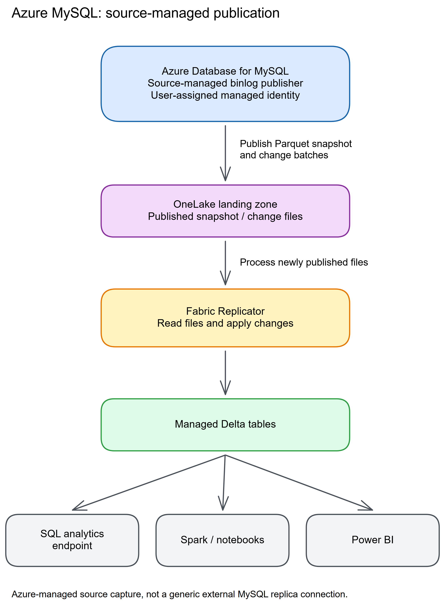

# Chapter 19: MySQL

> **Part 2: Source-Specific Mirroring Guides**
>
> **Purpose:** Use this chapter to configure MySQL binary-log replication and plan primary keys, binlog settings, retention, connectivity, and source impact.

**Part index:** [Chapters in Part 2](readme.md)

---

## Overview of the Source System

**MySQL** is an open-source relational database used for web applications, e-commerce platforms, and SaaS products. This Fabric connector is in **preview** and supports **Azure Database for MySQL**, not arbitrary self-managed MySQL servers.

---

## Mirroring Type and Architecture

- **Mirroring type**: Database mirroring
- **Method**: Source-managed snapshot and change-batch publication to OneLake
- **CDC mechanism**: MySQL binary log (binlog) replication

MySQL records row changes in its **binary log (binlog)**. Azure MySQL background processing exports an initial snapshot and subsequent change batches as Parquet files to a OneLake landing zone. Fabric's Replicator converts and applies them to Delta tables. This is not a generic external MySQL replica connection. See the [Azure MySQL architecture guide](https://learn.microsoft.com/en-us/azure/mysql/integration/fabric-mirroring-mysql#architecture).

**Architecture flow:**

[](../assets/diagrams/chapter-19/diagram-01.excalidraw.png)
*Figure 19.1: MySQL mirroring via binary log replication*

---

## Network and Connectivity

| Question | Answer |
|---|---|
| **Data gateway required?** | The tutorial requires **Data gateway: None** and leaves gateway reuse disabled. VNet data gateways are explicitly unsupported; an on-premises gateway path is not documented. |
| **Private endpoint support?** | Public access and Private Link/private endpoint connectivity are supported. VNet-integrated Azure MySQL servers are not supported. These are different deployment modes. |
| **Source network restrictions?** | Do not substitute a gateway for the supported Private Link path. Validate both the source connection and the source-to-OneLake publishing path. |
| **Fabric workspace outbound protection?** | MySQL is supported through [data connection rules](https://learn.microsoft.com/en-us/fabric/security/workspace-outbound-access-protection-mirrored-databases). This does not add support for VNet-integrated servers or VNet gateways. |

See [Network requirements for MySQL mirroring](https://learn.microsoft.com/en-us/fabric/mirroring/azure-database-mysql#network-requirements) for the current setup guidance.

---

## Setup Walkthrough

This runbook follows the [Fabric preview tutorial](https://learn.microsoft.com/en-us/fabric/mirroring/azure-database-mysql-tutorial), [Azure source-enablement guide](https://learn.microsoft.com/en-us/azure/mysql/integration/fabric-mirroring-mysql), and [troubleshooting reference](https://learn.microsoft.com/en-us/fabric/mirroring/azure-database-mysql-troubleshoot). Official source references were rechecked **8 October 2026**. Perform the first deployment against a recoverable test database, not by changing a production server's availability or authentication model to satisfy a demo.

### 1. Approve the supported server, source scope, and identities

1. In **Azure portal → Azure Database for MySQL → Overview**, record the server resource ID, endpoint, version, tier, region, availability configuration, network mode, and database name.
2. Confirm a supported **Azure Database for MySQL flexible server running 8.0.x, starting at 8.0.21**. MySQL 5.7 and 8.4 are not supported by the current preview.
3. Confirm non-Burstable compute, no HA configuration, no custom port, and a writable source rather than a read replica. The tutorial also excludes a primary that has a read replica.
4. Do not assume generic MySQL, MariaDB, Amazon RDS, a VM, or on-premises MySQL can use this connector. A generic binlog reader or an open-mirroring publisher is a different integration.
5. Choose **one database per server**, with up to **1,000 tables**. Do not choose `fabric_info`, which is reserved for the service.
6. Approve a fixed table list and the initial snapshot window. The preview limitations say tables cannot be added or removed after creation; settle scope before starting.
7. Inventory primary keys, data types, table sizes, long transactions, binlog/storage headroom, existing GTID consumers, and applications using Entra-only authentication.
8. Arrange a server administrator for database grants and an Azure administrator authorized to update server parameters and attach/create the publishing identity.

| Identity / operator | Required responsibility |
|---|---|
| MySQL administrator | Create/reconcile the connection user and grant the documented privileges on the selected database, `fabric_info`, and `mysql`. This requires authority to grant those privileges, not just read access. |
| Azure administrator | Enable Fabric Mirroring, change approved server parameters, and select/assign a UAMI. Existing identity assignment requires permission to assign that identity; creating one requires identity-creation permission as well. |
| Fabric connection user | **Basic MySQL authentication**, with the database permissions below. Neither Entra authentication nor an account configured as Entra-only is supported for this connection. |
| User-assigned managed identity | Writes snapshots/change batches to OneLake; it is not the username/password supplied to MySQL. Preserve its Read and Write permissions on the mirrored item. |
| Fabric creator / tenant administrator | Active capacity, workspace Admin or Member, and the two required tenant settings. Contributor alone lacks the Reshare permission used during identity provisioning. |

Have the tenant administrator enable **Service principals can use Fabric APIs** and **Users can access data stored in OneLake with apps external to Fabric**, including the appropriate scope for the participating identity.

> **Documentation discrepancies:** The [Azure setup guide](https://learn.microsoft.com/en-us/azure/mysql/integration/fabric-mirroring-mysql) names General Purpose and Business-Critical tiers, while the [Fabric overview](https://learn.microsoft.com/en-us/fabric/mirroring/azure-database-mysql#compute-tier-support) says General Purpose and Memory Optimized. Both exclude Burstable. The [FAQ](https://learn.microsoft.com/en-us/fabric/mirroring/azure-database-mysql-mirroring-faq) mentions a system-assigned identity; the explicit setup and troubleshooting procedures require a **UAMI**. Follow the UAMI procedure and confirm the actual higher-tier eligibility for your server.

### 2. Inspect binlogs and plan parameter changes

Connect to the **source MySQL server** using MySQL Workbench, the MySQL client, or another approved SQL client, as the server administrator. These are read-only configuration checks:

```sql
SHOW GLOBAL VARIABLES LIKE 'log_bin';
SHOW GLOBAL VARIABLES LIKE 'binlog_format';
SHOW GLOBAL VARIABLES LIKE 'binlog_row_image';
SHOW GLOBAL VARIABLES LIKE 'gtid_mode';
SHOW GLOBAL VARIABLES LIKE 'aad_auth_only';
SHOW GLOBAL VARIABLES LIKE 'binlog_expire_logs_seconds';
SHOW GLOBAL VARIABLES LIKE 'innodb_flush_log_at_trx_commit';
```

Use **global** values to inspect the active server configuration; unqualified `SHOW VARIABLES` reports session values where available. For session-scoped settings such as `binlog_row_image`, also check a fresh application/writer session after changing the global value. Existing pooled connections can retain their old session value; arrange an approved reconnect rather than assuming one administrator's new session proves all writers use a supported row image. See [MySQL system-variable scope](https://dev.mysql.com/doc/refman/8.0/en/using-system-variables.html).

Compare the results with the current source setup and troubleshooting guides:

| Parameter | Required / recommended value | Action before mirroring |
|---|---|---|
| `log_bin` | `ON` | Azure Flexible Server normally always enables binary logging. If not, confirm the deployment and source error rather than editing a self-managed `my.cnf`. |
| `binlog_format` | `ROW` | Azure's server-parameter guide says Flexible Server uses row logging. A different observed value requires investigation before proceeding. |
| `binlog_row_image` | `FULL` or `NOBLOB` | `MINIMAL` is unsupported. Set an approved supported value in Azure **Settings → Server parameters**. |
| `gtid_mode` | `OFF` | Required by mirroring troubleshooting. Do not disable GTID casually if another integration depends on it; treat that as an architecture conflict. |
| `aad_auth_only` | `OFF` | Basic MySQL authentication must be allowed. Obtain approval before changing an Entra-only security policy. |
| `innodb_flush_log_at_trx_commit` | `1` recommended | The Azure mirroring guide recommends this for durability; it is not listed as an additional Fabric connection credential or grant. |

Save any approved changes through **Azure Server parameters**, not unsupported global SQL changes to managed internals. The [server-parameter guide](https://learn.microsoft.com/en-us/azure/mysql/flexible-server/concepts-server-parameters) distinguishes dynamic and static parameters:

1. Check the portal's restart requirement for every changed parameter.
2. If a static setting changes, schedule and perform the required server restart.
3. Reconnect and rerun the checks after saving/restarting. A successful configuration write does not prove a static change is active.
4. Validate application authentication and existing replication consumers before continuing.

**Retention is an operating decision, not a magic Fabric setting.** The [documented `binlog_expire_logs_seconds` behavior](https://learn.microsoft.com/en-us/azure/mysql/flexible-server/concepts-server-parameters#binlog_expire_logs_seconds) says:

- The Azure default of **0** allows deletion once the service's handle is freed; do not interpret it as “retain forever.”
- A positive value retains logs for the configured number of seconds and can increase storage charges.
- With **accelerated logs enabled**, this parameter is ignored; a recorded value is not proof that it controls retention.
- Managed backup/replica log handling is controlled internally. The mirroring guides do not specify a universal mandatory retention duration or guaranteed maximum catch-up outage.

Record the effective retention behavior, accelerated-logs status, storage alarm thresholds, expected write volume, and recovery window with the DBA. Size headroom for the initial snapshot and outages. Do not blindly copy an external data-out-replication retention recipe, purge binlogs manually, or confuse backup retention with mirroring's recoverable position.

### 3. Enable the source publisher and assign its UAMI

1. Open **Azure portal → MySQL server → Settings → Fabric Mirroring (preview)**.
2. Review the server prerequisites shown on that page.
3. Select **Enable Fabric Mirroring**.
4. Select an approved existing **user-assigned managed identity**, or create a dedicated one through the administrator's approved process.
5. Save and wait for successful enablement. Record the UAMI resource ID and principal/object ID; these are useful when diagnosing OneLake permission failures.
6. If enablement fails, resolve the specific prerequisite error. Do not bypass it by creating or editing `fabric_info` tables yourself.

The [Azure enablement walkthrough](https://learn.microsoft.com/en-us/azure/mysql/integration/fabric-mirroring-mysql#enable-fabric-mirroring-in-the-azure-portal) shows the Settings entry, prerequisite view, and identity/save screen. Its identity is the publishing identity, separate from Basic authentication in the next step.

### 4. Provision the MySQL connection account with the documented grants

After source enablement, connect as the source server administrator and create or reconcile a dedicated connection account. The following preserves the Azure guide's grant scopes, with example names replaced:

```sql
CREATE USER 'fabric_repl'@'%' IDENTIFIED BY '<unique-secret-from-approved-vault>';
GRANT CREATE TEMPORARY TABLES, SELECT, CREATE ROUTINE, ALTER ROUTINE, EXECUTE
ON source_db.* TO 'fabric_repl'@'%';
GRANT SELECT, EXECUTE ON fabric_info.* TO 'fabric_repl'@'%';
GRANT EXECUTE ON mysql.* TO 'fabric_repl'@'%';
```

Replace `source_db` with the exact database identifier and supply a unique password using approved secret handling. If the user already exists, inspect it rather than running `CREATE USER` again. The `%` host matches the published example; review host restrictions and network controls with the DBA instead of broadening them inadvertently.

1. Keep `SELECT` on all selected source tables and the temporary-table/routine privileges on the selected database.
2. Include **both** service-schema grants. A user that can browse tables but cannot execute the required routines is not ready.
3. Inspect the grants in your administration client, then open a **fresh Basic-authentication session as the connection account** and run the read-only checks below. `CURRENT_USER()` identifies the matched MySQL `user@host`; `USER()` identifies the presented login and client host. They need not be the same.
4. Verify the required privileges and TLS in that fresh session. If you use MySQL roles, inspect the applicable role grants and ensure they are active by default at login; an administrator's session-only `SET ROLE` test does not configure Fabric's session. `SHOW GRANTS` can show role assignments without expanding their privileges.
5. Store the password in the Fabric connection only; record the owner and rotation process without embedding a reusable secret.

```sql
SELECT USER() AS presented_login, CURRENT_USER() AS matched_account,
       CURRENT_ROLE() AS active_roles;
SHOW GRANTS FOR CURRENT_USER;
SHOW SESSION STATUS LIKE 'Ssl_cipher';
```

Compare the output to **all three grant scopes** above and verify that the TLS cipher is populated. For role-based grants, the DBA can use the [MySQL `SHOW GRANTS ... USING` procedure](https://dev.mysql.com/doc/refman/8.0/en/show-grants.html) to expand the specific granted roles. Do not publish credential or connection output containing sensitive identifiers.

These are the [Azure mirroring-specific permissions](https://learn.microsoft.com/en-us/azure/mysql/integration/fabric-mirroring-mysql#prerequisites). Do not substitute a generic `REPLICATION SLAVE`/`REPLICATION CLIENT` recipe, add `SUPER`, or grant all privileges on every database as a trial-and-error fix.

### 5. Finalize keys, columns, and the network path

1. Confirm an actual **primary key on every selected table**. A unique index alone is not the documented substitute here. Add or correct keys only through approved source-schema change procedures before mirroring.
2. Inventory `TINYTEXT`, `TEXT`, `MEDIUMTEXT`, `LONGTEXT`, `TINYBLOB`, `BLOB`, `MEDIUMBLOB`, and `LONGBLOB` columns: they are **excluded**, not merely truncated at a maximum size.
3. Check all remaining types against the [supported list](https://learn.microsoft.com/en-us/fabric/mirroring/azure-database-mysql-troubleshoot#supported-data-types). Don't infer JSON support or full table fidelity from a successful row count.
4. Avoid unsupported table forms and freeze source DDL during the pilot. The preview does not support `ALTER TABLE`, `TRUNCATE`, or `DROP TABLE` on mirrored tables.
5. Match database/table-name case exactly. Keep an approved list of expected target columns as well as table names.
6. For a permitted public connection, verify the source FQDN, TLS, standard port **3306**, and the approved Azure network/firewall policy for the service connection.
7. For a network-isolated server, use the documented **Private Link/private endpoint** deployment path. Verify endpoint approval, DNS, and the actual supported service connection before starting.
8. Do **not** select a VNet-integrated server or install a VNet/on-premises gateway as a workaround. The tutorial requires **Data gateway: None**, including for the supported Private Link path.

The [network support statement](https://learn.microsoft.com/en-us/fabric/mirroring/azure-database-mysql#network-requirements) does not document a universal service IP allow-list or a gateway-based workaround. The linked connector pages state Private Link support but do **not** supply an end-to-end Fabric-side private-connection provisioning procedure. An approved Azure private endpoint alone therefore does not prove the Fabric service can use it. Record the supported routing/DNS/approval design with the network owner/Microsoft and pass the actual Fabric connection test before proceeding. A successful laptop connection is insufficient evidence that Fabric can connect or that the server publisher can reach OneLake; do not open the server to all addresses to bypass that gap.

For an outbound-protected Fabric workspace, also configure the required [data connection rule](https://learn.microsoft.com/en-us/fabric/security/workspace-outbound-access-protection-mirrored-databases). That does not change the connector's gateway or deployment restrictions.

### 6. Create the Fabric item, connection, and fixed table selection

1. Open the approved Fabric workspace and select **New item → Mirrored Azure Database for MySQL (preview)**.
2. Under new sources, choose **Azure Database for MySQL (Preview)**.
3. Create a connection using **Server** `<server-name>.mysql.database.azure.com` and the exact **Database** name. Check the database value is not the Azure server resource name.
4. Set a recognizable connection name and **Data gateway: None**.
5. Choose **Basic (MySQL Authentication)** and supply the dedicated MySQL username/password.
6. Leave **Use encrypted connection** selected and **This connection can be used with on-premises data gateway and VNET data gateway** unselected.
7. Select **Connect**. If this fails, review the endpoint, network mode, credentials, and grants before retrying; do not disable encryption.
8. Inspect the returned table list. Select only the approved tables, including an authorized test table if used for the validation below. Stay within the 1,000-table limit.
9. Give the mirror a name and select **Create mirrored database**. Record the item and connection IDs. Verify under the item's **Manage permissions** that the assigned publishing UAMI—not merely the human creator—has the automatically provisioned **Read and Write** access described by the tutorial.
10. Open **Monitor replication** and inspect each table. Wait for the initial load to complete and the target tables to become queryable; a few minutes in the tutorial is not a production snapshot SLA.


*Figure 19.2 — Microsoft documentation screenshot, unchanged. This shared monitor example shows Azure SQL, not MySQL connection settings; the MySQL tutorial links to this monitoring procedure. Source: [MySQL tutorial](https://learn.microsoft.com/en-us/fabric/mirroring/azure-database-mysql-tutorial#monitoring-replication) and [monitoring guide](https://learn.microsoft.com/en-us/fabric/mirroring/monitor). [Original image](https://raw.githubusercontent.com/MicrosoftDocs/fabric-docs/main/docs/mirroring/media/monitor/monitor-mirrored-database.png). Credit: Microsoft; [CC BY 4.0](https://creativecommons.org/licenses/by/4.0/).*

The Fabric MySQL tutorial currently contains no setup screenshot. This is a licensed illustration of the shared monitoring step, not an assertion that another connector's options are available for MySQL. In particular, the screenshot's Configure replication control does not override MySQL's fixed-selection restriction.

### 7. Validate initial data and committed insert/update/delete

1. Before creation, prepare an approved regular permanent test table with a primary key and supported scalar columns, or reserve disposable IDs in an existing selected test table.
2. Record one baseline source row before starting the snapshot; confirm the same key and values appear in the **Fabric SQL analytics endpoint** after initial load.
3. Compare expected target columns to the source inventory. A matching number of rows is not proof that excluded TEXT/BLOB columns were copied.
4. In an authorized **source MySQL session/application**, insert one uniquely identified disposable row and commit. Record the commit time and primary-key value.
5. Query that row through the Fabric SQL endpoint and wait for its initial marker value.
6. Update only that source row's marker, commit, and verify the new value in Fabric before continuing.
7. Delete only that same row using its primary key, commit, and verify its absence in Fabric. Do not use `TRUNCATE`, DDL, or a table-wide delete for validation.
8. Verify decimals, timestamps/timezone expectations, nulls, and every required business column with representative approved samples.

Keep test mutations separate and wait between them, otherwise an insert immediately followed by a delete can disappear before you observe it. Mutations run on MySQL, never on the read-only analytical endpoint. The monitor's **Rows replicated** counter includes insert/update/delete activity and is not a current row count.

### 8. Hand over source and Fabric operations

On the **source MySQL server**, the documented diagnostic entry point is:

```sql
SELECT * FROM fabric_info.error_logs;
```

Capture status codes and timestamps alongside Fabric's per-table status. Establish these responsibilities before accepting the deployment:

- Source DBA: CPU/IOPS/storage headroom, long transactions, binlog growth, effective retention behavior, parameter drift, and DDL change coordination.
- Identity owner: UAMI lifecycle and target Read/Write permissions; don't delete, replace, or detach the identity during unrelated cleanup.
- Connection owner: Basic-authentication password expiry/rotation and the exact Fabric connection to update.
- Fabric operator: capacity availability, failed/stalled tables, snapshot completion, SQL visibility, and the agreed freshness target.
- Data owner: excluded-column acceptance, initial/canary evidence, and recreated Fabric access controls. Source MySQL grants are not analytical authorization in Fabric.
- Recovery owner: approved stop/start/reseed procedure, time/storage budget, PITR reconfiguration, and major-version-upgrade eligibility. Do not upgrade a mirrored server to unsupported 8.4.

The troubleshooting guide's UAMI recovery involves disabling/re-enabling source mirroring and setting up Fabric again. Treat this as a coordinated rebuild with impact assessment, not a harmless permissions toggle. Preserve logs and configuration first; do not delete `fabric_info` or manually purge binlogs.

---

## Nuances and Limitations

| Topic | Detail |
|---|---|
| **Primary key required** | Every mirrored table must have a primary key. A unique key alone is not a documented substitute. |
| **Scale and scope** | One mirrored database per server, up to 1,000 tables. The system database name `fabric_info` is reserved and cannot be mirrored. |
| **Table selection** | Adding or removing tables after creation is not supported according to the limitations page. The FAQ's removal answer conflicts with this restriction; do not design around editable selection. |
| **Data types** | All `TINYTEXT`/`TEXT`/`MEDIUMTEXT`/`LONGTEXT` and `TINYBLOB`/`BLOB`/`MEDIUMBLOB`/`LONGBLOB` columns are excluded, not merely size-limited. Use the troubleshooting guide's supported-type list for other columns. |
| **Table types** | Only regular tables are supported; views, partitioned tables, and external tables are not. |
| **Binary log retention** | Monitor retained binlogs and source storage. Backup retention is not a documented Fabric replication-retention guarantee. |
| **DDL** | `ALTER TABLE`, `TRUNCATE`, and `DROP TABLE` are unsupported and can disrupt replication. |
| **Recovery and restart** | Stop/start reinitializes source tables. PITR requires mirroring to be reconfigured on the restored server. A major-version upgrade must not target an unsupported MySQL version. |
| **Names** | Database and table names are case-sensitive; enter them exactly as configured in MySQL. |

---

## Source System Impact

- **Initial snapshot**: Source background processing reads and exports tables, increasing CPU, memory, and I/O demand.
- **Change capture**: High update/delete rates increase binlog and I/O activity. Measure the impact rather than assuming negligible overhead.
- **Retained logs**: Long transactions and delayed downstream processing can defer binlog purging. Monitor storage, transactions, and `fabric_info.error_logs`; see the [MySQL troubleshooting guide](https://learn.microsoft.com/en-us/fabric/mirroring/azure-database-mysql-troubleshoot).

---

## Troubleshooting

| Symptom | Likely Cause | Resolution |
|---|---|---|
| Binlog not enabled | `log_bin = OFF` or wrong deployment | Flexible Server normally always enables binlogs; verify the supported source and investigate with the DBA/support rather than editing `my.cnf` |
| Binlog format not ROW | Unexpected source configuration | Verify the supported Flexible Server and active values; Azure documents row logging as the normal managed behavior |
| Authentication or setup error | Unsupported authentication, missing routine permissions, or invalid server settings | Use Basic authentication; verify the documented grants, `gtid_mode = OFF`, and `aad_auth_only = OFF` |
| Table not replicating | Table lacks primary key | Arrange an approved primary-key/schema change before onboarding; do not change a live mirrored schema ad hoc |
| Replication error | Source capture, schema, or upload error | Inspect `SELECT * FROM fabric_info.error_logs;` and follow the documented resolution for its status code |
| OneLake publishing fails | UAMI permission was removed | Preserve errors and confirm identity/permissions; if the documented rebuild is required, approve disable/re-enable and recreation with a reseed budget |

---

## Public issues and common pitfalls

**Evidence checked 8 October 2026.** Research began with Reddit-targeted search and located the existing chapter's [discussion about integrating third-party MySQL into Fabric](https://www.reddit.com/r/MicrosoftFabric/comments/1n87lq4/best_approach_to_integrate_3rdparty_mysql_into/). The direct thread returned a network-security/login block. Its body, exact publication date, and replies could not be independently verified, so this remains an **unverified research lead**, not a confirmed native-connector incident.

**Evidence boundary:** the title concerns third-party MySQL integration, which is not sufficient evidence about this native Azure connector or comparative capacity costs. Additional community searches encountered access/rate limits. **No usable Reddit report of a native Azure MySQL mirroring failure was verified** in the material reviewed; this does **not** mean no reports or problems exist. Search-result snippets and generic MySQL CDC anecdotes are not relabeled as incidents in this connector.

These are **documented failure modes and setup pitfalls**, not measured incident-frequency claims:

| Pitfall / error | First safe action | Evidence |
|---|---|---|
| Connection failure on 8.4, HA, VNet integration, or a gateway connection | Check deployment eligibility first. Don't relax TLS or source availability to force an unsupported architecture. | [Preview limitations](https://learn.microsoft.com/en-us/fabric/mirroring/azure-database-mysql-limitations), dated 18 March 2026. |
| Table browsing works but mirror initialization fails | Verify the source database routine privileges and grants on `fabric_info` and `mysql`, plus Basic authentication and UAMI preparation. | [Azure prerequisites](https://learn.microsoft.com/en-us/azure/mysql/integration/fabric-mirroring-mysql#prerequisites). |
| `BinlogDisabled` or source parameter mismatch | Inspect actual parameter values and the supported managed-server deployment. Check `FULL`/`NOBLOB`, `gtid_mode = OFF`, and `aad_auth_only = OFF`. | [Troubleshooting SQL/status codes](https://learn.microsoft.com/en-us/fabric/mirroring/azure-database-mysql-troubleshoot#sql-queries-for-troubleshooting). |
| `CdcRowImageMismatch` | Investigate source DDL; the guide identifies unsupported schema change as the cause. Preserve evidence and plan recovery instead of repeatedly restarting. | [Troubleshooting](https://learn.microsoft.com/en-us/fabric/mirroring/azure-database-mysql-troubleshoot). |
| `CdcParquetWriteFailed`, missing columns, or apparently incomplete data | Check supported types and deliberately excluded TEXT/BLOB columns before relying on row counts. | [Troubleshooting types](https://learn.microsoft.com/en-us/fabric/mirroring/azure-database-mysql-troubleshoot#supported-data-types); [limitations](https://learn.microsoft.com/en-us/fabric/mirroring/azure-database-mysql-limitations#table-level). |
| Binlog storage keeps growing | Check long transactions and downstream progress. Verify retention and accelerated-logs behavior; do not manually purge required logs. | [Source workload impact](https://learn.microsoft.com/en-us/fabric/mirroring/azure-database-mysql#active-transactions-workloads-and-replicator-engine-behaviors); [retention parameter](https://learn.microsoft.com/en-us/azure/mysql/flexible-server/concepts-server-parameters#binlog_expire_logs_seconds). |
| `UploadFileError` or persistent CDC/validation failures | Retain `fabric_info.error_logs`, table status, server version, UAMI ID, and item ID; the documented resolution for several codes is Microsoft support. | [Troubleshooting](https://learn.microsoft.com/en-us/fabric/mirroring/azure-database-mysql-troubleshoot). |

Preview limitations can change. Recheck the tutorial, limitations, and troubleshooting pages at deployment time; do not infer current support from old preview posts, generic MySQL replication advice, or the capabilities of a data-pipeline connector with a similar name.

---

## Summary

Azure MySQL mirroring is a preview source-managed, binlog-based integration. Prepare the server and UAMI in Azure, use supported MySQL 8.0 settings and primary keys, then validate the fixed table selection and excluded columns. See the current [overview](https://learn.microsoft.com/en-us/fabric/mirroring/azure-database-mysql), [tutorial](https://learn.microsoft.com/en-us/fabric/mirroring/azure-database-mysql-tutorial), [limitations](https://learn.microsoft.com/en-us/fabric/mirroring/azure-database-mysql-limitations), and [FAQ](https://learn.microsoft.com/en-us/fabric/mirroring/azure-database-mysql-mirroring-faq).

**Contents:** [Table of Contents](../index.md) | **Previous:** [Chapter 18: PostgreSQL](chapter-18.md) | **Next:** [Chapter 20: SAP](chapter-20.md)
