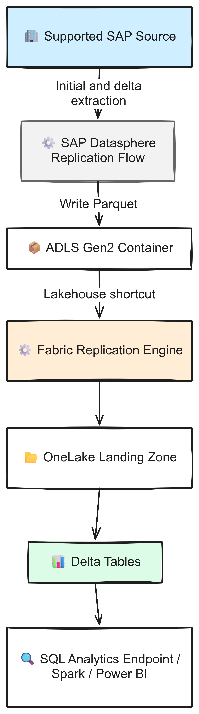
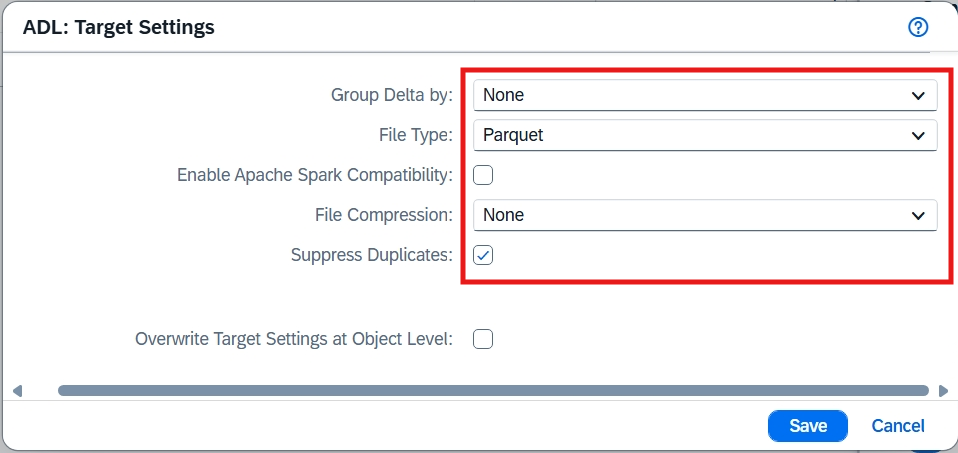
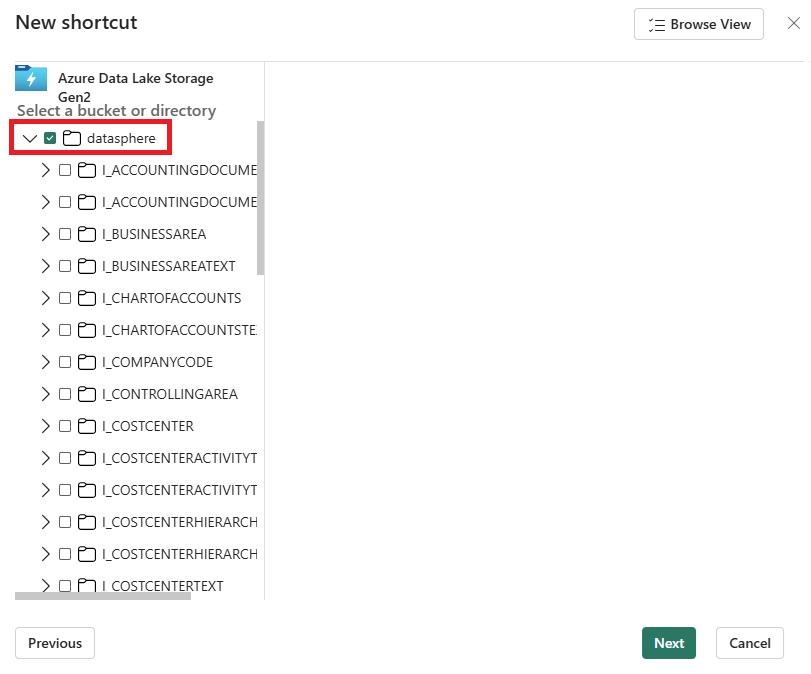
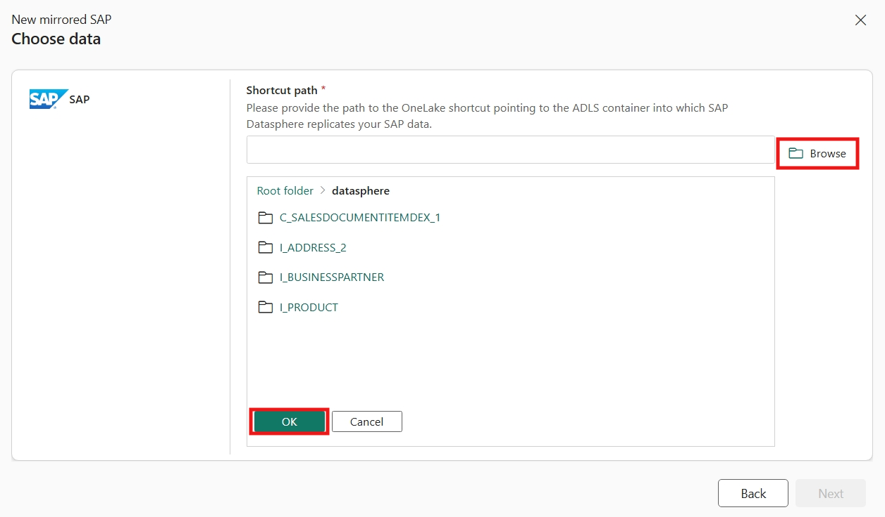

# Chapter 20: SAP

> **Part 2: Source-Specific Mirroring Guides**
>
> **Purpose:** Use this chapter to configure SAP mirroring through SAP Datasphere and ADLS Gen2, then operate both legs of the replication path.

**Part index:** [Chapters in Part 2](readme.md)

---

## Overview of the Source System

SAP Datasphere can extract initial and incremental data from supported systems including **SAP S/4HANA**, **SAP ECC**, **SAP BW/4HANA**, **SAP BW**, and SAP Datasphere sources.

Fabric Mirroring for SAP uses SAP Datasphere to write Parquet files to Azure Data Lake Storage Gen2. Fabric then processes those files into Delta tables in OneLake.

**Choose the SAP route first.** This chapter covers **SAP Datasphere Replication Flow → ADLS Gen2 → Mirrored SAP**. [Chapter 29: SAP Business Data Cloud Connect for Microsoft Fabric](chapter-29.md) covers the separate governed data-product sharing integration. Do not configure a Datasphere outbound replication flow merely because a BDC data product is described as available to Fabric, or apply a zero-copy claim to the physical replication path here.

---

## Mirroring Type and Architecture

- **Mirroring type**: Database mirroring
- **Method**: Two-step replication through SAP Datasphere and ADLS Gen2
- **Change mechanism**: SAP Datasphere Replication Flow with Initial and Delta loading

SAP Datasphere owns extraction from the SAP source and delivery to ADLS Gen2. A Fabric Lakehouse shortcut points to the storage container, and the Fabric replication engine merges the landed Parquet data into OneLake.

**Architecture flow:**

*Figure 20.1: SAP Datasphere to ADLS Gen2 to Fabric*

---

## Network and Connectivity

| Question | Answer |
|---|---|
| **Data gateway required?** | The SAP walkthrough does not configure a Fabric data gateway. Fabric reads landed files through a Lakehouse shortcut to ADLS Gen2. |
| **Storage firewall access?** | ADLS Gen2 shortcuts support trusted workspace access with a workspace identity, a storage resource-instance rule, and authorised connection credentials. This requires purchased F capacity, not a trial. Trusted workspace access is not a private endpoint. |
| **Private endpoints and outbound restrictions?** | The ADLS shortcut documentation explicitly excludes connections using Fabric managed private endpoints. The SAP-specific documentation does not establish an outbound-restricted-workspace configuration. Trusted workspace access is a different mechanism; validate the SAP Datasphere-to-ADLS route separately. |

See [Trusted workspace access](https://learn.microsoft.com/en-us/fabric/security/security-trusted-workspace-access) for the current guidance on connecting Fabric to firewall-restricted ADLS Gen2 storage.

---

## Setup Walkthrough

The important part is getting **SAP to ADLS working first**. A successful Fabric connection cannot repair a missing SAP authorisation, an inactive extractor, or a stopped Replication Flow. This walkthrough follows the [Microsoft tutorial](https://learn.microsoft.com/en-us/fabric/mirroring/sap-datasphere-tutorial), with SAP's source-preparation guidance where Microsoft delegates those steps.

### Step 1: Agree the Source, Owners, and Landing Area

Before opening the Fabric wizard, complete this hand-off:

| Owner | Prepare before setup | Evidence to keep |
|---|---|---|
| SAP Basis/security administrator | Exact SAP product, release, support package and DMIS version where applicable; supported extraction objects; technical-user authorisations; required SAP Notes; Cloud Connector route for an on-premises source | Approved source-object list and successful source connection validation |
| SAP Datasphere administrator | A suitable Space, access to create connections and deploy/run Replication Flows, and capacity assigned to **Premium Outbound Integration** for the non-SAP target | Working source and ADLS connections in that Space |
| Azure storage administrator | An ADLS Gen2 account with **hierarchical namespace enabled**, a dedicated container, source-writer credentials and separate Fabric-reader access | Writer can create files; reader can list and read them |
| Fabric administrator/implementer | Active paid Fabric capacity or trial, a workspace where the implementer can create the Lakehouse and mirrored item, and an approved storage connection | Lakehouse can browse the container through its shortcut |

Use a dedicated landing container where possible. Fabric mirrors **all data under the selected path**, not just a list of tables you select later. Do not share a landing root with unrelated feeds and then rely on the Fabric wizard to filter them out.

### Step 2: Prepare the SAP Source

There is no single `GRANT` script that works for ECC, S/4HANA, BW and Datasphere. The source system and extraction method determine the preparation. For an **S/4HANA on-premises CDS extraction** example:

1. Have the Basis administrator compare the release and support package with [SAP S/4HANA and other ABAP sources for Replication Flows](https://help.sap.com/docs/SAP_DATASPHERE/c8a54ee704e94e15926551293243fd1d/3f70579c92434f4f88471bba2bd70893.html). Apply the release-specific corrections and required security settings through the normal change process. The public table points to SAP Note **3100673** for security requirements, with additional TCI requirements for some older releases.
2. Run SAP **Note Analyzer**, resolve missing required notes with the Basis team, and run it again. Retain its output for support. Individual SAP Notes may require SAP customer sign-in; this book does not substitute an invented set of authorisation objects for that version-specific checklist.
3. Create or nominate the connection's technical user, and apply the source-specific authorisations identified by that checklist. Do not give it `SAP_ALL` simply to make a validation error disappear. Confirm it can enumerate and extract the approved objects, not merely log on.
4. For the tutorial's `CDS_EXTRACTION` path, confirm the CDS views are extraction-enabled, C1-released and available in the connected system. SAP documents the `@Analytics.dataextraction.enabled: true` annotation. Also confirm that the selected object supports delta extraction if ongoing changes are required; an initial-load success does not establish delta support.
5. Install/configure **SAP Cloud Connector** for the on-premises replication-flow route and allow the required backend resources. Follow [Prepare connectivity to SAP S/4HANA on-premise](https://help.sap.com/docs/SAP_DATASPHERE/9f804b8efa8043539289f42f372c4862/8de01dd25c1e443e8e2de7d2fbe1364d.html). This is an SAP component, not the Fabric on-premises data gateway.
6. In Datasphere **Connections**, choose the correct Space and create an **SAP S/4HANA On-Premise** connection. Enter the application/message server details, client, system number/ID and supported credentials. Enable the Cloud Connector option and select its location. The virtual host, port and logon type must match the Cloud Connector mapping. Select **Validate**.

For ECC, BW or another ABAP source, use the matching SAP connection type and the DMIS/ODP requirements in the linked source matrix. `CDS_EXTRACTION` is an example, not a universal container name. Do not apply the remote-table Data Provisioning Agent setup merely because it appears on the same SAP help page: the walkthrough uses **Replication Flows**.

**Choose the extraction route explicitly:** the current [S/4HANA connection reference](https://help.sap.com/docs/SAP_DATASPHERE/be5967d099974c69b77f4549425ca4c0/a49a1e3cc50f4af89711d8306bdd8f26.html) also lists `SQL_SERVICE` for CDS entities exposed through the ABAP SQL service, separately from `CDS_EXTRACTION` and ODP SAPI/BW. Its service-exposure and authorization prerequisites are not the tutorial's CDS extraction recipe. Record the chosen route with the Basis team rather than enabling every feature on the connection.

**Check keys before choosing continuous loading:** SAP's source matrix permits keyless CDS objects only with **Initial Only**. Keyless ODP SAPI objects have different conditions and can use **Initial and Delta**, with target-key configuration where required. Have the source owner inspect **Configure Schema** and approve the real key semantics; do not assume a generated technical record ID proves business-key uniqueness or delete support. These are upstream SAP restrictions, not a universal Fabric primary-key rule.

**Checkpoint:** stop here if the connection fails or the approved source objects cannot be listed. Fix source permissions, release prerequisites or the SAP route before adding Fabric.

### Step 3: Prepare ADLS Gen2 and Its Two Identities

1. Create the landing account/container and enable hierarchical namespace. Record the account name, container name and DFS endpoint, for example `https://<storage-account>.dfs.core.windows.net`.
2. Prepare **SAP writer access**. The [SAP ADLS connection](https://help.sap.com/docs/SAP_DATASPHERE/be5967d099974c69b77f4549425ca4c0/cd06b3c5ab5147c0905e3fa8abd13eb1.html) supports Shared Key, SAS and OAuth 2.0. For an approved OAuth client-credentials design, register the application, provision its certificate or secret securely, and grant storage data access that permits creation of folders and files. **Storage Blob Data Contributor** scoped to the landing container is a practical RBAC option; it also permits deletion, so review that scope.
3. Prepare **Fabric reader access separately**. For the simple dedicated-account configuration, give the shortcut's organisational account, service principal or workspace identity **Storage Blob Data Reader** at the storage-account scope. If that is too broad, follow the [ADLS shortcut authorisation model](https://learn.microsoft.com/en-us/fabric/onelake/create-adls-shortcut#authorization): account-level **Storage Blob Delegator** supplies the user-delegation-key action, with data access restricted through the documented ACL design. Ensure directory traversal, listing and file reads work, including for newly created descendants.
4. Do not confuse Azure resource **Contributor** with **Storage Blob Data Contributor**. The former does not itself grant blob-data access. Account keys bypass the identity-based model and grant broad access; store keys/secrets only in the connection's credential fields, never in this book's scripts or a shared runbook.
5. Configure the two network routes independently. For firewall-restricted storage, the Fabric reader can use [trusted workspace access](https://learn.microsoft.com/en-us/fabric/security/security-trusted-workspace-access), requiring a workspace identity, the storage resource-instance rule and an authorised connection on purchased F capacity. That rule does not authorise SAP Datasphere.
6. If SAP Datasphere uses its Cloud Connector storage route, follow SAP's instructions for **both DFS and Blob endpoints**, plus `login.microsoftonline.com` for OAuth. A successful DFS check alone is not sufficient. Do not assume this makes the Fabric shortcut a private-endpoint connection.
7. In Datasphere **Connections**, create **Microsoft Azure Data Lake Storage Gen2**, enter the account name and **Root Path** such as `/datasphere` for the container, select the approved authentication type and enter its credentials. Select **Validate**.

For the firewall-restricted Fabric leg, complete the [trusted workspace procedure](https://learn.microsoft.com/en-us/fabric/security/security-trusted-workspace-access#configure-trusted-workspace-access-in-blob-storage-or-adls), not just the storage data-role assignment:

- A workspace admin creates **Workspace settings** → **Workspace identity** and, as required by that procedure, adds the identity as **Contributor** through the workspace's **Manage access**.
- The Azure storage administrator adds the specific Fabric workspace's **resource-instance rule** using the documented ARM/PowerShell method. The rule uses the Fabric workspace GUID and the documented all-zero subscription ID, not the storage subscription ID. Preserve existing network rules; do not replace the firewall configuration with an empty example.
- Retain the shortcut credential's separate data authorization. Prefer the specific-workspace rule over the broad trusted-service exception. For a storage account in another Entra tenant, the ADLS shortcut supports **service principal or SAS**, not organizational account/workspace identity; validate the network design separately before using that cross-tenant route.

See the [ADLS access-control model](https://learn.microsoft.com/en-us/azure/storage/blobs/data-lake-storage-access-control-model) for RBAC versus ACL behaviour. ACLs do not restrict access already granted by a broader data role.

### Step 4: Land the Initial Data and Deltas

1. Open Datasphere **Data Builder** and create **New Replication Flow**.
2. Select the validated source connection, the appropriate source container (for example `CDS_EXTRACTION`), then **Add Source Objects**. Start with a small representative set whose data the SAP owner can validate.
3. Select the ADLS target connection and container. Set **Group Delta by = None** and **File Type = Parquet**. Review object-level overrides so they do not undo the flow's target settings.

*Figure 20.2: Target settings. Source: Microsoft, [SAP Datasphere mirroring tutorial](https://learn.microsoft.com/en-us/fabric/mirroring/sap-datasphere-tutorial); [original image](https://raw.githubusercontent.com/MicrosoftDocs/fabric-docs/main/docs/mirroring/media/sap-datasphere-tutorial/sap-datasphere-target-settings.png), [CC BY 4.0](https://creativecommons.org/licenses/by/4.0/), unchanged. SAP product UI is shown in Microsoft's documentation.*

4. In **Settings**, choose **Initial and Delta** for continuous replication, or **Initial Only** when a one-time load is intentional. **Run Settings** controls the upstream load frequency and resources; a fast Fabric mirror cannot make a slow upstream schedule faster.
5. Deploy and run the flow. In Datasphere, inspect the status of **each object**, not only the overall flow.
6. Browse the ADLS container and confirm that the expected object folders and initial Parquet files exist. For an Initial and Delta flow, ask the SAP application owner to make an approved test change and confirm subsequent output arrives.

**Checkpoint:** initial files and, where required, a delta must reach ADLS before proceeding. Do not hand-edit the generated files or delete the landing root to resolve a schema mismatch.

### Step 5: Create the Container-Level Shortcut

1. In Fabric, create or open a Lakehouse in the intended workspace.
2. Under **Files**, select **New shortcut**, then **Azure Data Lake Storage Gen2**. Use the DFS endpoint and the reader connection prepared earlier.
3. Browse and select the **whole storage container**, not an individual object's folder. Review and create the shortcut.

*Figure 20.3: Container-level shortcut. Source: Microsoft, [SAP Datasphere mirroring tutorial](https://learn.microsoft.com/en-us/fabric/mirroring/sap-datasphere-tutorial); [original image](https://raw.githubusercontent.com/MicrosoftDocs/fabric-docs/main/docs/mirroring/media/sap-datasphere-tutorial/lakehouse-shortcut-adls-dialog.png), [CC BY 4.0](https://creativecommons.org/licenses/by/4.0/), unchanged.*

4. Expand the shortcut under **Files** and confirm that the SAP object folders and files can be read. Azure portal visibility under your own login is not proof that the shortcut's delegated credential works.

### Step 6: Create the Mirrored SAP Item

1. In the workspace, select **New item**, then **Mirrored SAP**.
2. Select the Lakehouse containing the shortcut.
3. Select **Browse** and choose the root containing the replicated SAP data. If entering the path manually, omit the `Files/` prefix; for a shortcut called `datasphere`, the example path is `datasphere`.

*Figure 20.4: Selecting the landing root. Source: Microsoft, [SAP Datasphere mirroring tutorial](https://learn.microsoft.com/en-us/fabric/mirroring/sap-datasphere-tutorial); [original image](https://raw.githubusercontent.com/MicrosoftDocs/fabric-docs/main/docs/mirroring/media/sap-datasphere-tutorial/browse-lakehouse-and-select-path.png), [CC BY 4.0](https://creativecommons.org/licenses/by/4.0/), unchanged.*

4. Select **Next**, name the mirrored database and select **Create mirrored database**.
5. Inspect **Mirroring Status** for each table. Object selection remains in SAP Datasphere: there is no equivalent Fabric picker that filters unwanted source objects from this path.

### Step 7: Prove Both Legs and Hand Over Operations

1. Wait for the initial load of a representative object to complete. Compare a known business key and several values between the approved SAP source view/extractor output and the mirrored table. Counts from an actively changing source need a common comparison boundary; replication operation counts are not necessarily table row counts.
2. For an **Initial and Delta** flow, use the SAP application's approved test process to insert, update and, if supported by that extractor, delete a disposable business object. Do not write directly into production SAP application tables. Check the change first in Datasphere/ADLS, then in Fabric.
3. Query the generated SQL analytics endpoint. If OneLake data is current but SQL is not, distinguish [SQL endpoint metadata sync](https://learn.microsoft.com/en-us/fabric/data-engineering/sql-analytics-endpoint-metadata-sync) from upstream extraction or Fabric replication lag.
4. Record source system/client, Space, flow name, source objects, load mode, ADLS root, shortcut, mirrored item, credential owners/expiry, monitoring owners and the observed end-to-end delay.
5. Before sharing, set appropriate Fabric item and analytical access. SAP application authorisations do not automatically become row-level security on the replica.
6. Agree retention and recovery with both teams. Do not add storage lifecycle deletion rules or remove old object folders until the effect on ongoing ingestion and recovery is understood. Adding/removing objects is a coordinated flow and storage change, not a casual folder cleanup.

---

## Nuances and Limitations

| Topic | Detail |
|---|---|
| **Required intermediary** | SAP Datasphere is required for this replication-flow/ADLS path. It is not a statement that every SAP-to-Fabric integration uses this route; see the separate SAP BDC Connect chapter. This connector does not directly consume SAP SLT or SAP HANA CDC. |
| **SAP licensing** | SAP Datasphere Premium Outbound Integration pricing applies. |
| **Supported sources** | Source support follows the SAP source types available to SAP Datasphere Replication Flow. |
| **Load types** | Use Initial and Delta or Initial Only. Other load types are not supported. |
| **Target format** | The ADLS Gen2 target must use Parquet with Group Delta set to None. |
| **Object changes** | Adding or removing objects requires updating the Replication Flow and cleaning up storage where needed. |
| **Two monitoring surfaces** | Fabric monitors ADLS Gen2 to OneLake. Monitor SAP Datasphere to ADLS Gen2 separately in SAP Datasphere. |
| **Capacity pause** | A running Fabric capacity is required for replication. Before pausing it, plan how landed files and the upstream Replication Flow will be retained and monitored. |

---

## Source System Impact

- **SAP extraction**: Source impact is determined by the SAP Datasphere Replication Flow and the SAP source connector.
- **ADLS Gen2**: Initial and delta files consume Azure storage, transaction, and network resources.
- **Fabric replication**: Fabric processes the files from ADLS Gen2 into OneLake without charging Fabric compute for replication.
- **Operations**: Monitor both replication legs because either one can create end-to-end latency.

---

## Troubleshooting

| Symptom | Likely Cause | Resolution |
|---|---|---|
| No files in ADLS Gen2 | SAP Datasphere Replication Flow is stopped or failing | Check the flow status, source connection, and target connection in SAP Datasphere |
| Files exist but no Fabric tables appear | Shortcut or mirrored-item path is incorrect, or the shortcut cannot read the files | Verify the whole-container shortcut under Files, its read permissions, and the SAP root path selected by the mirrored item |
| Fabric rejects landed files | Target format or Group Delta is incorrect | Set File Type to Parquet and Group Delta to None |
| Data is delayed before ADLS | SAP Datasphere or source extraction issue | Investigate the Replication Flow in SAP Datasphere |
| Data is delayed after ADLS | Fabric processing or capacity issue | Check Fabric monitoring, Workspace Monitoring logs, and capacity state |

### Public Issues and Common Pitfalls

Reviewed **8 October 2026**. Research started with Reddit searches for SAP Datasphere and Fabric. Architecture/licensing discussions appeared in search, but their full threads returned HTTP 403; no readable source-specific Reddit incident was independently verified in this review. The checks below are grounded in the source documentation, not community certification claims.

| Evidence | Problem to plan for | Practical response |
|---|---|---|
| **Documented:** [Microsoft SAP limitations](https://learn.microsoft.com/en-us/fabric/mirroring/sap-limitations) | Incorrect Group Delta/file format or monitoring only the Fabric half of the route | Inspect the flow target settings, then determine whether the missing change has reached ADLS before changing Fabric |
| **Documented:** [SAP source prerequisites](https://help.sap.com/docs/SAP_DATASPHERE/c8a54ee704e94e15926551293243fd1d/3f70579c92434f4f88471bba2bd70893.html) | Release corrections, security notes or extraction-object prerequisites are incomplete | Retain Note Analyzer output and have the Basis team resolve the exact source prerequisite; do not borrow grants from an unrelated SAP connection mode |
| **Documented:** [ADLS shortcut authorisation](https://learn.microsoft.com/en-us/fabric/onelake/create-adls-shortcut#authorization) | SAP can write, but Fabric cannot list/read the same storage | Check the reader credential and delegation-key/data permissions independently of the writer |
| **Documented:** [Microsoft SAP cost overview](https://learn.microsoft.com/en-us/fabric/mirroring/sap#sap-mirroring-cost-considerations) | Free Fabric replication compute is mistaken for a free end-to-end SAP extraction route | Confirm Premium Outbound Integration pricing and the permitted extraction route with the SAP account/Basis team before a proof of concept |

Partner Open Mirroring failures are a different integration and should not be diagnosed using this chapter's Datasphere steps. The absence of a verified Reddit incident is not a reliability guarantee.

### Setup References

Public references reviewed **8 October 2026**: [Microsoft setup tutorial](https://learn.microsoft.com/en-us/fabric/mirroring/sap-datasphere-tutorial), [limitations](https://learn.microsoft.com/en-us/fabric/mirroring/sap-limitations), [ADLS shortcut setup](https://learn.microsoft.com/en-us/fabric/onelake/create-adls-shortcut), [SAP S/4HANA connection](https://help.sap.com/docs/SAP_DATASPHERE/be5967d099974c69b77f4549425ca4c0/a49a1e3cc50f4af89711d8306bdd8f26.html), and [SAP ADLS connection](https://help.sap.com/docs/SAP_DATASPHERE/be5967d099974c69b77f4549425ca4c0/cd06b3c5ab5147c0905e3fa8abd13eb1.html). Screenshot UI labels are those captured by Microsoft, not a guarantee that your tenant has identical screens.

---

## Summary

SAP mirroring uses SAP Datasphere to land Parquet files in ADLS Gen2, followed by Fabric processing into OneLake. Plan licensing, object selection, target settings, shortcut placement, and separate monitoring for both replication legs. See the current [SAP mirroring overview](https://learn.microsoft.com/en-us/fabric/mirroring/sap), [tutorial](https://learn.microsoft.com/en-us/fabric/mirroring/sap-datasphere-tutorial), and [limitations](https://learn.microsoft.com/en-us/fabric/mirroring/sap-limitations).

**Contents:** [Table of Contents](../index.md) | **Previous:** [Chapter 19: MySQL](chapter-19.md) | **Next:** [Chapter 21: SharePoint List](chapter-21.md)
