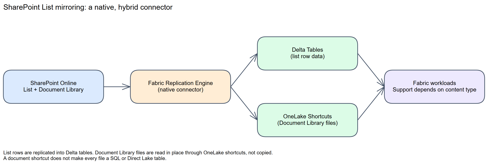
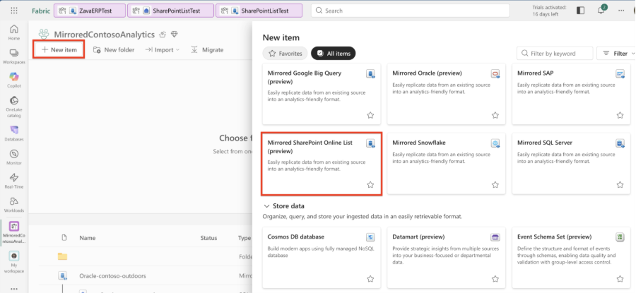
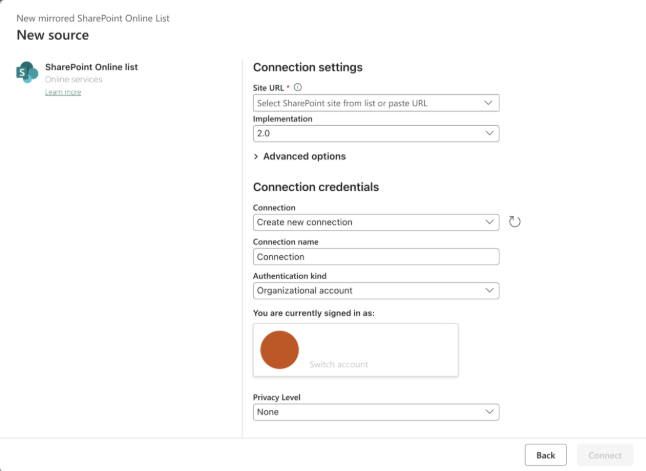

# Chapter 21: SharePoint List

> **Part 2: Source-Specific Mirroring Guides**
>
> **Purpose:** Use this chapter to configure the native SharePoint List mirroring connector and understand its hybrid replication mechanism.

**Part index:** [Chapters in Part 2](readme.md)

---

## Overview of the Source System

**SharePoint Lists** are structured data containers in Microsoft SharePoint and Microsoft 365. Teams use them to track project tasks, asset registers, approval queues, customer contacts, and other business data without a separate database. SharePoint lists are often paired with a **Document Library** that stores related files.

Fabric Mirroring for SharePoint List is a **native, first-party connector**. The [September 2026 FabCon feature summary explicitly announces general availability](https://community.fabric.microsoft.com/blog/fbc_fabricupdatesblogs/fabric-september-2026-feature-summary/5325825#community-5325825-mcetoc_1k3kj91s5_129), although the general Mirroring source table still carries a preview label when checked on **8 October 2026**. You select it directly from the Fabric portal; it does not require a custom Graph API integration, Azure Functions, or Power Automate flows to operate. GA does not imply that all SharePoint fields, document contents, or source permissions are automatically replicated; the row and shortcut paths below remain distinct.

---

## Mirroring Type and Architecture

- **Mirroring type**: Database mirroring and metadata mirroring, as classified in the [Mirroring overview](https://learn.microsoft.com/en-us/fabric/mirroring/overview#types-of-mirroring)
- **Method**: Native replication for list rows and OneLake shortcuts for Document Library data
- **Change mechanism**: Managed internally by the Fabric mirroring service; no customer-managed change-capture code

Mirroring a SharePoint List creates a mirrored database item with two distinct data paths:

- **List row data** is replicated into **Delta tables** in OneLake, following the same replication and conversion-to-Parquet process used by other mirrored databases.
- **Document Library data** is not copied. It is exposed through **OneLake shortcuts**, which act as symbolic links to the underlying SharePoint storage. Supported Document Library content can be surfaced as Delta tables for downstream workloads without duplicating the files.

**Architecture flow:**

*Figure 21.1: SharePoint List mirroring architecture*

Each mirrored SharePoint List database has an auto-generated **SQL analytics endpoint** that provides a read-only, T-SQL analytical surface over the Delta tables created by mirroring. You can also use **Power BI Direct Lake** mode against the mirrored tables.

---

## Network and Connectivity

| Question | Answer |
|---|---|
| **Data gateway required?** | The published SharePoint Online List walkthrough does not include a gateway setup step. Do not substitute the on-premises SharePoint connector. |
| **Private endpoint support?** | The SharePoint mirroring overview and tutorial do not document a private-endpoint configuration. Validate this requirement before deployment. |
| **Outbound-restricted (firewalled) networks?** | Not established in the source-specific mirroring documentation. SharePoint Online being a cloud service does not make Fabric workspace outbound restrictions irrelevant. |

---

## Setup Walkthrough

The source-side work here is **site access and a supported connection**, not enabling CDC or deploying a Graph application. The [Microsoft tutorial](https://learn.microsoft.com/en-us/fabric/mirroring/sharepoint-list-tutorial) is unusually short. The walkthrough below makes the preparation and acceptance checks explicit without inventing missing selection screens or a service-principal permission recipe.

### Step 1: Prepare the Site and Permissions

| Owner | Prepare before creating the mirror |
|---|---|
| Fabric administrator | A workspace on active paid Fabric capacity or trial, with an implementer permitted to create the mirrored item and use/create its connection |
| SharePoint site/list owner | The correct **SharePoint Online site**, the list/library inventory, and permission for the connection account to read the intended content |
| Identity administrator | An approved organisational account, successful sign-in under the tenant's access policies, and an owner for reauthentication if credentials or policies change |
| Data owner | Approval to expose the data through Fabric, plus an agreed consumer access model and a small, non-sensitive test list |

1. Open the intended list in SharePoint using the account that will authenticate the Fabric connection. Confirm that it can read actual items and any required Document Library content. A site home page loading successfully does not prove access to a list with broken permission inheritance.
2. Ask the site/list owner to grant the necessary read access at the intended scope. The mirroring-specific documentation does **not** publish a complete minimum-permission matrix. Do not respond to a discovery error by making the account a SharePoint administrator or granting tenant-wide application permissions.

   To inspect the actual source permissions, the owner opens the list/library → **Settings** → **List settings** or **Library settings** (then **More library settings**, if shown) → **Permissions for this list/document library**. Check whether permissions are inherited and inspect any **Show these items** exceptions. If access is inherited, use the approved parent-site group; do not break inheritance just for Fabric. Where unique permissions already apply, use **Grant Permissions** → **Show options** → **Read**, not the dialog's default **Edit**. Retest with the connection account. These are [SharePoint permission-management steps](https://support.microsoft.com/en-us/sharepoint/lists/sharepoint-sharing-and-permissions/customize-permissions-for-a-sharepoint-list-or-library), not a newly established connector minimum-role contract.

3. Copy the **site root URL**, for example `https://<tenant>.sharepoint.com/sites/<site>`. Do not use a list view URL ending in `/Lists/.../AllItems.aspx`, a document URL or a sharing link. Microsoft's [SharePoint connector guidance](https://learn.microsoft.com/en-us/power-query/connectors/sharepoint-online-list#determine-the-site-url) explains how to find the site address.
4. Record the site, list names/IDs and required columns, including internal names and display names. Note complex columns, lookups, dates, permission exceptions and library names so you can check their actual representation in the replica. Flag duplicate column display names for a pilot test; do not rename production columns on suspicion alone.
5. Use a separate account with edit permission to create/update/delete test items if needed; the connection account should not be given write access merely to run the test.

**Source changes required:** the published native-mirroring tutorial does not instruct you to enable SharePoint versioning, install an agent, change list thresholds or deploy a custom application. Do not add these as prerequisites from an unrelated Dataflow, pipeline or Graph-based example.

### Step 2: Create the Native Mirrored Item

1. Open the intended Fabric workspace and check that its capacity is running.
2. Select **New item**, then **Mirrored SharePoint Online List**. This is not a Dataflow Gen2 or Copy job.

*Figure 21.2: Finding the native item. Source: Microsoft, [SharePoint List mirroring tutorial](https://learn.microsoft.com/en-us/fabric/mirroring/sharepoint-list-tutorial); [original image](https://raw.githubusercontent.com/MicrosoftDocs/fabric-docs/main/docs/mirroring/media/sharepoint-list-tutorial/select-sharepoint-online-list.png), [CC BY 4.0](https://creativecommons.org/licenses/by/4.0/), unchanged. Preview badges in this historical screenshot do not establish current availability.*

3. Select **SharePoint Online list**, or choose an existing connection that targets the same site and uses the intended identity.
4. Enter the site URL. The tutorial screenshot shows **Implementation 2.0** and **Organizational account** authentication. Start with that documented path; do not infer that every authentication option on the generic Power Query connector page is supported by this mirroring item.
5. Give a new connection a meaningful name and sign in with the approved account. If an existing connection is reused, confirm who owns it and who can update its credentials.
6. Choose the **Privacy Level** required by your organisation's data-combination policy. The screenshot's `None` value is not a security recommendation, and privacy level is not a replacement for list or Fabric permissions. Select **Connect**.

*Figure 21.3: Connection settings. Source: Microsoft, [SharePoint List mirroring tutorial](https://learn.microsoft.com/en-us/fabric/mirroring/sharepoint-list-tutorial); [original image](https://raw.githubusercontent.com/MicrosoftDocs/fabric-docs/main/docs/mirroring/media/sharepoint-list-tutorial/new-sharepoint-source.png), [CC BY 4.0](https://creativecommons.org/licenses/by/4.0/), unchanged.*

### Step 3: Confirm the Selection and Start

1. Inspect the list/library choices and creation prompts that your tenant exposes. Confirm the actual site and selected objects against the inventory before completing creation; do not assume every list or library is automatically in scope.
2. Complete the available naming and creation prompts, then open the resulting item's **Mirroring Status** page.
3. Confirm the expected tables appear and inspect per-table progress/errors.

**Documentation boundary:** the public tutorial proceeds directly from the connection dialog to monitoring. It does not document the intervening list/library selection screens, naming fields or their defaults. If your tenant cannot complete this stage, capture the exact failing screen and error for support rather than substituting a guessed button sequence.

### Step 4: Validate Rows, Changes, and Access

1. Begin with a small non-sensitive list containing a known item ID, text, a number and a date/time. Wait for initial replication, then inspect the corresponding table in the SQL analytics endpoint. Discover the actual schema/table/column names rather than assuming the SharePoint display name becomes an SQL identifier unchanged.
2. Compare the known item's values. Include nulls, date/time interpretation and any complex fields your real list depends on. The source-specific docs do not provide a supported-column matrix, so record unsupported or changed representations explicitly.
3. Through the SharePoint UI, have the test owner add one disposable item. Wait for it to appear in Fabric, then update it and check the changed value. Finally delete that test item and check that the target reflects the deletion. Record elapsed times; this is an acceptance exercise, not a published replication SLA.
4. If Document Library content is included, validate its **shortcut access separately**. Do not treat a successful list-row query as proof that a document can be read, or assume every PDF/Office file becomes an SQL table.
5. If the replicated data is visible through OneLake but SQL is stale, investigate [SQL analytics endpoint metadata sync](https://learn.microsoft.com/en-us/fabric/data-engineering/sql-analytics-endpoint-metadata-sync) separately from the source connection and replication state.
6. Test access as an intended Fabric consumer, not only the item owner. Do not assume SharePoint's per-item permissions are reproduced as row-level security in the replica. Restrict the mirrored item/endpoint and shortcut access until the data owner approves the result.

**Checkpoint:** sign off only when the expected objects and representative changes are visible, errors are understood, and the access model is acceptable. An item with no connection error is not enough.

### Step 5: Record the Operational Handoff

Keep the site URL, selected list/library inventory, connection owner, authentication method, capacity, mirrored-item ID, test results and observed delay in your operational records. Agree who handles SharePoint permission changes, connection reauthentication, schema changes and Fabric support cases. Never put authentication tokens or production list contents into a public issue.

If a schema change is needed, try it on the test list first and inspect the resulting schema/status. The public connector documentation does not establish a refresh interval or a universal schema-repair procedure. Avoid deleting and recreating a production mirror as the first troubleshooting step.

---

## Nuances and Limitations

| Topic | Detail |
|---|---|
| **Documentation coverage** | The release notes announce GA, but the source-specific documentation remains brief and has no dedicated limitations article. Check the [overview](https://learn.microsoft.com/en-us/fabric/mirroring/sharepoint-list) and [tutorial](https://learn.microsoft.com/en-us/fabric/mirroring/sharepoint-list-tutorial) before relying on an undocumented capability. |
| **SharePoint Online only** | On-premises SharePoint Server is not a supported source. |
| **Hybrid mechanism** | List rows are replicated into Delta tables; Document Library content is accessed through OneLake shortcuts rather than copied. Plan queries accordingly. |
| **Unspecified limits** | The source-specific pages do not publish a table-count limit, a refresh interval, a supported-column matrix, or detailed schema-change behaviour. Do not reuse limits from another connector. |
| **Document Library scope** | The overview says that supported content can be surfaced as Delta tables, but does not enumerate supported file types. It does not promise that every document becomes a queryable table. |
| **Read-only endpoint** | The SQL analytics endpoint over mirrored SharePoint List data is read-only, consistent with every other mirrored database. |
| **Privacy level** | The connection dialog asks for a data source privacy level, the same Power Query concept used elsewhere in Fabric and Power BI connectors. Choose a level consistent with your organisation's data-source combination rules. |
| **No custom code required** | Unlike a do-it-yourself Open Mirroring integration, there is no Graph API code, delta-query token management, or landing-zone file format to maintain. |

---

## Source System Impact

- **Native connection**: Fabric manages authentication and read access to SharePoint Online directly; there's no customer-hosted extraction application, Azure Function, or Power Automate flow to operate or monitor.
- **No landing-zone file management**: Because this is a native connector rather than an Open Mirroring implementation, there are no `_metadata.json` files, sequential Parquet files, or `__rowMarker__` columns for you to manage.
- **Cost**: The SharePoint overview lists replication compute as free and a capacity-based OneLake storage allowance. Query compute is charged; storage above the allowance is not free. Document Library shortcuts are not a second replicated copy of the files.
- **Access controls**: Review permissions on the mirrored item, SQL analytics endpoint, and shortcuts before sharing. Do not assume that validating the connection's SharePoint access also validates every Fabric consumer's access.

---

## Troubleshooting

| Symptom | Likely Cause | Resolution |
|---|---|---|
| Connection fails | Incorrect site URL, expired credentials, or insufficient SharePoint permissions | Verify the site URL and credentials, and confirm the signed-in account can access the list |
| Mirrored database stays in an initial or non-running state | Fabric capacity is paused, or the initial snapshot is still in progress | Check capacity state and the **Mirroring Status** page for progress |
| Document Library content not visible | Connection access, shortcut target, or unsupported content may be involved | Validate the connection and shortcut target; the published overview does not provide a file-type support matrix |
| List schema changes not reflected | Cause cannot be inferred from the published connector guidance | Check **Mirroring Status** and compare source and destination schemas; do not assume a documented refresh schedule or automatic schema repair |

### Public Issues and Common Pitfalls

Reviewed **8 October 2026**. Research started with Reddit, where relevant titles were indexed but full thread reads returned HTTP 403. The readable Fabric Community reports below were verified directly, including their posting dates. They are historical/anecdotal reproduction leads, not a supported-column matrix or proof that a defect remains in the current service.

| Evidence | Report or pitfall | Safe diagnostic action |
|---|---|---|
| **Historical community report:** [Failed to get document libraries, Error 404](https://community.fabric.microsoft.com/discussions/df_mirroring/mirrored-sharepoint-list-preview---%E2%80%9Cfailed-to-get-document-libraries%E2%80%9D-error-404/5140182), 27 March 2026 | The poster reported a small list replicating correctly while document-library discovery returned 404. Their accepted reply on 7 April describes a pipeline/Notebook alternative | Check site-root URL, library permissions and list-versus-library scope independently. Retain the activity ID. The accepted alternative is not a repair to native mirroring, and does not establish that the native defect is fixed |
| **Historical community report:** [Sharepoint list mirroring](https://community.fabric.microsoft.com/discussions/df_mirroring/sharepoint-list-mirroring/5189929), 28 May 2026 | The poster reported missing User/Group values such as Created By and Modified By | Include these fields in acceptance tests. A forum suggestion to flatten data is not proof the values exist in the replica, nor a supported universal workaround. Verify the required fields before selecting this architecture |
| **Community report:** [Sharepoint lists mirroring issue](https://community.fabric.microsoft.com/discussions/df_mirroring/sharepoint-lists-mirroring-issue/5364776), 4 September 2026; poster follow-up 21 September | Some of more than 20 lists failed with a generic internal error. The poster attributed their case to different columns sharing a name and said complex fields were not the cause | Compare internal/display column names on one working and one failing list; reproduce on a disposable list and retain the ArtifactId, SequenceNumber and UTC time for support. Do not repeatedly recreate connections or declare every complex field unsupported. This case does not establish a general naming restriction or a service fix |
| **Documented connection guidance:** [Use the root SharePoint address](https://learn.microsoft.com/en-us/power-query/connectors/sharepoint-online-list#use-root-sharepoint-address) | A document/list-view URL is supplied instead of the site root | Return to the SharePoint site home page and use its URL. This connection principle is relevant; unrelated Power Query refresh limits are not automatically native-mirroring limits |
| **Documentation gap:** [Mirroring tutorial](https://learn.microsoft.com/en-us/fabric/mirroring/sharepoint-list-tutorial) | Detailed selection behaviour, field compatibility and replication timing are not specified | Validate the real list before rollout, retain a representative test list and raise a support case for unsupported or ambiguous behaviour |

The May and September reports differ on complex-field behavior, reinforcing the need to test the actual list rather than treating forum replies as a product contract. Community workarounds involving pipelines or custom Graph extraction are alternative architectures, not prerequisites for this native connector. No Reddit workaround is presented as independently verified in this review.

### Setup References

Public references reviewed **8 October 2026**: [SharePoint List overview](https://learn.microsoft.com/en-us/fabric/mirroring/sharepoint-list), [native mirroring tutorial](https://learn.microsoft.com/en-us/fabric/mirroring/sharepoint-list-tutorial), [monitoring](https://learn.microsoft.com/en-us/fabric/mirroring/monitor), and [SharePoint Online list connection guidance](https://learn.microsoft.com/en-us/power-query/connectors/sharepoint-online-list). Use the last reference for connection concepts only where consistent with the native mirroring documentation.

---

## Summary

SharePoint List mirroring is a native connector, not a do-it-yourself Open Mirroring pattern. It replicates list row data into Delta tables and exposes supported Document Library content through OneLake shortcuts. General availability does not fill the remaining documentation gaps: validate limits, security, networking, and schema changes for your workload.

**Contents:** [Table of Contents](../index.md) | **Previous:** [Chapter 20: SAP](chapter-20.md) | **Next:** [Chapter 22: Snowflake](chapter-22.md)
