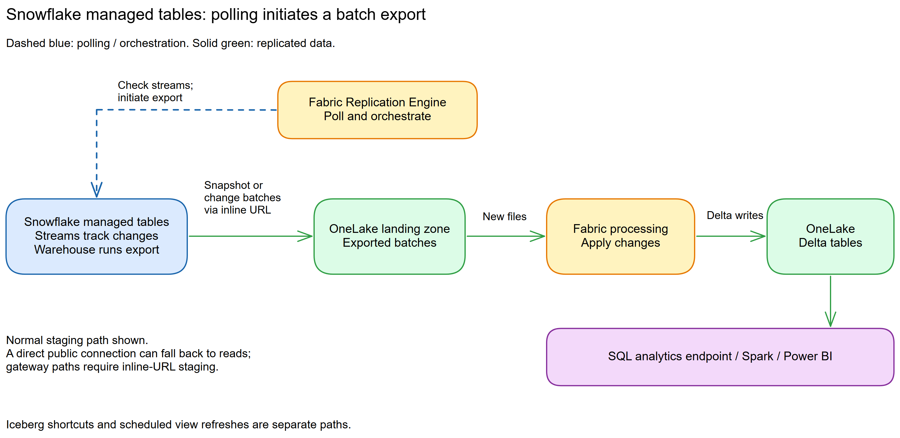
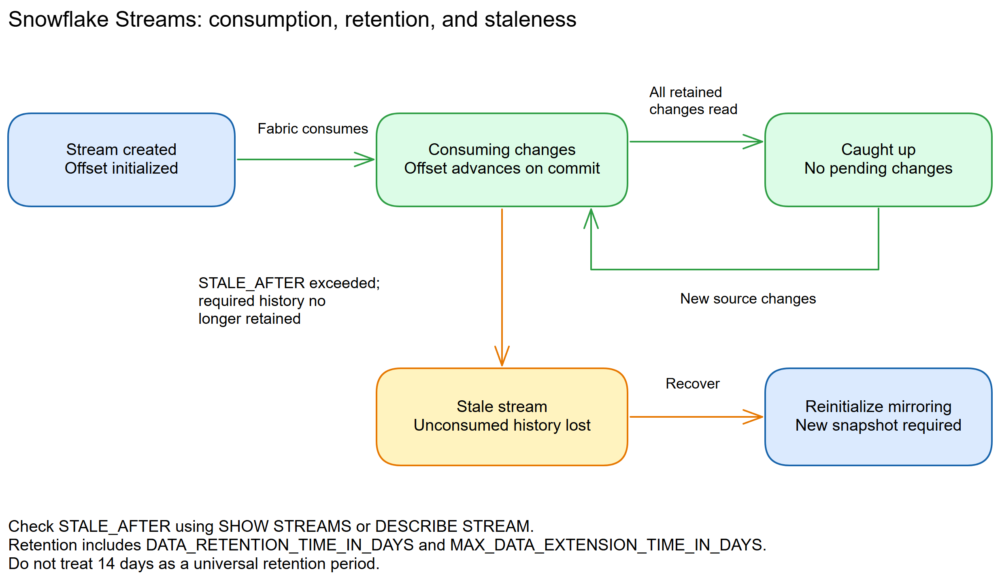
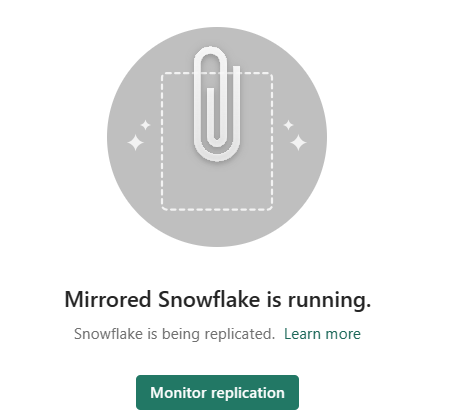
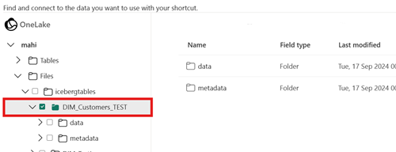

# Chapter 22: Snowflake

> **Part 2: Source-Specific Mirroring Guides**
>
> **Purpose:** Use this chapter to configure Snowflake mirroring and distinguish managed-table replication, view refreshes, and Iceberg shortcuts.

**Part index:** [Chapters in Part 2](readme.md)

---

## Overview of the Source System

**Snowflake** is a cloud data platform with separate storage and compute, multi-cloud availability, and data-sharing features. Fabric Mirroring replicates selected Snowflake tables into OneLake for use across Fabric workloads.

---

## Mirroring Type and Architecture

- **Mirroring type**: Database mirroring and metadata mirroring
- **Method**: Replication for managed tables and views; OneLake shortcuts for Iceberg tables
- **Change mechanism**: Snowflake Streams for managed-table changes; views and materialized views sync every 12 hours

**Snowflake Streams** tracks changes to managed tables, including inserts, updates, and deletes. Do not apply this architecture to every supported Snowflake object. Views and materialized views use scheduled syncs. [Mirroring views](https://learn.microsoft.com/en-us/fabric/mirroring/extended-capabilities-views) is an optional, paid capability. Iceberg tables keep their data in source storage, with Fabric mirroring metadata and creating shortcuts.

The [Fabric release notes](https://learn.microsoft.com/en-us/fabric/fundamentals/whats-new#generally-available-features) announce general availability for extended mirroring capabilities, including change feeds and source-view mirroring. The dedicated extended-capability and views pages still label them preview. This is a documentation conflict, not a reason to silently label every Snowflake feature GA or preview.

Iceberg tables require a separate connection to their underlying storage. All Iceberg tables in one mirrored database must be reachable through that same storage connection. OneLake generates virtual Delta metadata over the existing Parquet files; it does not copy the Iceberg table data.

**Architecture flow:**

[](../assets/diagrams/chapter-22/diagram-01.excalidraw.png)
*Figure 22.1: The managed-table path uses Snowflake Streams; Iceberg shortcuts and view refreshes follow different paths.*

[](../assets/diagrams/chapter-22/diagram-02.excalidraw.png)
*Figure 22.2: Snowflake Stream lifecycle and staleness risk. Check the stream's `STALE_AFTER` value, including retention-extension settings, rather than a fixed retention period.*

---

## Network and Connectivity

| Question | Answer |
|---|---|
| **Data gateway required?** | No, if Snowflake's network policy allows Fabric's IP ranges directly. Optional otherwise: a VNet data gateway or an on-premises data gateway for private connectivity. |
| **Private endpoint support?** | Not yet. Native Private Link connectivity between a Fabric workspace and Snowflake is not currently available. |
| **Source behind a firewall?** | Use a gateway whose network can reach Snowflake through a private endpoint or an allowed firewall rule. This source route and Fabric workspace outbound policy are separate checks. |
| **Fabric workspace outbound protection?** | Snowflake is explicitly supported through [data connection rules](https://learn.microsoft.com/en-us/fabric/security/workspace-outbound-access-protection-mirrored-databases). Allow the Snowflake connection; a gateway does not bypass this policy. |
| **Iceberg storage path?** | Validate the separate storage connection as well as Snowflake connectivity. Iceberg-to-Delta virtualization is not supported in tenants or workspaces with Private Link enabled. |

See the current [Snowflake mirroring limitations](https://learn.microsoft.com/en-us/fabric/mirroring/snowflake-limitations) for the Private Link status and connectivity guidance.

---

## Setup Walkthrough

**Documentation reviewed: 8 October 2026.** Follow the [Microsoft Learn Snowflake tutorial](https://learn.microsoft.com/en-us/fabric/mirroring/snowflake-tutorial) and [limitations](https://learn.microsoft.com/en-us/fabric/mirroring/snowflake-limitations). Start with managed tables; the Iceberg procedure below is a separate storage/metadata path, not a variation of the same Streams setup.

### 1. Assign owners and choose the object path

| Owner | Required decisions/actions |
|---|---|
| Fabric administrator/operator | Active Fabric/Premium/trial capacity, workspace other than **My workspace**, item-creation permission, available mirroring tenant settings, connection ownership, and target security. |
| Snowflake security administrator | Dedicated identity and role, approved authentication, object grants, and network policy. |
| Snowflake table/warehouse owners | Table eligibility and change tracking, retention, warehouse availability/budget, application DDL coordination, and test writes. |
| Storage administrator, for Iceberg | Independent credential, endpoint, read/list authority, storage firewall, encryption-key access, and metadata/data-file lifecycle. |
| Operations/FinOps | Baseline source credits/egress, monitor lag/reseeds, and own credential rotation, outages, and escalation. |

1. Record the Snowflake account hostname, **warehouse** name, database, schemas, and objects. Snowflake is supported across its clouds/editions; the warehouse is compute, not the database dropdown.
2. Classify objects: **managed tables** use replication; **views/materialized views** use the paid 12-hour-refresh capability; **Iceberg** uses metadata and storage access. External, transient, temporary, and dynamic tables are not supported by this connector.
3. Select a small pilot, not the whole database. Plan the 1,000-table limit and new-object onboarding. Review masking/row policies with the data owner and plan equivalent Fabric controls.
4. Coordinate with dbt and other schema automation. DDL timestamp changes, including recurring drop/recreate operations, can trigger full reloads and dominate credit consumption.
5. Agree on outage tolerance, retention, resource-monitor behavior, and the consequences of suspending a warehouse or Fabric capacity. There is no supported replication schedule to set to “nightly.”

### 2. Prepare managed tables and retention

The **table owner**, not the runtime mirror role, enables change tracking before the first stream is created. In a Snowflake SQL worksheet, replace the example identifiers with your approved, exactly cased identifiers:

```sql
ALTER TABLE ANALYTICS_DB.SOURCE_SCHEMA.ORDERS
SET CHANGE_TRACKING = TRUE;
```

1. Repeat for every approved managed table and build it into the process for future tables. Enabling change tracking adds metadata/storage overhead and can lock the object while the change is applied; schedule it with the application owner.
2. Check actual settings instead of assuming retention from account edition:

```sql
SHOW PARAMETERS LIKE 'DATA_RETENTION_TIME_IN_DAYS'
IN TABLE ANALYTICS_DB.SOURCE_SCHEMA.ORDERS;
SHOW PARAMETERS LIKE 'MAX_DATA_EXTENSION_TIME_IN_DAYS'
IN TABLE ANALYTICS_DB.SOURCE_SCHEMA.ORDERS;
SHOW TABLES LIKE 'ORDERS' IN SCHEMA ANALYTICS_DB.SOURCE_SCHEMA;
```

3. Keep a nonzero, approved retention period for recoverability. Standard-edition permanent tables support at most one day of normal Time Travel retention; Enterprise and higher can support longer periods. Do not paste a seven-day setting into an account/table that cannot support it, or reduce an existing setting for this tutorial.
4. Stream retention extension is separate. Inspect each stream's **`STALE_AFTER`** after creation; do not equate the usual 14-day extension default with guaranteed table retention or outage tolerance.
5. Do not manually create or consume a stream for Fabric. Fabric manages its stream lifecycle; another application's DML consumption of that stream would advance its offset.
6. For a safe pilot, have a source owner create this **new permanent table** in an approved test schema, not replace an existing table. `TEST_SCHEMA` and the database are examples:

```sql
CREATE TABLE ANALYTICS_DB.TEST_SCHEMA.FABRIC_MIRROR_PROBE (
  PROBE_ID NUMBER(10,0) NOT NULL,
  MARKER VARCHAR(30)
)
CHANGE_TRACKING = TRUE
DATA_RETENTION_TIME_IN_DAYS = 1;

INSERT INTO ANALYTICS_DB.TEST_SCHEMA.FABRIC_MIRROR_PROBE
VALUES (1, 'snapshot');
```

The one-day setting is for this new disposable pilot only. A primary key is not a published Snowflake connector prerequisite; do not transfer the BigQuery/Oracle key rules to this source.

### 3. Create a scoped role and authenticate the runtime identity

Run the following through administrators/owners authorized for **each** grant. `FABRIC_MIRROR_ROLE`, `FABRIC_REPL`, and all object identifiers are examples; create them only if they do not already exist.

```sql
CREATE ROLE FABRIC_MIRROR_ROLE;
GRANT USAGE ON WAREHOUSE ANALYTICS_WH TO ROLE FABRIC_MIRROR_ROLE;
GRANT USAGE ON DATABASE ANALYTICS_DB TO ROLE FABRIC_MIRROR_ROLE;
GRANT USAGE ON SCHEMA ANALYTICS_DB.SOURCE_SCHEMA TO ROLE FABRIC_MIRROR_ROLE;
GRANT SELECT ON TABLE ANALYTICS_DB.SOURCE_SCHEMA.ORDERS TO ROLE FABRIC_MIRROR_ROLE;
GRANT CREATE STREAM ON SCHEMA ANALYTICS_DB.SOURCE_SCHEMA TO ROLE FABRIC_MIRROR_ROLE;

GRANT USAGE ON SCHEMA ANALYTICS_DB.TEST_SCHEMA TO ROLE FABRIC_MIRROR_ROLE;
GRANT SELECT ON TABLE ANALYTICS_DB.TEST_SCHEMA.FABRIC_MIRROR_PROBE TO ROLE FABRIC_MIRROR_ROLE;
GRANT CREATE STREAM ON SCHEMA ANALYTICS_DB.TEST_SCHEMA TO ROLE FABRIC_MIRROR_ROLE;
```

1. Microsoft's required operations are `CREATE STREAM`, table `SELECT`, `SHOW`, and `DESCRIBE`. `SHOW`/`DESCRIBE` are operations enabled by object visibility/privileges, not additional `GRANT SHOW TABLES` syntax.
2. Keep `CREATE STREAM` at the selected schema scope and `SELECT` at approved object scope. Do not grant `ACCOUNTADMIN`, all-account ownership, or table ownership to the runtime role merely to enable change tracking; the table owner has already done that.
3. A grant on existing tables does not cover future tables. If using **Mirror all data**, approve future grants at the required schema scope and owner-side change-tracking preparation. Otherwise, manually grant/select each new object.
4. Grant access separately to selected views; for example, `GRANT SELECT ON VIEW ANALYTICS_DB.SOURCE_SCHEMA.APPROVED_VIEW TO ROLE FABRIC_MIRROR_ROLE;`. Do not assume Fabric view mirroring uses Snowflake's native streams-on-views semantics.
5. Prefer a dedicated **RSA key-pair** service identity for unattended operation. The mirroring tutorial also supports username/password and Entra ID SSO, but your Snowflake authentication/MFA policies still apply. Do not disable MFA to preserve a password-only automation.
6. Have the credential owner follow [Snowflake key-pair setup](https://docs.snowflake.com/en/user-guide/key-pair-auth) to generate an approved RSA key pair and protect the PKCS#8 private key/passphrase. For example, with an approved OpenSSL installation in a **protected credential directory**, these commands generate a new encrypted 2048-bit RSA key and its public key; choose unused filenames and never overwrite an active key:

```text
openssl genrsa 2048 | openssl pkcs8 -topk8 -v2 aes-256-cbc -inform PEM -out fabric_mirror_key.p8
openssl rsa -in fabric_mirror_key.p8 -pubout -out fabric_mirror_key.pub
```

Enter the passphrase interactively, not as a command-line argument. The identity administrator registering the public key needs **`OWNERSHIP` or `MODIFY PROGRAMMATIC AUTHENTICATION METHODS` on that user**; this is not a runtime grant for the mirror role. One supported registration pattern is:

```sql
CREATE USER FABRIC_REPL TYPE = SERVICE
  DEFAULT_ROLE = FABRIC_MIRROR_ROLE
  DEFAULT_WAREHOUSE = ANALYTICS_WH;
GRANT ROLE FABRIC_MIRROR_ROLE TO USER FABRIC_REPL;
ALTER USER FABRIC_REPL SET RSA_PUBLIC_KEY = '<PUBLIC_KEY_BODY>';
```

`<PUBLIC_KEY_BODY>` contains the public key without PEM delimiters, **never** the private key. For an existing identity, use its approved modification procedure rather than recreating it. Verify its public-key fingerprint and use the matching private key in Fabric. `TYPE = SERVICE` is for noninteractive use, not a password/Snowsight login; test with an approved client that supports key-pair authentication. The `RSA_PUBLIC_KEY` property itself does not impose key expiry—assign a rotation owner and verify the replacement connection before retiring the old key.

7. Ensure the dedicated role is assigned **and is the role used by the connection**. Setting a default role does not itself grant that role. General connector advanced options can apply only to connection testing; do not depend on a test-only role override for mirroring.
8. Validate a fresh session as the runtime identity, not only as a source administrator:

```sql
SELECT CURRENT_USER(), CURRENT_ROLE(), CURRENT_WAREHOUSE();
SHOW TABLES IN SCHEMA ANALYTICS_DB.SOURCE_SCHEMA;
DESCRIBE TABLE ANALYTICS_DB.SOURCE_SCHEMA.ORDERS;
SELECT * FROM ANALYTICS_DB.SOURCE_SCHEMA.ORDERS LIMIT 1;
```

Use an approved nonsensitive pilot for the read test. This proves discovery/read access, not yet successful service-managed stream creation or export.

### 4. Prepare warehouse and networking

1. Have the warehouse owner confirm `ANALYTICS_WH` exists, can execute the pilot query, and has an approved resume/suspend policy and resource monitor. `USAGE` is the runtime grant; broad warehouse administration is not required. A suspended warehouse with auto-resume disabled or a resource-monitor suspension must be resolved by its owner; adding table grants does not make unavailable compute usable.
2. Microsoft suggests considering the warehouse already used by source writers to avoid waking a second warehouse. A dedicated warehouse is reasonable for isolation, but is a measured cost/concurrency choice, not automatically cheaper.
3. Choose **None** for gateway only when the account's network policy permits direct Fabric access. Otherwise create a VNet gateway or standard on-premises gateway whose network can reach Snowflake through the approved private endpoint/firewall path.
4. Validate hostname/DNS, HTTPS/proxy/TLS, and Snowflake authentication from the chosen route. Use administrator-maintained current allowlists rather than pasting old IP addresses from a forum.
5. The Snowflake administrator must inspect the export control:

```sql
SHOW PARAMETERS LIKE 'PREVENT_UNLOAD_TO_INLINE_URL' IN ACCOUNT;
```

6. When this parameter is `true`, public/direct mirroring falls back to slower reads, but **both gateway paths are blocked**. Escalate the security-versus-staging decision; do not silently weaken the account policy. The documented alternative storage-integration path is still described as in development.
7. Native Private Link between a Fabric workspace and Snowflake is not currently available. Separate Iceberg storage endpoints have additional requirements and must be tested independently.
8. If workspace outbound access protection is enabled, have its administrator explicitly allow the Snowflake connection through [data connection rules](https://learn.microsoft.com/en-us/fabric/security/workspace-outbound-access-protection-mirrored-databases). This does not remove Iceberg virtualization's separate Private Link limitation.

### 5. Create the mirror and start managed-table replication

1. In the Fabric workspace, open **Create → Mirrored Snowflake**, enter the item name, and select **Create**.
2. Select **Snowflake** under **New connection**, or an existing authorized connection. Copy the Snowflake account hostname without `https://`; the tutorial instructs lowercasing the hostname. Preserve exact casing for warehouse/database/schema/table/view identifiers.
3. Enter **Warehouse** as the compute warehouse name, set the connection name, and select the approved gateway or **None**.
4. For **Key Pair**, supply the runtime username, upload the private-key file, and enter its passphrase when encrypted. Keep key material out of SQL, screenshots, and the repository. The [connection instructions](https://learn.microsoft.com/en-us/fabric/data-factory/connector-snowflake#key-pair-authentication) describe these credential fields; their support for other Fabric experiences does not add workspace-identity support to mirroring.
5. If using Entra ID instead, have the Snowflake identity administrator configure the corresponding SSO mapping/integration and role access before selecting it. Workspace identity is **not supported for Snowflake mirroring**.
6. Select the intended database. Disable **Mirror all data** for the pilot and choose only the prepared managed table(s). The all-data option can include managed plus Iceberg tables, or managed tables only.
7. Leave views and Iceberg out of the first managed-table test. Views require explicit billing review; Iceberg requires the storage procedure below.
8. Select **Connect**, confirm/name the mirrored database as prompted, and select **Create mirrored database**. Open **Monitor replication** after a few minutes.


*Figure 22.3: Start monitoring after creating the mirror; this banner is not proof that every table has completed its snapshot. Source: Microsoft Learn, [Snowflake mirroring tutorial](https://learn.microsoft.com/en-us/fabric/mirroring/snowflake-tutorial); [direct image](https://raw.githubusercontent.com/MicrosoftDocs/fabric-docs/main/docs/mirroring/media/snowflake-tutorial/mirrored-snowflake-is-running.png). Credit: Microsoft; [CC BY 4.0](https://creativecommons.org/licenses/by/4.0/); reproduced unchanged.*

### 6. Validate managed-table snapshot and DML

1. Confirm the pilot's initial row in Fabric's SQL analytics endpoint. Compare the small quiescent source/target count, selected columns, and representative values. For active production tables, compare a stable key range/cutoff instead of expecting simultaneous whole-table counts.
2. Have the **source test-table owner** perform the following independently. Use autocommit or explicitly commit each operation, then wait for the matching result in Fabric before continuing.

```sql
INSERT INTO ANALYTICS_DB.TEST_SCHEMA.FABRIC_MIRROR_PROBE
VALUES (2, 'insert');
```

```sql
UPDATE ANALYTICS_DB.TEST_SCHEMA.FABRIC_MIRROR_PROBE
SET MARKER = 'updated' WHERE PROBE_ID = 2;
```

```sql
DELETE FROM ANALYTICS_DB.TEST_SCHEMA.FABRIC_MIRROR_PROBE
WHERE PROBE_ID = 2;
```

3. Expect row 2 to appear, change, then disappear; row 1 should remain. Running all three immediately can produce no visible intermediate row because Streams represents changes between offsets.
4. Record source commit and target-observation times. Quiet-table backoff can reach **one hour**; there is no user-configurable polling interval. Check table status/errors before restarting.
5. **Rows replicated** is a cumulative operation count, not a live row count. Validate semi-structured and high-precision values with the actual Fabric engines you intend to use; the simple probe proves only basic DML.
6. Inspect the service-created streams without consuming or replacing them:

```sql
SHOW STREAMS IN SCHEMA ANALYTICS_DB.SOURCE_SCHEMA;
SHOW STREAMS IN SCHEMA ANALYTICS_DB.TEST_SCHEMA;
```

Record `STALE`/`STALE_AFTER`, ownership, and source table names. Do not run `CREATE OR REPLACE STREAM` or a DML statement against a Fabric-owned stream as a health check.
7. After sign-off, deselect only the disposable probe and arrange source cleanup. Deselecting removes its OneLake replica; do not use this as a production reset without impact approval.

### 7. Configure the separate Iceberg storage/shortcut path

1. Confirm the table's storage location and format with its **Snowflake owner**. This function requires `OWNERSHIP` on the Iceberg table and can generate current metadata for Snowflake-managed tables; do not add ownership to the runtime role just to run it:

```sql
SELECT SYSTEM$GET_ICEBERG_TABLE_INFORMATION(
  'ANALYTICS_DB.SOURCE_SCHEMA.ICEBERG_ORDERS'
);
```

2. Record the returned `metadataLocation`. The table folder must contain the metadata and referenced Parquet data; do not copy a lone metadata file elsewhere because Iceberg metadata contains absolute references.
3. Have the storage administrator supply an **independent storage connection** with the documented permission set for that provider:

| Storage | Connection and access preparation |
|---|---|
| ADLS Gen2 | Use the `https://<ACCOUNT>.dfs.core.windows.net` endpoint with hierarchical namespace. Follow [ADLS shortcut authorization](https://learn.microsoft.com/en-us/fabric/onelake/create-adls-shortcut#authorization): an approved Entra identity with the required delegation-key action plus data read/access, or a supported SAS with Read/List/Execute. Do not substitute Snowflake role grants for Azure storage permissions. |
| Amazon S3 | Use the regional HTTPS bucket endpoint and an approved IAM access key/secret. [Required permissions](https://learn.microsoft.com/en-us/fabric/onelake/create-s3-shortcut#authorization) include `s3:GetObject`, `s3:GetBucketLocation`, and `s3:ListBucket`; review the documented SSE-KMS key requirements when applicable. Do not disable Block Public Access. |
| Google Cloud Storage | Use a bucket endpoint and an **HMAC** access ID/secret with `storage.objects.get` and `storage.objects.list`; global-endpoint discovery also needs `storage.buckets.list`. Follow [GCS shortcut authorization](https://learn.microsoft.com/en-us/fabric/onelake/create-gcs-shortcut#authorization). This is not the JSON service-key credential used by BigQuery mirroring. |

4. Validate the storage firewall, credential expiry, encryption access, metadata files, and data-file reads. Keep **all Iceberg tables in one mirrored database reachable through one storage connection**; otherwise create separate mirrored databases.
5. In the Snowflake mirror configuration, select the Iceberg tables, select **Connect**, and supply the underlying storage connection when prompted. Managed-table replication still needs its Snowflake setup; a storage credential alone does not mirror managed tables.
6. Alternatively, to consume an existing Iceberg table **without creating a Snowflake mirrored database**, open a lakehouse and create **New shortcut** under **Tables** (under the schema for a schema-enabled lakehouse). Choose the storage provider/connection and target the **table folder containing `metadata` and `data`**, not either child folder. Review and create the shortcut.


*Figure 22.4: Correct target-folder level for the independent lakehouse shortcut path; this is not the Snowflake connection wizard. Source: Microsoft Learn, [Use Iceberg tables with OneLake](https://learn.microsoft.com/en-us/fabric/onelake/onelake-iceberg-tables#create-a-table-shortcut-to-an-iceberg-table); [direct image](https://raw.githubusercontent.com/MicrosoftDocs/fabric-docs/main/docs/onelake/media/onelake-iceberg-table-shortcut/shortcut-target.png). Credit: Microsoft; [CC BY 4.0](https://creativecommons.org/licenses/by/4.0/); reproduced unchanged.*

7. Validate the virtual Delta table and inspect `_delta_log/latest_conversion_log.txt`. In a lakehouse use **View files**; for mirrored items use a supported OneLake file client. A successful Snowflake connection does not prove successful format conversion.
8. Test source inserts/updates/deletes only on a disposable Iceberg table through its supported writer, waiting between commits and validating the conversion log each time. Metadata generation can take **5 seconds to 2 minutes**; the current guide asks for source updates less frequent than once per two minutes.
9. Do not reuse the managed-table probe's assumptions: equality deletes fail conversion; position deletes and supported deletion vectors follow the current virtualization rules. Check dropped unsupported columns, partition evolution, types, and engine-specific read behavior. The [current virtualization limits](https://learn.microsoft.com/en-us/fabric/onelake/onelake-iceberg-tables#limitations-and-considerations) require **fewer than 5,000 source transactions/commits** and **one table's metadata set per folder**. Snowflake drop/recreate can leave older metadata for `UNDROP`, causing conversion failure. Have the source owner plan supported compaction/metadata lifecycle and recovery before onboarding; do not delete old metadata ad hoc.
10. Check platform constraints before rollout: Iceberg virtualization is not currently available in Qatar Central/Norway West or tenants/workspaces with Private Link enabled. Shortcuts targeting **OneLake** locations additionally require the target and shortcut to be in the same region; this is not a general same-region requirement for every S3/ADLS/GCS shortcut. Virtualization uses the latest metadata, not a full mirrored history, and leaves source files in their storage location.

### 8. Hand over operation

- Record the connection identity/default role, grants, warehouse, authentication owner, gateway route, table selection, retention settings, stream staleness, and any separate storage connections.
- Monitor Snowflake warehouse/query history, resource monitors, cloud-services charges, egress, stream age, and recurring initial-copy behavior. Core replication compute is free in Fabric, not in Snowflake.
- Schedule DDL, dbt rebuilds, credential rotation, and gateway/capacity maintenance with a recovery budget. Stop/start reinitializes managed tables; it is not a cost-free “pause schedule.”
- For Iceberg, monitor conversion timestamps/errors and underlying metadata/data retention. Never remove manifests/data files merely to clear a conversion error without the source owner's recovery plan.
- Validate consumer security in Fabric separately; row/column/masking policies are not automatically copied. Approve additional billing before enabling view mirroring or change feeds.

---

## Nuances and Limitations

| Topic | Detail |
|---|---|
| **Object support** | Managed tables, Iceberg tables, views, and materialized views are supported. External, transient, temporary, and dynamic tables are not supported by this connector, regardless of their native Snowflake capabilities. |
| **View refreshes** | Views and materialized views sync every 12 hours. View mirroring is a paid extension whose GA/preview documentation conflicts as noted above; it materializes query results rather than creating a source SQL view definition in Fabric. Complex views with unsupported functions or nested subqueries may fail. |
| **Table limit** | Up to 1,000 tables. With **Mirror all data**, Fabric takes the first 1,000 sorted by schema and table name; manual selection prevents exceeding the limit. |
| **Stream retention** | Check `STALE_AFTER` with `SHOW STREAMS` or `DESCRIBE STREAM`. Retention depends on `DATA_RETENTION_TIME_IN_DAYS` and `MAX_DATA_EXTENSION_TIME_IN_DAYS`; 14 days is a default extension limit, not a universal table-retention setting. See [Snowflake stream retention](https://docs.snowflake.com/en/user-guide/streams-intro#data-retention-period-and-staleness). |
| **Reseeding** | DDL timestamp changes, recurring schema tools such as dbt, and stop/start operations can trigger a full reload. An extended capacity pause can also require reseeding. |
| **Polling** | Quiet tables or transient errors can cause backoff up to one hour. Mirroring does not expose a replication schedule or time window to configure. |
| **Unload restrictions** | With `PREVENT_UNLOAD_TO_INLINE_URL = true`, direct connections fall back to slower reads, but both VNet and on-premises gateway mirroring are blocked. Do not assume a gateway bypasses this Snowflake control. |
| **Iceberg conversion** | Requires supported Parquet-backed Iceberg tables and one storage connection per mirrored database. Check the [format-virtualization limits](https://learn.microsoft.com/en-us/fabric/onelake/onelake-iceberg-tables#limitations-and-considerations), including equality deletes and schema evolution. |
| **Data-type validation** | Validate representative semi-structured values through each intended Fabric query engine. The current connector pages do not provide a complete mapping matrix that justifies treating all `VARIANT`, `OBJECT`, and `ARRAY` values as JSON strings. |
| **Security policies** | Snowflake row-level and column-level policies are not replicated. Reconfigure equivalent Fabric controls, and validate what the connection identity can read rather than assuming it bypasses source masking. |
| **Schema and column names** | Source schemas and column names containing spaces or special characters are supported. Older mirrored items can require reconfiguration or recreation as described in the limitations article. |

### Snowflake Security Roles Replication (Preview)

The [September FabCon announcement](https://community.fabric.microsoft.com/blog/fbc_fabricupdatesblogs/fabric-september-2026-feature-summary/5325825#community-5325825-mcetoc_1k3kj91s5_131) specifies supported **role hierarchies, role assignments, and grants**, surfaced through **Manage OneLake security**. It says availability is shortly after FabCon EU, while the [OneLake companion announcement](https://community.fabric.microsoft.com/blog/fbc_fabricupdatesblogs/fabcon-and-sqlcon-barcelona-2026-what%E2%80%99s-new-in-microsoft-onelake-and-its-rapidly/5369146) says public preview is available now. Neither establishes rollout to every tenant.

The linked extended-capabilities page still has no role-replication setup or complete permission-mapping specification. Do not invent additional Snowflake admin grants or a REST flag to enable it. Confirm supported identities/grants, source privileges, hierarchy mapping, sync cadence, revocation behavior, and billing before use. In particular, the announcement does not establish parity for all row-access or masking policies. Keep the explicit Fabric-side security handoff until the supported preview is configured and tested. See [Chapter 9, Section 9.5](../Part%201%20-%20Concepts%20and%20Architecture/chapter-09.md#95-snowflake-security-roles-replication-preview).

---

> **Note:** For guidance on protecting mirrored Snowflake data in Fabric, see [Secure data in mirrored Snowflake](https://learn.microsoft.com/en-us/fabric/mirroring/snowflake-how-to-data-security).

---

## Source System Impact

- **Credit consumption**: Reads that return data use warehouse compute. Metadata checks do not necessarily wake the warehouse, but cloud-services charges can still apply. Full reloads can dominate costs.
- **Stream storage**: A stream stores an offset, not a second table. Change-tracking metadata and extended retention can still increase source storage.
- **Warehouse choice**: Microsoft recommends considering the warehouse already used by the writing applications to avoid waking a second warehouse. A dedicated warehouse can isolate budgets and concurrency, but is a trade-off rather than the default cost-saving recommendation.
- **Storage and egress**: Iceberg shortcuts read source files instead of producing a full OneLake replica. Budget for the relevant storage requests, source-cloud egress, and Fabric query compute.
- **Fabric extensions**: Core replication compute is free, but view mirroring and optional Delta change data feed have usage-based Fabric charges. Review [extended-capability billing](https://learn.microsoft.com/en-us/fabric/mirroring/extended-capabilities-billing) before enabling them.
- **Gateway cost**: A VNet data gateway consumes the linked Fabric or Power BI Premium capacity at **4 CUs per running gateway member**, based on uptime. This is separate from free core replication compute. See [gateway capacity consumption](https://learn.microsoft.com/en-us/data-integration/vnet/data-gateway-business-model).

---

## Troubleshooting

| Symptom | Likely Cause | Resolution |
|---|---|---|
| Stream staleness error | The retained change history no longer covers the stream offset | Check `STALE_AFTER` and retention settings; plan a Fabric-managed full reload rather than dropping a service-managed stream ad hoc |
| Authentication failure | Wrong credentials, key pair mismatch, or authentication policy | Verify the username, assigned/default role, public-key fingerprint and current policy; rotate credentials through the approved process only if required |
| Permission denied on STREAM | User lacks CREATE STREAM privilege | Grant CREATE STREAM on the schema to the Fabric role |
| High credit consumption | Repeated reseeds, broad table selection, or warehouse wake-ups | Check DDL and dbt activity, narrow the selected objects, and review warehouse usage; there is no user-configurable polling interval |
| Gateway replication blocked | `PREVENT_UNLOAD_TO_INLINE_URL` is true | Review the account policy with the Snowflake administrator; gateway replication requires the documented staging path |
| Missing objects or connection failure | Identifier casing or object permissions do not match | Copy the source identifiers exactly and verify the active role's access |
| Iceberg table is stale or unavailable | Format virtualization failed | Inspect `_delta_log/latest_conversion_log.txt` through the shortcut and check unsupported deletes, types, or schema changes |
| Change tracking not enabled | Table does not have `CHANGE_TRACKING = TRUE` | Run `ALTER TABLE ... SET CHANGE_TRACKING = TRUE` |

---

## Public Issues and Common Pitfalls

**Evidence rechecked 8 October 2026.** Research started with [Reddit via Bing](https://www.bing.com/search?q=site%3Areddit.com+%22Snowflake%22+%22mirroring%22+%22Fabric%22), which previously located [tables greyed out](https://www.reddit.com/r/MicrosoftFabric/comments/1d8y9nv/fabric_snowflake_mirroring_why_are_tables_greyed/) and [connection failure](https://www.reddit.com/r/MicrosoftFabric/comments/1degfis/unable_to_make_fabric_mirroring_connection/) threads. Both actual thread URLs returned **HTTP 403** on recheck; their diagnoses and dates could not be independently read, so no Reddit workaround is asserted here. The actual Fabric Community thread below and its embedded post/accepted-answer records were readable.

- **“Free” does not mean no Snowflake credits (historical anecdote):** The [Fabric Community Snowflake mirror cost thread](https://community.fabric.microsoft.com/discussions/power-bi-web-app/snowflake-mirror-cost/3968956), posted **3 June 2024** and verified **8 October 2026**, asks about polling/extraction costs. This is discussion, not a benchmark. Its accepted reply also links to a **copy activity**, not a mirroring setup guide, and its scheduling suggestion conflicts with the current mirroring FAQ: native replication windows are not available, and stop/start forces reloads.
- **Missing/grey objects:** Check current object-type support, exact identifier casing, effective role, schema usage, table selection, and the 1,000-table cap first. Do not infer that all current view support is absent from a preview-era discussion.
- **Repeated reloads/high credits:** Current Microsoft limitations explicitly describe DDL/dbt timestamp changes and stop/start as reseed triggers. Correlate query history, upstream DDL, and monitor timestamps before increasing warehouse size or rebuilding the mirror.
- **Works direct, fails through a gateway:** Inspect `PREVENT_UNLOAD_TO_INLINE_URL` and the actual network path. The documented direct-read fallback does not exist for either gateway path.
- **Iceberg reads stale data despite successful connection:** Read the conversion log and source snapshot metadata. A failed conversion can leave the last successful version visible. Fix the documented source incompatibility, then use an approved source commit to retry; do not delete the mirror, stream, or source metadata as the first response.

### References and Image Provenance

Reviewed **8 October 2026**:

- Microsoft Learn: [tutorial](https://learn.microsoft.com/en-us/fabric/mirroring/snowflake-tutorial), [limitations](https://learn.microsoft.com/en-us/fabric/mirroring/snowflake-limitations), [FAQ](https://learn.microsoft.com/en-us/fabric/mirroring/snowflake-mirroring-faq), [connection credential fields](https://learn.microsoft.com/en-us/fabric/data-factory/connector-snowflake), and [Iceberg walkthrough/limits](https://learn.microsoft.com/en-us/fabric/onelake/onelake-iceberg-tables).
- Source-operation checks: [public Microsoft tutorial source](https://raw.githubusercontent.com/MicrosoftDocs/fabric-docs/main/docs/mirroring/snowflake-tutorial.md), [Snowflake Streams/retention](https://docs.snowflake.com/en/user-guide/streams-intro), [key pairs](https://docs.snowflake.com/en/user-guide/key-pair-auth), and [`SYSTEM$GET_ICEBERG_TABLE_INFORMATION` ownership requirement](https://docs.snowflake.com/en/sql-reference/functions/system_get_iceberg_table_information).
- Network-policy scope: [workspace outbound protection for mirrored databases](https://learn.microsoft.com/en-us/fabric/security/workspace-outbound-access-protection-mirrored-databases); independent storage/format limits remain governed by the Iceberg walkthrough.
- Figures 22.3–22.4 are Microsoft documentation assets in `MicrosoftDocs/fabric-docs`. Its [LICENSE](https://raw.githubusercontent.com/MicrosoftDocs/fabric-docs/main/LICENSE) and [ThirdPartyNotices](https://raw.githubusercontent.com/MicrosoftDocs/fabric-docs/main/ThirdPartyNotices.md) license documentation and other content under CC BY 4.0; no separate media-license exception was found for these assets. Trademark rights are not granted. The authored architecture figures have separate provenance.

---

## Summary

Snowflake mirroring combines Streams-based managed-table replication, 12-hour view syncs, and metadata mirroring for Iceberg tables. Plan for source credits, retention, reseeds, separate Iceberg storage access, and Fabric security. See the current [Snowflake mirroring overview](https://learn.microsoft.com/en-us/fabric/mirroring/snowflake), [tutorial](https://learn.microsoft.com/en-us/fabric/mirroring/snowflake-tutorial), [limitations](https://learn.microsoft.com/en-us/fabric/mirroring/snowflake-limitations), and [FAQ](https://learn.microsoft.com/en-us/fabric/mirroring/snowflake-mirroring-faq).

**Contents:** [Table of Contents](../index.md) | **Previous:** [Chapter 21: SharePoint List](chapter-21.md) | **Next:** [Chapter 23: SQL Server 2016–2022](chapter-23.md)
