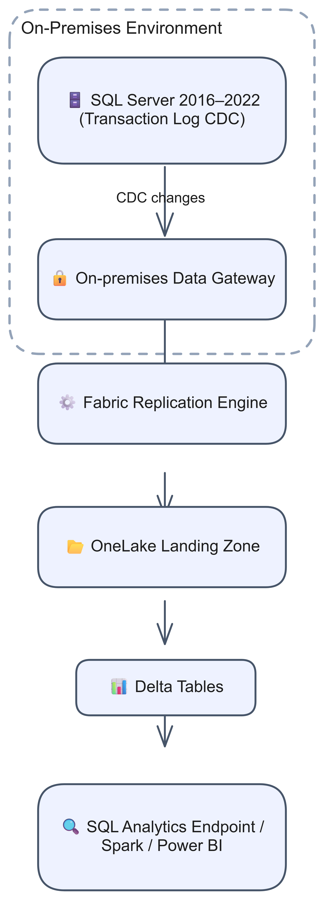
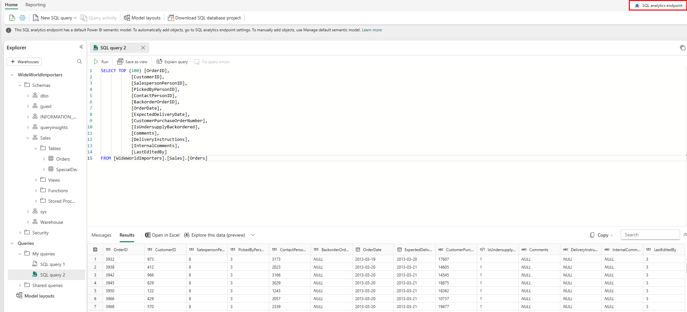

# Chapter 23: SQL Server 2016–2022

> **Part 2: Source-Specific Mirroring Guides**
>
> **Purpose:** Use this chapter to configure SQL Server 2016–2022 mirroring through a data gateway and plan CDC, permissions, editions, network access, and DDL changes.

**Part index:** [Chapters in Part 2](readme.md)

---

## Overview of the Source System

**SQL Server 2016–2022** can run on-premises or in self-managed virtual machines. Fabric Mirroring replicates selected data into Fabric without requiring a source migration.

SQL Server 2016–2022 uses SQL Server CDC. This walkthrough uses an on-premises or VNet data gateway. Fabric reuses existing CDC or configures it for the selected tables when the setup account has the required permissions.

---

## Mirroring Type and Architecture

- **Mirroring type**: Database mirroring
- **Method**: Gateway-mediated replication
- **Change mechanism**: SQL Server Change Data Capture (CDC)

Use the standard Microsoft on-premises data gateway or VNet data gateway to connect Fabric to the SQL Server instance. Fabric enables and manages CDC for the selected tables; there is no separate Fabric Mirroring Agent.

**Architecture flow:**

[](../assets/diagrams/chapter-23/diagram-01.excalidraw.png)
*Figure 23.1: SQL Server 2016–2022 CDC through an on-premises data gateway*

---

## Network and Connectivity

| Question | Answer |
|---|---|
| **Data gateway required?** | Use an on-premises or VNet data gateway for a private source. The version-specific tutorial and security article document this gateway path. |
| **Private source connectivity?** | The gateway's network must reach SQL Server through the appropriate private network, private endpoint where applicable, or source firewall rule. This does not establish support for Fabric workspace Private Link. |
| **Outbound-restricted source network?** | Allow the gateway service's [documented outbound endpoints and ports](https://learn.microsoft.com/en-us/data-integration/gateway/service-gateway-communication), plus connectivity to SQL Server's configured listening port. No inbound Internet connection to the gateway is required, but the source firewall must allow the gateway to reach SQL Server. |

The [tutorial prerequisites](https://learn.microsoft.com/en-us/fabric/mirroring/sql-server-tutorial#prerequisites) make the gateway conditional on source accessibility, while the version-specific steps instruct you to configure one. This chapter follows the documented gateway walkthrough rather than asserting that every public-source configuration requires one. Source firewall access is also distinct from Fabric workspace outbound access protection.

---

## Setup Walkthrough

### 1. Confirm the CDC branch and assign owners

Use the [SQL Server tutorial with the **SQL Server 2016–2022** tab selected](https://learn.microsoft.com/en-us/fabric/mirroring/sql-server-tutorial?tabs=sql201622). This same branch applies to SQL MI with the SQL Server 2022 update policy. It does **not** require Azure Arc, an Arc managed identity, or `ALTER ANY EXTERNAL MIRROR`; those belong to SQL Server 2025.

| Owner | Pre-setup responsibility |
|---|---|
| SQL Server DBA | Confirm build/edition, writable source, Agent, CDC consumers/retention, permissions, primary keys, log space, and snapshot impact. |
| Windows/Linux and gateway administrators | Operate the source service and an on-premises or VNet gateway; prove SQL reachability and outbound gateway connectivity. |
| Fabric tenant/capacity administrator | Provide an active capacity and enable **Service principals can use Fabric APIs** and **Users can access data stored in OneLake with apps external to Fabric**. |
| Workspace Admin or Member | Create the item, use the intended gateway connection, and record table selection and ownership. |
| Application/security owners | Approve the replicated data, trial writes, DDL coordination, separate analytical security, and operational acceptance. |

Start with a recoverable test database. The [supported environments](https://learn.microsoft.com/en-us/fabric/mirroring/sql-server#supported-environments) include Standard, Enterprise, and Developer on Windows for the documented 2016–2022 versions. Verify CDC support in the installed serviced build. Linux support starts with SQL Server 2017 CU18 and includes SQL Server 2019 and 2022; do not infer support from the SQL Server 2025 matrix.

For **SQL Server 2016 Standard**, CDC requires **SP1 or later**, as specified in the [2016 edition matrix's Data warehouse section](https://learn.microsoft.com/en-us/previous-versions/sql/sql-server/editions-and-components-of-sql-server-2016#data-warehouse). This is a feature minimum, not a recommendation to run an unserviced SP1 installation. Developer edition is for development/test, not a production licensing shortcut.

As a DBA, use SSMS or the MSSQL extension for VS Code to inspect the instance and **intended user database**:

```sql
SELECT SERVERPROPERTY('ProductVersion') AS product_version,
       SERVERPROPERTY('Edition') AS edition;
GO
USE [<SOURCE_DATABASE>];
SELECT name, is_read_only, is_cdc_enabled,
       delayed_durability_desc, log_reuse_wait_desc
FROM sys.databases
WHERE database_id = DB_ID();

SELECT s.name AS schema_name, t.name AS table_name,
       t.is_tracked_by_cdc,
       CASE WHEN pk.object_id IS NULL THEN 0 ELSE 1 END AS has_primary_key
FROM sys.tables AS t
JOIN sys.schemas AS s ON s.schema_id = t.schema_id
LEFT JOIN sys.key_constraints AS pk
  ON pk.parent_object_id = t.object_id AND pk.type = 'PK'
WHERE t.is_ms_shipped = 0
ORDER BY s.name, t.name;
```

Replace `<SOURCE_DATABASE>` everywhere; `GO` is a client batch separator. A primary key is required **by this mirroring connector**, even though CDC in general can capture some tables without one. Review unsupported types, table features, and the 1,000-table cap before changing source schema.

Do not proceed with a secondary AG database, failover cluster instance, delayed durability, Azure Synapse Link, or a source already mirrored into another workspace. Do not dismantle another integration during a trial.

### 2. Establish SQL Server Agent and CDC ownership

1. Confirm **SQL Server Agent is running** using the appropriate service tools and SSMS. Configure automatic startup under the host's service-management policy.
2. If the database already uses CDC, inventory its capture instances and gating roles:

```sql
-- Source database; run only after is_cdc_enabled = 1 is confirmed.
EXEC sys.sp_cdc_help_change_data_capture;
EXEC sys.sp_cdc_help_jobs;
```

3. Identify other CDC consumers, their retention needs, and ownership of the capture/cleanup jobs. Fabric can reuse CDC; enabling mirroring is not permission to delete or replace those capture instances.
4. Choose **DBA-prepared CDC** or **temporary Fabric setup elevation** below. The tutorial requires an administrator with `sysadmin` for setup/future CDC maintenance; ongoing replication has narrower connection/read permissions.
5. Size retention to the approved outage/recovery window, accounting for change volume and storage. Retention is not a guarantee that an arbitrarily long outage can recover without a snapshot.

Before first-time enablement, check for an existing **application-owned** `cdc` schema or database user: [CDC reserves both names](https://learn.microsoft.com/en-us/sql/relational-databases/track-changes/enable-and-disable-change-data-capture-sql-server?view=sql-server-ver16#enable-for-a-database). Have the DBA resolve any collision under change control, rather than dropping it. For existing capture instances, inspect `supports_net_changes`, captured columns, and gating roles with `sp_cdc_help_change_data_capture`; `is_tracked_by_cdc = 1` alone does not describe their configuration. The new-table example below enables net changes and captures all columns. If an existing instance differs, validate compatibility before altering it or affecting other consumers.

### 3. Create a dedicated connection login and user

A SQL administrator runs this for a new **SQL-authenticated** login in `master`. SQL authentication requires that the instance already permits it; do not change production authentication mode casually.

```sql
USE [master];
CREATE LOGIN [fabric_login]
WITH PASSWORD = '<REPLACE_WITH_A_UNIQUE_SECRET>';
GRANT CONNECT SQL TO [fabric_login];
GO
USE [<SOURCE_DATABASE>];
CREATE USER [fabric_user] FOR LOGIN [fabric_login];
GRANT CONNECT, SELECT TO [fabric_user];
```

Use consistent approved names, inspect existing principals rather than rerunning `CREATE`, and keep passwords in the approved secret store and Fabric credential fields. Do not put secrets in shared scripts or gateway troubleshooting exports.

If selecting another supported gateway authentication method, provision the corresponding login and mapped user and apply the same version-appropriate permissions. Do not copy an Entra `CREATE LOGIN ... FROM EXTERNAL PROVIDER` example onto SQL Server 2016–2019: Entra authentication is not available uniformly across these versions. On SQL Server 2022 it needs its own [Entra configuration](https://learn.microsoft.com/en-us/sql/relational-databases/security/authentication-access/azure-ad-authentication-sql-server-overview).

**DBA-prepared CDC, preferred where setup elevation is prohibited:** the DBA prepares every selected table before Fabric connects. For a safe first test, create the following table once in the approved source database:

```sql
USE [<SOURCE_DATABASE>];
IF OBJECT_ID(N'dbo.MirrorSetupProbe23', N'U') IS NOT NULL
    THROW 50000, 'Probe already exists; choose a new approved name.', 1;
CREATE TABLE dbo.MirrorSetupProbe23
(
    ProbeId int NOT NULL PRIMARY KEY,
    Note varchar(40) NOT NULL,
    ChangedAt datetime2(6) NOT NULL
);
INSERT dbo.MirrorSetupProbe23 (ProbeId, Note, ChangedAt)
VALUES (1, 'snapshot', SYSUTCDATETIME()),
       (2, 'before-update', SYSUTCDATETIME());
```

For a new lab CDC configuration, the DBA can use the following scoped preparation. This is not a reset script; if CDC already exists, inspect and reuse the relevant capture instance instead of replacing it.

```sql
USE [<SOURCE_DATABASE>];
IF (SELECT is_cdc_enabled FROM sys.databases WHERE database_id = DB_ID()) = 0
    EXEC sys.sp_cdc_enable_db;
GO
IF DATABASE_PRINCIPAL_ID(N'fabric_cdc_reader') IS NULL
    CREATE ROLE [fabric_cdc_reader];
ALTER ROLE [fabric_cdc_reader] ADD MEMBER [fabric_user];
GO
EXEC sys.sp_cdc_enable_table
    @source_schema = N'dbo',
    @source_name = N'MirrorSetupProbe23',
    @role_name = N'fabric_cdc_reader',
    @capture_instance = N'dbo_MirrorSetupProbe23',
    @supports_net_changes = 1;
```

For existing CDC with a non-null gating role, the DBA must authorize the connection user as a member of that role as well as granting SELECT on captured source columns. See [CDC enablement and gating-role permissions](https://learn.microsoft.com/en-us/sql/relational-databases/track-changes/enable-and-disable-change-data-capture-sql-server?view=sql-server-ver16). Do not remove a gating role to bypass an access decision.

**Alternative—let Fabric configure missing CDC:** create the same probe table, omit the manual CDC-enable block, and have a separate administrator explicitly approve temporary elevation:

```sql
USE [master];
ALTER SERVER ROLE [sysadmin] ADD MEMBER [fabric_login];
```

This is instance-wide authority, not a minor database grant. Limit its duration to the setup window; no passwords or admin grants are needed for readers of the mirrored destination. Remove this membership in step 6 after CDC and the initial replication are verified.

### 4. Install/select and test the gateway

1. Install the [standard on-premises data gateway](https://learn.microsoft.com/en-us/data-integration/gateway/service-gateway-install), not personal mode, on an approved always-on host; alternatively provision a [VNet data gateway](https://learn.microsoft.com/en-us/data-integration/vnet/create-data-gateways).
2. Register it to the intended tenant, name it meaningfully, and protect its recovery key in the approved store. Record service, patching, and high-availability ownership.
3. From the gateway's network, resolve the server FQDN and connect to SQL's **configured** listening port. Named instances may use nondefault/dynamic ports; obtain the actual endpoint from the DBA instead of opening all ports. Configure TCP/IP and source firewall access under change control if they are not already enabled.
4. Use a server certificate and hostname that validate for the gateway connection. Do not make **Trust server certificate** or disabling encryption a routine production solution.
5. Permit the gateway's [documented outbound endpoints and ports](https://learn.microsoft.com/en-us/data-integration/gateway/service-gateway-communication). An inbound Internet rule to the gateway is not required.
6. Verify the database login from this network and authorize the Fabric creator to use the gateway/connection. Keep source routing, gateway availability, and credential validation as separate tests.

**VNet gateway alternative:** use the [creation procedure](https://learn.microsoft.com/en-us/data-integration/vnet/create-data-gateways), not the Windows installer. Check supported region, same tenant, and eligible capacity; the subscription owner registers `Microsoft.PowerPlatform`. A network administrator with subnet `join/action` permission creates a dedicated subnet, delegates it to `Microsoft.PowerPlatform/vnetaccesslinks`, and validates routes/DNS to SQL Server. In **Settings → Manage connections and gateways → Virtual network (VNet) data gateway → New**, select the capacity and Azure subnet details, then save. The delegated subnet cannot be shared with other services.

**Workspace outbound access protection:** [SQL Server is a supported mirrored source](https://learn.microsoft.com/en-us/fabric/security/workspace-outbound-access-protection-mirrored-databases). If protection is enabled, ask the workspace Admin to allow this source using a **data connection rule** before validation. A healthy gateway or open SQL firewall port does not override the workspace's default-deny policy.

**Availability groups:** use the listener, not a node address. Before production acceptance, the DBA prepares the login on every replica with the **same SID**, confirms mapped-user access, and follows the tutorial's [secondary-replica procedure](https://learn.microsoft.com/en-us/fabric/mirroring/sql-server-tutorial?tabs=sql201622#configure-secondary-replicas-of-always-on-availability-groups). In an approved maintenance/failover exercise, ensure capture/cleanup jobs exist on each potential primary. Enable them on the current primary and disable them on secondaries; SQL Agent jobs in `msdb` do not travel with the user database. Do not perform an unplanned failover merely to test connectivity.

### 5. Create and configure the mirror

1. In the approved Fabric workspace, choose **Create** or **+ New item → Mirrored SQL Server database**. Name the mirrored item and select **Create**.
2. Select **New sources → SQL Server database**, or a verified existing SQL Server connection.
3. Enter **Server** (FQDN/listener and configured port as applicable) and **Database** (the user database's name). The tutorial's wording about entering a server name in the Database field must not be read literally.
4. Name the connection, select the prepared gateway, and choose the authentication method. With the example above, use login `fabric_login`, not database user `fabric_user`. Use encrypted connectivity and select **Connect**.
5. On **Configure mirroring**, turn off **Mirror all data** for the initial trial and select `dbo.MirrorSetupProbe23` and other explicitly approved CDC-ready tables.
6. Read every table warning/error. **Mirror all data** is an alternative that includes future eligible tables and the first 1,000 in schema/table order. After temporary admin rights are removed, new tables still need DBA-owned CDC setup; this option does not override permissions.
7. Select **Create mirrored database**, then open **Monitor replication**. Fabric reuses existing CDC or configures missing CDC using the chosen setup path.


*Figure 23.2: Monitor the table's initial copy, not just connection success. From the [Microsoft Learn SQL Server setup tutorial](https://learn.microsoft.com/en-us/fabric/mirroring/sql-server-tutorial?tabs=sql201622). Image: Microsoft, [original](https://raw.githubusercontent.com/MicrosoftDocs/fabric-docs/main/docs/mirroring/media/sql-server-tutorial/monitor-replication.png), [CC BY 4.0](https://creativecommons.org/licenses/by/4.0/), unchanged. The shared tutorial image's sample name does not select the SQL version; use the 2016–2022 instructions.*

### 6. Verify snapshot and remove setup elevation

Wait for the probe table to finish the initial copy and display a **Last completed/Last refresh** time. **Running** can include snapshot work. On the source and the mirror's **SQL analytics endpoint**, query:

```sql
SELECT ProbeId, Note, ChangedAt
FROM dbo.MirrorSetupProbe23
ORDER BY ProbeId;
```

Expect keys 1 and 2. As the DBA, confirm CDC is enabled for the selected tables and capture/cleanup jobs are healthy. If temporary setup elevation was used, remove it using a **separate administrator session**:

```sql
USE [master];
ALTER SERVER ROLE [sysadmin] DROP MEMBER [fabric_login];
```

Reconnect as the connection account to verify server `CONNECT SQL`, database `CONNECT`/`SELECT`, and any CDC gating-role access. Do not drop the login/user or revoke the ongoing permissions.

### 7. Test each change after privilege reduction

Using an approved writer on the **source**, execute these separately in autocommit mode. After each statement, repeat the SELECT on both sides and observe its result before advancing:

```sql
INSERT dbo.MirrorSetupProbe23 (ProbeId, Note, ChangedAt)
VALUES (3, 'insert-check', SYSUTCDATETIME());
```

```sql
UPDATE dbo.MirrorSetupProbe23
SET Note = 'update-check', ChangedAt = SYSUTCDATETIME()
WHERE ProbeId = 2;
```

```sql
DELETE FROM dbo.MirrorSetupProbe23 WHERE ProbeId = 1;
```

Expect keys 2 and 3 and the updated row 2. **Rows replicated** is cumulative activity, not a count to compare directly with `COUNT(*)`. Do not perform a `TRUNCATE` or DDL change as a substitute for the DELETE test.


*Figure 23.3: Query the analytical copy in the SQL analytics endpoint; execute test writes only at the source. From the [Microsoft Learn SQL Server setup tutorial](https://learn.microsoft.com/en-us/fabric/mirroring/sql-server-tutorial?tabs=sql201622). Image: Microsoft, [original](https://raw.githubusercontent.com/MicrosoftDocs/fabric-docs/main/docs/mirroring/media/sql-server-tutorial/validate-data-in-onelake.png), [CC BY 4.0](https://creativecommons.org/licenses/by/4.0/), unchanged. Historical semantic-model banners are not current setup requirements.*

If table monitoring advances but SQL queries are stale, follow [the source → OneLake → SQL endpoint checks](https://learn.microsoft.com/en-us/fabric/mirroring/troubleshooting#data-doesnt-appear-to-be-replicating). A Lakehouse shortcut/Spark query can distinguish replicated Delta data from SQL endpoint metadata lag; refresh endpoint metadata only after identifying that layer. Restarting CDC does not fix metadata sync.

### 8. Handoff, diagnostics, and safe retirement

Record the SQL version/build, database/listener, selected tables, CDC capture instances and gating roles, retention, connection owner, gateway cluster, reduced privileges, and freshness baseline. Agree who enables CDC for new tables and who approves schema changes. Reapply endpoint security and assess direct OneLake access before sharing: source RLS/masking is not replicated as policy.

For first-line source diagnostics, have the DBA run these **in the CDC-enabled source database**:

```sql
SELECT * FROM sys.dm_cdc_log_scan_sessions;
SELECT * FROM sys.dm_cdc_errors;
EXEC sys.sp_cdc_help_jobs;
```

Also inspect SQL Agent job history, source log reuse, CDC storage/cleanup, gateway health, and Fabric table errors. Monitoring permissions vary by engine version; perform administrator diagnostics without permanently elevating the replication login.

If DDL causes the documented schema-mismatch error, coordinate a **table-scoped** CDC disable/re-enable with all CDC consumers and budget for a fresh snapshot. Preserve the approved capture options and gating role: the generic error-message example uses `@role_name = NULL`, which must not silently remove an existing access gate. This is a targeted repair after diagnosis, not a first-line reset. Do not disable database CDC, purge change tables, or delete the mirror to troubleshoot an unexplained delay. Retain the probe for approved health checks or retire only that table/capture instance and its mirror selection under DBA control.

For `.dacpac` deployments, the [SQL Server limitations](https://learn.microsoft.com/en-us/fabric/mirroring/sql-server-limitations#database-level-limitations) require `/p:DoNotAlterReplicatedObjects=False` to permit changes to mirrored objects. Review the deployment script and CDC repair/reseed plan first: this publish setting does not make schema drift transparent or override unsupported DDL.

---

## Nuances and Limitations

| Topic | Detail |
|---|---|
| **Edition requirements** | Standard, Enterprise, and Developer on Windows are listed for SQL Server 2016–2022. Verify the installed build supports CDC. |
| **Gateway** | Keep the on-premises data gateway current and monitor its availability. |
| **Primary key required** | Each mirrored table must have a primary key. |
| **SQL Server Agent** | CDC capture and cleanup depend on SQL Server Agent. |
| **DDL changes** | A schema change can fail mirroring for the affected table. An administrator must disable and re-enable that table's CDC using the error's procedure, preserving the approved gating role/capture options; the table then takes a new snapshot. Coordinate with any other CDC consumers first. |
| **Linux** | SQL Server 2017 on Linux requires CU18 or later. SQL Server 2019 and 2022 on Linux are supported. |
| **Always On AG** | Only the primary database can be mirrored. Prepare logins and CDC jobs on every replica; capture and cleanup jobs should run on the primary, not secondary replicas. Failover cluster instances are not supported. |
| **CDC retention** | Retained CDC change-table data must cover replication interruptions. Monitor CDC cleanup separately from transaction-log truncation. |
| **Table limit** | Up to 1,000 tables. **Mirror all data** takes the first 1,000 sorted by schema and table name. |
| **Incompatible configurations** | Do not combine mirroring with Azure Synapse Link for SQL, another mirror of the database in a different workspace, or delayed transaction durability. |
| **Unsupported tables** | Clustered columnstore, temporal or ledger history, Always Encrypted, in-memory, graph, and external tables are not supported. |
| **Unsupported columns and keys** | Computed columns and types such as `xml`, spatial types, UDTs, `sql_variant`, `rowversion`, and legacy LOB types are not replicated. An unsupported key type makes the table ineligible. |
| **Value fidelity** | LOB values over 1 MB are truncated. Seven-digit fractional-second precision is reduced, and `datetimeoffset(7)` loses its time-zone information. Keys using `datetime2(7)`, `datetimeoffset(7)`, or `time(7)` are unsupported. |
| **Character primary keys** | Case-only or accent-only updates to character keys with insensitive collations can produce duplicate rows. Review the documented case-sensitive or accent-sensitive collation workaround before changing a source key's semantics. |
| **Restart behaviour** | Stopping mirroring disables it; starting again reseeds the tables. Do not treat stop/start as a cost-free pause. |
| **Schema and column names** | Source schemas and column names containing spaces or special characters are supported. Older mirrored items can need reconfiguration as described in the limitations article. |

---

## Source System Impact

- **CDC overhead**: CDC capture and cleanup add source CPU and I/O activity.
- **CDC tables and jobs**: Fabric creates missing CDC objects when given setup permission, or reuses the DBA-prepared configuration. SQL Server Agent runs the associated jobs.
- **Gateway traffic**: Replication traffic passes through the data gateway and consumes network bandwidth.
- **Gateway cost**: Budget for the on-premises gateway host if you manage one. A VNet data gateway instead consumes its linked Fabric or Power BI Premium capacity at **4 CUs per running member**, based on uptime. See [gateway capacity consumption](https://learn.microsoft.com/en-us/data-integration/vnet/data-gateway-business-model).
- **Log and change-table retention**: Monitor capture lag, cleanup jobs, change-table storage, and transaction-log usage separately. Long-running transactions and capture problems can prevent log truncation.

---

## Troubleshooting

See the current [SQL Server mirroring troubleshooting guide](https://learn.microsoft.com/en-us/fabric/mirroring/sql-server-troubleshoot) for additional scenarios.

| Symptom | Likely Cause | Resolution |
|---|---|---|
| Gateway is offline | Gateway service is stopped or cannot reach Fabric | Restart and update the gateway; verify outbound connectivity |
| Gateway cannot reach SQL Server | Firewall, DNS, or SQL connectivity issue | Test the source connection from the gateway machine |
| CDC setup fails | CDC is not already configured and the setup login lacks permissions | Have an administrator configure CDC, or grant temporary setup membership and remove it after configuration |
| Replication fails after DDL | Source table schema changed while CDC was active | Follow the documented table-level CDC reset procedure; expect a new snapshot |
| High CDC storage use | Replicator is falling behind | Check gateway health, network bandwidth, and source load |
| Tables not visible or unsupported | Missing primary key, unsupported table feature, insufficient permissions, or the table limit | Check the table's replication status, source permissions, and limitations before changing the edition |

---

## Public issues and common pitfalls

**Evidence review: 8 October 2026.** Public research began with Reddit SQL Server mirroring searches. Relevant threads were found, but Reddit blocked their bodies, preventing independent verification of those reports. The Fabric Community report below was read directly and its date verified from public post metadata; it is historical anecdotal evidence, not a confirmed current defect. The remaining entries are **documented troubleshooting cases**.

| Evidence and source date | Practical implication |
|---|---|
| **Historical community report, 17 June 2025:** [Large CDC-enabled tables fail the initial snapshot](https://community.fabric.microsoft.com/discussions/ac_datawarehouse/issues-replicating-large-cdc-enabled-tables-using-microsoft-fabric-sql-server-da/4734849) | During preview, the author reported successful small-table replication but timeouts/`InputValidationError` for a 70-million-plus-row table. The accepted response recommends a support ticket, not a verified configuration fix. This is explicitly a **CDC** report (exact engine build unspecified), not SQL Server 2025 change-feed evidence. After the probe, test a representative large table and capture gateway/source metrics and artifact/error IDs before escalation; do not assert a current hard row limit or repeatedly reseed production. |
| **Documented:** [SQL Server troubleshooting](https://learn.microsoft.com/en-us/fabric/mirroring/sql-server-troubleshoot?tabs=sql201622), 6 April 2026 | `watermark ... is null` can indicate stopped SQL Server Agent. Check capture activity, job history, and retention before resetting a table. |
| **Documented:** [CDC not enabled / net-changes errors](https://learn.microsoft.com/en-us/fabric/mirroring/sql-server-troubleshoot?tabs=sql201622#troubleshoot-cdc-error-messages) | A successful connection is not proof of CDC setup or a supported primary key. Inspect the database and selected table, including whether temporary admin rights were removed before configuration completed. |
| **Documented:** [SQL Server limitations](https://learn.microsoft.com/en-us/fabric/mirroring/sql-server-limitations), 15 May 2026 | DDL can fail the table until CDC is re-enabled, which reseeds it. A character primary key updated only by case/accent under an insensitive collation can produce duplicate mirrored rows. Review key semantics with application owners rather than changing collation casually. |
| **Documented:** [Gateway and authentication errors](https://learn.microsoft.com/en-us/fabric/mirroring/sql-server-troubleshoot?tabs=sql201622#troubleshoot-common-error-messages) | `Gateway is unreachable`, `Challenge Kind=SQL`, and source network errors identify different layers. Test the gateway path and credentials separately. |
| **Documentation caveat:** [Version-tabbed tutorial](https://learn.microsoft.com/en-us/fabric/mirroring/sql-server-tutorial?tabs=sql201622), 3 April 2026 | Generic permission text elsewhere mentions `ALTER ANY EXTERNAL MIRROR`; do not apply that SQL Server 2025 grant to these older engines. The version-specific tutorial gives ongoing `CONNECT SQL`, database `CONNECT`/`SELECT`, and temporary CDC setup authority. |

### Public references reviewed

Reviewed **7 October 2026**: [version-specific setup tutorial](https://learn.microsoft.com/en-us/fabric/mirroring/sql-server-tutorial?tabs=sql201622), [supported environments](https://learn.microsoft.com/en-us/fabric/mirroring/sql-server#supported-environments), [limitations](https://learn.microsoft.com/en-us/fabric/mirroring/sql-server-limitations), [troubleshooting](https://learn.microsoft.com/en-us/fabric/mirroring/sql-server-troubleshoot?tabs=sql201622), [security](https://learn.microsoft.com/en-us/fabric/mirroring/sql-server-security), [CDC enablement](https://learn.microsoft.com/en-us/sql/relational-databases/track-changes/enable-and-disable-change-data-capture-sql-server?view=sql-server-ver16), and [shared troubleshooting](https://learn.microsoft.com/en-us/fabric/mirroring/troubleshooting). Tutorial screenshots are reproduced under the public MicrosoftDocs/fabric-docs [CC BY 4.0 license](https://github.com/MicrosoftDocs/fabric-docs/blob/main/LICENSE).

Rechecked **8 October 2026**: those setup, version, limitations, troubleshooting, security, and CDC articles; additionally, [2016 edition/build requirements](https://learn.microsoft.com/en-us/previous-versions/sql/sql-server/editions-and-components-of-sql-server-2016#data-warehouse), [CDC table options](https://learn.microsoft.com/en-us/sql/relational-databases/system-stored-procedures/sys-sp-cdc-enable-table-transact-sql?view=sql-server-ver16), [VNet gateway creation](https://learn.microsoft.com/en-us/data-integration/vnet/create-data-gateways), [outbound protection](https://learn.microsoft.com/en-us/fabric/security/workspace-outbound-access-protection-mirrored-databases), and the dated forum report above.

---

## Summary

SQL Server 2016–2022 uses Fabric-managed CDC through an on-premises or VNet data gateway. Plan supported versions and editions, SQL Server Agent, temporary setup permissions, primary keys, gateway availability, and DDL handling. See the current [SQL Server mirroring overview](https://learn.microsoft.com/en-us/fabric/mirroring/sql-server), [tutorial](https://learn.microsoft.com/en-us/fabric/mirroring/sql-server-tutorial), [security guidance](https://learn.microsoft.com/en-us/fabric/mirroring/sql-server-security), [performance guidance](https://learn.microsoft.com/en-us/fabric/mirroring/sql-server-performance), and [limitations](https://learn.microsoft.com/en-us/fabric/mirroring/sql-server-limitations).

**Contents:** [Table of Contents](../index.md) | **Previous:** [Chapter 22: Snowflake](chapter-22.md) | **Next:** [Chapter 24: SQL Server 2025](chapter-24.md)
