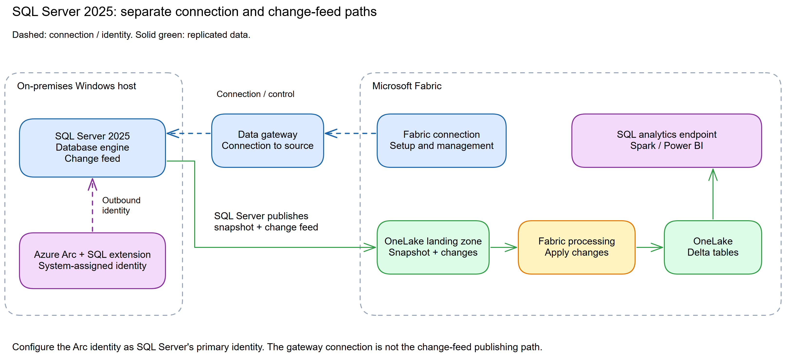
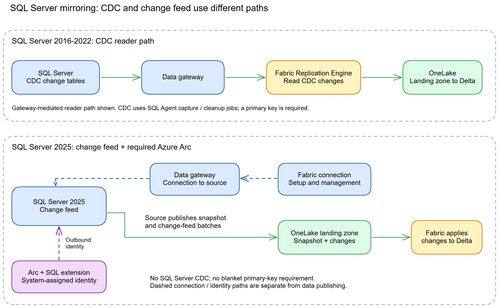
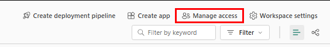
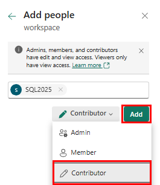
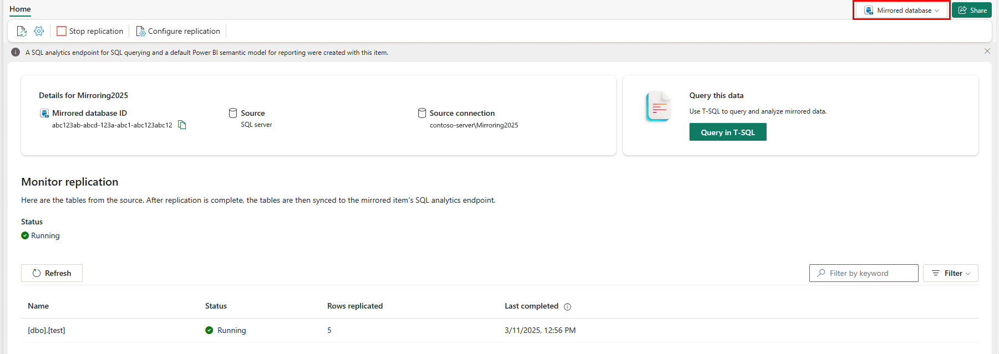

# Chapter 24: SQL Server 2025

> **Part 2: Source-Specific Mirroring Guides**
>
> **Purpose:** Use this chapter to configure SQL Server 2025 mirroring with Azure Arc, managed identity, a data gateway, and the built-in change feed.

**Part index:** [Chapters in Part 2](readme.md)

---

## Overview of the Source System

**SQL Server 2025** adds the change feed to the database engine. The connector requires Azure Arc and the Azure Extension for SQL Server.

---

## Mirroring Type and Architecture

- **Mirroring type**: Database mirroring
- **Method**: Source-managed change feed
- **Change mechanism**: Built-in SQL Server 2025 change feed
- **Connectivity**: Azure Arc managed identity for outbound authentication; an on-premises or VNet data gateway for the connection used in this walkthrough

Unlike SQL Server 2016–2022, SQL Server 2025 does not use SQL Server CDC for mirroring. The engine scans its transaction log and publishes changes through the change feed, and requires Azure Arc for outbound authentication. Azure Arc supplies the system-assigned managed identity used for that authentication. Keep this source-to-OneLake publishing path separate from the gateway connection that Fabric uses to reach SQL Server.

**Architecture flow:**

[](../assets/diagrams/chapter-24/diagram-01.excalidraw.png)
*Figure 24.1: SQL Server 2025 mirroring with Azure Arc and a data gateway*

[](../assets/diagrams/chapter-24/diagram-02.excalidraw.png)
*Figure 24.2: CDC for SQL Server 2016–2022 compared with the SQL Server 2025 change feed*

---

## Network and Connectivity

| Question | Answer |
|---|---|
| **Data gateway required?** | The version-specific tutorial configures an on-premises or VNet data gateway, in addition to Azure Arc onboarding. Use that path for private source access. |
| **Private connectivity?** | A gateway can reach SQL Server over a private network. It does not make the engine's outbound change feed or Azure Arc authentication private automatically, nor does it prove support for Fabric workspace Private Link. |
| **Outbound-restricted source network?** | Check both hosts: the gateway needs its service endpoints and access to SQL Server's configured port; the SQL Server/Arc host needs outbound authentication and change-feed connectivity. Do not allow only gateway traffic and assume the SQL Server host can remain isolated. |

The [tutorial prerequisites](https://learn.microsoft.com/en-us/fabric/mirroring/sql-server-tutorial#prerequisites) describe gateways conditionally for sources that are not publicly accessible, whereas its SQL Server 2025 steps prescribe a gateway. Follow the documented gateway walkthrough here and validate any alternative with Microsoft. The [Arc managed-identity guidance](https://learn.microsoft.com/en-us/sql/sql-server/azure-arc/managed-identity?view=sql-server-ver17) also requires Azure public-cloud access for Microsoft Entra authentication. Workspace outbound access protection is a separate control: [SQL Server is listed as a supported mirrored source](https://learn.microsoft.com/en-us/fabric/security/workspace-outbound-access-protection-mirrored-databases), but the workspace Admin must explicitly allow its connection using a data connection rule. That rule does not establish the engine's outbound publishing route.

---

## Setup Walkthrough

### 1. Approve the SQL Server 2025 path

Select the **SQL Server 2025** tab in the [Microsoft Learn tutorial](https://learn.microsoft.com/en-us/fabric/mirroring/sql-server-tutorial?tabs=sql2025). Begin with a recoverable non-production database; SQL Server 2025 uses the external mirroring change feed, **not CDC**.

| Owner | Required preparation |
|---|---|
| SQL Server DBA | Confirm SQL Server 2025, supported database/tables, connection principal, snapshot window, source resources, and log-growth response. |
| Windows/Azure administrator | Onboard the Windows host to Azure Arc, register required providers, install/verify the SQL extension, and enable the instance's primary system-assigned identity. |
| Entra administrator | Check tenant alignment; if using inbound Entra SQL authentication, authorize the documented directory lookup permissions separately. |
| Network/gateway administrator | Permit gateway-to-SQL connectivity, gateway outbound services, and SQL/Arc host outbound publishing/authentication. |
| Fabric tenant/workspace administrators | Active capacity, required tenant settings, Admin/Member creator, item identity grants, and AG secondary-node grants if applicable. |
| Data/security owner | Approve replicated data and reapply analytical security before sharing. |

The current [platform limitations](https://learn.microsoft.com/en-us/fabric/mirroring/sql-server-limitations#platform-limitations) exclude SQL Server 2025 on Azure VMs and Linux. Use the documented on-premises Windows path; an Arc-enabled but unsupported host is still unsupported. The [2025 edition matrix](https://learn.microsoft.com/en-us/sql/sql-server/editions-and-components-of-sql-server-2025?view=sql-server-ver17#replication) lists mirroring for Enterprise, Standard, and Express; do not import SQL Server 2016–2022 CDC edition/Agent requirements into this branch.

As a DBA, inspect the instance and the intended **source database**:

```sql
SELECT SERVERPROPERTY('ProductVersion') AS product_version,
       SERVERPROPERTY('Edition') AS edition;
GO
USE [<SOURCE_DATABASE>];
SELECT name, is_read_only, is_cdc_enabled, is_published,
       delayed_durability_desc, log_reuse_wait_desc
FROM sys.databases
WHERE database_id = DB_ID();
```

Replace `<SOURCE_DATABASE>` throughout. Inspect all replication configurations as well as this query: SQL Server replication, CDC, Azure Synapse Link, delayed durability, and mirroring into another workspace are incompatible. Only an AG primary can be used; failover cluster instances are unsupported. Do not disable a business CDC/replication workload without an approved migration.

### 2. Connect the host to Azure Arc and verify the SQL extension

Follow the [Arc onboarding quickstart](https://learn.microsoft.com/en-us/azure/azure-arc/servers/quick-enable-hybrid-vm) as the Azure/Windows administrator:

1. Select the subscription/resource group in the same Entra tenant as Fabric. Confirm permissions from the [Arc prerequisites](https://learn.microsoft.com/en-us/azure/azure-arc/servers/prerequisites#required-permissions) and local Administrator rights on Windows.
2. Ensure subscription resource providers **Microsoft.HybridCompute**, **Microsoft.GuestConfiguration**, **Microsoft.HybridConnectivity**, and **Microsoft.AzureArcData** are registered. Confirm supported OS/region and the [Arc network prerequisites](https://learn.microsoft.com/en-us/azure/azure-arc/servers/network-requirements).
3. In Azure **Machines – Azure Arc**, choose **Onboard/Create → Onboard existing machines**. Set the subscription, resource group, region, Windows OS, approved connectivity/proxy, and authentication method.
4. Generate and **review** the installation script, then run it from an elevated 64-bit PowerShell session on the intended SQL host. Do not run an unreviewed download-and-execute command or share onboarding credentials.
5. Verify the Arc machine is **Connected**. The mirroring tutorial says the Azure Extension for SQL Server installs automatically during onboarding; verify that it actually exists, is healthy/current, and discovers the intended SQL instance.
6. For an AG, repeat the checks on **every node**. One healthy Arc resource does not prepare the other replicas.

Azure Arc Gateway, where used for Arc connectivity, is not the Fabric on-premises/VNet data gateway. Do not confuse these two services.

### 3. Enable SQL Server's primary managed identity

An Arc machine identity existing is not enough: it must be associated with the **SQL Server instance**. Use the supported portal procedure in [Set up managed identity](https://learn.microsoft.com/en-us/sql/sql-server/azure-arc/microsoft-entra-authentication-with-managed-identity?view=sql-server-ver17):

1. Open the **SQL Server enabled by Azure Arc** resource for the instance.
2. Under **Settings → Microsoft Entra ID and Purview**, select **Use a primary managed identity**, then **Save**. Older portal versions label this page **Microsoft Entra ID**.
3. As the SQL administrator, query `master` and wait for configuration to finish:

```sql
USE [master];
SELECT * FROM sys.dm_server_managed_identities;
```

The tutorial expects **exactly one row**, the correct `client_id` and `tenant_id`, and `identity_type` **System-assigned**. Match those values to the Arc host resource. UAMI and an app registration are not substitutes for the required outbound identity.

Use the portal path rather than manually editing registry values. The linked manual procedure includes service-account Tokens-folder access and Hybrid agent extension group membership; those are sensitive host changes for the administrator, not permissions to grant to analysts. Never copy token-folder contents into a support message.

If choosing **inbound Entra authentication** for SQL connections, the setup guide also requires the identity's Microsoft Graph application permissions **User.Read.All**, **GroupMember.Read.All**, and **Application.Read.All**, granted by a Privileged Role Administrator or higher. Apply them through the documented identity setup, resolving the exact service principal. These directory-read permissions are separate from Fabric item Write and SQL database grants; do not grant broad Directory Readers by habit or assume a Basic SQL login requires the same inbound-authentication setup.

### 4. Create the Fabric-to-SQL connection principal

The publishing identity from step 3 is different from the connection account. The DBA creates this SQL login in **`master`**, using a unique secret obtained through the approved secret-management process:

```sql
USE [master];
CREATE LOGIN [fabric_login]
WITH PASSWORD = '<REPLACE_WITH_A_UNIQUE_SECRET>';
GO
USE [<SOURCE_DATABASE>];
CREATE USER [fabric_user] FOR LOGIN [fabric_login];
GRANT SELECT, ALTER ANY EXTERNAL MIRROR,
      VIEW DATABASE PERFORMANCE STATE, VIEW DATABASE SECURITY STATE
TO [fabric_user];
```

SQL authentication must already be permitted by the instance; do not change its authentication mode casually. Do not grant temporary `sysadmin` as in Chapter 23: no CDC setup is being performed here.

Alternatively, after completing the Entra prerequisites, the Entra administrator can create the existing identity's login in `master` and map it in the source:

```sql
USE [master];
CREATE LOGIN [<EXISTING_ENTRA_PRINCIPAL_NAME>] FROM EXTERNAL PROVIDER;
GO
USE [<SOURCE_DATABASE>];
CREATE USER [<EXISTING_ENTRA_PRINCIPAL_NAME>]
FOR LOGIN [<EXISTING_ENTRA_PRINCIPAL_NAME>];
GRANT SELECT, ALTER ANY EXTERNAL MIRROR,
      VIEW DATABASE PERFORMANCE STATE, VIEW DATABASE SECURITY STATE
TO [<EXISTING_ENTRA_PRINCIPAL_NAME>];
```

Choose one path; use a client that understands `GO` or run batches separately. Inspect existing names/mappings rather than rerunning `CREATE`. Reconnect as the intended connection principal and verify `DB_NAME()`, `USER_NAME()`, and `sys.fn_my_permissions(NULL, 'DATABASE')`.

For an AG, prepare the login on every instance with the **same SID**, correct authentication material, and mapped-user permissions. Use the listener in Fabric. Coordinate this with the DBA; user databases replicate, but server logins do not.

### 5. Prepare Fabric identity grants and both network paths

The Fabric administrator enables **Service principals can use Fabric APIs** and **Users can access data stored in OneLake with apps external to Fabric**, checking any scope restrictions. The capacity must be active.

The creator must be a workspace **Admin or Member**. On portal creation, Fabric grants the source identity **Read and Write** on the mirrored database item. A workspace Contributor cannot perform the required Reshare operation.

**AG only:** before failover acceptance, a workspace administrator adds **every secondary node's system-assigned identity** as a workspace **Contributor**, as specifically required by the tutorial. Resolve the identity by its recorded ID as well as its display name. This is broad workspace access; assess the workspace's other data and do not generalize it into granting Contributor to every connection user.


*Figure 24.3: Open workspace access management for the documented AG secondary-identity step. From the [Microsoft Learn SQL Server 2025 tutorial](https://learn.microsoft.com/en-us/fabric/mirroring/sql-server-tutorial?tabs=sql2025). Image: Microsoft, [original](https://raw.githubusercontent.com/MicrosoftDocs/fabric-docs/main/docs/mirroring/media/sql-server-tutorial/manage-access.png), [CC BY 4.0](https://creativecommons.org/licenses/by/4.0/), unchanged.*


*Figure 24.4: Choose the correct node identity and Contributor role; this is not the SQL login grant. From the [Microsoft Learn SQL Server 2025 tutorial](https://learn.microsoft.com/en-us/fabric/mirroring/sql-server-tutorial?tabs=sql2025). Image: Microsoft, [original](https://raw.githubusercontent.com/MicrosoftDocs/fabric-docs/main/docs/mirroring/media/sql-server-tutorial/add-people.png), [CC BY 4.0](https://creativecommons.org/licenses/by/4.0/), unchanged.*

Now have the network/gateway administrator prove both paths:

1. **Fabric → gateway → SQL:** install/register a standard [on-premises gateway](https://learn.microsoft.com/en-us/data-integration/gateway/service-gateway-install) or create a [VNet gateway](https://learn.microsoft.com/en-us/data-integration/vnet/create-data-gateways). Protect the recovery key, authorize connection use, and test DNS, the actual SQL listening port, credentials, and encrypted SQL connectivity from its network.
2. **Gateway → service:** permit its [documented outbound services](https://learn.microsoft.com/en-us/data-integration/gateway/service-gateway-communication); no inbound Internet gateway rule is needed.
3. **SQL/Arc host → identity and publishing services:** validate Arc/extension health, public-cloud Entra connectivity, and the source-to-Fabric publishing path with the security guidance. A SQL connection test through the gateway does not validate this direction.

**If choosing the VNet gateway:** the [gateway creation guide](https://learn.microsoft.com/en-us/data-integration/vnet/create-data-gateways) additionally requires a supported region, same-tenant deployment, eligible capacity, and subscription registration of `Microsoft.PowerPlatform`. Have a network administrator with subnet `join/action` permission create a dedicated subnet and delegate it to `Microsoft.PowerPlatform/vnetaccesslinks`; it cannot be shared with other services. Then open **Settings → Manage connections and gateways → Virtual network (VNet) data gateway → New**, select the capacity and Azure network/subnet details, and save. Prove routing and DNS from that subnet to the on-premises SQL listener before selecting this gateway in the mirror connection.

If workspace outbound access protection is already enabled, confirm the source's **data connection rule** is in place before attempting the connection. Do not disable the workspace policy to work around a missing rule.

Use a SQL certificate trusted by the gateway with the correct server/listener name. The tutorial's local SSMS **Trust server certificate** setting is not a recommendation to disable production certificate validation. The tutorial does not provide a single SQL Server 2025-specific minimal egress allow-list covering every Arc, identity, and OneLake dependency; validate the linked service requirements and actual errors with network owners rather than inventing static IP rules. Gateway private connectivity also does not prove workspace Private Link/outbound-protection support.

### 6. Create a probe, connect, select, and start

With DBA approval, create this once in the disposable **source database** using an authorized writer, not the replication principal:

```sql
USE [<SOURCE_DATABASE>];
IF OBJECT_ID(N'dbo.MirrorSetupProbe24', N'U') IS NOT NULL
    THROW 50000, 'Probe already exists; use a new approved name.', 1;
CREATE TABLE dbo.MirrorSetupProbe24
(
    ProbeId int NOT NULL PRIMARY KEY,
    Note varchar(40) NOT NULL,
    ChangedAt datetime2(6) NOT NULL
);
INSERT dbo.MirrorSetupProbe24 (ProbeId, Note, ChangedAt)
VALUES (1, 'snapshot', SYSUTCDATETIME()),
       (2, 'before-update', SYSUTCDATETIME());
```

1. In Fabric, open the approved workspace and select **Create** or **+ New item → Mirrored SQL Server database**. There is no separate SQL Server 2025 item type.
2. Name the item and choose **New sources → SQL Server database**, or a verified existing connection.
3. Enter the **Server** FQDN/listener and **Database** name. Despite ambiguous wording in the tutorial, the Database field is the user database, not the SQL instance name.
4. Name the connection, choose the prepared gateway, and select the authentication kind matching the provisioned principal. Basic uses `fabric_login`, not its differently named mapped user. Enter credentials only into the approved connection fields.
5. Select **Use encrypted connection → Connect**. Resolve validation failures before continuing.
6. For a controlled trial, turn off **Mirror all data** and select `dbo.MirrorSetupProbe24` and explicitly approved tables. Inspect column warnings and unsupported-table errors. Alternatively approve **Mirror all data**, which discovers future eligible tables subject to the 1,000-table cap.
7. Select **Create mirrored database**, then **Monitor replication**. Inspect initial-copy progress and table timestamps; the tutorial's 2–5 minutes is an observation interval, not a guaranteed finish time.


*Figure 24.5: Verify initial-copy progress and Last completed. From the [Microsoft Learn SQL Server 2025 tutorial](https://learn.microsoft.com/en-us/fabric/mirroring/sql-server-tutorial?tabs=sql2025). Image: Microsoft, [original](https://raw.githubusercontent.com/MicrosoftDocs/fabric-docs/main/docs/mirroring/media/sql-server-tutorial/monitor-replication.png), [CC BY 4.0](https://creativecommons.org/licenses/by/4.0/), unchanged. Historical UI banners are illustrative.*

### 7. Verify snapshot and committed changes

After the table's initial copy completes, query the source and the mirror's **SQL analytics endpoint**:

```sql
SELECT ProbeId, Note, ChangedAt
FROM dbo.MirrorSetupProbe24
ORDER BY ProbeId;
```

Expect keys 1 and 2. Run the following statements **separately on the source**, in autocommit mode. After each statement, query both sides until the matching state is visible:

```sql
INSERT dbo.MirrorSetupProbe24 (ProbeId, Note, ChangedAt)
VALUES (3, 'insert-check', SYSUTCDATETIME());
```

```sql
UPDATE dbo.MirrorSetupProbe24
SET Note = 'update-check', ChangedAt = SYSUTCDATETIME()
WHERE ProbeId = 2;
```

```sql
DELETE FROM dbo.MirrorSetupProbe24 WHERE ProbeId = 1;
```

The final keys are 2 and 3, with row 2 updated. Record source commit and target visibility times. **Rows replicated** counts operations repeatedly; it is not the live table cardinality.

If monitoring advances but SQL is stale, use the [documented OneLake/SQL endpoint separation](https://learn.microsoft.com/en-us/fabric/mirroring/troubleshooting#data-doesnt-appear-to-be-replicating). Validate Delta data through a Lakehouse shortcut/Spark if needed, then refresh SQL endpoint metadata. Do not reset the source identity or change feed for endpoint-only lag.

### 8. Accept operations and plan log protection

Verify the source identity still has item **Read and Write**, record connection/gateway/Arc ownership, and reapply RLS, masking, and granular analytical access before sharing. In an AG maintenance exercise, verify approved failover with listener connectivity, login SID mapping, all node identities, and new insert/update/delete tests.

Monitor source CPU/I/O, log usage, `log_reuse_wait_desc`, change-feed errors, Arc extension health, gateway state, and Fabric table freshness. Unlike Azure SQL Database/MI, **SQL Server 2025 autoreseed is disabled by default**.

Before enabling it, the DBA should test its snapshot and analytical-staleness impact in the lab, then approve a threshold and follow [automatic reseed configuration](https://learn.microsoft.com/en-us/fabric/mirroring/sql-server-configure-automatic-reseed). For example, the documented `sys.sp_change_feed_configure_parameters` uses `@autoreseed = 1` and `@autoreseedthreshold = 70`; 70 is an example, not a universal production setting. Do not wait for operational writes to fail before agreeing the response.

A DDL change can reseed a table; Stop/Start reseeds the database's selected tables. Diagnose first using the source queries below. Retain the disposable probe for agreed checks or retire only that table and its selected-mirror entry under change control. Never disable source CDC, delete Arc resources, or remove identities as generic cleanup.

If deployments use `.dacpac`, the [SQL Server limitations](https://learn.microsoft.com/en-us/fabric/mirroring/sql-server-limitations#database-level-limitations) require `/p:DoNotAlterReplicatedObjects=False` to permit mirrored-object changes. Review the generated deployment script and expected reseed load before authorizing this setting; unsupported DDL remains unsupported.

---

## Nuances and Limitations

| Topic | Detail |
|---|---|
| **SQL Server 2025 only** | The change feed is not backported. SQL Server 2016–2022 uses the CDC path in Chapter 23. |
| **Azure Arc** | Azure Arc and the Azure Extension for SQL Server are required. |
| **Managed identity** | Only the Arc-enabled server's system-assigned managed identity is supported. |
| **Platform** | SQL Server 2025 on Azure VMs and Linux is not currently supported. |
| **CDC and replication compatibility** | A SQL Server 2025 database with CDC or SQL Server replication enabled cannot use this mirroring path. |
| **Keys and indexes** | Unlike the 2016–2022 path, the limitations do not impose a blanket primary-key requirement. A primary key, or clustered index when there is no primary key, must not use an unsupported type. |
| **Gateway** | This walkthrough uses an on-premises or VNet data gateway. Gateway access does not replace the source engine's outbound requirements. |
| **Always On AG** | Only the primary database is mirrored. Every secondary node's system-assigned managed identity needs Contributor on the workspace. Failover cluster instances are unsupported. |
| **Table limit** | Up to 1,000 tables. **Mirror all data** takes the first 1,000 sorted by schema and table name. |
| **DDL and restart** | A DDL change reseeds the affected table. Stopping and starting mirroring reseeds all tables. Partition switching and altering a primary key are not allowed while mirrored. |
| **Unsupported tables** | Clustered columnstore, temporal or ledger history, Always Encrypted, in-memory, graph, and external tables are unsupported. A `json` or `vector` column makes the table ineligible. |
| **Unsupported columns** | Computed columns, CLR/UDTs, spatial types, `hierarchyid`, `sql_variant`, `timestamp`/`rowversion`, `xml`, and legacy `image`/`text`/`ntext` types are not replicated. |
| **Value fidelity** | LOB values over 1 MB are truncated. Seven-digit temporal precision is reduced; `datetimeoffset(7)` also loses time-zone information. Keys or applicable clustered indexes using `datetime2(7)`, `datetimeoffset(7)`, or `time(7)` are unsupported. |
| **Other exclusions** | Delayed transaction durability, Azure Synapse Link for SQL, and mirroring the database into a second workspace are unsupported. The source and Fabric workspace must be in the same Entra tenant. |

---

## Source System Impact

- **Engine activity**: SQL Server scans the transaction log at high frequency to publish changes.
- **No CDC objects**: This path does not create or manage user CDC tables and jobs.
- **Gateway and network**: Monitor the gateway connection and source-to-Fabric publishing connectivity separately.
- **Gateway cost**: A VNet data gateway consumes its linked Fabric or Power BI Premium capacity at **4 CUs per running member**, based on uptime. Free core mirroring compute does not remove this gateway charge. See [gateway capacity consumption](https://learn.microsoft.com/en-us/data-integration/vnet/data-gateway-business-model).
- **Azure Arc**: Mirroring also depends on Arc extension health and the system-assigned managed identity.
- **Log growth and autoreseed**: Unreplicated changes can hold transaction-log truncation. SQL Server 2025 autoreseed is **disabled by default**. Review the [automatic reseed guide](https://learn.microsoft.com/en-us/fabric/mirroring/sql-server-configure-automatic-reseed) and test the full-snapshot impact before enabling it.
- **Workload controls**: SQL Server 2025 supports the documented change-feed dynamic scan settings and Resource Governor groups. Use the [performance guide](https://learn.microsoft.com/en-us/fabric/mirroring/sql-server-performance) rather than CDC-job tuning advice intended for earlier versions.

---

## Troubleshooting

| Symptom | Likely Cause | Resolution |
|---|---|---|
| Arc prerequisite fails | Server is not Arc-enabled or the SQL extension is unhealthy | Repair the Arc connection and Azure Extension for SQL Server |
| Managed identity error | SQL Server's primary identity is missing or its Fabric permission grant failed | Check `sys.dm_server_managed_identities`; follow the documented primary-identity repair steps rather than granting broad workspace access indiscriminately |
| Mirror cannot be created | CDC, replication, or another unsupported database feature is enabled | Review dependent workloads before removing that feature or choose a different supported source configuration |
| Gateway connection fails | Gateway cannot reach SQL Server or Fabric | Check gateway health, DNS, firewall, and credentials |
| Replication stops after failover | Secondary-node identity lacks workspace access | Grant each participating node's identity the required permission |
| Transaction log fills with `REPLICATION` wait | Change feed cannot publish or commit changes quickly enough | Check change-feed errors and connectivity; assess autoreseed and source workload controls before the log reaches its maximum |

For source-side diagnostics, run these in the mirrored user database:

```sql
SELECT * FROM sys.dm_change_feed_log_scan_sessions;
SELECT * FROM sys.dm_change_feed_errors;
EXEC sys.sp_help_change_feed;
```

See the [SQL Server troubleshooting guide](https://learn.microsoft.com/en-us/fabric/mirroring/sql-server-troubleshoot?tabs=sql2025) for interpreting the results and repairing primary managed identity configuration.

---

## Comparison: SQL Server 2016–2022 and SQL Server 2025

| Feature | SQL Server 2016–2022 | SQL Server 2025 |
|---|---|---|
| **Change mechanism** | SQL Server CDC | Change feed |
| **Documented private-source connection** | On-premises or VNet data gateway | On-premises or VNet data gateway, plus source outbound publishing |
| **Azure Arc** | Not required | Required |
| **CDC state** | Required; prepared by the DBA or configured by Fabric with setup permission | Must be disabled |
| **Managed identity** | Not required for the CDC path | Arc system-assigned identity required |
| **Primary key** | Required | No blanket requirement; key/index type restrictions apply |
| **Linux support** | Supported for documented versions | Not currently supported |

---

## Public issues and common pitfalls

**Evidence review: 8 October 2026.** Searches started with Reddit using SQL Server 2025-specific terms, but thread bodies could not be independently verified because Reddit access was blocked. The dated Fabric Community report below was read directly and its posting date verified from public metadata. It is **anecdotal**; the other entries are documented guidance, and older CDC reports are not relabeled as SQL Server 2025 evidence.

| Evidence and source date | Practical implication |
|---|---|
| **Community report, 12 January 2026:** [Unable to set up mirroring with on-prem SQL 2025](https://community.fabric.microsoft.com/discussions/ac_generaldiscussion/unable-to-setup-mirroring-with-on-prem-sql-2025-instance/4916928) | The author reports `PowerBI user with prefix undefined not found` despite checking tenant permissions. The [current official troubleshooting procedure](https://learn.microsoft.com/en-us/fabric/mirroring/sql-server-troubleshoot?tabs=sql2025#unable-to-grant-required-permission-to-the-source-server) addresses that exact error through primary-identity repair. The post does not establish a root cause or a confirmed fix for that deployment. SQL authentication remains a documented option in the 2025 tutorial; this identity error alone is not a reason to replace it. |
| **Documented:** [Tutorial](https://learn.microsoft.com/en-us/fabric/mirroring/sql-server-tutorial?tabs=sql2025), 3 April 2026; [limitations](https://learn.microsoft.com/en-us/fabric/mirroring/sql-server-limitations), 15 May 2026 | Arc onboarding alone is insufficient; the SQL instance needs the primary system-assigned identity. SQL Server 2025 on Azure VMs/Linux remains excluded by these pages. |
| **Documented:** [Primary-identity error repair](https://learn.microsoft.com/en-us/fabric/mirroring/sql-server-troubleshoot?tabs=sql2025#unable-to-grant-required-permission-to-the-source-server), 6 April 2026 | `PowerBI user with prefix undefined not found` has a specific identity-repair procedure. Capture IDs/state first. Its delete/recreate and identity-toggle steps are a planned repair for that diagnosed failure, not the first thing to try for any connection error. |
| **Documented:** [AG identity permissions](https://learn.microsoft.com/en-us/fabric/mirroring/sql-server-tutorial?tabs=sql2025#add-managed-identities-permissions-in-microsoft-fabric) | A primary can mirror successfully while failover remains unprepared. Secondary-node SAMIs need the documented Contributor grant, and logins need matching SIDs. |
| **Documented:** [Automatic reseed](https://learn.microsoft.com/en-us/fabric/mirroring/sql-server-configure-automatic-reseed), 8 July 2026 | `REPLICATION` log-reuse waits can threaten OLTP writes. Autoreseed is opt-in here and trades catch-up for a fresh snapshot; it is not simply a gateway retry setting. |
| **Documentation boundary:** [Tutorial networking](https://learn.microsoft.com/en-us/fabric/mirroring/sql-server-tutorial?tabs=sql2025) and [Arc managed identity](https://learn.microsoft.com/en-us/sql/sql-server/azure-arc/managed-identity?view=sql-server-ver17) | Generic prerequisites mention gateways conditionally, while the 2025 walkthrough prescribes one. This chapter follows that walkthrough and does not claim an independently verified gatewayless or fully private publishing deployment. |

### Public references reviewed

Reviewed **7 October 2026**: [2025 setup tutorial](https://learn.microsoft.com/en-us/fabric/mirroring/sql-server-tutorial?tabs=sql2025), [limitations](https://learn.microsoft.com/en-us/fabric/mirroring/sql-server-limitations), [troubleshooting](https://learn.microsoft.com/en-us/fabric/mirroring/sql-server-troubleshoot?tabs=sql2025), [Arc onboarding](https://learn.microsoft.com/en-us/azure/azure-arc/servers/quick-enable-hybrid-vm), [primary-identity setup](https://learn.microsoft.com/en-us/sql/sql-server/azure-arc/microsoft-entra-authentication-with-managed-identity?view=sql-server-ver17), [automatic reseed](https://learn.microsoft.com/en-us/fabric/mirroring/sql-server-configure-automatic-reseed), and [security](https://learn.microsoft.com/en-us/fabric/mirroring/sql-server-security). The three screenshots are from the public Fabric tutorial repository under its [CC BY 4.0 license](https://github.com/MicrosoftDocs/fabric-docs/blob/main/LICENSE); no Arc documentation image license has been assumed.

Rechecked **8 October 2026**: the version-tabbed tutorial, limitations, troubleshooting, primary-identity setup, automatic reseed, and security articles; additionally, [VNet gateway creation](https://learn.microsoft.com/en-us/data-integration/vnet/create-data-gateways), [workspace outbound protection for mirrored sources](https://learn.microsoft.com/en-us/fabric/security/workspace-outbound-access-protection-mirrored-databases), and the dated forum report above.

---

## Summary

SQL Server 2025 uses the built-in change feed with Azure Arc, a system-assigned managed identity, and a data gateway. SQL Server 2025 requires Azure Arc; do not enable CDC on the source database. See the current [SQL Server mirroring overview](https://learn.microsoft.com/en-us/fabric/mirroring/sql-server), [tutorial](https://learn.microsoft.com/en-us/fabric/mirroring/sql-server-tutorial), [security guidance](https://learn.microsoft.com/en-us/fabric/mirroring/sql-server-security), and [limitations](https://learn.microsoft.com/en-us/fabric/mirroring/sql-server-limitations).

**Contents:** [Table of Contents](../index.md) | **Previous:** [Chapter 23: SQL Server 2016–2022](chapter-23.md) | **Next:** [Chapter 25: Fabric SQL Database](chapter-25.md)
