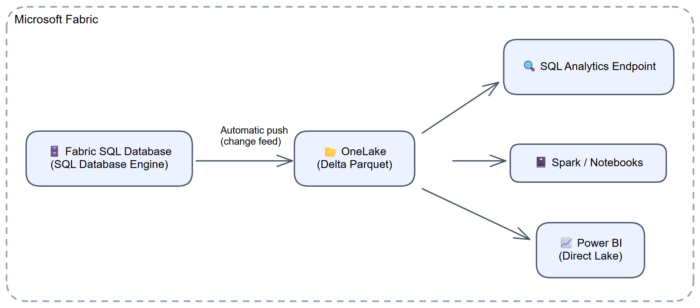
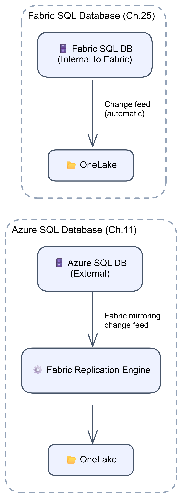
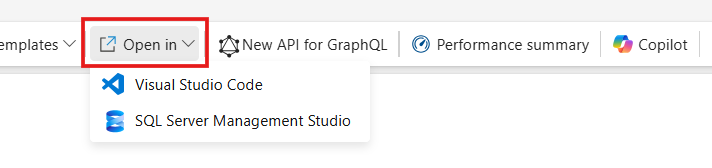
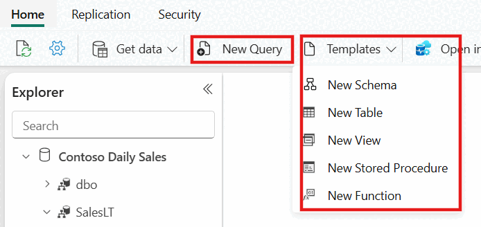
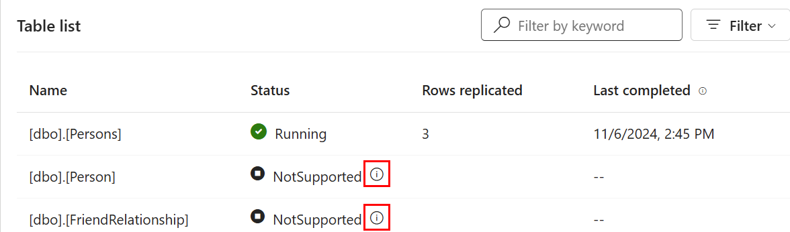

# Chapter 25: Fabric SQL Database

> **Part 2: Source-Specific Mirroring Guides**
>
> **Purpose:** Use this chapter to understand automatic mirroring for SQL database in Fabric, its query surfaces, operational behaviour, and current limitations.

**Part index:** [Chapters in Part 2](readme.md)

---

## Overview of the Source System

**SQL database in Microsoft Fabric** is a managed transactional database built on the same SQL Database Engine as Azure SQL Database. Unlike external sources, it **automatically mirrors its data into OneLake** when you create the database.

SQL database in Fabric is designed for:

- **Intelligent applications and AI**: Vector data types, Azure OpenAI integration, and RAG patterns.
- **Reverse ETL**: Pushing curated analytical data back into operational systems via APIs and GraphQL endpoints.
- **Operational Data Store (ODS)**: Consolidating data from multiple operational systems into a normalised near-real-time store.
- **Translytical applications**: Applications that need both transactional and analytical access to the same data.

---

## Mirroring Type and Architecture

- **Mirroring type**: Database mirroring
- **Method**: Push-based (automatic, engine-level integration)
- **Change mechanism**: Built-in change feed over the SQL transaction log

Fabric SQL database mirroring is **enabled automatically**. It uses the change feed, not customer-configured SQL Server CDC. When you create a SQL database in Fabric, two items are provisioned in your workspace:

1. **The SQL database itself**: the read/write OLTP transactional database.
2. **The SQL analytics endpoint**: a read-only T-SQL interface over the mirrored Delta tables in OneLake.

The database engine continuously pushes changes from the transaction log into OneLake, where they are stored as Delta Parquet files. This happens entirely within Fabric, with no external connectivity, user-managed credentials, or replication agent.

**Architecture flow:**

[](../assets/diagrams/chapter-25/diagram-01.excalidraw.png)
*Figure 25.1: Fabric SQL Database automatic mirroring within Fabric*

**Key distinction from Azure SQL Database mirroring:**

[](../assets/diagrams/chapter-25/diagram-02.excalidraw.png)
*Figure 25.2: Azure SQL Database change feed compared with Fabric SQL Database automatic mirroring*

---

## Change Event Streaming (September 2026 Preview)

The [FabCon summary announces Change Event Streaming for SQL database in Fabric in Preview](https://community.fabric.microsoft.com/blog/fbc_fabricupdatesblogs/fabric-september-2026-feature-summary/5325825#community-5325825-mcetoc_1k3kj91s5_118): committed insert/update/delete events are streamed from the transaction log into Eventstream as **CloudEvents JSON**. This complements automatic OneLake mirroring; it is not the same as consuming a mirrored Delta table's CDF.

The summary's [linked event-streaming tutorial](https://learn.microsoft.com/en-us/fabric/real-time-intelligence/event-streams/stream-sql-change-events-to-eventstream) currently demonstrates Azure SQL Database/SQL Server rather than establishing the newly announced Fabric SQL setup. Do not run those source-configuration commands against Fabric SQL by analogy or disable automatic mirroring to use the announcement. Follow the supported Fabric SQL procedure when available; [Chapter 9](../Part%201%20-%20Concepts%20and%20Architecture/chapter-09.md#consuming-cdf-in-fabric-workloads) covers the separate mirrored-CDF consumer path.

## Network and Connectivity

| Question | Answer |
|---|---|
| **Data gateway required?** | No. There is no external source system, so no gateway of any kind applies. |
| **Private endpoint support?** | Client access to the SQL database and its SQL analytics endpoint supports Fabric tenant-level and workspace-level Private Link; workspace-level support is preview. This is separate from automatic internal mirroring. |
| **Outbound restrictions?** | There is no external source connection or customer gateway to configure for mirroring. Client firewall requirements and Fabric workspace outbound access protection are separate concerns; do not infer their support from mirroring being automatic. |

See the [SQL database private-connectivity entry](https://learn.microsoft.com/en-us/fabric/database/sql/limitations#platform-capabilities) and [Private Link guidance for SQL database](https://learn.microsoft.com/en-us/fabric/security/security-private-links-overview#sql-database).

---

## Setup Walkthrough

### 1. Approve automatic inclusion before creating the database

Use the [Create a SQL database tutorial](https://learn.microsoft.com/en-us/fabric/database/sql/create) and the [automatic mirroring overview](https://learn.microsoft.com/en-us/fabric/database/sql/mirroring-overview). This walkthrough creates a **SQL database**, not a **Mirrored Azure SQL Database** or generic external-source mirrored item. There is no source-connection wizard, table-selection screen, gateway, CDC job, Azure Arc onboarding, or customer-managed publishing credential.

| Owner | Decision or prerequisite |
|---|---|
| Fabric capacity/workspace administrator | Active Fabric capacity or trial, workspace, and region supporting both SQL database and its mirroring. Check region under **Workspace settings → Workspace type**. |
| Creator | Workspace **Admin or Member** for database creation, as required by the creation tutorial. SQL database is enabled by default in Fabric tenants. |
| Database/data owner | Approve automatic inclusion of every eligible table/column in OneLake; review the 1,000-table cap and unsupported features before designing/importing the schema. |
| Entra/security administrator | Appropriate user/application identities and Fabric item permissions; separate transactional, SQL endpoint, and direct OneLake access decisions. |
| Network administrator | Client access to Fabric and SQL, including Private Link/DNS if deployed. This is client connectivity, not an external-source mirroring gateway. |
| Operations owner | Monitoring, resource/freshness baselines, serverless-pause expectations, schema-change review, and escalation. |

Choose a dedicated test database/workspace for the first walkthrough. The [database limitations](https://learn.microsoft.com/en-us/fabric/database/sql/limitations) currently limit trial capacity to three SQL databases and require unique database names; a deleted database name cannot simply be reused. Do not delete an existing database to make space without an explicit retention decision.

All eligible tables are included automatically, with no per-table opt-out. A column that works in the transactional engine is not necessarily supported in the mirror: native `json`/`vector`, computed columns, large values, and unsupported keys need review. If a table must never be copied to OneLake, do not load it assuming an exclusion checkbox will appear later.

**Full-text indexing documentation conflict, checked 8 October 2026:** the [general database feature matrix](https://learn.microsoft.com/en-us/fabric/database/sql/limitations#features-of-azure-sql-database-and-fabric-sql-database) lists full-text search as preview, while the [mirroring limitations](https://learn.microsoft.com/en-us/fabric/database/sql/mirroring-limitations#table-level) still say full-text indexing is unsupported and cannot be created. If the intended schema depends on it, obtain clarification and validate a disposable deployment before import; do not assume the preview entry establishes mirroring compatibility.

### 2. Create the database and identify both query surfaces

1. Sign in to the Fabric portal with the approved Entra identity and open the intended workspace.
2. Select **Databases** and under **New** choose **SQL database**.
3. Give the database an approved unique name and select **Create**.
4. Wait for provisioning. Fabric creates the **transactional SQL database** and its **SQL analytics endpoint** in the same workspace; automatic mirroring is enabled without another Start action.
5. Open the database's **Home** page. The **Explorer** lists transactional objects. Under **Build your database**, **T-SQL** opens the editor, **Connection strings** supplies client details, and **Sample data** can populate a brand-new empty database.

For this exercise use the small table below rather than loading a business export. If you choose [AdventureWorks sample data](https://learn.microsoft.com/en-us/fabric/database/sql/load-adventureworks-sample-data) instead, do so before creating any objects: the sample-load option disappears after objects exist, and the tutorial says not to modify the database while that import runs.

| Surface | Use it for | Do not use it for |
|---|---|---|
| SQL database / transactional query editor | Creating tables and committing inserts, updates, and deletes | Assuming every supported OLTP feature will mirror |
| SQL analytics endpoint | Read-only queries against mirrored OneLake tables, analytical views, and endpoint security | Writing rows back to the transactional database |

### 3. Connect securely; do not create an external mirroring login

SQL database in Fabric uses **Microsoft Entra authentication only**. For a first test, its built-in query editor avoids local client setup. For SSMS or the MSSQL extension in VS Code:

1. Open the SQL database item and select **Settings → Connection strings**, or **Open in → SQL Server Management Studio / Visual Studio Code**.
2. Copy the actual **Server name** and **Database name** from the transactional database's connection information. Do not construct a hostname from an example or use the analytics endpoint's hostname by mistake.
3. In SSMS choose an Entra authentication method such as **Microsoft Entra ID – Universal with MFA support**, set **Connect to database** to the copied database name, and keep encryption/certificate validation enabled.
4. Sign in to the correct tenant and run `SELECT DB_NAME(), USER_NAME();` to confirm the intended database/user.
5. Open a separate connection/query tab for the **SQL analytics endpoint** when validating the mirror. Label the two tabs clearly to prevent writes being attempted on the read-only surface.


*Figure 25.3: Open the transactional database in SQL tools. Companion to the [database creation tutorial](https://learn.microsoft.com/en-us/fabric/database/sql/create), from [Connect to your SQL database](https://learn.microsoft.com/en-us/fabric/database/sql/connect). Image: Microsoft, [original](https://raw.githubusercontent.com/MicrosoftDocs/fabric-docs/main/docs/database/sql/media/connect/open-in-sql-tools.png), [CC BY 4.0](https://creativecommons.org/licenses/by/4.0/), unchanged.*

The [documented public connection policy](https://learn.microsoft.com/en-us/fabric/database/sql/limitations#connection-policy) is **Default** and cannot be changed. Network administrators must allow outbound client traffic to regional Azure SQL gateway addresses on TCP **1433** and regional Azure SQL addresses on **11000–11999**. Use the current regional SQL service-tag/IP guidance, not a static copied list. For Private Link, validate the applicable Fabric setup, private DNS, and routes instead; public-client rules alone are not a private-connectivity design.

There is **no** `CREATE LOGIN ... WITH PASSWORD`, `sp_cdc_enable_db`, or external-mirror grant to run for this automatic mirroring setup. Those instructions belong to other sources.

### 4. Prepare a narrowly scoped test writer if needed

The database creator can run the test as its administrator. If an application/test operator will perform the writes instead, have the database administrator configure both authorization layers:

1. Grant the chosen existing Entra user/application **Read** on the **SQL database item** in Fabric: choose the item's **… → Share**, select the recipient, leave **all additional data-access permissions unchecked**, and select **Grant**. The [sharing guide](https://learn.microsoft.com/en-us/fabric/database/sql/share-sql-manage-permission) explains that this grants connection/property access, not table reads. SQL `GRANT CONNECT` alone cannot replace the item permission.
2. After the probe table exists, create its database user and grant only the probe's DML permissions. Do not give the operator workspace Contributor or item Write just to run a smoke test.
3. Reconnect as that user to test effective access; assess its existing group/workspace grants because those can confer more access than this table grant.

Check the item's **… → Manage permissions** as well as SQL grants. Microsoft documents that Fabric permission changes can take **up to two hours** to become visible; SQL catalog views do not show item-level grants. Do not add workspace roles or broad ReadAll merely to bypass propagation delay. The Share dialog's separate **SQL database**, **SQL analytics endpoint**, and **Apache Spark** data-access choices must match the approved consumer path.

For a new, approved principal, the database administrator can use the following **in the transactional database after creating the table in step 5**:

```sql
CREATE USER [<EXISTING_ENTRA_TEST_WRITER>] FROM EXTERNAL PROVIDER;
GRANT SELECT, INSERT, UPDATE, DELETE
ON OBJECT::dbo.MirrorSetupProbe25
TO [<EXISTING_ENTRA_TEST_WRITER>];
```

Replace the name with the actual directory principal; inspect an existing user rather than rerunning `CREATE`. Follow [granular access configuration](https://learn.microsoft.com/en-us/fabric/database/sql/configure-sql-access-controls) for group/application resolution. The application should acquire Entra tokens through an approved credential flow; do not embed tokens/client secrets in shared queries, notebooks, screenshots, or this book. Access to the analytical endpoint is a separate acceptance check, not conferred by this source table grant.

### 5. Create an approved disposable table and observe materialization

In the **transactional database**, select **New Query/New SQL query**, paste the following, verify the active database, and select **Run**. Execute it once with table-creation permission:

```sql
IF OBJECT_ID(N'dbo.MirrorSetupProbe25', N'U') IS NOT NULL
    THROW 50000, 'Probe already exists; use a new approved name.', 1;
CREATE TABLE dbo.MirrorSetupProbe25
(
    ProbeId int NOT NULL PRIMARY KEY,
    Note varchar(40) NOT NULL,
    ChangedAt datetime2(6) NOT NULL
);
INSERT dbo.MirrorSetupProbe25 (ProbeId, Note, ChangedAt)
VALUES (1, 'baseline', SYSUTCDATETIME()),
       (2, 'before-update', SYSUTCDATETIME());
```

The existence guard prevents silently reusing someone else's table. The integer key, bounded string, and six-digit timestamp avoid unnecessary type-fidelity complications. Do not add unsupported columns deliberately to a production table to test eligibility.


*Figure 25.4: Create the probe in the transactional editor. Companion to the [create-table tutorial](https://learn.microsoft.com/en-us/fabric/database/sql/create-table), from [Microsoft Learn SQL query editor guidance](https://learn.microsoft.com/en-us/fabric/database/sql/query-editor). Image: Microsoft, [original](https://raw.githubusercontent.com/MicrosoftDocs/fabric-docs/main/docs/database/sql/media/query-editor/query-editor-and-templates.png), [CC BY 4.0](https://creativecommons.org/licenses/by/4.0/), unchanged.*

Now select **Replication → Monitor replication** on the SQL database. Find `dbo.MirrorSetupProbe25`. Automatic inclusion is the expected behavior—do not create a second mirrored item or search for **Mirror all data**.

Wait for the table's initial materialization/copy and freshness timestamp. Creating a table starts automatic processing, so its immediately inserted rows may arrive through snapshot or subsequent changes; the acceptance criterion is a complete, matching baseline, not assuming precisely where that snapshot boundary fell.


*Figure 25.5: Inspect table information icons when an expected table is not mirrored. Companion to the [SQL database creation tutorial](https://learn.microsoft.com/en-us/fabric/database/sql/create), from [Microsoft Learn mirroring monitoring](https://learn.microsoft.com/en-us/fabric/database/sql/mirroring-monitor). Image: Microsoft, [original](https://raw.githubusercontent.com/MicrosoftDocs/fabric-docs/main/docs/database/sql/media/mirroring-monitor/notsupported-replication-status.png), [CC BY 4.0](https://creativecommons.org/licenses/by/4.0/), unchanged.*

### 6. Verify baseline, insert, update, and delete

Run this SELECT on the **transactional database** and then the **SQL analytics endpoint**. Wait until both show keys 1 and 2:

```sql
SELECT ProbeId, Note, ChangedAt
FROM dbo.MirrorSetupProbe25
ORDER BY ProbeId;
```

Perform the following separately on the **transactional database**, using the administrator or scoped test writer. After each committed operation, repeat the SELECT on both surfaces and wait for the expected state:

```sql
INSERT dbo.MirrorSetupProbe25 (ProbeId, Note, ChangedAt)
VALUES (3, 'insert-check', SYSUTCDATETIME());
```

```sql
UPDATE dbo.MirrorSetupProbe25
SET Note = 'update-check', ChangedAt = SYSUTCDATETIME()
WHERE ProbeId = 2;
```

```sql
DELETE FROM dbo.MirrorSetupProbe25 WHERE ProbeId = 1;
```

Use autocommit or commit explicitly; an open or rolled-back transaction is not a completed replication test. The final result is keys **2 and 3**, with row 2 changed. Record the source commit time and analytical visibility time without storing sensitive results.

**Running** is not a freshness guarantee, and **Rows replicated** is cumulative replication activity rather than live row count. The [FAQ](https://learn.microsoft.com/en-us/fabric/database/sql/mirroring-faq) says initial duration depends on data size and describes changes as near real time; it provides no fixed seconds-based SLA.

### 7. Distinguish mirroring lag from endpoint lag

When the transactional result is correct but the analytical result is stale:

1. Check **Replication → Monitor replication**, its table timestamp, warnings, and `NotSupported` details.
2. Check [Fabric SQL-specific table/column limitations](https://learn.microsoft.com/en-us/fabric/database/sql/mirroring-limitations); do not apply an external connector's type list indiscriminately.
3. If monitoring indicates progress, use the [shared OneLake diagnostic sequence](https://learn.microsoft.com/en-us/fabric/mirroring/troubleshooting#data-doesnt-appear-to-be-replicating): inspect mirrored Delta data through an authorized Lakehouse shortcut/Spark query when needed.
4. If OneLake is current but SQL is not, refresh the **SQL analytics endpoint's metadata** and query again. Refreshing the transactional editor is not that operation.
5. Have the database administrator inspect the source's diagnostic DMVs below if replication itself is stalled; capture errors and timestamps before raising a support case.

There is no external gateway to restart or SQL password to rotate for this internal mirroring path. Serverless inactivity can pause the database and mirror; approved user activity resumes the database and pending mirroring. Distinguish this from a persistent table error.

### 8. Secure and hand over the automatic mirror

Before adding consumers, apply equivalent RLS, column permissions, and masking on the analytical surface and assess **ReadAll/direct OneLake** access separately. The [authorization model](https://learn.microsoft.com/en-us/fabric/database/sql/authorization) distinguishes Read (connect), ReadData, ReadAll, and Write. Do not give broad workspace roles to work around a granular access problem.

Record database and endpoint identifiers, owners, capacity/region, expected mirrored tables and documented eligibility exclusions, freshness baseline, and approved test-table retention. Review schema deployments: DDL can reseed the affected table, and changing a key/partition or adding unsupported features can fail or change mirroring eligibility.

**Maintenance is not initial setup:** the [SQL database start/stop REST API guide](https://learn.microsoft.com/en-us/fabric/database/sql/start-stop-mirroring-api) documents:

```text
POST https://api.fabric.microsoft.com/v1/workspaces/{workspaceId}/sqlDatabases/{databaseId}/stopMirroring
POST https://api.fabric.microsoft.com/v1/workspaces/{workspaceId}/sqlDatabases/{databaseId}/startMirroring
```

These are the **SQL database** APIs, not generic mirrored-database APIs. The [Start](https://learn.microsoft.com/en-us/rest/api/fabric/sqldatabase/mirroring/start-mirroring) and [Stop](https://learn.microsoft.com/en-us/rest/api/fabric/sqldatabase/mirroring/stop-mirroring) API references require **Read and Write** on the SQL database; delegated callers also need `SQLDatabase.ReadWrite.All` or `Item.ReadWrite.All`. Use them only in an approved maintenance procedure; do not paste an access token into a saved query or assume API success means all tables are fresh. Do not call change-feed configuration procedures manually.

The overview/limitations still contain “cannot be disabled” wording alongside this API guidance. Treat mirroring as automatic by default, with a documented database-level maintenance control, not a table-exclusion feature. If adding a clustered columnstore index during a stop, the table remains ineligible after restart; stop/start does not make it mirrorable.

Retain the probe for periodic approved checks or drop **only that disposable table** after sign-off and permission review. Unlike an external connector's selective table list, dropping a Fabric SQL source table also removes its mirrored OneLake data. Never delete the SQL database as a replication-reset technique.

---

## How Mirroring Works for Fabric SQL Database

Fabric SQL database stores its data in `.mdf` files, just like Azure SQL Database. The mirroring engine continuously replicates this data into OneLake as Delta Parquet files.

| Aspect | Behaviour |
|---|---|
| **Mirroring activation** | Automatic on database creation; no user action required |
| **Table selection** | All supported tables are mirrored; you cannot selectively exclude tables |
| **Mirroring control** | Enabled by default; documented SQL database REST APIs can stop and start mirroring |
| **Authentication** | Fabric managed identities (no user credentials required) |
| **Destination workspace** | Same workspace as the database; it cannot mirror to a different workspace |

The SQL analytics endpoint provides a **read-only** T-SQL interface over the mirrored data. This protects the operational workload from analytical query pressure and prevents accidental writes or deletes against the replica.

The overview and limitations pages still say mirroring cannot be disabled. Read that alongside the newer [start/stop REST API guide](https://learn.microsoft.com/en-us/fabric/database/sql/start-stop-mirroring-api), which documents stopping it for maintenance. Do not interpret "automatic" as meaning the mirror can never be stopped, or use change-feed configuration stored procedures as a substitute for the supported API.

---

## Differences from Azure SQL Database Mirroring

Since Fabric SQL database and Azure SQL Database share the same underlying SQL Database Engine, their mirroring capabilities are closely related. However, several key differences exist:

| Feature | Azure SQL Database (Ch. 11) | Fabric SQL Database |
|---|---|---|
| **Mirroring setup** | Manual: user configures authentication and network access, then selects tables | Automatic upon database creation |
| **Authentication** | User configures the source connection principal and its required permissions | Fabric managed identities; no user action |
| **Table selection** | User chooses which tables to mirror | All supported tables are mirrored automatically |
| **Mirroring control** | User can start, stop, and reconfigure the mirror | Automatically enabled; SQL database REST API supports start and stop |
| **Point-in-time restore** | Creates a new database; mirroring must be manually reconfigured | Creates a new database; mirroring automatically restarts with a snapshot |
| **Stored procedures** | Allowed for control and monitoring | Allowed for monitoring only, not configuration |
| **Drop table** | Behaviour depends on configuration | Automatically drops the mirrored table data from OneLake |

---

## Nuances and Limitations

### Database-Level Limitations

| Topic | Detail |
|---|---|
| **Automatic inclusion** | No per-table opt-out. Use the documented start/stop API for database-level maintenance; do not assume a table-selection control exists. |
| **Same workspace only** | Mirrored data is stored in the same workspace as the database. |
| **Maximum tables** | Up to 1,000 tables can be mirrored per database. Tables beyond this limit are skipped. |
| **Serverless pause** | If there is no user activity, the database automatically pauses. Mirroring pauses with it and resumes when the database is resumed. |

### Table-Level Limitations

| Topic | Detail |
|---|---|
| **Primary key types** | A table cannot be mirrored if its primary key uses an unsupported data type. The Fabric SQL mirroring limitations do not impose the blanket primary-key requirement used by SQL Server 2016–2022. |
| **Unsupported table types** | Temporal history tables, ledger history tables, Always Encrypted tables, in-memory tables, graph tables, and external tables cannot be mirrored. |
| **Clustered columnstore indexes** | Create a CCI inline with a new table, or stop mirroring through the REST API before adding one to an existing table. In either case, the CCI table is not mirrored after mirroring starts. |
| **DDL changes** | DDL changes trigger a full snapshot for the affected table. Partition switch/split/merge, altering the primary key, partition rebuilds with ROW/PAGE compression, and `ALTER INDEX ALL` are not allowed. Individual named indexes can be altered. |
| **Temporal tables** | The current data table is mirrored; its history table is not. Adding or removing system versioning can therefore change which table is included automatically. |
| **Views and stored procedures** | Not mirrored to OneLake. |
| **json and vector data types** | Tables with `json` or `vector` columns cannot currently be mirrored. |

### Column-Level Limitations

| Topic | Detail |
|---|---|
| **Unsupported data types** | Columns using `image`, `text`/`ntext`, `xml`, `rowversion`/`timestamp`, `sql_variant`, UDTs, `geometry`, `geography`, or `hierarchyid` are skipped. |
| **Computed columns** | Skipped and not mirrored. |
| **Temporal precision** | `datetime2(7)` loses its seventh fractional-second digit; `datetimeoffset(7)` also loses time-zone information. Keys using `datetime2(7)`, `datetimeoffset(7)`, or `time(7)` prevent the table from being mirrored. |
| **LOB columns > 1 MB** | Large Binary Object columns exceeding 1 MB are truncated to 1 MB in OneLake. |
| **Column name restrictions** | Column names cannot contain spaces or these characters: `,` `;` `{` `}` `(` `)` `\n` `\t` `=` |

### Security Limitations

| Topic | Detail |
|---|---|
| **Row-level security (RLS)** | Supported in the database but permissions are **not** propagated to mirrored data in OneLake. |
| **Object-level security (OLS)** | Not propagated to mirrored data. |
| **Dynamic data masking** | Not propagated to mirrored data. |
| **Sensitivity labels** | Microsoft Purview labels are not cascaded to mirrored data. |

Reconfigure granular security on the SQL analytics endpoint before sharing it, and assess OneLake access separately. Protecting the transactional database alone does not protect every analytical access path. See [Secure and share mirroring in SQL database](https://learn.microsoft.com/en-us/fabric/database/sql/mirroring-secure).

---

## Source System Impact

- **Operational workload**: There is no external source to administer, but snapshots and change-feed processing still work against the transactional database. Monitor its resource use rather than treating automatic mirroring as zero source impact.
- **Transaction log**: Active transactions hold the transaction log until they commit. Long-running transactions may increase log utilisation.
- **Serverless auto-pause**: Mirroring activity does not prevent the database from pausing. When the database pauses, mirroring pauses too.
- **Table updates/deletes**: Heavy update or delete workloads can increase log generation, which may affect mirroring throughput.

---

## Cross-Database Queries

Because the mirrored data is stored in OneLake, you can write **cross-database queries** using three-part naming via the SQL analytics endpoint. This allows you to join Fabric SQL database data with mirrored databases, warehouses, and lakehouse SQL analytics endpoints in the same workspace. Run this against the analytical endpoint, not the transactional database connection:

```sql
SELECT *
FROM ContosoWarehouse.dbo.ContosoSalesTable AS Contoso
INNER JOIN AdventureWorksLT.SalesLT.Affiliation AS Affiliation
ON Affiliation.AffiliationId = Contoso.RecordTypeID;
```

---

## Additional Capabilities

Fabric SQL database includes several capabilities beyond mirroring that are relevant to its role in the Fabric ecosystem:

| Capability | Description |
|---|---|
| **GraphQL API** | Create a GraphQL API directly from the Fabric portal for your SQL database. |
| **Source control** | Integrated with Fabric CI/CD and git repositories. |
| **SqlPackage** | Import/export with `.bacpac` files and declarative deployments with `.dacpac` files. |
| **Direct Lake** | Power BI can query the mirrored Delta tables through Direct Lake mode. |
| **Resource limits** | The [database limits](https://learn.microsoft.com/en-us/fabric/database/sql/limitations#resource-limits) list up to 32 vCores, 4 TB storage, 1,024 GB tempdb, and 50 MB/s log write throughput. These are database limits, not mirroring throughput guarantees. |

---

## Troubleshooting

See the current [Fabric SQL database mirroring troubleshooting guide](https://learn.microsoft.com/en-us/fabric/database/sql/mirroring-troubleshooting) for additional scenarios.

| Symptom | Likely Cause | Resolution |
|---|---|---|
| Table not appearing in SQL analytics endpoint | Table uses an unsupported feature (e.g., Always Encrypted, in-memory, graph) | Check the Replication monitor for `NotSupported` status; verify table type |
| Column missing from mirrored data | Column uses an unsupported data type | Check column data types against the supported list; computed columns are also skipped |
| Mirroring paused unexpectedly | Database entered serverless auto-pause due to inactivity | Resume the database; mirroring will restart automatically |
| Table shows `NotSupported` status | Unsupported key type, table feature, or data type | Read the table's status details before planning a schema change; primary-key alteration is not allowed while mirrored |
| Tables created later are missing | The database has exceeded the 1,000-table mirror limit | Review the table count and eligibility; there is no selective table picker for this source |
| Precision loss on datetime2 columns | Delta Lake only supports 6 fractional digits | Accept the precision trimming or avoid using 7-digit precision for analytics-critical columns |
| Stale data after DDL change | DDL change triggered a full reseed | Wait for the snapshot to complete; monitor progress in the Replication monitor |

Open **Replication** → **Monitor replication** for table-level details. For source diagnostics, use `sys.dm_change_feed_log_scan_sessions`, `sys.dm_change_feed_errors`, and `sys.sp_help_change_feed` as described in the troubleshooting guide. These are diagnostic checks, not instructions to configure mirroring manually.

---

## Public issues and common pitfalls

**Evidence review: 8 October 2026.** Public research started with Reddit searches for Fabric SQL database automatic mirroring. Search results did not yield a thread body that could be independently verified; Reddit access was blocked. Posts about Azure SQL Database must not be relabeled as Fabric SQL evidence. The Fabric Community incident below was read directly, with dates verified from public post metadata; it is a **historical, reportedly resolved** incident. The other entries are documented behaviors and documentation gaps.

| Evidence and source date | Practical implication |
|---|---|
| **Historical community incident, 10 September 2025:** [Fabric SQL database replication error to OneLake](https://community.fabric.microsoft.com/discussions/db_general_discussion/issue-fabric-sql-database-replication-error-to-one-lake/4822961); [support response, 15 September 2025](https://community.fabric.microsoft.com/discussions/db_general_discussion/issue-fabric-sql-database-replication-error-to-one-lake/4822961/replies/4826178) | The author describes creating a **SQL database inside a Fabric workspace** and receiving a server-principal/security-context replication error. The accepted support response says the backend team resolved it; this is not evidence of an ongoing October 2026 defect. Capture current diagnostics and escalate persistent automatic-mirroring errors rather than applying replies intended for an external Azure SQL server's SAMI. |
| **Documented:** [Creation tutorial](https://learn.microsoft.com/en-us/fabric/database/sql/create), 5 September 2025; [mirroring overview](https://learn.microsoft.com/en-us/fabric/database/sql/mirroring-overview), 2 July 2025 | There is no generic “new mirrored database” setup, source secret, or per-table picker. Automatic inclusion must be approved before loading data. |
| **Documented:** [Mirroring limitations](https://learn.microsoft.com/en-us/fabric/database/sql/mirroring-limitations), 24 February 2026 | `json`/`vector` tables, unsupported keys, computed columns, and the 1,000-table cap explain missing data differently. Inspect the table's specific status rather than recreating the database. |
| **Documentation discrepancy:** [Start/stop API guide](https://learn.microsoft.com/en-us/fabric/database/sql/start-stop-mirroring-api), 28 October 2025, versus overview/limitations wording | A supported SQL database maintenance API exists even though older “always on/cannot be disabled” text remains. Do not use unsupported change-feed configuration procedures or interpret maintenance stop as per-table selection. |
| **Documented:** [Troubleshooting](https://learn.microsoft.com/en-us/fabric/database/sql/mirroring-troubleshooting), 15 October 2024; [shared diagnostics](https://learn.microsoft.com/en-us/fabric/mirroring/troubleshooting), 18 March 2026 | Missing tables/columns require eligibility checks; SQL endpoint lag can be separate from OneLake replication. These are current referenced diagnostics, not a claim that an old preview defect persists. |
| **Documented:** [Connection policy](https://learn.microsoft.com/en-us/fabric/database/sql/limitations#connection-policy), 24 August 2026; [connection guidance](https://learn.microsoft.com/en-us/fabric/database/sql/connect), 21 September 2026 | External clients need the right database endpoint, Entra authentication, and network ports. Copy connection details from Fabric: source text shows different example hostname forms, so do not derive a server address from an example. |
| **Documented:** [Secure mirrored data](https://learn.microsoft.com/en-us/fabric/database/sql/mirroring-secure), 10 February 2025 | Source RLS/masking is not an analytical policy. Test consumer access to the endpoint and OneLake independently before acceptance. |

### Public references reviewed

Reviewed **7 October 2026**: [create database](https://learn.microsoft.com/en-us/fabric/database/sql/create), [create table](https://learn.microsoft.com/en-us/fabric/database/sql/create-table), [connect](https://learn.microsoft.com/en-us/fabric/database/sql/connect), [authorization](https://learn.microsoft.com/en-us/fabric/database/sql/authorization), [granular permissions](https://learn.microsoft.com/en-us/fabric/database/sql/configure-sql-access-controls), [mirroring overview](https://learn.microsoft.com/en-us/fabric/database/sql/mirroring-overview), [limitations](https://learn.microsoft.com/en-us/fabric/database/sql/mirroring-limitations), [monitoring](https://learn.microsoft.com/en-us/fabric/database/sql/mirroring-monitor), [troubleshooting](https://learn.microsoft.com/en-us/fabric/database/sql/mirroring-troubleshooting), [FAQ](https://learn.microsoft.com/en-us/fabric/database/sql/mirroring-faq), and [start/stop API guide](https://learn.microsoft.com/en-us/fabric/database/sql/start-stop-mirroring-api). Images are from the public MicrosoftDocs/fabric-docs repository under its [CC BY 4.0 license](https://github.com/MicrosoftDocs/fabric-docs/blob/main/LICENSE).

Rechecked **8 October 2026**: creation, connection, authorization, automatic-mirroring overview, limitations, monitoring, troubleshooting, and API guidance; additionally, [database-wide limitations](https://learn.microsoft.com/en-us/fabric/database/sql/limitations), [sharing and permission propagation](https://learn.microsoft.com/en-us/fabric/database/sql/share-sql-manage-permission), the SQL database [Start](https://learn.microsoft.com/en-us/rest/api/fabric/sqldatabase/mirroring/start-mirroring)/[Stop](https://learn.microsoft.com/en-us/rest/api/fabric/sqldatabase/mirroring/stop-mirroring) API references, and the dated forum incident above.

---

## Summary

SQL database in Fabric starts mirroring automatically and keeps the database engine and mirroring infrastructure within Fabric. There is no external connection, credential, or replication agent to configure. Review its supported data types, workspace behaviour, and read-only SQL analytics endpoint before relying on the mirrored copy. See the current [Fabric SQL database mirroring overview](https://learn.microsoft.com/en-us/fabric/database/sql/mirroring-overview), [limitations](https://learn.microsoft.com/en-us/fabric/database/sql/mirroring-limitations), [monitoring guidance](https://learn.microsoft.com/en-us/fabric/database/sql/mirroring-monitor), and [FAQ](https://learn.microsoft.com/en-us/fabric/database/sql/mirroring-faq).

**Contents:** [Table of Contents](../index.md) | **Previous:** [Chapter 24: SQL Server 2025](chapter-24.md) | **Next:** [Chapter 26: Dremio Catalog Mirroring](chapter-26.md)
