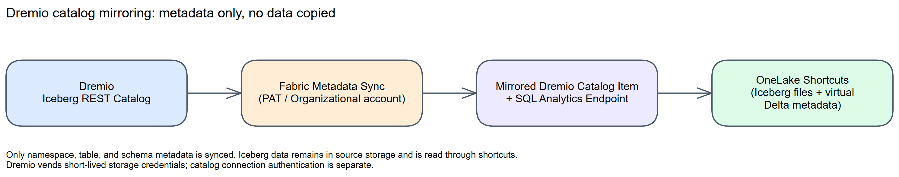
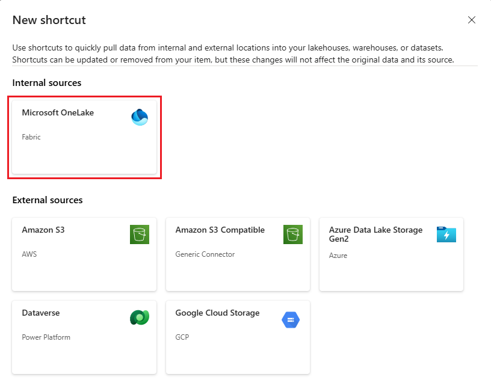

# Chapter 26: Dremio Catalog Mirroring

> **Part 2: Source-Specific Mirroring Guides**
>
> **Purpose:** Use this chapter to configure Dremio catalog mirroring and understand its metadata-only, Iceberg-based architecture.

**Part index:** [Chapters in Part 2](readme.md)

---

## Overview of the Source System

**Dremio** is a data lakehouse platform that manages an **Apache Iceberg** catalog over data stored in object storage. Fabric's **Dremio catalog mirroring** connector, currently in **Public Preview**, integrates data managed by Dremio with the rest of your data in Fabric.

When you mirror a Dremio catalog, there is **no data movement or data replication**. Only the Dremio catalog structure (namespaces, tables, and schemas) is mirrored to Fabric. The underlying table data is accessed through OneLake shortcuts and remains in Dremio-managed storage.

---

## Mirroring Type and Architecture

- **Mirroring type**: Metadata mirroring
- **Method**: Shortcuts. Fabric synchronises catalog metadata and creates OneLake shortcuts to the underlying Iceberg tables
- **Metadata access**: Fabric connects to a **Dremio Iceberg REST Catalog** endpoint; Dremio can vend short-lived credentials for the underlying Iceberg storage

**Architecture flow:**

*Figure 26.1: Dremio catalog mirroring architecture*

Mirrored tables are typically available to query within seconds of selection, with end-to-end metadata propagation usually completing in seconds to a few minutes. OneLake generates **virtual Delta metadata** over the Iceberg table's existing Parquet files. This is format virtualization, not a second physical copy of the table. Unsupported Iceberg features can prevent conversion or omit columns, so validate the resulting schema and conversion log.

---

## Network and Connectivity

| Question | Answer |
|---|---|
| **Data gateway required?** | No gateway path is documented for this connector. A gateway is not a documented workaround for its public-reachability requirement. |
| **Private endpoint support?** | No private source-network path is documented. In addition, Iceberg-to-Delta virtualization is unsupported in tenants or workspaces with Private Link enabled. |
| **Outbound-restricted (firewalled) networks?** | Not supported. The Dremio project and the storage location of all Iceberg tables must be reachable over the public internet. |

Confirm both catalog and storage reachability before planning a deployment. Publicly reachable does not mean anonymously accessible: the connection still requires authorised credentials.

---

## Setup Walkthrough

### 1. Dremio administrator-owned preflight

Use the [Microsoft tutorial](https://learn.microsoft.com/en-us/fabric/mirroring/catalog-mirroring/dremio-tutorial) as the connector contract. Before opening Fabric, record the Dremio organization/project, **project name**, Iceberg REST catalog endpoint, namespace/table names, connection identity, and underlying storage locations. Warehouse in this connector means the **Dremio project name**, not a SQL compute warehouse.

1. Confirm that the project actually exposes the selected **Iceberg tables through its Iceberg REST catalog**. Choose a small existing Iceberg table with Parquet data files and a known record. A Dremio SQL view, Reflection, CSV dataset, or federated database connection is not proof of an externally readable Iceberg table.
2. Dremio supports many source connections; Microsoft does **not** publish a complete matrix saying every Dremio-connected source, Cloud Classic deployment, or self-managed edition works with this connector. Start with the project's Dremio-managed Iceberg catalog and obtain source-specific confirmation before promising the same behavior for an external catalog connected inside Dremio. Do not confuse “Dremio reads OneLake” integrations with “Fabric mirrors Dremio.”
3. Have an organization administrator or an identity with the organization-level **CREATE ROLE** privilege create the dedicated reader role. In the [Dremio console](https://docs.dremio.com/dremio-cloud/security/roles/), open **Admin** → **Organization** → **Roles** → **Add Role**, name it, and **Add**. Open that role → **Members**, add the intended connection user, and **Save**. Separately, the appropriate object owner or administrator with **MANAGE GRANTS** grants its data privileges. Project ownership or **MANAGE GRANTS** alone is not the organization-level permission to create a role. The current [Dremio privilege reference](https://docs.dremio.com/dremio-cloud/security/privileges/) distinguishes:

   | Scope | Source-side permission to verify |
   |---|---|
   | Project | **USAGE**, required to access the project |
   | Open Catalog and each folder in the selected path | **USAGE** on the immediate catalog/folder; verify every folder in the hierarchy |
   | Selected catalog/folder/table | **READ METADATA** for discovery and **SELECT** for reads, scoped to approved datasets |
   | Administration | The granting administrator, not the Fabric reader, retains **MANAGE GRANTS** |

   Dremio roles inherit grants; avoid project-wide `SELECT` or `ALL` when only a few tables are approved. Microsoft's tutorial says “necessary permissions” without publishing connector-specific GRANT statements. The table above makes the Dremio Cloud role review concrete but is not a claim that every Dremio edition uses identical privilege syntax.
4. Sign in as the intended identity and confirm it can navigate the selected namespace and query the pilot table. Have the catalog/storage owner also verify that Dremio can authorize **external storage reads through credential vending**. `READ METADATA` alone does not grant object-storage access, and a successful query inside Dremio does not by itself prove Fabric's external read path.
5. Confirm that **both** the project endpoint and every selected table's storage location are publicly reachable, while still requiring authentication. Do not make buckets anonymous. No firewall/private-source gateway path is documented. Check the separate OneLake format-virtualization region and Private Link limits below.
6. In Fabric, have the tenant administrator enable **Enable new mirrored catalog items (Preview)**. Use a workspace with F SKU or trial capacity and a creator with item-creation rights. Approve the intended Fabric/OneLake audience separately from Dremio permissions.

### 2. Prepare credentials, then create the catalog item

1. For the documented PAT path, sign in **as the approved reader identity**. Open the user icon → **Account Settings** → **Personal Access Tokens** → **Generate Token**. Enter a descriptive **Label** and approved **Lifetime**, then **Generate** and immediately store the token in the organization's secret store: it is shown only once. Dremio's [PAT instructions](https://docs.dremio.com/dremio-cloud/security/authentication/personal-access-token/) specify a 30-day default and 180-day maximum. PATs inherit **all** of their user's privileges and cannot be scoped down; even an administrator cannot create another user's PAT. Record rotation ownership and do not use an administrator's personal token to bypass a failed read.
2. Open the Fabric workspace → **+ New** → **Mirrored Dremio catalog (preview)**. Select an existing connection only after verifying its project and identity; otherwise create one.
3. Enter the **Warehouse** as the Dremio project name. The [Dremio API reference](https://docs.dremio.com/dremio-cloud/api/) distinguishes the Iceberg catalog endpoint from the general project-management API; obtain the appropriate endpoint for your deployment rather than entering a SQL/JDBC URL. Microsoft's Fabric tutorial does not provide a region/edition endpoint matrix or document every connection field.
4. Under **Connection credentials**, provide the reader PAT, or select **Organizational account** when the signed-in identity is associated with that project and the option is supported by the deployed connection experience.
5. On **Choose data**, select **Catalog scope**, then explicitly include the approved namespaces and tables. Review the default-enabled **Automatically sync future tables** option with the data owner. Keep selected plus future auto-included tables within 500. Metadata auto-sync is not a source snapshot or CDC pipeline.
6. Select **Next**, review a unique item name and scope, then **Create**. Each eligible table receives a shortcut. Empty namespaces are not displayed.

> **Authentication distinction:** Microsoft's overview describes PAT and credential vending; its tutorial also lists Organizational account. PAT/interactive sign-in authenticates the catalog caller. Credential vending authorizes short-lived reads of underlying table storage. These are separate layers, not interchangeable wizard choices. There is no documented instruction to supply an AWS Glue IAM user or GCP service-account key to this Dremio wizard.

### 3. Validate metadata, storage reads, and a source change

1. Compare Fabric namespace/table names with the approved source list; confirm excluded objects stay absent. This validates catalog discovery only.
2. Preview the pilot table and open the automatically created **SQL analytics endpoint**. Using the actual generated schema/table names, run a bounded query such as `SELECT TOP (10) * FROM [sales].[orders];` and compare a stable key/value with Dremio.
3. If discovery works but the read fails, inspect credential vending, access to the Iceberg metadata/data files, and the table's supported format. Do not solve a storage failure by granting broad catalog-administrator rights.
4. Have the source owner commit one identifiable non-sensitive row through the normal Iceberg writer. Wait for metadata propagation, requery, and record observed freshness. Test future-table discovery separately if enabled. Refreshing a catalog does not ingest an Iceberg snapshot or copy Parquet data.
5. Inspect the virtual `_delta_log/latest_conversion_log.txt` through a Lakehouse shortcut's **View files** if data is stale or columns differ. Compare the conversion timestamp and schema with the source. A failed conversion can leave the last successful version queryable; a green-looking table is not sufficient evidence of current data.
   - No log means conversion was not attempted; check shortcut placement and the Iceberg target.
   - For a **USER** conversion error, have the source owner review the unsupported table feature. For **SYSTEM**, retain the invocation/root activity IDs and escalate persistent failures.
   - Microsoft's [conversion guidance](https://learn.microsoft.com/en-us/fabric/onelake/onelake-iceberg-tables#understand-the-conversion-log-and-error-categories) retries after a source commit. A schema-only change might not trigger reconversion until a data change occurs. Use an approved test-table commit for diagnosis, never an arbitrary production write or manual manifest edit.
6. Configure Fabric/OneLake read permissions and rerun the consumer test as a non-admin. Review source row/column policies explicitly rather than assuming catalog-role assignments were copied to Fabric.

### 4. Optional: Create Lakehouse Shortcuts

You can also create shortcuts from a Lakehouse to the mirrored Dremio catalog item to use the data with Spark notebooks:

1. Create or open a Lakehouse in the same workspace.
2. In the Lakehouse **Explorer**, under **Load data in your lakehouse**, select **New shortcut**.
3. Select **Microsoft OneLake**, then select the mirrored Dremio catalog item, and select **Next**.
4. Select the tables to shortcut, then select **Create**.

*Figure 26.2 — Downstream Lakehouse shortcut to the already created Dremio mirrored item; choose **Microsoft OneLake**, not an external-storage tile. Microsoft tutorial screenshot, unchanged. Source: [Create a same-tenant OneLake shortcut](https://learn.microsoft.com/en-us/fabric/onelake/shortcuts/create-onelake-shortcut); [original image](https://raw.githubusercontent.com/MicrosoftDocs/fabric-docs/main/docs/onelake/shortcuts/media/create-onelake-shortcut/new-shortcut.png). © Microsoft, [CC BY 4.0](https://creativecommons.org/licenses/by/4.0/). Microsoft's Dremio Learn tutorial supplies no source-wizard screenshots.*

For the downstream shortcut, keep the default **Pass-through** access unless a separately reviewed delegated OneLake identity is required. This is Fabric-to-Fabric authorization, not Dremio credential vending. Validate the notebook as the intended reader.

### 5. Safe operations handoff

Record project/catalog owner, reader-role grants, PAT expiry or organizational-account owner, approved namespaces, automatic-discovery policy, source-storage owner, and query/conversion checks. Rotate the connection credential and validate enumeration plus file reads before revoking the old one. Stop expanding selection near the 500-table ceiling. Coordinate source schema changes and table drops/recreation: reuse of a previously dropped table name is a documented limitation, not a reason to delete production storage. Remove only the pilot Fabric item/shortcuts at cleanup; manage source rows and retention in Dremio.

---

## Nuances and Limitations

| Topic | Detail |
|---|---|
| **500-table limit** | A maximum of 500 tables can be mirrored at once, whether individually selected or automatically synced. |
| **Public internet only** | The Dremio project and its Iceberg table storage must be reachable via the public internet. Firewall rules and other network restrictions are not currently supported. |
| **Iceberg-to-Delta virtualization** | OneLake generates Delta metadata without rewriting the source data. Only Parquet data files are supported. Iceberg V2 is supported; V3 support is partial. |
| **Conversion limits** | Source tables must have fewer than 5,000 transactions or commits. Equality deletes and live files spanning multiple partition specs fail conversion; supported position deletes and V3 deletion vectors become Delta deletion vectors. Column renames and incompatible schema changes are not supported. |
| **Conversion timing** | Metadata generation can take 5 seconds to 2 minutes. Microsoft advises source updates less frequent than once per 2 minutes to avoid an inconsistent virtual view. This is not a guaranteed end-to-end refresh SLA. |
| **Region and Private Link** | Format virtualization is unavailable in Qatar Central and Norway West, and in tenants or workspaces with Private Link enabled. Check these independently of Dremio connectivity. |
| **Dropped-and-recreated tables** | A Dremio Iceberg table that reuses the name of a previously dropped table is not mirrored, because the storage folder is reused across deletion and recreation. |
| **Authentication guidance** | Use the documented PAT or Organizational account connection flow, subject to the overview/tutorial distinction above. Do not infer managed-identity support from other catalog connectors. |
| **Namespace selection** | Deselecting a namespace deselects all tables within it. Reselecting the namespace reselects every table in it. |

See the [Dremio limitations](https://learn.microsoft.com/en-us/fabric/mirroring/catalog-mirroring/dremio-limitations) and the linked [Iceberg format-virtualization limitations](https://learn.microsoft.com/en-us/fabric/onelake/onelake-iceberg-tables#limitations-and-considerations). Review Fabric item and OneLake permissions before sharing; a successful catalog connection is not a substitute for validating consumer access.

---

## Source System Impact

- **No replication copy**: Only catalog metadata is synchronised. Queries still transfer data from source storage through OneLake shortcuts.
- **Metadata sync load**: Automatic sync reflects selected namespace and table additions or deletions; there is no user-managed extraction pipeline to operate. The connector pages do not publish a configurable polling schedule.
- **Cost**: Do not apply the free database-mirroring replica-storage allowance to a metadata-only catalog. Budget for Fabric query and OneLake shortcut operations, plus source-storage requests and any network egress. The Dremio connector pages do not publish a separate pricing entitlement.

---

## Troubleshooting

| Symptom | Likely Cause | Resolution |
|---|---|---|
| Cannot create a mirrored catalog item | Tenant admin setting not enabled | Ask your Fabric tenant administrator to enable **Enable new mirrored catalog items (Preview)** |
| Connection fails | Dremio project not reachable over the public internet, or invalid credentials | Confirm public reachability and verify the PAT or organizational account credentials |
| Table not mirrored after recreation | A table with the same name was previously dropped and recreated | Check the documented storage-folder reuse limitation; use a distinct table identity/location or seek support before deleting source metadata |
| Expected tables exceed the mirror limit | More than 500 tables selected or eligible for automatic sync | Reduce the namespace or table selection to stay within the 500-table limit |
| Data looks stale | Propagation still in progress | Wait a few minutes; check the [SQL analytics endpoint performance guidance](https://learn.microsoft.com/en-us/fabric/data-engineering/sql-analytics-endpoint-performance) for expected propagation times |
| Table stays at an older version or loses columns | Iceberg format virtualization failed or omitted an unsupported feature | Inspect `_delta_log/latest_conversion_log.txt` through the shortcut. A failed conversion leaves the last successful version visible; a successful conversion can still omit unsupported columns |

---

## Public issues and common pitfalls

**Reviewed 8 October 2026.** Research started with [`site:reddit.com "Dremio" "Fabric" "mirroring"`](https://www.google.com/search?q=site%3Areddit.com+%22Dremio%22+%22Fabric%22+%22mirroring%22), then checked Fabric Community. No verifiable source-specific Reddit troubleshooting report was found. General Dremio-versus-Fabric discussions and reports about unrelated Dremio connectors are not evidence of a catalog-mirroring defect.

The relevant Fabric Community result was Microsoft's [27 April 2026 preview announcement](https://community.fabric.microsoft.com/blog/fbc_fabricupdatesblogs/bring-your-dremio-data-into-onelake-preview/5171986). It confirms REST-catalog access, credential vending, and shortcuts; its future gateway plans are **not** evidence that private connectivity is now supported.

| Documented pitfall | Check before escalating |
|---|---|
| Catalog is visible but table reads fail | Verify selected principal's `SELECT` access and Dremio's credential-vending/storage authorization; discovery privileges are not storage credentials. |
| Recreated table never appears | The [Dremio limitations](https://learn.microsoft.com/en-us/fabric/mirroring/catalog-mirroring/dremio-limitations) specifically identify reuse of previously dropped table names/storage folders. Do not repeatedly drop/recreate production tables to diagnose this. |
| Item seems healthy but content is old or columns are absent | Inspect the [OneLake conversion log](https://learn.microsoft.com/en-us/fabric/onelake/onelake-iceberg-tables#check-the-conversion-log); failure can retain the previous virtualized version, and successful conversion can omit unsupported features. |
| Metadata selection succeeds but a restricted network cannot read data | Both catalog and storage must be publicly reachable. No documented gateway workaround exists for this connector. |
| A Dremio SQL dataset is absent | Verify that the project exposes it as a supported Iceberg table, not merely a view/Reflection or another database's query result. The Microsoft pages do not publish a complete Dremio source/edition compatibility matrix. |

For support, retain the project/catalog/table identifiers, UTC time, sanitized connection error, and conversion log. Keep PATs and any vended storage credentials out of screenshots and logs. The absence of public reports is not a reliability guarantee.

---

## Summary

Dremio catalog mirroring is a Public Preview, metadata-only connector: Fabric mirrors the Dremio Iceberg REST Catalog structure and creates OneLake shortcuts to the underlying tables, without copying data. Plan for the public-internet-only requirement, the 500-table limit, and the Iceberg-to-Delta conversion behaviour before relying on it for production analytics. See the current [Dremio catalog mirroring overview](https://learn.microsoft.com/en-us/fabric/mirroring/catalog-mirroring/dremio), [tutorial](https://learn.microsoft.com/en-us/fabric/mirroring/catalog-mirroring/dremio-tutorial), and [limitations](https://learn.microsoft.com/en-us/fabric/mirroring/catalog-mirroring/dremio-limitations).

**Contents:** [Table of Contents](../index.md) | **Previous:** [Chapter 25: Fabric SQL Database](chapter-25.md) | **Next:** [Chapter 27: AWS Glue Catalog Mirroring](chapter-27.md)
