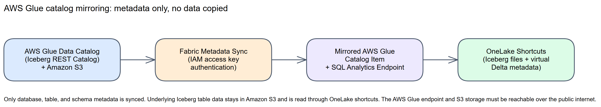
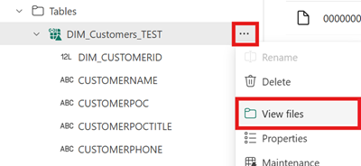

# Chapter 27: AWS Glue Catalog Mirroring

> **Part 2: Source-Specific Mirroring Guides**
>
> **Purpose:** Use this chapter to configure AWS Glue catalog mirroring and understand its metadata-only, Iceberg-based architecture.

**Part index:** [Chapters in Part 2](readme.md)

---

## Overview of the Source System

**AWS Glue Data Catalog** is Amazon's managed metadata catalog for data stored in Amazon S3, commonly used to catalog **Apache Iceberg** tables. Fabric's **AWS Glue catalog mirroring** connector, currently in **Public Preview**, integrates data cataloged in AWS Glue with the rest of your data in Fabric.

When you mirror an AWS Glue catalog, there is **no data movement or duplication**. Only the AWS Glue catalog structure is mirrored to Fabric. The underlying Iceberg table data stays in Amazon S3 and is accessed through OneLake shortcuts.

---

## Mirroring Type and Architecture

- **Mirroring type**: Metadata mirroring
- **Method**: Shortcuts. Fabric synchronises catalog metadata and creates OneLake shortcuts to the underlying Iceberg tables in Amazon S3
- **Metadata access**: Fabric connects to the **AWS Glue Iceberg REST Catalog** endpoint using an AWS IAM access key

**Architecture flow:**

[](../assets/diagrams/chapter-27/diagram-01.excalidraw.png)
*Figure 27.1: AWS Glue catalog mirroring architecture*

Mirrored tables are typically available to query within seconds of selection, with end-to-end metadata propagation usually completing in seconds to a few minutes. OneLake generates **virtual Delta metadata** over the Iceberg table's existing Parquet files. It does not rewrite or replicate the S3 table data. Changes might not appear immediately, and unsupported Iceberg features can prevent conversion or omit columns.

---

## Network and Connectivity

| Question | Answer |
|---|---|
| **Data gateway required?** | No gateway path is documented for this connector. A gateway is not a documented workaround for the public-reachability requirement. |
| **Private endpoint support?** | No private source-network path is documented. Iceberg-to-Delta virtualization also does not support tenants or workspaces with Private Link enabled. |
| **Outbound-restricted (firewalled) networks?** | The AWS Glue Iceberg REST catalog endpoint and the S3 locations holding the Iceberg data must be publicly reachable. The connector does not support firewall rules or other network restrictions. |

Confirm both catalog and storage reachability before deployment. This does **not** require public or anonymous S3 bucket access: the connection must still authenticate with the authorised IAM credential.

---

## Setup Walkthrough

### 1. AWS administrator-owned preflight

Follow the [Microsoft AWS Glue tutorial](https://learn.microsoft.com/en-us/fabric/mirroring/catalog-mirroring/aws-glue-tutorial). Record the AWS account's 12-digit catalog ID, Region, Glue databases/tables, S3 buckets/prefixes, IAM connection user, and target Fabric workspace. This procedure mirrors metadata and reads existing Iceberg files; it does not configure a Glue ETL job, crawler-driven data copy, or CDC stream.

1. **Glue data owner:** select an existing catalog containing valid **Apache Iceberg tables**, not just Parquet files registered as Hive tables. Pick one small table, verify its current metadata location and a known source row, and record every bucket holding its metadata and data. A crawler listing a table is not proof of supported Iceberg format.
2. **Network/storage owner:** verify that the regional Glue Iceberg REST endpoint and every S3 data location are reachable through the public internet. Firewall/private-only paths are not supported by the documented connector. Keep bucket authentication and access controls enabled; “publicly reachable” does not mean public bucket permissions.
3. **AWS IAM administrator:** create or select a dedicated **IAM user** for the connection. Attach the following action set from Microsoft's tutorial, substituting all required buckets. The Glue statement is broad (`Resource: "*"`); have the IAM owner review resource scoping and applicable organization/bucket policies rather than calling this universally minimal:

```json
{
  "Version": "2012-10-17",
  "Statement": [
    {
      "Sid": "GlueCatalogRead",
      "Effect": "Allow",
      "Action": [
        "glue:GetCatalog",
        "glue:GetDatabases",
        "glue:GetDatabase",
        "glue:GetTables",
        "glue:GetTable"
      ],
      "Resource": "*"
    },
    {
      "Sid": "S3DataRead",
      "Effect": "Allow",
      "Action": [
        "s3:GetObject",
        "s3:GetBucketLocation",
        "s3:ListBucket"
      ],
      "Resource": [
        "arn:aws:s3:::your-bucket",
        "arn:aws:s3:::your-bucket/*"
      ]
    }
  ]
}
```

4. **Lake Formation administrator, if applicable:** grant the **same IAM user** corresponding read access to the selected databases/tables. For a conventional same-account, named-resource setup:
   - First approve full-table exposure with the data owner. Fabric does **not** enforce Lake Formation row/column/cell filters, and the connection also has direct S3 access. If consumers may see only a filtered subset, stop and redesign the approved source scope rather than removing the filters to make the mirror work.
   - Open Lake Formation → **Permissions** → **Data permissions** → **Grant**. Choose the connection user under **IAM users and roles**, then **Named data catalog resources** and the approved database.
   - Grant database **Describe** for discovery, then grant **Select** on the approved tables. For the approved full-table share, keep **All data access**, leave **Grantable permissions** unselected, and choose **Grant**. Follow AWS's [database](https://docs.aws.amazon.com/lake-formation/latest/dg/granting-database-permissions.html) and [table grant](https://docs.aws.amazon.com/lake-formation/latest/dg/granting-table-permissions.html) procedures; **Describe** alone exposes metadata, not data.
   - Keep cross-account, LF-tag and hybrid-access configurations with the Lake Formation owner. Microsoft's connector recipe does not specify every such grant/API-action combination; do not replace that review with `lakeformation:*` or treat **DATA_LOCATION_ACCESS** as an object-read grant.
5. **Storage/encryption owner:** inspect the actual Iceberg metadata, manifest and data objects for **SSE-KMS**, not only the bucket's current default encryption. Where KMS is used, AWS requires the reader to have [`kms:Decrypt`](https://docs.aws.amazon.com/AmazonS3/latest/userguide/UsingKMSEncryption.html) on the relevant keys, with the key policy permitting that use. Scope approval to those keys and check explicit denies in organizational, bucket and key policies. Glue/S3 read permissions alone are insufficient; do not disable encryption or grant KMS wildcards as a workaround.
6. **Credential owner:** create an access key for that user in AWS IAM, securely capture its **access key ID and secret access key**, and record rotation ownership. Do not use root-account keys, paste secrets into notebooks, or put them in this runbook.
7. **Fabric administrator:** provide a workspace with F SKU/trial capacity and item-creation permissions; enable **Enable new mirrored catalog items (Preview)** for the intended users.

> **IAM trust and external ID — not this connector's authentication path:** Microsoft's current [overview](https://learn.microsoft.com/en-us/fabric/mirroring/catalog-mirroring/aws-glue#connect-and-authenticate) documents only an IAM-user key. It supplies no Fabric AWS principal ARN, `sts:AssumeRole` trust policy, role-ARN field, or external-ID exchange. Do **not** invent one or reuse an S3-shortcut, Snowflake, or another connector's role-assumption recipe. Where organizational policy requires role federation instead of long-lived user keys, this documented connector path does not meet that requirement; resolve support/design before onboarding.

### 2. Create and scope the Fabric catalog

1. Open `https://fabric.microsoft.com` and the intended workspace → **+ New** → **Mirrored AWS Glue catalog (preview)**.
2. Select an approved existing connection, or create one with:

   | Field | Value |
   |---|---|
   | **URL** | `https://glue.<Region>.amazonaws.com/iceberg`, replacing Region with the source Region |
   | **Warehouse** | The 12-digit AWS account/catalog ID, not a database name, S3 URI, or IAM role ARN |
   | **Authentication kind** | **Access Key** |
   | **Access Key ID / Secret Access Key** | The dedicated IAM user's credential |

3. On **Choose data**, choose **Catalog scope** and include only the approved databases/Iceberg tables. The picker reflects Glue **and** Lake Formation access. Exclude non-Iceberg tables explicitly.
4. Review **Automatically sync future tables**, enabled by default. Disable it for a fixed pilot scope or approve the selected databases for future automatic exposure. This discovers catalog objects; it does not schedule an S3 ingest. Allow room below the 500-table limit for auto-included tables.
5. Select **Next**, review scope and a workspace-unique item name, then **Create**. Confirm a shortcut per selected eligible table; empty databases are not shown.

### 3. Validate metadata and an authenticated S3 read

1. **Discovery:** compare the mirrored schemas/tables with the source Glue database/table list. Missing objects point first to scope, Region/account ID, IAM, or Lake Formation visibility.
2. **Read:** preview a pilot table and open its automatically created **SQL analytics endpoint**. Query a known row using actual generated identifiers, for example `SELECT TOP (10) * FROM [sales].[orders];`. Compare with the source query. Glue `Get*` success is not an S3 read grant: metadata, manifests, and Parquet objects must all be readable.
3. **Conversion:** through a Lakehouse shortcut's **View files**, inspect the virtual `_delta_log/latest_conversion_log.txt` if the schema is incomplete or the table remains stale. It describes format virtualization, not replicated ingestion. Conversion failure can preserve the last successful table version.
4. **Change:** have the source owner commit one recognizable non-sensitive row using the normal Iceberg writer, then requery after propagation. Test new-table discovery separately if automatic sync is enabled. A browser/catalog refresh does not copy the current Iceberg snapshot into OneLake.
5. **Consumer:** assign intended Fabric/OneLake access and retest as a non-admin. Lake Formation row-, column-, and cell-level filters are not enforced on the mirrored item; obtain a separate access approval before sharing.

### 4. Optional: Create Lakehouse Shortcuts

You can also create shortcuts from a Lakehouse to the mirrored AWS Glue catalog item to use the data with Spark notebooks:

1. Create or open a Lakehouse in the same workspace.
2. In the Lakehouse **Explorer**, under **Load data in your lakehouse**, select **New shortcut**.
3. Select **Microsoft OneLake**, then select the mirrored AWS Glue catalog item, and select **Next**.
4. Select the tables to shortcut, then select **Create**.


*Figure 27.2 — Downstream shortcut to an **existing mirrored AWS Glue item**: choose Microsoft OneLake, not the Amazon S3 tile. Microsoft tutorial screenshot, unchanged. Source: [Create a same-tenant OneLake shortcut](https://learn.microsoft.com/en-us/fabric/onelake/shortcuts/create-onelake-shortcut); [original image](https://raw.githubusercontent.com/MicrosoftDocs/fabric-docs/main/docs/onelake/shortcuts/media/create-onelake-shortcut/new-shortcut.png). © Microsoft, [CC BY 4.0](https://creativecommons.org/licenses/by/4.0/). The AWS Glue Learn tutorial contains no source-wizard screenshots.*

Keep downstream OneLake **Pass-through** access unless a separately approved delegated identity is needed. This Fabric-to-Fabric authorization choice does not change the AWS catalog's IAM authentication.

### 5. Safe operations handoff

Record the key owner/rotation date without recording the secret, Glue account/Region, IAM policy scope, Lake Formation grants, S3 locations and KMS keys, automatic-table policy, consumer roles, and validation results. When rotating, update the Fabric connection and verify both catalog discovery and object reads before disabling the old key. Permissions revoked in Glue, S3 or KMS can interrupt operation. AWS documents that [dropping and recreating a catalog object does not restore its Lake Formation grants](https://docs.aws.amazon.com/lake-formation/latest/dg/granting-catalog-permissions.html); revalidate permissions after such a change. Preserve AWS-side metadata/data retention and rollback procedures; deleting a Fabric shortcut is not deleting or purging the source Iceberg table.

---

## Nuances and Limitations

| Topic | Detail |
|---|---|
| **Iceberg tables only** | Only tables in the Apache Iceberg format can be mirrored. Selecting a non-Iceberg table (Hive, CSV, JSON, or plain Parquet) does not mirror it, and can show an error on the mirrored item. |
| **500-table limit** | A maximum of 500 tables can be mirrored at once, whether individually selected or automatically synced. |
| **Public internet only** | The AWS Glue Iceberg REST catalog endpoint and the Amazon S3 storage locations must be reachable via the public internet. Firewall rules and other network restrictions are not currently supported. |
| **Iceberg-to-Delta virtualization** | OneLake generates Delta metadata over existing Parquet files. Iceberg V2 is supported; V3 support is partial. There is no second data copy. |
| **Conversion limits** | Source tables must have fewer than 5,000 transactions or commits. Equality deletes and live files spanning multiple partition specs fail conversion; supported position deletes and V3 deletion vectors become Delta deletion vectors. Column renames and incompatible schema changes are unsupported. |
| **Conversion timing** | Metadata generation can take 5 seconds to 2 minutes. Microsoft advises source updates less frequent than once per 2 minutes to avoid an inconsistent virtual view. This is not an end-to-end refresh SLA. |
| **Region and Private Link** | Format virtualization is unavailable in Qatar Central and Norway West, and in tenants or workspaces with Private Link enabled. |
| **Read-only** | Mirrored AWS Glue catalog data is read-only in Fabric. You cannot write back to the source AWS Glue tables through the mirrored item. |
| **Fine-grained permissions not enforced** | Column-level, row-level, and cell-level filters defined in AWS Lake Formation are not enforced on the mirrored item. Grant access through OneLake security and review the mirrored item as its own access surface. |
| **Authentication method** | Only an IAM access key (delegated authorization) is supported; there is no managed-identity or role-assumption authentication path for this connector. |
| **Credential rotation** | Fabric uses the supplied IAM credential for catalog scanning and ongoing metadata sync. Rotation, deletion, disabling, or revoked Glue/S3 permissions stops sync until the connection has a valid credential and permissions. |
| **Database selection** | Deselecting a database deselects all tables within it. Reselecting the database reselects every table in it. |

See the current [AWS Glue catalog mirroring limitations](https://learn.microsoft.com/en-us/fabric/mirroring/catalog-mirroring/aws-glue-limitations) and linked [Iceberg format-virtualization limits](https://learn.microsoft.com/en-us/fabric/onelake/onelake-iceberg-tables#limitations-and-considerations).

---

## Source System Impact

- **No replication copy**: Only catalog metadata is synchronised. Queries still transfer data from Amazon S3 through OneLake shortcuts.
- **Metadata sync load**: Automatic sync reflects selected database and table additions or deletions; there is no user-managed extraction pipeline to operate. The connector pages do not publish a configurable polling schedule.
- **Cost**: Do not apply the database-mirroring replica-storage allowance to a metadata-only catalog. Budget for Fabric query and OneLake shortcut operations, plus AWS Glue/S3 requests and any egress charges. The connector documentation does not promise free AWS-side access.

---

## Troubleshooting

| Symptom | Likely Cause | Resolution |
|---|---|---|
| Cannot create a mirrored catalog item | Tenant admin setting not enabled | Ask your Fabric tenant administrator to enable **Enable new mirrored catalog items (Preview)** |
| Connection fails | AWS Glue endpoint or S3 storage not reachable over the public internet, or invalid access key | Confirm public reachability and verify the IAM access key ID and secret access key |
| Database or table not visible | IAM user lacks Glue or Lake Formation read permissions on it | Grant the required `glue:Get*` actions and, if Lake Formation governs the catalog, the corresponding Lake Formation permissions |
| Table not mirrored | Table is not in Apache Iceberg format | Confirm the table is cataloged as Iceberg; Hive, CSV, JSON, and plain Parquet tables are not supported |
| Expected tables exceed the mirror limit | More than 500 tables selected or eligible for automatic sync | Reduce the database or table selection to stay within the 500-table limit |
| Metadata sync stops | IAM credential was rotated, disabled, or deleted, or source permissions were revoked | Update the connection with a valid access key and verify both Glue and S3 read permissions |
| Data looks stale | Propagation still in progress | Wait a few minutes; check the [SQL analytics endpoint performance guidance](https://learn.microsoft.com/en-us/fabric/data-engineering/sql-analytics-endpoint-performance) for expected propagation times |
| Table stays at an older version or loses columns | Iceberg format virtualization failed or omitted a source feature | Inspect `_delta_log/latest_conversion_log.txt` through the shortcut. Failed conversion preserves the last successful version; successful conversion can still omit unsupported columns |

---

## Public issues and common pitfalls

**Reviewed 8 October 2026.** Research started with the public query [`site:reddit.com "AWS Glue" "Fabric" "mirroring"`](https://www.google.com/search?q=site%3Areddit.com+%22AWS+Glue%22+%22Fabric%22+%22mirroring%22). A source-specific Reddit discussion was indexed, but its full thread returned HTTP 403 and could not be independently verified. No readable source-specific Reddit incident is used as evidence below.

| Evidence | Practical interpretation |
|---|---|
| **Documented:** the [limitations](https://learn.microsoft.com/en-us/fabric/mirroring/catalog-mirroring/aws-glue-limitations) reject non-Iceberg tables and do not carry Lake Formation fine-grained filters into Fabric. | Select Iceberg tables only and perform a separate Fabric access review. A successful Glue enumeration is not permission to read S3 or proof of equivalent row-level security. |
| **Documented source authorization:** [AWS SSE-KMS permissions](https://docs.aws.amazon.com/AmazonS3/latest/userguide/UsingKMSEncryption.html) require key-decryption permission for encrypted object reads. | If Glue enumeration succeeds but file reads fail, inspect the actual object's key and effective S3/KMS permissions. A successful catalog scan or access-key rotation does not fix a denied decrypt. |
| **Microsoft announcement, not an incident report:** [Bring your Azure Monitor and AWS Glue data to OneLake](https://community.fabric.microsoft.com/blog/fbc_fabricupdatesblogs/bring-your-azure-monitor-and-aws-glue-data-to-onelake-preview/5326474), reviewed 8 October 2026. | Confirms the preview's metadata/shortcut architecture. It is not evidence of a connector-specific fix, latency guarantee, or IAM role-assumption support. |

If a table is discoverable but unreadable, collect the failing table and metadata location, UTC timestamp, Fabric error/activity ID, and conversion log; redact credentials. Ask the AWS owner to check effective Glue/Lake Formation permissions and S3/KMS access before assuming replication has stalled. In the conversion log, **USER** indicates a source-feature problem and **SYSTEM** an internal/transient failure; no log means conversion was not attempted. Microsoft documents reattempts after a source commit and possible delayed handling of schema-only changes. Test with an approved source-table change; never hand-edit manifests or delete old metadata merely to force a refresh.

---

## Supplementary setup: Google Lakehouse runtime catalog

**Separate source and authentication model.** This supplementary runbook covers the **Mirrored Google Lakehouse runtime catalog (preview)** item, not AWS Glue and not BigQuery database mirroring. It follows the [Microsoft Google Lakehouse runtime tutorial](https://learn.microsoft.com/en-us/fabric/mirroring/catalog-mirroring/google-lakehouse-runtime-tutorial), [overview](https://learn.microsoft.com/en-us/fabric/mirroring/catalog-mirroring/google-lakehouse-runtime), and [limitations](https://learn.microsoft.com/en-us/fabric/mirroring/catalog-mirroring/google-lakehouse-runtime-limitations), reviewed **8 October 2026**.

Only catalog metadata is mirrored. Iceberg data remains in **Google Cloud Storage** and is read through OneLake shortcuts with virtual Delta metadata. This is neither a replicated CDC stream nor a backfill into Fabric-managed storage.

### GCP 1. Administrator-owned preflight

1. **Google Cloud project/catalog owner:** select a project with billing enabled and enable the **BigLake API**. Provision or identify a Google Lakehouse runtime catalog containing **Iceberg V2** tables with **Parquet** data files. Confirm a small pilot table and its storage buckets; Iceberg V1 and catalog/database/metastore views are not supported.
2. Record the catalog's warehouse path, billing **project ID**, and all table-data buckets. For the federation configuration, separately record the owning project's numeric **project number**. The text project ID and numeric project number are not interchangeable and can refer to different project responsibilities.
3. **Google IAM administrator:** ensure the administrator can create/manage a **Workload Identity Pool and OIDC provider**, and grant Google Cloud IAM roles. Obtain the **Microsoft Entra tenant ID** and the **object ID** of each identity to authorize. Do not substitute the application's client ID for an Entra object ID.
4. **Network owner:** verify public-internet reachability for both the Iceberg REST endpoint and GCS locations, with authenticated access retained. The connector does not document firewall/private-source networking support. Also check OneLake format-virtualization limitations, including unsupported Private Link tenants/workspaces.
5. **Fabric administrator:** provide an F SKU/trial workspace and item-creation access, and enable **Enable new mirrored catalog items (Preview)**.

If the source catalog does not yet exist, the Google administrator follows [Google's catalog creation procedure](https://docs.cloud.google.com/lakehouse/docs/set-up-lakehouse-iceberg-rest-catalog#create_a_catalog) before federation or Fabric setup:

1. Arrange **BigLake Admin** on the project and the required **Storage Admin** authority on the associated buckets for the provisioning administrator. Enabling the API requires `serviceusage.services.enable` (for example through **Service Usage Admin**). These are provisioning privileges, **not** roles to give the Fabric reader.
2. In Google Cloud console, open **Lakehouse** → **Create catalog** → **Iceberg Rest Catalog**. For a new multiple-bucket catalog, select **Multiple bucket catalog**, choose the default Cloud Storage path, enter **Catalog ID** and a compatible **Primary location**, then **Continue**.
3. Add only approved additional **Data paths**, then choose **End-user credentials** or **Credential vending mode** and **Create**. Record the mode; do not overlap source paths belonging to unrelated catalogs.
4. Complete the separate bucket authorization in GCP 3. Use the source owner's supported Iceberg writer to create/register a namespace and a small **V2/Parquet** pilot table in this catalog, then verify its committed metadata and a known row. A bucket of unregistered Parquet files is not a prepared catalog.

**Current documentation boundary:** Google now documents Iceberg V3 preview support in its REST catalog, while Microsoft's Google mirroring limitations still specify **V2 only**. Keep the Fabric pilot at V2; source-platform V3 support is not evidence of Fabric connector support. Likewise, Google's ability to request a larger metadata-file limit does not establish support above Fabric's documented **1 MB** limit.

### GCP 2. Configure Entra-to-Google federation

This connector uses **Google Cloud Workload Identity Federation**. Fabric presents an Entra OIDC token; it does not require a downloaded Google service-account JSON key, an AWS access key, or an AWS external ID.

1. In Google Cloud console, choose the project that will own federation. Open **IAM & Admin** → **Workload Identity Federation** → **Create Pool**.
2. Name the pool, choose its **Pool ID**, keep it enabled in location **global**, and record the ID.
3. Open the pool → **Add Provider** → **OpenID Connect (OIDC)**. Enter and record a **Provider ID**, and use the following exact values:

   | Setting | Required value |
   |---|---|
   | Issuer URL | `https://sts.windows.net/{TENANT_ID}/` — use the Entra tenant ID and keep the trailing slash |
   | Allowed audience | `https://analysis.windows.net/powerbi/connector/MirroredGoogleLakehouseRuntimeCatalog` |
   | Attribute mapping | `google.subject = assertion.oid` |

4. Save and enable the provider. The issuer/audience must match the token claims exactly; a generic Microsoft login endpoint or a different Fabric connector's audience is not equivalent.
5. Add each approved Entra identity as an IAM principal using its object ID:

   ```text
   principal://iam.googleapis.com/projects/PROJECT_NUMBER/locations/global/workloadIdentityPools/POOL_ID/subject/ENTRA_OID
   ```

6. Grant that principal **BigLake Viewer** (`roles/biglake.viewer`) and **Service Usage Consumer** (`roles/serviceusage.serviceUsageConsumer`) at the narrowest appropriate resource scope. Record the bindings. Prefer individual subjects over a pool-wide `principalSet://.../*`: a wildcard can grant access to identities accepted through other providers in the same pool.

### GCP 3. Authorize storage separately

Have the catalog owner identify the catalog's credential mode before granting bucket access:

| Catalog credential mode | Bucket permission owner and action |
|---|---|
| **Credential vending** | Grant the catalog's **auto-provisioned service account** **Storage Object User** (`roles/storage.objectUser`) on **every associated bucket**. The federated Entra principal does not need direct bucket access in this mode. |
| **End-user credentials** | Grant the **federated principal** the required read access on every associated bucket. Google's [Storage Object Viewer](https://docs.cloud.google.com/storage/docs/access-control/iam-roles) (`roles/storage.objectViewer`) provides object read/list access; scope it to the approved buckets and validate metadata, manifest and data reads. |

This distinction comes from the Microsoft tutorial and Google's linked [Iceberg REST catalog setup](https://docs.cloud.google.com/lakehouse/docs/set-up-lakehouse-iceberg-rest-catalog). Do not generate a key for the catalog's service account or put it into Fabric: that account serves the catalog's storage authorization, not the Entra-to-Google sign-in. `BigLake Viewer` lets the principal access catalog metadata; it is not an implicit GCS object-read grant. Retain the documented Storage Object User requirement for vending rather than replacing it with a guessed read-only role.

For a newly created credential-vending catalog, open **Catalog details** → **Authentication method** → **Set bucket permissions** → **Confirm**, as documented by Google, then verify the service-account binding on every associated bucket. When provisioning outside the console, apply those bucket bindings explicitly. The auto-provisioned account is eventually consistent: if it is not yet found, verify the catalog's actual account and allow propagation rather than generating a replacement account/key or granting project-wide storage access.

### GCP 4. Connect and select tables in Fabric

1. Open the intended workspace at `https://powerbi.com` → **+ New** → **Mirrored Google Lakehouse runtime catalog (preview)**.
2. Create a new connection, or verify the target and identity of an existing one. Supply:

   | Field | Value |
   |---|---|
   | **URL** | `https://biglake.googleapis.com/iceberg/v1/restcatalog` |
   | **Warehouse**, multiple-bucket catalog | `bl://projects/PROJECT_ID/catalogs/CATALOG_ID` |
   | **Warehouse**, single-bucket catalog | `gs://CLOUD_STORAGE_BUCKET_NAME` |
   | **Project ID** | Project billed for catalog requests |
   | **Project number** | Numeric project number owning the Workload Identity Pool |
   | **Pool ID / Provider ID** | The enabled federation resources created above |

3. Authenticate with an **Entra identity authorized by the Google IAM subject binding**. The Microsoft tutorial does not enumerate a broader list of wizard authentication kinds; do not assume all service-principal/workspace-identity modes from other connectors apply.
4. On **Choose data**, choose **Catalog scope**, then include/exclude namespaces and supported tables. Review the default-enabled **Automatically sync future tables** option and approve the future scope. Keep total selected/auto-included tables below the 500-table limit.
5. Select **Next**, review a unique mirrored item name and scope, and **Create**. Fabric creates shortcuts and a **SQL analytics endpoint**; empty namespaces are not shown. This creates metadata references, not copies of the GCS objects.

### GCP 5. Validate, share, and hand over

1. **Catalog validation:** compare namespaces and table names with the source. A failure here points to federation, role bindings, project identifiers, or catalog scope.
2. **Read validation:** preview a known pilot row and query it through the SQL analytics endpoint using its generated schema/table name. If discovery succeeds but reads fail, check the vending service account or end-user bucket grants for the chosen mode, every bucket used by the table, and object reachability.
3. **Change validation:** have the source owner commit one non-sensitive identifiable record using the normal Iceberg writer. Requery after propagation and compare with the source. Test future-table discovery separately. Refreshing catalog metadata does not ingest a snapshot; conversion latency and SQL metadata visibility are separate delays.
4. For Spark, create a Lakehouse **Tables** shortcut → **Microsoft OneLake** → the mirrored Google catalog → selected tables. For an unreadable/stale Iceberg table, open its shortcut menu → **View files** and inspect virtual `_delta_log/latest_conversion_log.txt`. Do not edit that virtual log or source manifests.

   
   *Figure 27.3 — Shared OneLake Iceberg diagnostic step after creating the Google catalog shortcut; not a Google authentication screen. Microsoft tutorial screenshot, unchanged. Source: [Use Iceberg tables with OneLake](https://learn.microsoft.com/en-us/fabric/onelake/onelake-iceberg-tables#check-the-conversion-log); [original image](https://raw.githubusercontent.com/MicrosoftDocs/fabric-docs/main/docs/onelake/media/onelake-iceberg-table-shortcut/view-files.png). © Microsoft, [CC BY 4.0](https://creativecommons.org/licenses/by/4.0/). The Google catalog Learn tutorial supplies no source-wizard screenshots.*

5. Configure **OneLake security** and test as a non-admin consumer. Google source row/column policies are not enforced on the mirrored item. Approve its Fabric access independently.
6. Hand over pool/provider IDs, Entra subject bindings, catalog mode/service-account identity, bucket-role scopes, owners, approved table scope, and test results. Disabling the pool/provider, changing issuer/audience, deleting bindings, or recreating an Entra identity with a new object ID can break access. Revalidate after every such change. Delete only the intended Fabric pilot objects during cleanup; source retention/purge remains a GCP responsibility.

### GCP public issues and common pitfalls

**Reviewed 8 October 2026.** Public research started with [`site:reddit.com "Google Lakehouse" "mirroring"`](https://www.google.com/search?q=site%3Areddit.com+%22Google+Lakehouse%22+%22mirroring%22). No verifiable source-specific Reddit problem report was found; results about BigQuery or generic GCS shortcuts are different integrations and are not treated as evidence here. Microsoft's [preview announcement](https://community.fabric.microsoft.com/blog/fbc_fabricupdatesblogs/bring-your-google-lakehouse-runtime-catalog-data-to-onelake-preview/5360492) was also read, but is not a user incident or fix.

Documented checks to put in the runbook:

- **Federation fails:** verify project **number**, enabled pool/provider, exact issuer including `/`, exact audience, and `assertion.oid` mapping. Recreated Entra identities need new subject bindings.
- **Catalog visible, files denied:** verify the credential mode and its distinct bucket principal; do not indiscriminately grant every federated user storage access.
- **Table rejected or stale:** require Iceberg V2/Parquet, a `metadata.json` file no larger than **1 MB**, and supported OneLake conversion features. The last successful virtualized version can survive a later conversion failure.
- **Unexpected data exposure:** review pool-wide wildcard bindings, automatic future-table selection, and independent Fabric security.

These are documented constraints and diagnostic checks, not claims of observed connector bugs or a refresh SLA.

---

## Summary

AWS Glue catalog mirroring is a Public Preview, metadata-only connector: Fabric mirrors the AWS Glue Iceberg REST Catalog structure and creates OneLake shortcuts to the underlying tables in Amazon S3, without copying data. Plan for the Iceberg-only requirement, the public-internet-only requirement, the 500-table limit, and the Iceberg-to-Delta conversion behaviour before relying on it for production analytics. See the current [AWS Glue catalog mirroring overview](https://learn.microsoft.com/en-us/fabric/mirroring/catalog-mirroring/aws-glue), [tutorial](https://learn.microsoft.com/en-us/fabric/mirroring/catalog-mirroring/aws-glue-tutorial), and [limitations](https://learn.microsoft.com/en-us/fabric/mirroring/catalog-mirroring/aws-glue-limitations).

**Contents:** [Table of Contents](../index.md) | **Previous:** [Chapter 26: Dremio Catalog Mirroring](chapter-26.md) | **Next:** [Chapter 28: What is Open Mirroring and Why It's Useful](../Part%203%20-%20Open%20Mirroring/chapter-28.md)
