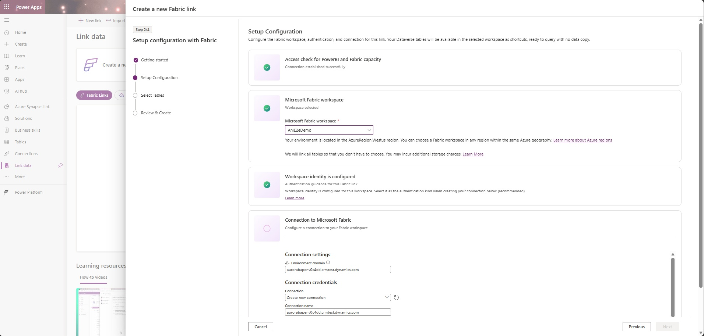
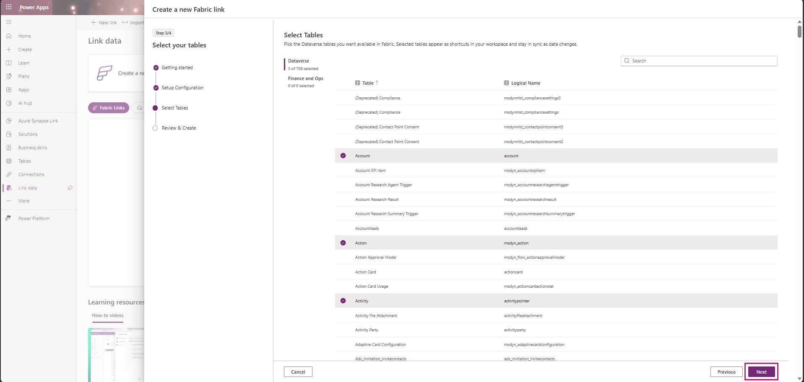

# Chapter 28: Dataverse Link to Microsoft Fabric

> **Part 2: Source-Specific Mirroring Guides**
>
> **Purpose:** Configure the direct Dataverse Link to Fabric, understand its source-managed analytical replica and shortcut security, and operate it without confusing it with native Fabric Mirroring.

**Part index:** [Chapters in Part 2](readme.md)

**Documentation reviewed:** 8 October 2026.

---

## Overview of the Source System

Microsoft Dataverse stores the business data behind Power Apps and many Dynamics 365 applications. **Link to Microsoft Fabric** makes eligible tables available to Fabric analytics without a customer-built export pipeline or customer-provided storage account.

This is **not a native Fabric Mirroring source or a mirrored database item**. It belongs alongside the mirroring guides because its consumption model resembles metadata mirroring: the source service maintains analytical tables, and Fabric exposes them through shortcuts. Use the Dataverse link controls and Lakehouse operations, not native mirrored-database start/stop APIs.

**Current status:** Microsoft's current setup and FAQ document direct Link to Fabric as an established capability. The newer **low-latency sync** engine is rolling out by station, rather than being available everywhere at once. **New SQL analytics endpoint metadata sync** is a separate preview feature; it is not a prerequisite for this walkthrough.

## Mirroring Type and Architecture

| Question | Direct Link to Fabric |
|---|---|
| **Book classification** | Source-managed analytical replica plus shortcuts; operationally similar to metadata mirroring, not technically native Fabric Mirroring |
| **Source work** | Dataverse initializes and refreshes an optimized replica in Delta Parquet format |
| **Physical storage owner/location** | Dataverse-managed storage, in the same region as the Dataverse environment |
| **Fabric artifacts** | A generated Lakehouse with table shortcuts, SQL analytics endpoint, and Power BI dataset/semantic model, as described by the Dataverse documentation |
| **Fabric consumption** | SQL, Spark and Power BI read the linked analytical tables; Dataverse shortcuts are read-only |
| **Customer infrastructure** | No customer ADLS account, Synapse workspace or customer-operated conversion job for this direct route |

The flow is **Dataverse operational tables → Dataverse-managed Delta analytical replica → OneLake shortcuts in a Fabric Lakehouse → analytical workloads**. “Zero-copy” describes shortcut consumption without another required customer-managed landing copy. It does **not** mean that Dataverse avoids creating a physical optimized replica.

Dataverse owns capture, initialization and replica maintenance. The Fabric team owns workspace access, connection governance, downstream models and query workloads. Treat synchronization progress and Fabric query readiness as separate checkpoints.

### Do Not Substitute the Azure Synapse Link Architecture

An existing **Azure Synapse Link for Dataverse** profile is a different route: it exports into customer-owned storage and must have **Enable Parquet/Delta lake** configured before it can be linked to Fabric. CSV-only profiles cannot be linked; the current documentation also excludes Azure Synapse Link profiles secured with managed identities. That restriction does **not** prohibit workspace identity authentication for the direct Dataverse link.

In today's Power Apps navigation, direct links appear under **Link data → Fabric Links**; Azure Synapse Link profiles appear under **Other Links**. Do not apply their ADLS permissions, Synapse compute costs or Delta-conversion setup to the direct route described below.

---

## Ownership and Prerequisites

Agree these responsibilities before enabling the link:

| Owner | Required preparation |
|---|---|
| Dataverse administrator | **System Administrator** security role in the source environment; approved table list; ability to create the required application user; database-capacity headroom |
| Fabric workspace administrator | **Admin** on the target workspace; create/manage its workspace identity; permissions to manage the Dataverse cloud connection |
| Fabric tenant/capacity administrator | Eligible Fabric capacity or trial, or supported Power BI Premium capacity with Fabric enabled; permitted geography; tenant settings below |
| Data/security owner | Approval for the analytical replica, broad connection identity and downstream access model; sample data and acceptance criteria |
| Analytics operator | Named owner for synchronization, schema changes, credentials, capacity consumption and downstream dependencies |

**Premium Per User alone is insufficient.** Prefer an existing, capacity-backed collaborative workspace, not **My workspace**. If the wizard must create a workspace, the setup guide requires **Power BI Capacity Administrator** access to a suitable capacity.

The setup guide uses “same Azure geographical region”; the troubleshooting guide explains that validation moved from exact-region to geography matching in 2024. Choose a workspace offered by the wizard in the supported Dataverse geography; do not promise arbitrary cross-region/cross-geo support. The source replica itself remains in the Dataverse environment's region.

Have the Fabric administrator approve **Users can create Fabric items**, **Create workspaces** where needed, and **Users can access data stored in OneLake with apps external to Fabric**. Record their security scope rather than enabling them tenant-wide merely to resolve a setup error.

## Setup Walkthrough

### Step 1: Prepare the Environment and Tables

1. Use an approved sandbox or developer environment for the first test. Record its environment ID, URL, region, intended Fabric workspace/capacity and owners. Keep the workspace private until access tests pass.
2. In Power Platform admin center, select **Manage → Environments → the environment → Settings → Product → Features**. Under **Microsoft Fabric**, confirm that administrators are allowed to link Dataverse tables with a Fabric workspace. This setting is normally on but can be disabled by policy.
3. Inventory the tables, sensitivity and approximate volume before creating the link. Include any mandatory system/add-in tables in the exposure review; not every table can be deselected.
4. In Power Apps, select the environment and open **Tables → the table → Properties → Advanced options**. Under **For this table**, enable **Track changes** and save, if the approved table supports it. **Enabling change tracking cannot be undone.** Do not enable it across the environment just to simplify selection.
5. Verify that the intended tables are supported. Tables without change tracking are unsupported; elastic tables are supported when change tracking is enabled. The FAQ specifically excludes `postcomment`, `postregarding`, `postlike`, `post` and `postrole` from customer-enabled synchronization. Their appearance in retention scenarios does not prove incremental-sync support.
6. If including finance and operations data, confirm the Dataverse environment is linked to that finance and operations environment and complete its [source prerequisites](https://learn.microsoft.com/en-us/power-apps/maker/data-platform/azure-synapse-link-select-fno-data). These tables are not automatically selected. For low-latency sync, check the version-specific minimum platform/application builds in the current setup guide before proceeding.

**Table-selection documentation changed:** the July 2026 overview describes initially adding all nonsystem change-tracked tables. The September 2026 setup guide and FAQ now show a **Select Tables/Select Entities** step: change-tracked Dataverse tables are preselected, but unwanted tables can be cleared before creation. Follow the newer wizard and inspect the actual selection. If your tenant still exposes the older all-table experience, do not proceed with production data until that wider scope is approved.

### Step 2: Create the Workspace Identity and Dataverse Application User

The current setup guide recommends **Workspace identity** to avoid user-password and customer-managed-secret dependencies.

1. As workspace admin in Fabric, open the target workspace and select **Workspace settings → Workspace identity → + Workspace identity**. This creates a Fabric-managed service principal and accompanying app registration.
2. Record the identity name, which matches the workspace, and verify its application identifier. Names alone are insufficient if similarly named workspaces have been deleted/recreated.
3. In Power Platform admin center, open **Manage → Environments → the source environment → Settings → Users + permissions → Application users**.
4. Select **+ New app user → + Add an app**. Find the workspace identity's application using the name/identifier, verify the match, and select **Add**.
5. Select the correct **Business unit**, enter the required application-user email address, and assign **System Administrator** as prescribed by the Link to Fabric walkthrough. Save/confirm the role assignment and select **Create**. Verify that the application user is active.

This is a powerful integration identity, not a row-restricted report consumer. The general setup prerequisites say “appropriate role (commonly System Administrator)”, but the concrete walkthrough assigns System Administrator and the Dataverse shortcut authorization reference requires it for Managed Lake access. Do not invent a narrower supported role without explicit product guidance and validation.

The application user can be **unlicensed**; this does not remove the organization's Dataverse, Dynamics 365/Power Apps, Fabric or Power BI licensing obligations. Workspace identity is not an Azure storage role assignment and does not require provisioning customer ADLS.

### Step 3: Create the Direct Link

1. Sign in to Power Apps, select the source environment, then open **Link data** (use **More** if hidden).
2. Select **+ New link**, then **Link data via Fabric**, marked **Recommended**. The overview also calls this **Fabric link**. Alternatively use **Tables → Analyze → Analyze in Fabric**; it opens the same Fabric wizard.
3. On **Getting started**, review capacity/geography and prerequisite checks. Resolve failures before continuing.
4. On **Setup Configuration**, select the approved workspace. Create/save the connection using **Workspace identity** and confirm the connection-success message before selecting **Next**.



*Figure 28.1 — Setup Configuration. © Microsoft; reproduced unchanged from [source image](https://raw.githubusercontent.com/MicrosoftDocs/powerapps-docs/main/powerapps-docs/maker/data-platform/media/Fabric/link-data-wizard-03.png) in [Configure your environment and link to Microsoft Fabric](https://learn.microsoft.com/en-us/power-apps/maker/data-platform/fabric-link-to-data-platform#step-2-set-up-configuration), under [CC BY 4.0](https://creativecommons.org/licenses/by/4.0/) ([powerapps-docs LICENSE](https://github.com/MicrosoftDocs/powerapps-docs/blob/main/LICENSE), including its warranty disclaimer). Microsoft's capture still contains an all-tables summary; verify scope in the current Select Tables step below.*

5. On **Select Tables**, clear unwanted preselected Dataverse tables, explicitly add approved finance and operations tables where applicable, and review anything that cannot be removed.
6. Select **Next → Review and create**, check the workspace, identity and table scope, then **Finish**. Watch creation/initialization tasks; the completed link appears under **Fabric Links** and opens **Manage tables**.



*Figure 28.2 — Select Tables. © Microsoft; reproduced unchanged from [source image](https://raw.githubusercontent.com/MicrosoftDocs/powerapps-docs/main/powerapps-docs/maker/data-platform/media/Fabric/link-data-wizard-05.png) in the [Microsoft setup article](https://learn.microsoft.com/en-us/power-apps/maker/data-platform/fabric-link-to-data-platform#step-3-select-tables), under [CC BY 4.0](https://creativecommons.org/licenses/by/4.0/) ([powerapps-docs LICENSE](https://github.com/MicrosoftDocs/powerapps-docs/blob/main/LICENSE), including its warranty disclaimer). No crop, annotation or other alteration.*

**Other supported authentication choices:** an organizational account, or a service principal with Tenant ID, Client ID and Key in the connection's protected credential fields. A service principal must first be onboarded as a Dataverse application user. Do not copy secrets into notebooks or runbooks. The newer setup steps and FAQ explicitly support all three choices despite a residual “only user based connections” sentence later in the setup article.

### Step 4: Validate a Safe Sample Before Sharing

1. In **Manage tables**, check the approved table's synchronization status. Wait for initial sync to complete and become **Active**; **Unidentified** shortcuts during initialization are not automatically a failure.
2. Select **View in Microsoft Fabric**. Confirm the generated Lakehouse, expected table shortcuts and SQL analytics endpoint; inspect the generated semantic-model/report artifacts rather than assuming readiness from workspace creation alone.
3. In the SQL analytics endpoint, use a small read-only query patterned on Microsoft's [shortcut query example](https://learn.microsoft.com/en-us/fabric/onelake/onelake-shortcuts#sql). Replace every placeholder with the names shown in your endpoint:

```sql
SELECT TOP (10) *
FROM [<lakehouse_name>].[<schema_name>].[<table_logical_name>];
```

4. Use an approved synthetic test record and compare its stable record ID and selected values with the source application. Ask the source owner to create, update and then delete only that disposable record through normal Dataverse application operations, checking each result in Fabric after synchronization. Never test writes through the shortcut.
5. Record source-change time, table status and first observed arrival in Fabric. Initial loads can exceed an hour for large tables; the FAQ still describes incremental updates as typically taking up to an hour, dependent on load. Low-latency rollout is not a universal seconds-level SLA.
6. Repeat the consumption test as an intended nonadministrator reader and as a user who should be denied. Validate SQL, Spark/OneLake and Power BI paths that will actually be exposed.

Keep a small evidence record: environment/workspace/Lakehouse IDs, selected tables, authentication kind, active application user, initial-sync completion, observed sample changes, reader/denial results and storage baseline. Do not parse `CDS2`/`CDS3` or any other segment of the generated Lakehouse display name; Microsoft says its format can change.

---

## Security and Network Boundaries

**Dataverse business security is not automatically the Fabric reader's security model.** The [Dataverse shortcut authorization reference](https://learn.microsoft.com/en-us/fabric/onelake/create-dataverse-shortcut#authorization) says all access uses the credential configured on the shortcut. It is delegated access to the Managed Lake, not per-viewer impersonation back through the operational app's row/business-unit rules.

Therefore, do not rely on a viewer's Dataverse roles, record sharing or column restrictions to filter the linked analytical data. Explicitly design and test downstream authorization. Use least-privilege workspace/item access and suitable [OneLake security](https://learn.microsoft.com/en-us/fabric/onelake/security/get-started-security) roles; account for SQL endpoint mode and Power BI model security. OneLake restrictions do not constrain workspace **Admins, Members or Contributors**, who already have broad data access. A restricted report is not sufficient if the same user can read its unrestricted Lakehouse.

Connection management is a separate permission plane. In **Settings → Manage connections and gateways → Connections**, find the Dataverse connection, then **Manage users**. The setup guide describes **Owner** and **Reader** access and requires sharing the connection with other link operators/consumers as applicable. Grant ownership only to operators; test consumption separately from table-management rights. Dataverse System Administrator alone does not guarantee permission to refresh a Fabric connection.

| Network question | Documented position as of 8 October 2026 |
|---|---|
| **On-premises gateway required?** | The direct cloud-to-cloud walkthrough does not install a gateway. “Manage connections and gateways” is also the management surface for cloud connections. |
| **Workspace inbound restrictions?** | The current FAQ requires **Inbound access: allow connections from all networks**. A selected-networks/workspace-private-link-only workspace cannot be used for this link. |
| **Can outbound public access stay blocked?** | Yes, according to the FAQ, provided a **data connection rule** allows the Dataverse environment URL as an endpoint. |
| **Private endpoints for all traffic?** | Not supported by the documented Link to Fabric configuration. Do not infer support from unrelated ADLS shortcut/private-link features. |
| **Cross-tenant workspace identity?** | Workspace identity documentation excludes B2B/cross-tenant scenarios; this walkthrough assumes a same-tenant deployment. |

Have the security owner approve these settings. If inbound all-networks access is prohibited, stop rather than weakening policy silently. See the [network FAQ](https://learn.microsoft.com/en-us/power-apps/maker/data-platform/fabric-link-faq#what-network-settings-are-required-in-microsoft-fabric-to-create-a-link-to-fabric) and [outbound data connection rules](https://learn.microsoft.com/en-us/fabric/security/workspace-outbound-access-protection-allow-list-connector).

## Storage, Licensing and Cost

- **Dataverse Database capacity:** the optimized Delta replica consumes additional **database**, not merely file, capacity. Review the environment's capacity details in Power Platform admin center; an `Account-Analytics` entry is an example. The FAQ explicitly confirms this allocation for linked environments.
- **Do not classify by suffix alone:** `-Analytics` tables can also exist without a Fabric link. First-party applications using legacy CSV synchronization can consume **Dataverse File capacity**, including snapshots and supporting files. Check the active link and both capacity categories.
- **Fabric capacity and workloads:** budget for the eligible capacity and downstream SQL, Spark, Power BI and any transformations/materialized copies you create. There is no customer ADLS/Synapse infrastructure bill required by this direct setup.
- **Power BI licensing:** model/report creation and distribution retain their normal per-user/capacity requirements. On F capacities below F64, Power BI viewers generally require Pro, PPU or an individual trial; eligible F64+ viewers can use Free. PPU does not itself supply the Fabric capacity.
- **No native-mirroring entitlement assumption:** these documents do not grant this Lakehouse route the free mirrored-data TB allowance or native replication-compute treatment. Do not apply those allowances to the Dataverse replica or promise an entirely free pipeline.

Compare measured replica growth with available Dataverse Database entitlement before widening table scope; there is no documented universal source-size multiplier. Use the [capacity report](https://learn.microsoft.com/en-us/power-platform/admin/capacity-storage) and current [Fabric licensing rules](https://learn.microsoft.com/en-us/fabric/enterprise/licenses), not a fixed price quoted from an old example.

## Operations, Schema Changes and Lifecycle

Open **Link data → the Fabric link → Manage tables** to add or remove tables. Adding a table starts initial sync; use **Refresh Fabric tables** to surface newly enabled tables. Clearing a removable table, saving and confirming stops its sync, removes its shortcut and removes its synchronized internal replica storage; it does not delete the operational Dataverse table. Mandatory system/add-in tables are exceptions.

For an added column, the setup guide directs **Refresh Fabric tables** and notes that the update follows the next table data change. The newer FAQ also describes up to an hour of metadata propagation, with transient delta failures that catch up automatically. Observe progress before choosing a disruptive table remove/re-add.

Deleting a source column does **not** physically drop it downstream: future values become null and historical values can remain on rows not subsequently updated. Changing a linked column's type or precision is unsupported and can cause permanent delta failures; the documented recovery is to remove and re-add the table after assessing dependent reports and full-resync impact. Deleting/recreating a column with the same name does not solve that mismatch.

To replace an organizational credential with workspace identity, first prepare the identity/application user, then update that Dataverse connection's **Authentication method** in **Manage connections and gateways** and save. All Fabric items using the connection inherit the changed authentication. Revalidate readers and scheduled workloads; do not delete the managed identity directly in Microsoft Entra.

**Unlink is destructive to the generated Fabric artifacts:** it removes the Lakehouse and shortcuts. Use workspace lineage to identify dependent pipelines, copy jobs and semantic models; update/remove their references before unlinking. Relinking creates a new initialization, not a resume checkpoint. Schedule the outage, retain downstream definitions and update IDs after recreation.

### Low-Latency Sync and Current Limits

- The newer engine writes directly from the Dataverse database to Delta Parquet instead of the earlier intermediate CSV path. Check the **Low-latency mode** flag on the link; new links use it after their station is enabled. Existing profiles retain the earlier engine unless unlinked/relinked.
- Migration requires a full initial sync. Review **INT64** timestamps instead of the older INT96 format, preserved empty strings instead of conversion to null, removal of `createdonpartition` in choice-metadata tables, and newer Delta capabilities including deletion vectors.
- Azure Synapse serverless SQL readers may not support the new Delta features. Microsoft's FAQ recommends Fabric SQL analytics endpoint, or a separately maintained compatible rewrite when necessary; that rewrite adds copies, compute and latency.
- If an existing link exposes live **and long-term retained** data, relinking for low-latency sync currently exposes **live data only** until Microsoft's retained-data migration completes. Retention itself continues and the retained data is preserved; reporting coverage changes.
- Optional **Change Data Feed** for low-latency sync retains changes for approximately **24 hours**, starts capturing only after enablement/next changes, and can increase sync latency. It is not a durable audit archive.
- The latest overview still documents **one Fabric workspace link per Dataverse environment**. Multiple direct links are planned, not a capability to assume is available.
- More than **2,000 active/change-tracked tables** can block setup; Microsoft's pages use both descriptions, so check the enabled table inventory and the actual error rather than assuming deselection bypasses the limit.
- The FAQ documents a **200 MiB uncompressed single-record response limit** that can affect large email/content/attachment records. It cannot be raised on request. Any source cleanup must follow the data owner's retention obligations.
- Finance and operations **kernel tables** use a daily initial refresh rather than continuous incremental sync; `InitialSyncInProgress` can be expected for those tables.
- SQL endpoint **new metadata sync** remains preview and must be enabled on the selected workspace before linking under the documented preview procedure. Do not unlink a production environment solely to adopt a preview.

## Troubleshooting

These checks are grounded in Microsoft's setup, FAQ and troubleshooting pages, reviewed **8 October 2026**; they are not unverified community fixes. Older error guidance uses **Synapse Link/Microsoft OneLake** names for what the current portal calls **Link data/Fabric Links**.

| Symptom | Check and practical response |
|---|---|
| No suitable capacity/workspace offered | Check supported geography, actual F/P/trial capacity, workspace Admin rights and tenant settings. PPU alone is not sufficient. |
| Workspace/Lakehouse creation fails | Check item/workspace/OneLake tenant permissions, capacity access and the FAQ's inbound/outbound configuration. Retain the correlation/reference ID for support. |
| Workspace identity/service principal cannot connect | Verify the exact application identity is active in the correct Dataverse environment with the documented role and business unit; creating the identity in Fabric alone is insufficient. |
| `Unauthorized` at the Dataverse URL | Inspect connection identity, organizational-account expiry/deactivation, and connection sharing. Reauthenticate or migrate to the approved workspace identity; do not widen workspace roles indiscriminately. |
| Connection ID “not valid for this user” on refresh | Confirm connection access and that it points to this environment. If deleted/unrecoverable, Microsoft's documented recovery is unlink/relink, with dependency and full-resync planning first. |
| Tables remain `Unidentified` | Check initial-sync progress and size first. If persistent for several hours, use the link's Fabric-table refresh action and retain table/status/error details for support. |
| New table/column absent | Confirm change tracking, table selection and initial sync; use **Refresh Fabric tables**. Allow metadata propagation and the next table data change. |
| Permanent failures after type/precision change | Plan removal/re-addition of the affected table; do not repeatedly recreate a column of the same name or treat this as normal transient schema delay. |
| Finance and operations tables missing/stale | Confirm linked environment, explicit selection and supported builds. Distinguish kernel-table daily refresh from stalled incremental sync. |
| Unlink fails | Inspect Lakehouse/SQL endpoint lineage and resolve dependent items before retrying. Do not delete unrelated workspace content. |

For latency investigations, distinguish source commit, replica refresh, shortcut metadata and query visibility. `ModifiedOn` describes the source record change; `SinkModifiedOn` describes writing to the Dataverse lake. Repeated finance and operations synchronization can advance the latter without indicating when the data first became queryable.

## Official References

- [Dataverse direct-link overview and comparison with Azure Synapse Link](https://learn.microsoft.com/en-us/power-apps/maker/data-platform/azure-synapse-link-view-in-fabric) — architecture, source-region replica and single-workspace scope.
- [Configure your environment and link to Microsoft Fabric](https://learn.microsoft.com/en-us/power-apps/maker/data-platform/fabric-link-to-data-platform) — current wizard, identity, table management, low-latency rollout and preview boundaries.
- [Fabric Link FAQ](https://learn.microsoft.com/en-us/power-apps/maker/data-platform/fabric-link-faq) and [troubleshooting](https://learn.microsoft.com/en-us/power-apps/maker/data-platform/fabric-troubleshoot) — storage classification, schema behavior, limits and network requirements.
- [Enable change tracking](https://learn.microsoft.com/en-us/power-platform/admin/enable-change-tracking-control-data-synchronization), [application users](https://learn.microsoft.com/en-us/power-platform/admin/manage-application-users#create-an-application-user), and [environment feature settings](https://learn.microsoft.com/en-us/power-platform/admin/settings-features#microsoft-fabric) — source-side preparation.
- [Dataverse shortcuts](https://learn.microsoft.com/en-us/fabric/onelake/create-dataverse-shortcut), [workspace identity](https://learn.microsoft.com/en-us/fabric/security/workspace-identity), and [OneLake security](https://learn.microsoft.com/en-us/fabric/onelake/security/get-started-security) — read-only access and independent identity/security boundaries.
- Figures are Microsoft documentation assets from **powerapps-docs**, whose own [CC BY 4.0 LICENSE](https://github.com/MicrosoftDocs/powerapps-docs/blob/main/LICENSE) was verified for this reuse; no Fabric-repository licence assumption is used.

## Summary

Treat Dataverse Link to Fabric as **source-managed Delta replication plus read-only shortcuts**, not a native mirrored database. Approve the initial table scope, onboard the connection identity correctly, secure the analytical access paths independently, budget Dataverse Database capacity, and validate both synchronization and reader permissions before production use.

**Contents:** [Table of Contents](../index.md) | **Previous:** [Chapter 27: AWS Glue](chapter-27.md) | **Next:** [Chapter 29: SAP Business Data Cloud Connect for Microsoft Fabric](chapter-29.md)
