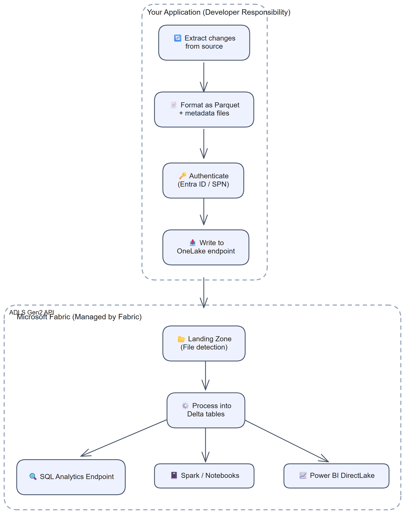

# Chapter 30: What is Open Mirroring and Why It's Useful

> **Part 3: Open Mirroring**
>
> **Purpose:** Use this chapter to understand the Open Mirroring contract, decide when it fits, and separate developer responsibilities from Fabric responsibilities.

**Part index:** [Chapters in Part 3](readme.md)

---

## Overview

**Open Mirroring** is the Fabric interface for custom and partner-managed replication. An application, platform, or data source can use it when the developer implements the required data-delivery contract.

Use Open Mirroring when no native connector exists or when you need direct control over what data is replicated, when it is delivered, and how it is formatted.

---

## Definition and Extensibility

At its core, open mirroring is a contract between an application and Fabric:

*Figure 30.1: The Open Mirroring contract and division of responsibilities*

- **The application** is responsible for extracting change data from its source system and writing it to the Fabric landing zone in the prescribed format.
- **Fabric** is responsible for detecting new files in the landing zone, processing them into Delta tables, and making those tables available through the SQL analytics endpoint, Spark, and Power BI.

The "open" in Open Mirroring refers to the interface. Any application that can:

1. Authenticate with Microsoft Entra ID
2. Write files to an ADLS Gen2-compatible OneLake endpoint
3. Follow the landing zone file format and metadata conventions

An application that meets those requirements can publish through the interface. That does not make its implementation open source.

### Open Interface versus Open-Source Implementation

**Open Mirroring** names the Fabric ingestion contract. A publisher can be proprietary, a licensed open-source project, or custom code maintained by your organisation. A listing in the partner ecosystem does not establish that a product's source code is available.

This part separates three kinds of resource:

| Resource | What to verify before adopting it |
|---|---|
| **Open-source implementation** | A public GitHub repository containing the publisher code and an explicit open-source licence covering it. Check source support and recovery behaviour in the implementation, not only its README. |
| **Source-available example** | Code is visible, but licence terms may be absent or restrictive. Do not assume permission to modify or redistribute it. |
| **Blog or walkthrough** | Useful explanation, but not an implementation you can inspect, build, or maintain unless it links to suitable source code. |

Even a licensed repository can be an educational sample rather than a supported connector. Pin the version you evaluate, record its dependencies, and test the source-to-landing-zone failure cases before using it for a production workload.

Chapters [36](chapter-36.md)-[45](chapter-45.md) apply these distinctions to real GitHub projects. Start with the [source-to-project comparison](chapter-46.md#source-to-project-comparison) if you want an existing implementation rather than a custom build. The [Synapse chapter](chapter-44.md) records the author's explicit confirmation of open-source/customer use separately from the repository's unnamed licence terms.

An open-source publisher can depend on commercially licensed or source-available components. Check the whole stack: the C# Excel example uses EPPlus, and the MariaDB sample uses MaxScale. Neither the publisher's licence nor free Fabric replication compute eliminates source-system, hosting, storage, networking, analytics, or maintenance costs.

---

## Use Cases

Open mirroring is well-suited for:

| Use Case | Description |
|---|---|
| **Unsupported source systems** | Legacy databases (e.g., DB2, Teradata, Sybase), custom application databases, or proprietary data stores not covered by Fabric's built-in connectors. |
| **Custom CDC implementations** | Scenarios requiring custom change-extraction logic, such as event-sourcing systems, custom audit tables, or soft-delete patterns. |
| **Multi-cloud data consolidation** | Bringing data from platforms in other clouds (AWS RDS, GCP Cloud SQL) where a native connector is not available. |
| **IoT and streaming data** | High-velocity sensor or telemetry data that is batched and written in micro-batches. |
| **SaaS application data** | Extracting data from SaaS APIs (Salesforce, ServiceNow, HubSpot) and landing it in Fabric. |
| **Partner integrations** | ISV products that want to deliver data to Fabric customers without requiring a native Fabric connector. |
| **Excel/CSV mirroring** | Periodically publishing supported delimited-text files or converting Excel workbooks to Parquet. Excel workbooks are not a landing-zone file format. |

---

## Built-In Analytics After Ingestion

Once Fabric processes landing-zone data into Delta tables, Open Mirroring supports the same main analytical experiences as database mirroring:

- **SQL analytics endpoint**: Read-only T-SQL access after replication and endpoint metadata synchronisation.
- **Power BI Direct Lake**: Semantic models and reports over the mirrored data.
- **Fabric Notebooks**: Spark-based processing and machine learning.
- **OneLake Explorer**: Browse Delta table files directly.
- **Cross-database queries**: Join mirrored tables with Warehouses and Lakehouse SQL analytics endpoints in the same workspace.

Consumers use the resulting tables rather than the publisher's file protocol. Data freshness still depends on source extraction, publication, Fabric processing, and the consuming experience; there is no fixed end-to-end latency guarantee.

### Security and Support Boundaries

Open Mirroring does not manage a connection to the source. The publisher owns source credentials, change capture, delete capture, and recovery. Fabric owns processing valid landing-zone files into managed Delta tables.

Grant publishers only the required workspace or mirrored-item permissions. The item's **Read and write** permission allows landing-zone writes and configuration changes; **ReadData** grants SQL data access, while **ReadAll** grants direct OneLake data access. These are different access paths, so do not assume a SQL-only restriction also protects direct file access. See [Share and manage permissions](https://learn.microsoft.com/en-us/fabric/mirroring/share-and-manage-permissions).

Publish to `Files/LandingZone`, not directly to the managed `Tables` area. A partner connector can impose additional source versions, licensing, hosting, or permission requirements. The [partner ecosystem](https://learn.microsoft.com/en-us/fabric/mirroring/open-mirroring-partners-ecosystem) identifies integrations, not a guarantee that every partner supports every source feature.

---

## Cost Considerations

Open mirroring introduces specific cost considerations:

| Cost Component | Detail |
|---|---|
| **Fabric replication compute** | Fabric compute used to process landing-zone files into OneLake is free. |
| **OneLake storage** | Mirrored replicas receive a capacity-based free storage allowance. Storage above the allowance, or while capacity is paused, is chargeable. Check the current pricing rules rather than treating all Open Mirroring storage as billable. |
| **Compute for extraction** | The publisher's hosting, extraction, and transformation compute is separate from free Fabric replication compute, whether it runs outside Fabric or in a billable Fabric workload. |
| **Egress costs** | If the source data is in a different cloud or region from the Fabric capacity, data egress costs may apply. |
| **Queries and OneLake requests** | SQL, Power BI, and Spark queries are charged at regular rates. Direct requests to OneLake consume capacity as normal OneLake operations. |

The [cost of mirroring](https://learn.microsoft.com/en-us/fabric/mirroring/overview#cost-of-mirroring) describes one free terabyte of replica storage per purchased capacity unit. A running capacity is still required even though background replication compute does not consume capacity units.

**Cost optimisation tips:**
- Write micro-batches rather than individual rows. Fewer, larger files are more efficient for Delta processing.
- Use Parquet format rather than CSV for landing zone files when possible.
- Schedule extraction around source workload constraints where the freshness requirement allows it.
- Implement efficient watermarking to avoid re-sending unchanged data.

---

## Summary

Open Mirroring gives custom and partner integrations a defined way to deliver source changes to Fabric. The developer owns extraction and file delivery, while Fabric processes those files into queryable Delta tables.

**References:** [Open Mirroring overview](https://learn.microsoft.com/en-us/fabric/mirroring/open-mirroring), [FAQ](https://learn.microsoft.com/en-us/fabric/mirroring/open-mirroring-faq), and [publication and recovery best practices](https://learn.microsoft.com/en-us/fabric/mirroring/open-mirroring-best-practices).

**Contents:** [Table of Contents](../index.md) | **Previous:** [Chapter 29: SAP Business Data Cloud Connect for Microsoft Fabric](../Part%202-%20Source-Specific%20Mirroring%20Guides/chapter-29.md) | **Next:** [Chapter 31: Setting Up Open Mirroring: Step-by-Step Configuration](chapter-31.md)
