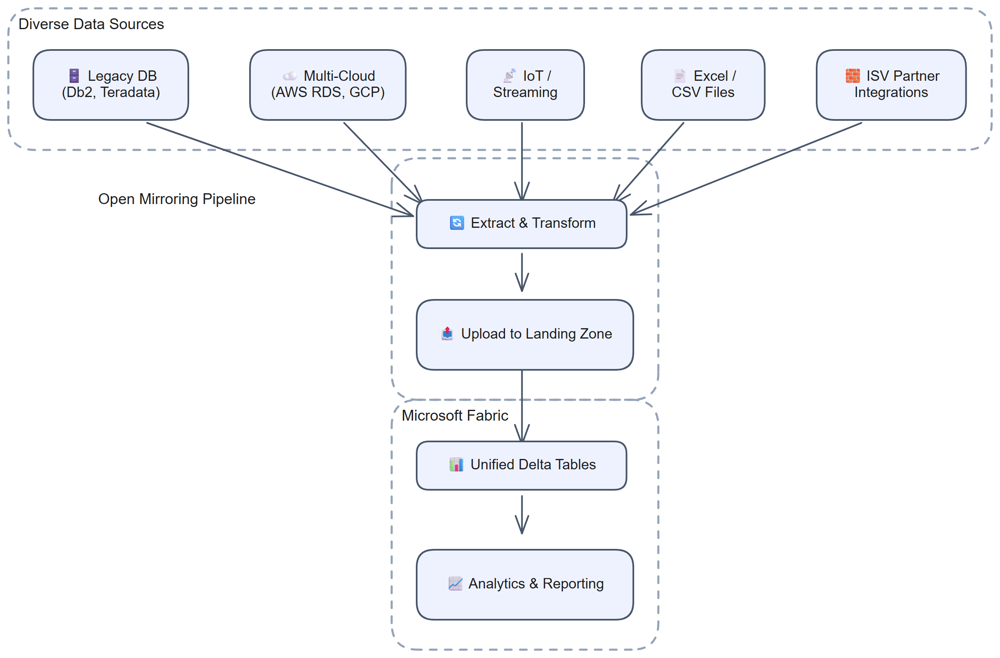

# Chapter 31: Use Cases and Examples

> **Part 3: Open Mirroring**
>
> **Purpose:** Use this chapter to choose an Open Mirroring pattern for legacy databases, SaaS applications, IoT data, files, or an ISV connector.

**Part index:** [Chapters in Part 3](readme.md)

---

## Overview

This chapter compares five common Open Mirroring use cases and the implementation choices each one requires.

[](../assets/diagrams/chapter-31/diagram-01.excalidraw.png)
*Figure 31.1: Open Mirroring use cases*

---

## Use Case 1: Legacy Database Integration

### Scenario

An organisation runs a critical business application on a legacy database platform (e.g., IBM Db2, Teradata, Sybase, or a mainframe VSAM file system) that is not natively supported by Fabric Mirroring. They need near-real-time access to this data in Fabric for reporting and analytics.

### Solution

Implement an open mirroring pipeline using the database's native CDC or polling mechanism:

**Implementation pattern:**

1. **Change extraction**: Select a documented CDC facility or partner connector for the exact source version. A custom audit table is another option when it captures every required insert, update, and delete.
2. **Staging**: Write extracted rows to a local staging area (Parquet files or an in-memory PyArrow table).
3. **Upload**: Persist a batch-to-sequence assignment, upload under a temporary name, then atomically rename to the final landing-zone path.
4. **Watermark management**: Advance the durable source position only after verifying publication. Recover an interrupted batch using the same assignment.

**Technology choices:**
- Azure Function (timer-triggered) for the extraction and upload pipeline.
- Azure Blob Storage for watermark persistence.
- `pyarrow` and `azure-storage-file-datalake` for data writing.

---

## Use Case 2: Multi-Cloud Data Consolidation

### Scenario

An organisation uses multiple cloud data platforms: AWS RDS PostgreSQL for one business unit, GCP BigQuery for another, and Azure SQL Database for a third. They want to consolidate all three in Fabric for a unified analytics layer.

### Solution

- **Azure SQL Database**: Use its native change feed (Chapter 11).
- **GCP BigQuery**: Use Fabric's native BigQuery connector (Chapter 16).
- **AWS RDS PostgreSQL**: Implement Open Mirroring with source-appropriate change extraction. The example below demonstrates bounded timestamp polling and a soft-delete flag, not a native Fabric RDS connector or a lossless CDC guarantee.

**AWS RDS PostgreSQL open mirroring pattern:**

This concrete example expects `id`, `name`, `updated_at` (`timestamptz`), and a non-null Boolean `is_deleted`. Declare `id` in `_metadata.json`; extend the query and Arrow schema together for additional source columns. Supply connection options from protected configuration.

```python
from contextlib import closing
from datetime import datetime

import psycopg2
from psycopg2 import sql
import pyarrow as pa

CHANGE_SCHEMA = pa.schema([
    pa.field("id", pa.int64(), nullable=False),
    pa.field("name", pa.string()),
    pa.field("updated_at", pa.timestamp("us", tz="UTC"), nullable=False),
    pa.field("is_deleted", pa.bool_(), nullable=False),
    pa.field("__rowMarker__", pa.int32(), nullable=False),
])

def extract_from_rds_postgres(
    connection_options: dict,
    source_schema: str,
    source_table: str,
    watermark: tuple[datetime, int],
    upper_bound: datetime,
) -> tuple[pa.Table, tuple[datetime, int]]:
    """Read one bounded page without advancing the durable source position."""
    query = sql.SQL("""
        SELECT id, name, updated_at, is_deleted
        FROM {}.{}
        WHERE (updated_at, id) > (%s, %s)
          AND updated_at <= %s
        ORDER BY updated_at, id
        LIMIT 100000
    """).format(sql.Identifier(source_schema), sql.Identifier(source_table))

    with closing(psycopg2.connect(**connection_options)) as conn:
        with conn.cursor() as cursor:
            cursor.execute(query, (*watermark, upper_bound))
            rows = cursor.fetchall()

    records = []
    for row_id, name, changed_at, deleted in rows:
        if row_id is None or changed_at is None or deleted is None:
            raise ValueError("The polling key, timestamp, and delete flag are required")
        records.append({
            "id": row_id,
            "name": name,
            "updated_at": changed_at,
            "is_deleted": deleted,
            "__rowMarker__": 2 if deleted else 4,
        })
    next_watermark = (rows[-1][2], rows[-1][0]) if rows else watermark
    return pa.Table.from_pylist(records, schema=CHANGE_SCHEMA), next_watermark
```

Keep the same upper bound while paging and do not publish an empty extraction as a new batch. Serialise each nonempty page, persist its payload and sequence assignment, publish it using Chapter 29, and only then persist its returned watermark.

The `(updated_at, id)` index and cursor make pagination deterministic for a stable data set, not for every concurrent transaction pattern. Late commits with older timestamps, repeated changes sharing a timestamp, hard deletes, and changes during paging can be missed. A safety lag alone does not fix this. Use a tested overlap-and-reconciliation design for state polling, or source-supported logical decoding when lossless ordered changes are required. Retain soft-delete records until they have been published.

---

## Use Case 3: IoT and Streaming Data

### Scenario

An industrial organisation collects telemetry data from thousands of IoT sensors via Azure IoT Hub. They need to make this time-series data available in Fabric for analytics and anomaly detection.

### Solution

Implement a micro-batch open mirroring pipeline:

1. **Azure Stream Analytics** (or Azure Functions with IoT Hub trigger) aggregates sensor readings into micro-batches (e.g., 5-minute windows).
2. Each micro-batch is written as a Parquet file to the Fabric open mirroring landing zone.
3. Fabric processes each batch into the Delta table. Measure actual ingestion and query visibility latency; the batch window is only one part of end-to-end delay.

**Key design considerations:**

- Define an actually unique event key in `_metadata.json`, such as `device_id` plus an event ID. Use upserts for replayable events; insert marker `0` does not deduplicate even when keys are declared.
- Choose a micro-batch window that balances latency and file count (fewer, larger files are more efficient).
- Let Fabric manage mirrored-table storage. If custom retention or physical optimisation is required, materialise a separate Lakehouse or Warehouse table.

**Landing zone file naming for IoT:**

```text
Files/LandingZone/sensor_readings/00000000000000000001.parquet
Files/LandingZone/sensor_readings/00000000000000000002.parquet
Files/LandingZone/sensor_readings/00000000000000000003.parquet
```

---

## Use Case 4: Excel/CSV Mirroring

### Scenario

A finance team maintains a master data Excel workbook that is updated weekly. Business users need this data to be available in Fabric for joining with transaction data in Power BI reports.

### Solution

Implement a triggered open mirroring pipeline:

1. The Excel file is stored in SharePoint Online or Azure Blob Storage.
2. When the file is updated, a **Power Automate flow** or **Azure Logic App** triggers.
3. The trigger reads the Excel file using the Graph API or Azure Blob trigger.
4. The data is converted to Parquet using a Python Azure Function.
5. The publisher compares keys with the last successfully published workbook, then publishes upserts and explicit deletes under its next durably assigned sequence.

**Python example: Excel to Parquet**

This helper validates a declared schema and writes the current workbook rows. It does not detect removed rows. Install `openpyxl` for pandas' Excel reader, and use the same cleaned column names in the schema and `_metadata.json`.

```python
import pandas as pd
import pyarrow as pa
import pyarrow.parquet as pq
from io import BytesIO

def excel_to_parquet(
    excel_bytes: bytes,
    schema: pa.Schema,
    key_columns: list[str],
    incremental: bool = True,
) -> bytes:
    """Encode a full workbook or its current rows with an explicit schema."""
    df = pd.read_excel(BytesIO(excel_bytes), engine="openpyxl")
    df.columns = [str(col).strip().replace(" ", "_").lower() for col in df.columns]
    if df.columns.duplicated().any() or "__rowMarker__" in schema.names:
        raise ValueError("Require unique names and a schema without the row marker")
    if set(df.columns) != set(schema.names):
        raise ValueError("Workbook columns must match the declared schema")
    if not key_columns or not set(key_columns).issubset(schema.names):
        raise ValueError("Declare valid key columns")
    if df[key_columns].isna().any().any() or df.duplicated(key_columns).any():
        raise ValueError("Workbook keys must be non-null and unique")
    table = pa.Table.from_pandas(df, schema=schema, preserve_index=False, safe=True)
    if incremental:
        table = table.append_column(
            "__rowMarker__", pa.array([4] * table.num_rows, type=pa.int32())
        )
    buf = BytesIO()
    pq.write_table(table, buf)
    return buf.getvalue()
```

For the initial file, call with `incremental=False` and omit `__rowMarker__`. For later files, use upserts plus delete rows for keys present in the last published workbook but absent from the new one. An empty workbook still requires those deletes. Publish deletes with marker `2` and the old keys, preserving compatible Parquet types as described in Chapter 32.

Persist the accepted workbook version or key set with the batch checkpoint only after publication succeeds. A repeated or out-of-order trigger must not reapply an older workbook over a newer one. This comparison and checkpoint logic is part of the publisher, not something the conversion helper or Fabric performs automatically.

---

## Use Case 5: Partner Integrations

### Scenario

An Independent Software Vendor (ISV) builds a vertical SaaS application on top of a proprietary database. Their customers want to analyse ISV data alongside other Fabric data. The ISV wants to offer a "Connect to Microsoft Fabric" feature in their product.

### Solution

The ISV implements open mirroring as a built-in product feature:

1. The ISV application includes a **Fabric Integration** module that customers can enable.
2. When enabled, customers authorise a dedicated Microsoft Entra application with the required mirrored-item permissions. Do not collect a user's interactive Fabric password.
3. The ISV module extracts relevant application data and writes it to the customer's Fabric open mirroring landing zone.
4. The ISV publishes the landing zone schema in their documentation so customers know what tables to expect.

**ISV considerations:**
- Consider a dedicated identity per customer and scope its permissions to the intended destination. Identity separation alone does not enforce isolation if permissions are overly broad.
- Document table folders, keys, column types, and row-marker behaviour.
- Version schema changes and test them against the current landing-zone contract.
- Implement resets by deleting the table folder, waiting for the table to disappear, and recreating it with metadata and a complete initial load. Wait for it to reappear before resuming changes.
- Keep one ordered publisher per customer table.
- Add optional `_partnerEvents.json` at the landing-zone root to identify the publisher and source.

The [Microsoft Learn partner list](https://learn.microsoft.com/en-us/fabric/mirroring/open-mirroring-partners-ecosystem) includes integrations such as MongoDB Atlas, Oracle GoldenGate 23ai, Qlik, CData, and SAP-focused providers. These are partner-managed Open Mirroring paths, not interchangeable native Fabric connectors. Confirm versions, prerequisites, and support with the provider.

---

## From a Pattern to an Existing Implementation

These use cases are design patterns, not claims that the illustrative code forms a complete connector. The later chapters show how public projects implement them: [SQL Server CT and files](chapter-35.md), [notebooks](chapter-36.md), [BigQuery](chapter-38.md), [MongoDB](chapter-39.md), [PostgreSQL CDC](chapter-40.md), [PostgreSQL polling](chapter-41.md), and [Synapse dedicated SQL pool](chapter-42.md).

Compare source behaviour before choosing code. Polling an increasing key does not capture updates to old rows. Re-reading a workbook does not detect removed rows without comparison. Snapshot/diff detects differences between observations, not every transaction in between. A publishing SDK cannot repair any of those source-capture gaps.

## Summary

Each Open Mirroring pattern follows the same contract: extract source changes, write correctly described Parquet files to the landing zone, and let Fabric process them. The source determines how you handle change capture, ordering, schema, and recovery.

**References:** [Landing-zone contract](https://learn.microsoft.com/en-us/fabric/mirroring/open-mirroring-landing-zone-format), [publisher best practices](https://learn.microsoft.com/en-us/fabric/mirroring/open-mirroring-best-practices), and [Fabric Toolbox proof-of-concept samples](https://github.com/microsoft/fabric-toolbox/tree/main/samples/open-mirroring).

**Contents:** [Table of Contents](../index.md) | **Previous:** [Chapter 30: Code Samples and the Fabric Toolbox](chapter-30.md) | **Next:** [Chapter 32: Metadata and Change Files](chapter-32.md)
