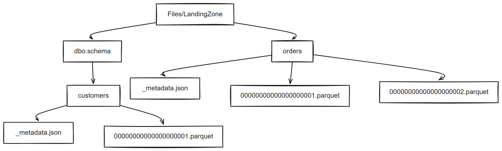

# Chapter 34: Metadata and Change Files

> **Part 3: Open Mirroring**
>
> **Purpose:** Use this chapter to define each table's `_metadata.json`, encode row operations, and deliver files in the order Fabric expects.

**Part index:** [Chapters in Part 3](readme.md)

---

## Overview

Each Open Mirroring table has its own landing-zone folder and `_metadata.json` file. Parquet files carry their own column schema. The metadata file identifies key columns and optional file-detection behaviour.

The public contract does not require `settings.json`, commit marker files, or a source-watermark directory. Keep durable publisher state separate from data files. Producers can use ignored underscore-prefixed state files, but those are their own convention, not a Fabric checkpoint protocol.

[](../assets/diagrams/chapter-34/diagram-01.excalidraw.png)
*Figure 34.1: Open Mirroring landing-zone structure*

---

## Table Folder Layout

Tables in the default schema sit directly under `Files/LandingZone`. To use an explicit schema, add a folder whose name ends in `.schema`.

```text
Files/LandingZone/
    orders/
        _metadata.json
        00000000000000000001.parquet
        00000000000000000002.parquet
    dbo.schema/
        customers/
            _metadata.json
            00000000000000000001.parquet
```

Fabric creates one Delta table for each table folder.

---

## `_metadata.json`

Place `_metadata.json` inside the table folder:

```text
Files/LandingZone/orders/_metadata.json
```

For a Parquet table with a composite key, the minimum file is:

```json
{
  "keyColumns": ["order_id", "line_id"]
}
```

### Main Fields

| Field | Use |
|---|---|
| `keyColumns` | Names of the columns used to match updates, deletes, and upserts. Match the file's column names exactly. Keys can be declared later for an insert-only table, but cannot be changed once declared. |
| `fileDetectionStrategy` | Defaults to `SequentialFileName`. Set to `LastUpdateTimeFileDetection` only when strict source order is unnecessary or enforced elsewhere. |
| `isUpsertDefaultRowMarker` | When `true`, rows without `__rowMarker__` are treated as upserts rather than inserts. |
| `SchemaDefinition` | Required for delimited text. Parquet supplies its schema in the file metadata. |
| `FileFormat` and `FileExtension` | Configure CSV or another supported delimited-text format. |
| `FileFormatTypeProperties` | Controls delimiters, quoting, escaping, null values, encoding, and header handling for delimited text. |

For delimited text, define the columns and file format in `_metadata.json`. The [landing-zone format reference](https://learn.microsoft.com/en-us/fabric/mirroring/open-mirroring-landing-zone-format) lists the supported fields and data types.

Always create metadata before the first data file in these examples. The reference also describes marker-free, keyless insert behaviour when metadata is absent; that is not a reason to omit the file from a keyed replication design.

### Delimited Text and Type Boundaries

- The landing-zone reference supports Parquet and delimited text, uncompressed or compressed with Snappy, GZIP, or ZSTD. Excel workbooks must be converted first.
- Delimited text requires a header row and an explicit `SchemaDefinition`. Configure `FileExtension`, encoding, delimiters, quoting, and null representation consistently with the actual file.
- Parquet carries its own schema. Use compatible logical and physical types, such as Parquet `DATE` backed by `INT32`.
- Use simple Parquet types; serialise complex structures as JSON strings, or use binary for appropriate binary values.
- Delimited-text schema evolution is explicitly unsupported. Do not assume that the reference's general add-column wording makes changing a declared CSV schema safe.

### Nonsequential Detection

The following is valid JSON for a table using unique, immutable, nonsequential file paths:

```json
{
  "keyColumns": ["id"],
  "fileDetectionStrategy": "LastUpdateTimeFileDetection",
  "isUpsertDefaultRowMarker": true
}
```

File detection and the default row operation are independent settings. Either can be configured without the other. Timestamp detection orders each visible, unprocessed set by storage `LastModified`, not source event time. Equal timestamps have no defined producer-order tie-break, and a late file can apply after a newer logical batch. Rewriting a processed path does not make it eligible for ingestion again.

Use sequential detection for order-sensitive CDC unless another mechanism preserves the required order.

### Producer Identification

The optional `_partnerEvents.json` belongs at the mirrored database's landing-zone root, not inside each table folder. It records `partnerName` and `sourceInfo`, including `sourceType`; it is not table schema or a commit marker.

---

## Row Operations

Incremental files normally use a column named `__rowMarker__`. Use an integer type such as Arrow `int32` for the numeric operation values in this book's Parquet examples.

The column must:

- be the final column in the file
- contain one of the supported operation values

| Value | Operation | Result |
|---:|---|---|
| `0` | Insert | Inserts even if the key already exists; it does not deduplicate. |
| `1` | Update | Updates a matching key or inserts when no match exists. |
| `2` | Delete | Deletes a matching key and does nothing when no match exists. |
| `4` | Upsert | Updates a matching key or inserts a new row. |

Rows are applied from top to bottom within a file. If a key value changes, send a delete for the old key followed by an insert for the new key.

### Initial Load

For the default Parquet contract, omit `__rowMarker__` from initial snapshot files. Without a default-upsert override, a marker-free file is treated as inserts. As soon as a marker-bearing file is encountered, Fabric treats the changes as incremental. Do not describe later marker-free files as a new snapshot or a table reset.

Marker omission is not a universal optimisation: `isUpsertDefaultRowMarker: true` changes the meaning to upsert. The [best-practices guidance](https://learn.microsoft.com/en-us/fabric/mirroring/open-mirroring-best-practices#optimize-insert-only-files) also says not to remove the marker from CSV files.

### Incremental Loads

Include `__rowMarker__` for explicit update, delete, and upsert operations. A configured default-upsert mode is the exception for marker-free upserts, not a way to encode deletes. Updated and upserted rows must include the complete row, not only changed columns.

Delete rows need the key values and marker `2`; non-key values need not be supplied. When writing a mixed-operation Parquet file, retain the full typed schema and use typed nulls for unused nullable fields rather than inferring a new schema from the delete rows.

For a table keyed by `id`, the following illustrates file contents, not a literal Parquet file:

```text
id,name,__rowMarker__
1,Ada,4
1,Ada Lovelace,1
2,Grace,4
2,NULL,2
```

The result has key `1` with the name `Ada Lovelace`; key `2` is absent. Replaying these operations after a newer batch could overwrite newer state, so upsert support does not replace ordered, crash-safe publication.

---

## File Names and Delivery

In sequential mode, data files use a 20-digit, zero-padded integer:

```text
00000000000000000001.parquet
00000000000000000002.parquet
00000000000000000003.parquet
```

Start at 1 and increase by exactly one. A missing sequence blocks later files in that stream. Do not skip, reuse, or regress an index, including across publisher restarts.

To prevent Fabric from reading a partial upload:

1. Write the file with an underscore prefix, such as `_00000000000000000003.parquet`.
2. Flush the complete file.
3. Rename it atomically to `00000000000000000003.parquet`.

Fabric ignores files whose names start with an underscore.

The reserved `_scratchPad` folder is an alternative staging area for multistep publishers. Complete and validate the file there, then atomically rename or move it into the table folder. A copy-and-delete operation is not an atomic publication.

Final paths are immutable. Persist each batch's source range, payload identity, and assigned sequence before upload. On retry, verify an existing final file against that assignment; do not overwrite it or republish the batch under a new name. Publish sequential files in order even if extraction or temporary uploads run concurrently.

The landing-zone reference describes processed-file cleanup through `_ProcessedFiles` or `_FilesReadyToDelete`, with removal after seven days. It also says the latest sequential file is retained as a publisher reference. Neither mechanism replaces durable publisher state. This cleanup is separate from destination Delta-table retention.

---

## Schema and Table Changes

- **Parquet schema**: Fabric reads the column schema from each Parquet file.
- **Add a Parquet column**: Fabric adds it to the destination table.
- **Omit a nullable column**: The destination column remains; new rows have `NULL` there. Omitting a nonnullable column fails schema merge.
- **Change a type**: Replication for that table stops with an error; rebuild and republish the table.
- **Rename a column**: This is effectively drop-and-add, not an in-place rename. Rebuild to retire the old name.
- **Delimited-text schema**: Define it in `_metadata.json`. Schema evolution is not supported for this format.
- **Key columns**: Choose them before publishing changes; once declared, they cannot be changed in place.
- **Table reset or rename**: Delete the old table folder and wait for the mirrored table to disappear. Recreate the folder, metadata, and complete initial load, using a new folder name for a rename. Resume incremental publication only after the table reappears.
- **Ordering**: Keep file and row order deterministic when several changes affect the same key.

---

## Best Practices

1. Create the table folder and `_metadata.json` before writing the first data file.
2. Use Parquet unless the source requires a supported delimited-text format.
3. Use the temporary-name and atomic-rename pattern for every upload.
4. Persist the source extraction position separately from the Fabric file sequence.
5. Use one coordinated publisher per table to avoid sequence collisions. Narrow merge keys improve performance; the documented suggestion of fewer than five key columns is not a hard limit.
6. Test key, schema, update, delete, restart, and retry behaviour before production.

---

## Summary

Open Mirroring uses per-table metadata, a declared file-detection strategy, and row operations. Keep source checkpoints distinct from file sequences, preserve schema and source order, and publish each completed file atomically.

**References:** [Landing-zone requirements and formats](https://learn.microsoft.com/en-us/fabric/mirroring/open-mirroring-landing-zone-format) and [Open Mirroring best practices](https://learn.microsoft.com/en-us/fabric/mirroring/open-mirroring-best-practices).

**Contents:** [Table of Contents](../index.md) | **Previous:** [Chapter 33: Use Cases and Examples](chapter-33.md) | **Next:** [Chapter 35: Common Issues and Troubleshooting](chapter-35.md)
