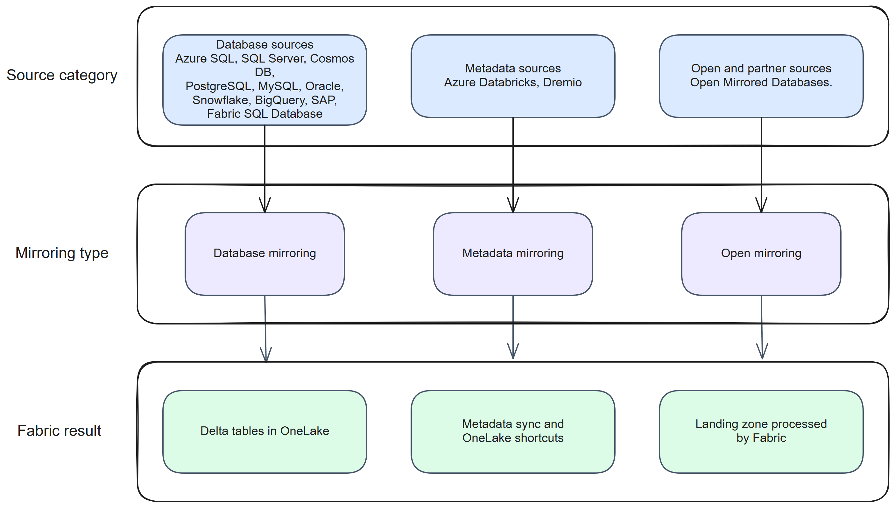

# Microsoft Fabric Mirroring - Complete Guide

This guide covers the main mirroring patterns in Microsoft Fabric, source-specific setup, and open mirroring implementations. Use Part 1 for concepts and architecture, Part 2 for source guides, and Part 3 for open mirroring and partner-led integrations.

Fabric includes 1 TB of free mirrored storage per purchased CU. An F2 capacity includes 2 TB, an F4 capacity includes 4 TB, and the allowance scales with capacity.

(Mirroring Overview)

* Database mirroring copies source data into Delta tables in OneLake.
* Metadata mirroring syncs catalog metadata and uses OneLake shortcuts to access the source data.
* Open mirroring accepts developer-defined or partner-defined change data in a landing zone that Fabric processes.

## Table of Contents

> **Note:** Chapters are published one at a time. A chapter title is a link once it has been published; otherwise it is shown as plain text.

### Part 1: Concepts and Architecture

* [Chapter 1: Introduction to Fabric Mirroring](Part%201%20-%20Concepts%20and%20Architecture/chapter-01.md)
* Chapter 2: Types of Mirroring in Fabric
* Chapter 3: Methods of Mirroring: Push, Pull or Polling, and Shortcuts
* Chapter 4: The Anatomy of a Mirrored Database
* Chapter 5: Monitoring a Mirrored Database
* Chapter 6: Using the Fabric REST API
* Chapter 7: Deploying a Mirrored Database Using CI/CD
* Chapter 8: Using a Mirrored Database
* Chapter 9: Extended Capabilities

### Part 2: Source-Specific Mirroring Guides

* Chapter 10: Azure SQL Database
* Chapter 11: Azure SQL Managed Instance
* Chapter 12: Azure Cosmos DB
* Chapter 13: Azure Databricks (Unity Catalog) - metadata mirroring
* Chapter 14: Google BigQuery - Public Preview
* Chapter 15: Oracle
* Chapter 16: PostgreSQL
* Chapter 17: MySQL - Public Preview
* Chapter 18: SAP
* Chapter 19: SharePoint List - Public Preview
* Chapter 20: Snowflake
* Chapter 21: SQL Server 2016–2022
* Chapter 22: SQL Server 2025
* Chapter 23: Fabric SQL Database
* Chapter 24: Dremio Catalog Mirroring - Public Preview

> **Note:** Chapter 13 and Chapter 24 cover metadata mirroring rather than database mirroring. Chapters 14, 17, 19, and 24 cover Public Preview sources.

### Part 3: Open Mirroring

* Chapter 25: What is Open Mirroring and Why It's Useful
* Chapter 26: Setting Up Open Mirroring: Step-by-Step Configuration
* Chapter 27: Code Samples and the Fabric Toolbox
* Chapter 28: Use Cases and Examples
* Chapter 29: Metadata and Change Files
* Chapter 30: Common Issues and Troubleshooting

### Appendix

* [Appendix: Supported Sources, Mirroring Types, and Reference Tables](appendix.md)
* Book Update History
